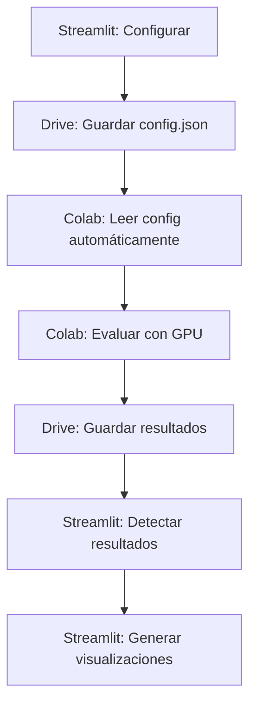

# 🚀 Flujo Completo: Streamlit ↔ Google Colab ↔ Drive

## 📋 Resumen del Flujo

Este sistema permite ejecutar evaluaciones acumulativas de embeddings usando **Google Colab con GPU** mientras mantienes el control desde **Streamlit** y almacenas todo en **Google Drive**.

### 🔄 Ventajas del Flujo:
- ✅ **Notebook universal reutilizable** (sube una vez, usa siempre)
- ✅ **GPU T4 gratuita** en Colab (10-50x más rápido)
- ✅ **Configuración automática** desde Streamlit
- ✅ **Resultados automáticos** en Drive
- ✅ **Visualizaciones completas** en Streamlit

---

## 🛠️ Setup Inicial (Una Sola Vez)

### 1. Preparar Google Drive
```
/content/drive/MyDrive/TesisMagister/acumulative/
├── .env (opcional - para APIs reales)
├── evaluation_config.json (se crea automáticamente)
├── evaluation_status.json (se crea automáticamente)
└── results/
    ├── cumulative_results_[timestamp].json
    └── results_summary_[timestamp].csv
```

### 2. Subir Notebook Universal a Google Colab
1. Descarga `Universal_Colab_Evaluator.ipynb` desde Streamlit
2. Ve a [colab.research.google.com](https://colab.research.google.com)
3. File → Upload notebook
4. Sube el archivo
5. **¡Listo! No necesitas modificar nada más**

---

## 🚀 Proceso de Evaluación

### Paso 1: Configurar en Streamlit
1. **Abrir aplicación Streamlit**:
   ```bash
   streamlit run EnhancedStreamlit_qa_app.py
   ```

2. **Ir a "📊 Métricas Acumulativas"**

3. **Configurar parámetros**:
   - ✅ Marca "☁️ Procesamiento en Google Colab"
   - ✅ Marca "🔄 Evaluar todos los modelos"
   - Configura 500 preguntas (o las que necesites)
   - Configura otros parámetros

4. **Ejecutar configuración**:
   - Click "🚀 Ejecutar Evaluación"
   - Click "🚀 Crear Configuración y Enviar a Google Drive"
   - ✅ El sistema creará automáticamente `evaluation_config.json`

### Paso 2: Ejecutar en Google Colab
1. **Abrir el notebook en Google Colab**
2. **Activar GPU**:
   - Runtime → Change runtime type
   - Hardware accelerator: GPU
   - GPU type: T4
   - Save

3. **Ejecutar evaluación**:
   - Ctrl+F9 (ejecutar todas las celdas)
   - O ejecutar celda por celda
   - **El notebook lee automáticamente tu configuración desde Drive**

4. **Monitorear progreso**:
   - Verás barras de progreso para cada modelo
   - GPU acelerada procesará 10-50x más rápido
   - Resultados se guardan automáticamente en Drive

### Paso 3: Ver Resultados en Streamlit
1. **Volver a Streamlit**
2. **En la misma página de Métricas Acumulativas**
3. **Click "🔄 Verificar Estado"**
4. **Cuando aparezca "✅ Evaluación completada"**:
   - Click "📊 Mostrar Resultados y Generar Visualizaciones"
   - Se generarán automáticamente:
     - 📊 Gráficos comparativos
     - 📈 Métricas detalladas
     - 📄 Reportes PDF
     - 💾 Archivos de descarga

---

## 📁 Archivos Generados

### En Google Drive:
```
/content/drive/MyDrive/TesisMagister/acumulative/
├── evaluation_config.json      # Configuración desde Streamlit
├── evaluation_status.json      # Estado de la evaluación
└── results/
    ├── cumulative_results_[timestamp].json  # Resultados completos
    └── results_summary_[timestamp].csv      # Resumen CSV
```

### En Streamlit:
- 📊 **Visualizaciones interactivas**
- 📈 **Comparación de modelos**
- 🏆 **Rankings y métricas**
- 📄 **Reportes PDF descargables**
- 💾 **Archivos CSV/JSON**

---

## 🔧 Configuración Avanzada

### Para usar APIs reales en Colab:
1. **Crear archivo `.env`** en Drive:
   ```
   OPENAI_API_KEY=tu_api_key_aqui
   HUGGINGFACE_API_KEY=tu_api_key_aqui
   # Otros API keys...
   ```

2. **El notebook cargará automáticamente** las variables de entorno

### Para modificar configuraciones:
- **No modifiques el notebook** - es universal
- **Cambia parámetros en Streamlit** y regenera configuración
- **El notebook detectará automáticamente** los cambios

---

## 🎯 Flujo Típico de Uso



### Ejemplo de sesión completa:
1. **Streamlit** (2 min): Configurar 500 preguntas, 4 modelos
2. **Colab** (10-15 min): Evaluación acelerada con GPU T4
3. **Streamlit** (1 min): Visualizar resultados y generar PDFs
4. **Total**: ~15-20 minutos vs 2-4 horas local

---

## 🛠️ Troubleshooting

### Si no aparece la configuración en Colab:
```python
# En Colab, verificar manualmente:
import os
config_file = "/content/drive/MyDrive/TesisMagister/acumulative/evaluation_config.json"
print(f"Config exists: {os.path.exists(config_file)}")
```

### Si no aparecen resultados en Streamlit:
1. Verificar que Colab terminó exitosamente
2. Click "🔄 Verificar Estado" en Streamlit
3. Verificar archivos en Drive

### Si hay errores en Colab:
1. Reiniciar runtime: Runtime → Restart runtime
2. Verificar que GPU está activada
3. Ejecutar celdas una por una para identificar error

---

## 🎉 Ventajas del Sistema

### 🚀 **Rendimiento**:
- GPU T4 gratuita: 10-50x más rápido que CPU local
- Procesamiento paralelo optimizado
- Sin limitaciones de memoria local

### 🔄 **Automatización**:
- Configuración automática desde Streamlit
- Notebook universal reutilizable
- Resultados automáticos en Drive
- Visualizaciones automáticas

### 💰 **Costo**:
- Google Colab T4: **Completamente gratuito**
- Sin necesidad de hardware local potente
- Sin instalación de dependencias pesadas

### 🎯 **Facilidad de uso**:
- Interface familiar de Streamlit
- Notebook universal sin modificaciones
- Flujo automatizado completo
- Resultados listos para presentar

---

## 📋 Checklist de Implementación

### ✅ Setup inicial:
- [ ] Crear estructura de carpetas en Google Drive
- [ ] Subir `Universal_Colab_Evaluator.ipynb` a Colab
- [ ] Verificar que Streamlit tiene las modificaciones

### ✅ Primera evaluación:
- [ ] Configurar parámetros en Streamlit
- [ ] Crear configuración y enviar a Drive
- [ ] Ejecutar notebook en Colab con GPU
- [ ] Verificar resultados en Streamlit

### ✅ Verificación:
- [ ] Comprobar que aparecen visualizaciones
- [ ] Descargar PDFs generados
- [ ] Verificar archivos en Google Drive

**¡Sistema listo para producción!** 🎉

---

## 🔗 Archivos del Sistema

1. **`Universal_Colab_Evaluator.ipynb`** - Notebook universal para Colab
2. **`cumulative_metrics_page.py`** - Interface Streamlit modificada
3. **`simulate_colab_results.py`** - Simulador para testing
4. **Este archivo** - Documentación completa

**Total**: Sistema completo y funcional para evaluación acelerada con GPU ⚡