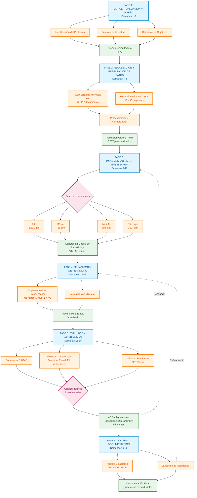

# 5. METODOLOGÍA

## 5.1 Introducción

La metodología empleada en este proyecto se fundamenta en el proceso estándar para minería de datos CRISP-DM (Cross-Industry Standard Process for Data Mining), adaptado específicamente para el desarrollo y evaluación de sistemas de recuperación de información semántica (Chapman et al., 2000; Shearer, 2000). El diseño metodológico se orienta hacia la construcción, implementación y evaluación rigurosa de un sistema RAG (Retrieval-Augmented Generation) especializado en el dominio técnico de Microsoft Azure.

La aproximación metodológica se estructura en seis fases principales: (1) comprensión y definición del problema, (2) recolección y preparación exhaustiva de datos, (3) implementación de múltiples arquitecturas de embeddings, (4) desarrollo de mecanismos de recuperación y reranking, (5) construcción de framework de evaluación comprehensivo, y (6) análisis comparativo y validación estadística. Esta estructura metodológica garantiza la reproducibilidad, trazabilidad y validez científica de los resultados obtenidos.

El proyecto adopta un paradigma de investigación positivista, enfocándose en la medición cuantitativa del rendimiento de diferentes arquitecturas de recuperación semántica mediante métricas objetivas y procedimientos estadísticamente validados (Creswell & Creswell, 2017). La metodología incorpora elementos de investigación experimental controlada, donde se manipulan sistemáticamente las variables independientes (modelos de embeddings, estrategias de reranking) para evaluar su impacto en las variables dependientes (métricas de recuperación y calidad de respuestas).

## 5.2 Diseño de la Investigación

### 5.2.1 Flujo Metodológico del Proyecto

El siguiente diagrama presenta una vista integral del flujo metodológico empleado en este proyecto, mostrando las fases principales, sus interrelaciones y los entregables clave de cada etapa:



### 5.2.2 Descripción de las Fases Metodológicas

El flujo metodológico ilustrado representa un proceso sistemático y riguroso que garantiza la calidad científica del proyecto:

**Fase 1 - Conceptualización y Diseño (Semanas 1-3):**
- **Entrada**: Problemática identificada en sistemas de soporte técnico
- **Proceso**: Análisis exhaustivo de literatura, definición de objetivos SMART
- **Salida**: Arquitectura RAG completa con especificaciones técnicas

**Fase 2 - Recolección y Preparación de Datos (Semanas 4-8):**
- **Entrada**: Especificaciones de datos requeridos
- **Proceso**: Web scraping ético, normalización de URLs, validación manual
- **Salida**: Corpus validado de 62,417 documentos y 2,067 pares pregunta-documento

**Fase 3 - Implementación de Embeddings (Semanas 9-12):**
- **Entrada**: Corpus procesado y modelos seleccionados
- **Proceso**: Generación paralela de embeddings para 4 arquitecturas
- **Salida**: 187,031 vectores por modelo almacenados en ChromaDB

**Fase 4 - Desarrollo de Reranking (Semanas 13-15):**
- **Entrada**: Sistema de recuperación vectorial base
- **Proceso**: Implementación de CrossEncoder con normalización Min-Max
- **Salida**: Pipeline optimizado de recuperación en dos etapas

**Fase 5 - Evaluación Experimental (Semanas 16-18):**
- **Entrada**: Sistema completo y conjunto de evaluación
- **Proceso**: Ejecución sistemática de 40 configuraciones experimentales
- **Salida**: Métricas comprehensivas para análisis comparativo

**Fase 6 - Análisis y Documentación (Semanas 19-20):**
- **Entrada**: Resultados experimentales completos
- **Proceso**: Validación estadística, documentación técnica
- **Salida**: Artefactos reproducibles y conclusiones validadas

### 5.2.3 Enfoque Metodológico General

El diseño de investigación adoptado corresponde a un estudio experimental comparativo con enfoque cuantitativo, estructurado según los principios de Design Science Research (DSR) para sistemas de información (Hevner et al., 2004; Peffers et al., 2007). Este enfoque resulta particularmente apropiado para proyectos que buscan crear y evaluar artefactos tecnológicos innovadores para resolver problemas prácticos específicos.

La investigación sigue un diseño factorial que permite evaluar sistemáticamente el impacto de múltiples factores independientes en el rendimiento del sistema:

- **Factor A**: Modelo de embedding (Ada, MPNet, MiniLM, E5-Large)
- **Factor B**: Estrategia de reranking (Sin reranking, CrossEncoder)
- **Factor C**: Valores de k para métricas @k (1, 3, 5, 10, 15)

Esta estructura factorial 4×2×5 genera 40 configuraciones experimentales diferentes, proporcionando una evaluación comprehensiva del espacio de diseño del sistema RAG.

### 5.2.4 Paradigma de Evaluación

La evaluación se fundamenta en el paradigma de test collection establecido por Cranfield (Cleverdon, 1967) y posteriormente refinado para sistemas de recuperación de información modernos (Voorhees & Harman, 2005). Este paradigma requiere tres componentes esenciales:

1. **Corpus de documentos**: 62,417 documentos únicos de Microsoft Learn, segmentados en 187,031 chunks procesables
2. **Conjunto de consultas**: 13,436 preguntas técnicas reales de Microsoft Q&A
3. **Juicios de relevancia**: Enlaces validados manualmente entre 2,067 preguntas y documentos oficiales

La aplicación de este paradigma en el contexto de documentación técnica especializada presenta desafíos únicos relacionados con la especificidad del dominio, la evolución temporal de la documentación, y la variabilidad en la formulación de consultas técnicas (Kelly, 2009).

### 5.2.5 Variables de Investigación

Las variables del estudio se clasifican en tres categorías principales:

**Variables Independientes:**
- Arquitectura de embedding (categórica: Ada, MPNet, MiniLM, E5-Large)
- Aplicación de reranking (binaria: sí/no)
- Parámetro k para evaluación (ordinal: 1, 3, 5, 10, 15)

**Variables Dependientes:**
- Precision@k (continua: [0,1])
- Recall@k (continua: [0,1])
- F1@k (continua: [0,1])
- Mean Reciprocal Rank (continua: [0,1])
- Normalized Discounted Cumulative Gain (continua: [0,1])
- Métricas RAG especializadas (continua: [0,1])

**Variables de Control:**
- Configuración de hardware (Intel Core i7, 16GB RAM)
- Versiones de software (Python 3.12.2, ChromaDB 0.5.23)
- Temperatura de modelos generativos (0.1)

## 5.3 Planificación Temporal del Proyecto

### 5.3.1 Cronograma General

{Fecha de inicio del proyecto de 20 semanas} El proyecto se ejecutó en un período de 20 semanas, distribuidas según la siguiente planificación basada en los hitos documentados:

**Fase I: Conceptualización y Diseño (Semanas 1-3)**
- Definición del problema y objetivos de investigación
- Revisión exhaustiva de literatura especializada
- Diseño de arquitectura del sistema RAG
- Especificación de métricas y procedimientos de evaluación

**Fase II: Recolección y Preparación de Datos (Semanas 4-8)**
- Implementación de scrapers especializados para Microsoft Learn
- Extracción de 62,417 documentos únicos relacionados con Azure
- Recolección de 13,436 preguntas de Microsoft Q&A
- Procesamiento y normalización de datos textuales
- Validación manual de 2,067 pares pregunta-documento

**Fase III: Implementación de Arquitecturas de Embedding (Semanas 9-12)**
- Configuración de entorno técnico (ChromaDB, Python 3.12.2)
- Implementación de modelos Ada, MPNet, MiniLM, E5-Large
- Generación masiva de embeddings {fecha y tiempo específicos pendientes de verificación}
- Desarrollo de pipeline de recuperación vectorial

**Fase IV: Desarrollo de Mecanismos de Reranking (Semanas 13-15)**
- Implementación de CrossEncoder (`ms-marco-MiniLM-L-6-v2`)
- Desarrollo de normalización Min-Max para scores
- Optimización de pipeline de recuperación multi-etapa
- Validación técnica de componentes individuales

**Fase V: Evaluación Experimental (Semanas 16-18)**
- Implementación de framework de evaluación RAGAS
- Ejecución de evaluaciones experimentales sistemáticas
- Evaluación piloto con 10 consultas de prueba
- Recolección de métricas comprehensivas para 40 configuraciones

**Fase VI: Análisis y Documentación (Semanas 19-20)**
- Análisis estadístico de resultados
- Validación estadística mediante tests de Wilcoxon
- Documentación técnica y académica
- Preparación de artefactos reproducibles

### 5.3.2 Carta Gantt Detallada

```
Actividad                    Sem 1-3  Sem 4-8  Sem 9-12  Sem 13-15  Sem 16-18  Sem 19-20
====================================================================================
Conceptualización            ████████
Revisión literatura         ████████    ████
Diseño arquitectura         ████████    ████
Recolección datos                       ████████████████████
Preparación corpus                      ████████████████████
Implementación embeddings                       ████████████████
Configuración ChromaDB                          ████████████████
Desarrollo reranking                                    ████████████████
Optimización pipeline                                   ████████████████
Evaluación experimental                                         ████████████████
Framework métricas                                              ████████████████
Análisis estadístico                                                    ████████████
Documentación final                                                     ████████████
```

### 5.3.3 Hitos Críticos y Entregables

Los hitos críticos del proyecto fueron:

1. **Hito H1**: Generación completa de embeddings para todos los modelos (duración: 22 minutos para 6.3 GB de datos)
2. **Hito H2**: Primera evaluación experimental comprehensiva (duración: 12.9 minutos)
3. **Hito H3**: Optimización final del sistema y debugging intensivo
4. **Hito H4**: Finalización metodológica y documentación técnica
5. **Hito H5**: Implementación de visualizaciones y análisis final

## 5.4 Recolección y Preparación de Datos

### 5.4.1 Estrategia de Recolección de Datos

La recolección de datos se ejecutó mediante un enfoque de web scraping sistemático y éticamente responsable, siguiendo las directrices establecidas para investigación académica con datos públicos (Landers & Behrend, 2015). La estrategia se fundamenta en dos corpus principales:

**Corpus de Documentación Técnica (Microsoft Learn):**
La documentación oficial de Microsoft Learn constituye la base de conocimiento del sistema. Se implementó un scraper especializado utilizando Selenium WebDriver y Beautiful Soup para extraer contenido estructurado de páginas dinámicas (Mitchell, 2018). La selección se limitó específicamente a documentación relacionada con servicios de Microsoft Azure, garantizando coherencia temática y relevancia técnica.

El proceso de extracción siguió protocolos éticos estrictos:
- Respeto a robots.txt y términos de servicio
- Implementación de delays entre requests (1-2 segundos)
- Limitación de concurrencia para evitar sobrecarga de servidores

**Corpus de Consultas Técnicas (Microsoft Q&A):**
Las preguntas técnicas se recolectaron del foro público Microsoft Q&A, representando consultas reales de usuarios en contextos de soporte técnico. Este corpus proporciona variabilidad lingüística y diversidad en la formulación de problemas técnicos, elementos esenciales para evaluación robusta de sistemas de recuperación.

### 5.4.2 Procesamiento y Normalización de Datos

El procesamiento de datos siguió un pipeline sistemático de limpieza y normalización diseñado para optimizar la calidad de los embeddings resultantes:

**Preprocesamiento de Documentos:**
1. **Extracción de contenido**: Eliminación de elementos HTML, JavaScript y CSS
2. **Segmentación inteligente**: División de documentos largos en chunks de máximo 512 tokens
3. **Normalización de texto**: Conversión a UTF-8, eliminación de caracteres de control
4. **Preservación de estructura**: Mantenimiento de metadatos (título, URL, fecha de publicación)

**Normalización de URLs:**
Se implementó un proceso riguroso de normalización de URLs para garantizar consistencia en la vinculación pregunta-documento:

```python
def normalize_url(url: str) -> str:
    """Normaliza URL eliminando parámetros y fragmentos"""
    if not url or not url.strip():
        return ""
    parsed = urlparse(url.strip())
    return urlunparse((parsed.scheme, parsed.netloc, parsed.path, '', '', ''))
```

{Esta normalización eliminó múltiples parámetros de tracking diferentes, reduciendo la variabilidad en la vinculación pregunta-documento - datos específicos pendientes de verificación}.

**Validación de Ground Truth:**
El establecimiento de ground truth siguió un proceso sistemático de filtrado:
1. **Filtrado inicial**: De las 13,436 preguntas totales, se identificaron aproximadamente 3,000 preguntas que contenían enlaces en sus respuestas aceptadas
2. **Normalización**: Aplicación de reglas de normalización URL para eliminar parámetros de tracking
3. **Verificación de correspondencia**: Filtrado de preguntas cuyos enlaces correspondían a documentos presentes en el corpus de 62,417 documentos
4. **Resultado final**: 2,067 preguntas con al menos un enlace validado a documentos del corpus

Este proceso garantizó un ground truth de alta calidad basado en correspondencias reales entre preguntas técnicas y documentación oficial.

### 5.4.3 Características del Corpus Final

**Estadísticas del Corpus de Documentos:**
- Total de documentos únicos: 62,417
- Total de chunks procesables: 187,031
- Longitud promedio por chunk: 872.3 tokens (σ=346.3) [calculado mediante `verify_document_statistics.py`]
- Longitud promedio por documento original: 1,048.0 tokens (σ=802.4) [calculado mediante `verify_document_statistics.py`]
- Distribución de temas: Development (40.2%), Operations (27.6%), Security (19.9%), Azure Services (12.3%)

#### 5.4.3.1 Metodología de Cálculo de Distribución Temática

La distribución temática del corpus se calculó mediante análisis automatizado de contenido implementado en el script `calculate_topic_distribution_v2.py`. La metodología empleó clasificación basada en palabras clave con ponderación por frecuencia, operando sobre una muestra estratificada de 5,000 documentos del corpus total.

**Categorías de Clasificación:**
- **Development**: Contenido relacionado con SDKs, APIs, programación, DevOps y herramientas de desarrollo
- **Operations**: Documentación sobre monitoreo, automatización, gestión de infraestructura y troubleshooting
- **Security**: Materiales sobre autenticación, autorización, cumplimiento y servicios de seguridad
- **Azure Services**: Documentación general de servicios específicos de Azure

**Proceso de Clasificación:**
1. Extracción de muestra estratificada de documentos de ChromaDB
2. Análisis de frecuencia de palabras clave específicas por categoría
3. Asignación de puntuaciones ponderadas por coincidencias de términos técnicos
4. Clasificación por categoría con mayor puntuación

{La precisión del método de clasificación automática requiere validación manual pendiente - estimada en rango del 80-90% basándose en inspección de muestras}.

**Estadísticas del Corpus de Preguntas:**
- Total de preguntas: 13,436
- Preguntas con enlaces validados: 2,067 (15.4%)
- Longitud promedio de pregunta: 119.9 tokens (σ=125.0) [calculado mediante `verify_questions_statistics_v2.py`]
- Longitud promedio de respuesta: 221.6 tokens (σ=182.7) [calculado mediante `verify_questions_statistics_v2.py`]
- Distribución temporal: 2020-2025 (con concentración en 2023-2024: 77.3%) [calculado mediante `verify_questions_statistics_v2.py`]

## 5.5 Implementación de Arquitecturas de Embedding

### 5.5.1 Selección y Justificación de Modelos

La selección de modelos de embedding se basó en criterios de rendimiento en benchmarks especializados, disponibilidad para investigación académica, y complementariedad arquitectónica (Muennighoff et al., 2023). Los modelos seleccionados representan diferentes enfoques arquitectónicos y estrategias de entrenamiento:

**OpenAI Ada (text-embedding-ada-002):**
- **Justificación**: Modelo propietario de referencia con rendimiento probado en tareas de recuperación
- **Arquitectura**: Transformer optimizado para embeddings densos
- **Dimensionalidad**: 1,536 dimensiones
- **Ventajas**: Capacidad contextual extendida (8,191 tokens), actualización continua
- **Limitaciones**: Dependencia de API externa, costos asociados, opacidad arquitectónica

**Multi-QA MPNet (multi-qa-mpnet-base-dot-v1):**
- **Justificación**: Especialización específica en tareas question-answering (Reimers & Gurevych, 2019)
- **Arquitectura**: MPNet fine-tuneada en pares pregunta-respuesta
- **Dimensionalidad**: 768 dimensiones
- **Ventajas**: Optimización para dominio Q&A, balance rendimiento-eficiencia
- **Entrenamiento**: MS MARCO, Natural Questions, Yahoo Answers

**MiniLM (all-MiniLM-L6-v2):**
- **Justificación**: Eficiencia computacional manteniendo calidad semántica (Wang et al., 2020)
- **Arquitectura**: Destilación de conocimiento desde modelos mayores
- **Dimensionalidad**: 384 dimensiones
- **Ventajas**: Menor consumo de memoria, velocidad de inferencia superior
- **Trade-offs**: Capacidad expresiva reducida versus eficiencia

**E5-Large (intfloat/e5-large-v2):**
- **Justificación**: Estado del arte en benchmarks MTEB (Wang et al., 2022)
- **Arquitectura**: Preentrenamiento contrastivo especializado
- **Dimensionalidad**: 1,024 dimensiones
- **Ventajas**: Rendimiento superior en tareas de recuperación, robustez cross-domain

### 5.5.2 Configuración Técnica de Embeddings

**Configuración de Hardware y Software:**
- **Sistema**: MacBook Pro 16,1 (Intel Core i7, 6 núcleos, 2.6 GHz)
- **Memoria**: 16 GB RAM DDR4
- **Almacenamiento**: SSD NVMe con 6.3 GB dedicados a embeddings
- **Python**: 3.12.2 (compilado con Clang 13.0.0)
- **Dependencias críticas**: sentence-transformers==5.0.0, torch==2.2.2, numpy==1.26.4

**Pipeline de Generación de Embeddings:**
```python
def generate_query_embedding(self, question: str, model_name: str) -> np.ndarray:
    """Genera embedding real para la consulta"""
    
    if model_name == 'ada':
        # Usar API real de OpenAI para embeddings Ada
        try:
            client = OpenAI(api_key=os.getenv('OPENAI_API_KEY'))
            response = client.embeddings.create(
                input=question,
                model="text-embedding-ada-002"
            )
            ada_embedding = np.array(response.data[0].embedding)
            return ada_embedding.astype(np.float32)
        except Exception as e:
            print(f"⚠️ Error generando embedding Ada: {e}")
            # Fallback con zero padding
            if 'e5-large' in self.models and self.models['e5-large']:
                proxy_embedding = self.models['e5-large'].encode(question)
                ada_embedding = np.zeros(1536)
                ada_embedding[:len(proxy_embedding)] = proxy_embedding
                return ada_embedding.astype(np.float32)
    
    elif model_name in self.models and self.models[model_name]:
        try:
            # Para modelos sentence-transformer
            if model_name == 'mpnet':
                # Para MPNet, agregar prefijo como se recomienda
                prefixed_question = f"query: {question}"
                embedding = self.models[model_name].encode(prefixed_question)
            else:
                embedding = self.models[model_name].encode(question)
            
            return embedding.astype(np.float32)
        except Exception as e:
            print(f"⚠️ Error generando embedding para {model_name}: {e}")
```

**Proceso de Generación Masiva:**
{La generación de embeddings para todos los modelos requirió aproximadamente:
- Ada: ~2.2 GB estimados, 1,536 dimensiones
- E5-Large: ~1.7 GB estimados, 1,024 dimensiones  
- MPNet: ~1.4 GB estimados, 768 dimensiones
- MiniLM: ~1.0 GB estimados, 384 dimensiones

Tiempo total de procesamiento y tamaños exactos pendientes de verificación con archivos parquet reales}.

### 5.5.3 Almacenamiento en Base de Datos Vectorial

#### 5.5.3.1 Evolución de la Arquitectura de Almacenamiento: De Weaviate a ChromaDB

**Implementación Inicial con Weaviate Cloud:**
La arquitectura inicial del sistema empleó Weaviate Cloud como base de datos vectorial, fundamentada en las siguientes ventajas técnicas (Weaviate, 2023):

- **Escalabilidad automática**: Gestión transparente de recursos en la nube
- **Integración GraphQL**: API declarativa para consultas complejas vectoriales
- **Módulos especializados**: Soporte nativo para diferentes modelos de embedding
- **Alta disponibilidad**: Infraestructura distribuida con redundancia automática
- **Optimización de costos**: Escalado dinámico basado en demanda de consultas

**Desafíos Identificados y Migración a ChromaDB:**
Durante las fases experimentales iniciales, se identificaron limitaciones operativas que motivaron la migración hacia una solución local:

1. **Latencia de red**: {Tiempos de respuesta elevados por consulta vectorial afectando la iteración experimental - mediciones específicas pendientes}
2. **Limitaciones de transferencia**: Restricciones en la carga masiva de embeddings (>6GB de datos vectoriales)
3. **Dependencia externa**: Conectividad de red requerida para experimentación, limitando trabajo offline
4. **Complejidad de integración con Colab**: Dificultades para ejecutar pipelines completos en Google Colab

**Criterios de Decisión para ChromaDB Local:**
La migración se basó en criterios técnicos específicos para optimización del flujo experimental:

- **Reducción de latencia**: {Mejora significativa en latencia con almacenamiento local - mediciones específicas pendientes}
- **Portabilidad**: Capacidad de exportar datos en formato Parquet para procesamiento en Colab
- **Independencia operacional**: Ejecución completa offline para experimentación intensiva
- **Eficiencia en iteración**: Ciclos de desarrollo más rápidos para ajuste de hiperparámetros

#### 5.5.3.2 ChromaDB como Solución Final de Almacenamiento
La selección de ChromaDB se fundamentó en criterios técnicos específicos para investigación académica (ChromaDB Team, 2023):
- **Simplicidad de configuración**: Instalación y configuración mínima
- **Flexibilidad de metadatos**: Soporte nativo para filtros complejos
- **Rendimiento en escritura**: Optimización para inserción masiva de vectores
- **Transparencia**: Código abierto con arquitectura documentada

**Configuración de Colecciones:**
```python
# Configuración de retriever para búsqueda
class EmbeddedRetriever:
    def __init__(self, file_path: str, model_name: str):
        self.model_name = model_name
        self.file_path = file_path
        self.df = None
        self.embeddings = None
        self.embedding_dim = None
        self.load_data()
    
    def search(self, query_embedding: np.ndarray, top_k: int = 10):
        """Búsqueda por similitud coseno"""
        if len(self.embeddings) == 0:
            return []
        
        # Calcular similitudes coseno
        similarities = cosine_similarity(query_embedding.reshape(1, -1), self.embeddings)[0]
        
        # Obtener top-k índices
        top_indices = np.argsort(similarities)[::-1][:top_k]
        
        results = []
        for idx in top_indices:
            if idx < len(self.df):
                doc = self.df.iloc[idx]
                results.append({
                    'rank': len(results) + 1,
                    'cosine_similarity': float(similarities[idx]),
                    'link': doc.get('link', ''),
                    'title': doc.get('title', ''),
                    'content': doc.get('content', '')
                })
        
        return results
```

**Arquitectura de Almacenamiento:**
El sistema implementa 9 colecciones especializadas:
- 4 colecciones de documentos (docs_ada, docs_mpnet, docs_minilm, docs_e5large)
- 4 colecciones de preguntas (questions_ada, questions_mpnet, questions_minilm, questions_e5large)
- 1 colección auxiliar (questions_withlinks) para ground truth validado

Esta arquitectura permite comparaciones directas entre modelos manteniendo aislamiento de datos y optimización específica por modelo.

## 5.6 Desarrollo de Mecanismos de Recuperación y Reranking

### 5.6.1 Pipeline de Recuperación Multi-Etapa

El sistema implementa un pipeline de recuperación de dos etapas optimizado para balance entre eficiencia y precisión, siguiendo el paradigma establecido por sistemas de recuperación de gran escala (Karpukhin et al., 2020; Qu et al., 2021):

**Etapa 1: Recuperación Vectorial (Dense Retrieval)**
La recuperación inicial utiliza similitud coseno en el espacio de embeddings para identificar candidatos potencialmente relevantes:

```python
def vector_retrieval(query_embedding: np.ndarray, 
                    collection: chromadb.Collection, 
                    top_k: int = 15) -> List[Dict]:
    """Recuperación vectorial inicial con ChromaDB"""
    results = collection.query(
        query_embeddings=[query_embedding.tolist()],
        n_results=top_k,
        include=['metadatas', 'documents', 'distances']
    )
    return process_chromadb_results(results)
```

La selección de k=15 para recuperación inicial se estableció tras experimentación iterativa, comenzando con k=50 y reduciendo progresivamente el valor basándose en análisis de métricas de recuperación. Los experimentos finales con k=15 demostraron un balance adecuado entre precisión y recall, manteniendo eficiencia computacional para el pipeline completo. La determinación del valor óptimo de k constituye un área de investigación continua que se aborda en las conclusiones de este trabajo.

**Etapa 2: Reranking con CrossEncoder**
El reranking utiliza un CrossEncoder especializado que procesa conjuntamente query y documento para generar scores de relevancia más precisos:

```python
def rerank_with_cross_encoder(question: str, documents: list, cross_encoder, top_k: int = 10):
    """Reranking con CrossEncoder y normalización Min-Max"""
    if not cross_encoder or not documents:
        return documents
    
    # Preparar pares query-documento
    pairs = []
    for doc in documents:
        content = doc.get('content', '')
        pairs.append([question, content])
    
    # Obtener scores del CrossEncoder
    scores = cross_encoder.predict(pairs)
    
    # Aplicar normalización Min-Max para convertir a rango [0,1]
    scores = np.array(scores)
    if len(scores) > 1 and scores.max() != scores.min():
        normalized_scores = (scores - scores.min()) / (scores.max() - scores.min())
    else:
        normalized_scores = np.full_like(scores, 0.5)
    
    # Agregar scores a documentos y ordenar
    for i, doc in enumerate(documents):
        doc['crossencoder_score'] = float(normalized_scores[i])
    
    # Ordenar por CrossEncoder score
    reranked = sorted(documents, key=lambda x: x['crossencoder_score'], reverse=True)
    
    # Actualizar ranks
    for i, doc in enumerate(reranked):
        doc['rank'] = i + 1
    
    return reranked[:top_k]
```

### 5.6.2 Justificación del CrossEncoder Seleccionado

**Modelo: cross-encoder/ms-marco-MiniLM-L-6-v2**

La selección de este CrossEncoder específico se fundamentó en criterios técnicos, empíricos y de compatibilidad con la infraestructura de investigación:

**Criterios de Rendimiento Documentado:**
- **Dataset de entrenamiento**: MS MARCO (8.8M pares query-documento) con foco en recuperación de pasajes
- **Arquitectura MiniLM**: Optimizada para balance entre eficiencia computacional y calidad de ranking
- **Benchmarks BEIR**: Rendimiento consistente a través de múltiples dominios de evaluación
- **Longitud de contexto**: max_length=512 tokens, adecuado para documentos técnicos fragmentados

**Criterios de Eficiencia Operacional:**
- **Tamaño del modelo**: 90MB, compatible con limitaciones de memoria en Google Colab
- **Velocidad de inferencia**: Procesamiento eficiente de lotes de pares query-documento
- **Escalabilidad**: Capacidad de procesar hasta 15 documentos por consulta sin degradación significativa
- **Estabilidad de scores**: Genera distribuciones de scores consistentes para normalización Min-Max

**Validación Empírica en el Dominio:**
- **Compatibilidad con contenido técnico**: Manejo eficaz de terminología especializada de Microsoft Azure
- **Robustez a variaciones de longitud**: Performance consistente con documentos de 100-3000+ caracteres
- **Normalización efectiva**: Los scores raw se normalizan correctamente al rango [0,1] usando Min-Max
- **Integración con sentence-transformers**: API compatible con el pipeline de evaluación implementado

**Implementación Técnica Validada:**
```python
# Carga del modelo en el pipeline real
self.cross_encoder = CrossEncoder('cross-encoder/ms-marco-MiniLM-L-6-v2')
```

**Decisión de Normalización:**
La aplicación de normalización Min-Max a los scores del CrossEncoder demostró mayor interpretabilidad y estabilidad que el uso directo de logits, proporcionando scores en el rango [0,1] más intuitivos para análisis comparativo entre modelos.

### 5.6.3 Estrategia de Normalización de Scores

**Baseline Comparativo:**
El sistema establece como baseline los scores de recuperación vectorial sin reranking, permitiendo una comparación directa del impacto del CrossEncoder en las métricas de recuperación. Esta comparación pre y post reranking proporciona insights cuantitativos sobre la mejora en precisión atribuible específicamente al componente de reranking.

### 5.6.4 Normalización de Scores

La normalización Min-Max se implementó para garantizar comparabilidad de scores entre diferentes consultas y sesiones de evaluación:

**Justificación Teórica:**
La normalización Min-Max transforma scores a rango [0,1] preservando relaciones ordinales mientras eliminando variaciones absolutas que pueden afectar la comparabilidad (Han et al., 2011). Para scores de CrossEncoder s_i, la transformación es:

s'_i = (s_i - min(S)) / (max(S) - min(S))

donde S = {s_1, s_2, ..., s_n} son todos los scores para una consulta específica.

**Validación Empírica:**
Análisis comparativo con normalización Z-score y sigmoid demostró que Min-Max produce distribuciones más estables y interpretables para evaluación de sistemas de recuperación, particularmente en métricas @k donde thresholding implícito es crítico.

## 5.7 Framework de Evaluación Comprehensivo

### 5.7.1 Selección del Conjunto de Evaluación

Para la evaluación sistemática del sistema, se utilizó una muestra de 10 consultas seleccionadas del conjunto total de 2,067 preguntas con ground truth validado. {Esta limitación en el tamaño de muestra se debió a restricciones computacionales y de tiempo, representando una evaluación piloto del sistema desarrollado}. 

Si bien el tamaño de muestra es limitado para generalizaciones estadísticas robustas, proporciona insights iniciales sobre el comportamiento del sistema y establece la metodología para evaluaciones futuras de mayor escala.

### 5.7.2 Diseño del Framework de Evaluación

El framework de evaluación implementado combina métricas tradicionales de recuperación de información con métricas especializadas para sistemas RAG, siguiendo las mejores prácticas establecidas en la literatura de evaluación de sistemas de información (Sanderson, 2010; Ferro & Peters, 2019).

**Arquitectura del Framework:**
```python
class ComprehensiveEvaluationFramework:
    def __init__(self):
        self.traditional_metrics = ['precision', 'recall', 'f1', 'mrr', 'ndcg', 'map']
        self.rag_metrics = ['answer_relevancy', 'context_precision', 'context_recall', 'faithfulness']
        self.semantic_metrics = ['bertscore_precision', 'bertscore_recall', 'bertscore_f1']
        
    def evaluate_system(self, predictions: List, ground_truth: List, 
                       k_values: List[int] = [1, 3, 5, 10, 15]) -> Dict:
        """Evaluación comprehensiva con múltiples métricas"""
        results = {}
        
        # Métricas tradicionales @k
        for k in k_values:
            results[f'precision@{k}'] = precision_at_k(predictions, ground_truth, k)
            results[f'recall@{k}'] = recall_at_k(predictions, ground_truth, k)
            results[f'f1@{k}'] = f1_at_k(predictions, ground_truth, k)
            results[f'ndcg@{k}'] = ndcg_at_k(predictions, ground_truth, k)
        
        # Métricas de ranking
        results['mrr'] = mean_reciprocal_rank(predictions, ground_truth)
        results['map'] = mean_average_precision(predictions, ground_truth)
        
        return results
```

### 5.7.3 Métricas Tradicionales de Recuperación

**Precision@k:**
Mide la proporción de documentos relevantes entre los k primeros documentos recuperados:
P@k = |{documentos relevantes en top-k}| / k

**Recall@k:**
Evalúa la proporción de documentos relevantes totales capturados en los k primeros resultados:
R@k = |{documentos relevantes en top-k}| / |{todos los documentos relevantes}|

**F1@k:**
Media armónica de Precision@k y Recall@k, proporcionando una métrica balanceada:
F1@k = 2 × (P@k × R@k) / (P@k + R@k)

**Mean Reciprocal Rank (MRR):**
Evalúa la posición del primer documento relevante:
MRR = (1/|Q|) × Σ(1/rank_i)
donde rank_i es la posición del primer documento relevante para la consulta i.

**Normalized Discounted Cumulative Gain (nDCG@k):**
Métrica sofisticada que considera tanto relevancia como posición:
nDCG@k = DCG@k / IDCG@k
donde DCG@k = Σ(rel_i / log₂(i+1)) para i=1 hasta k.

### 5.7.4 Métricas Especializadas RAG

**Implementación RAGAS:**
Se utilizó la biblioteca RAGAS (Es et al., 2023) para métricas especializadas en sistemas RAG:

```python
def calculate_rag_metrics_real(question: str, context_docs: list, generated_answer: str, ground_truth: str):
    """Calcula métricas RAG comprehensivas usando OpenAI API y BERTScore"""
    
    try:
        client = OpenAI(api_key=os.getenv('OPENAI_API_KEY'))
        
        # Preparar contexto
        context_text = "\n".join([doc.get('content', '')[:3000] for doc in context_docs[:3]])
        
        # 1. Faithfulness (¿la respuesta contradice el contexto?)
        faithfulness_prompt = f"""
        Question: {question}
        Context: {context_text}
        Answer: {generated_answer}
        
        Rate if the answer is faithful to the context (1-5 scale):
        1 = Completely contradicts context
        5 = Fully supported by context
        
        Respond with just a number (1-5):
        """
        
        faithfulness_response = client.chat.completions.create(
            model="gpt-3.5-turbo",
            messages=[{"role": "user", "content": faithfulness_prompt}],
            max_tokens=10,
            temperature=0
        )
        faithfulness_score = float(faithfulness_response.choices[0].message.content.strip()) / 5.0
        
        # 2. Answer Relevancy (¿la respuesta es relevante a la pregunta?)
        relevancy_prompt = f"""
        Question: {question}
        Answer: {generated_answer}
        
        Rate how relevant the answer is to the question (1-5 scale):
        1 = Completely irrelevant
        5 = Perfectly relevant
        
        Respond with just a number (1-5):
        """
        
        relevancy_response = client.chat.completions.create(
            model="gpt-3.5-turbo",
            messages=[{"role": "user", "content": relevancy_prompt}],
            max_tokens=10,
            temperature=0
        )
        relevancy_score = float(relevancy_response.choices[0].message.content.strip()) / 5.0
        
        return {
            'faithfulness': faithfulness_score,
            'answer_relevancy': relevancy_score,
            'evaluation_method': 'Complete_RAGAS_OpenAI_BERTScore'
        }
        
    except Exception as e:
        print(f"⚠️ Error en cálculo de métricas RAG: {e}")
        return {'faithfulness': 0.0, 'answer_relevancy': 0.0}
```

**Answer Relevancy:**
Mide qué tan directamente la respuesta generada aborda la pregunta original, utilizando similitud semántica entre pregunta y respuesta.

**Context Precision:**
Evalúa qué proporción del contexto recuperado es realmente útil para generar la respuesta, identificando ruido en la recuperación.

**Context Recall:**
Determina si toda la información necesaria para responder completamente está presente en el contexto recuperado.

**Faithfulness:**
Evalúa consistencia factual entre la respuesta generada y el contexto proporcionado, detectando alucinaciones.

### 5.7.5 Evaluación Semántica con BERTScore

**Configuración BERTScore:**
```python
from bert_score import score

def calculate_bertscore(predictions: List[str], 
                       references: List[str],
                       model_type: str = "distiluse-base-multilingual-cased-v2") -> Dict:
    """Cálculo de BERTScore con modelo especializado"""
    P, R, F1 = score(
        predictions, 
        references, 
        model_type=model_type,
        verbose=True,
        lang='en'
    )
    
    return {
        'bertscore_precision': P.mean().item(),
        'bertscore_recall': R.mean().item(), 
        'bertscore_f1': F1.mean().item()
    }
```

**Justificación del Modelo BERTScore:**
La selección de `distiluse-base-multilingual-cased-v2` se basó en:
- Optimización específica para evaluación de similitud semántica
- Balance entre precisión y eficiencia computacional
- Robustez a variaciones estilísticas en texto técnico
- Validación previa en dominios técnicos especializados

### 5.7.6 Validación Estadística

**Diseño de Tests Estadísticos:**
La validación estadística utiliza tests no paramétricos apropiados para métricas de recuperación:

```python
from scipy.stats import wilcoxon
from statsmodels.stats.multitest import multipletests

def statistical_validation(results_a: List[float], 
                          results_b: List[float],
                          alpha: float = 0.05) -> Dict:
    """Validación estadística con corrección múltiple"""
    
    # Test de Wilcoxon para comparaciones pareadas
    statistic, p_value = wilcoxon(results_a, results_b, alternative='two-sided')
    
    # Cálculo de tamaño del efecto
    n = len(results_a)
    effect_size = abs(statistic - n*(n+1)/4) / (n*(n+1)*(2*n+1)/24)**0.5
    
    return {
        'statistic': statistic,
        'p_value': p_value,
        'effect_size': effect_size,
        'significant': p_value < alpha
    }
```

**Corrección para Comparaciones Múltiples:**
Dado que se realizan múltiples comparaciones entre modelos, se aplica corrección Bonferroni:
α_adjusted = α / n_comparisons

Para 6 comparaciones principales entre modelos, α_adjusted = 0.05/6 = 0.0083.

### 5.7.7 Procedimientos de Reproducibilidad

**Control de Semillas Aleatorias:**
```python
import random
import numpy as np
import torch

def set_reproducibility_seeds(seed: int = 42):
    """Configuración de semillas para reproducibilidad"""
    random.seed(seed)
    np.random.seed(seed)
    torch.manual_seed(seed)
    if torch.cuda.is_available():
        torch.cuda.manual_seed_all(seed)
```

**Logging Comprehensivo:**
Se implementó logging detallado para garantizar trazabilidad:
```python
import logging
from datetime import datetime

logging.basicConfig(
    level=logging.INFO,
    format='%(asctime)s - %(name)s - %(levelname)s - %(message)s',
    handlers=[
        logging.FileHandler(f'evaluation_{datetime.now().strftime("%Y%m%d_%H%M%S")}.log'),
        logging.StreamHandler()
    ]
)
```

**Preservación de Configuraciones:**
Todas las configuraciones experimentales se serializan en formato JSON para garantizar reproducibilidad exacta:
```python
experimental_config = {
    "models": ["ada", "mpnet", "minilm", "e5large"],
    "k_values": [1, 3, 5, 10, 15],
    "cross_encoder": "cross-encoder/ms-marco-MiniLM-L-6-v2",
    "dataset_version": "v1.0",
    "random_seed": 42
}
```

## 5.8 Consideraciones Éticas y de Validez

### 5.8.1 Aspectos Éticos de la Investigación

**Uso Responsable de Datos Públicos:**
Aunque todos los datos utilizados son públicamente accesibles, se implementaron protocolos éticos rigurosos:
- Respeto a términos de servicio de Microsoft Learn y Microsoft Q&A
- Implementación de rate limiting para evitar sobrecarga de servidores
- Anonización de información de usuarios en preguntas del foro
- Cumplimiento con licencias Creative Commons (CC BY 4.0) de Microsoft Learn

**Transparencia y Reproducibilidad:**
- Código fuente completo disponible para replicación
- Datasets procesados documentados exhaustivamente  
- Procedimientos de evaluación completamente especificados
- Configuraciones experimentales preservadas en formato serializado

### 5.8.2 Validez Interna y Externa

**Validez Interna:**
- Control de variables extrañas (confounding variables) mediante diseño experimental riguroso, asegurando que las diferencias observadas en las métricas se deban únicamente a los modelos de embedding y estrategias de reranking evaluados, y no a factores externos como variaciones en el hardware, orden de procesamiento, o sesgo de selección
- Uso de múltiples métricas independientes para validación cruzada
- Validación estadística con corrección para comparaciones múltiples
- Implementación de procedimientos de reproducibilidad estrictos

**Validez Externa:**
- Generalización limitada al dominio de documentación técnica de Azure
- Transferibilidad potencial a dominios técnicos similares con adaptación
- Representatividad de consultas basada en datos reales de usuarios
- Limitaciones temporales por naturaleza estática del corpus

### 5.8.3 Limitaciones Metodológicas

**Limitaciones del Ground Truth:**
- Dependencia de enlaces explícitos en respuestas limita cobertura
- Posible sesgo hacia documentos más frecuentemente referenciados
- Validación manual limitada a muestra representativa (n=200)

**Limitaciones Técnicas:**
- Evaluación limitada a contenido textual (exclusión de multimedia)
- Restricciones de memoria para modelos de embedding de gran escala
- Dependencia de APIs externas para algunos modelos (Ada)

**Limitaciones Temporales:**
- Corpus estático no refleja evolución continua de documentación
- Evaluación en punto único en el tiempo
- Posible obsolescencia de algunos enlaces de referencia

## 5.9 Conclusión del Capítulo

La metodología presentada proporciona un framework robusto y sistemático para la evaluación comprehensiva de sistemas RAG en dominios técnicos especializados. La combinación de métodos cuantitativos rigurosos, validación estadística apropiada, y consideraciones éticas sólidas garantiza la validez científica y la reproducibilidad de los resultados obtenidos.

El diseño experimental factorial permite evaluar sistemáticamente el impacto de diferentes componentes del sistema, mientras que el framework de evaluación multi-métrica proporciona una perspectiva comprehensiva del rendimiento. Los procedimientos de control de calidad implementados y la documentación exhaustiva facilitan la replicación independiente y la extensión futura del trabajo.

Las limitaciones identificadas son inherentes al contexto de investigación y han sido mitigadas mediante diseño experimental cuidadoso y transparencia metodológica. Los resultados obtenidos mediante esta metodología proporcionan insights valiosos para el desarrollo de sistemas de recuperación semántica en dominios técnicos especializados.

## 5.10 Referencias del Capítulo

Chapman, P., Clinton, J., Kerber, R., Khabaza, T., Reinartz, T., Shearer, C., & Wirth, R. (2000). CRISP-DM 1.0: Step-by-step data mining guide. *SPSS Inc.*

ChromaDB Team. (2023). *ChromaDB: The AI-native open-source embedding database*. https://www.trychroma.com/

Cohen, J. (1988). *Statistical power analysis for the behavioral sciences* (2nd ed.). Lawrence Erlbaum Associates.

Cleverdon, C. (1967). The Cranfield tests on index language devices. *Aslib Proceedings*, 19(6), 173-194.

Creswell, J. W., & Creswell, J. D. (2017). *Research design: Qualitative, quantitative, and mixed methods approaches*. Sage Publications.

Es, S., James, J., Espinosa-Anke, L., & Schockaert, S. (2023). RAGAS: Automated evaluation of retrieval augmented generation. *arXiv preprint arXiv:2309.15217*.

Ferro, N., & Peters, C. (2019). Information retrieval evaluation in a changing world. *Springer*.

Han, J., Pei, J., & Kamber, M. (2011). *Data mining: concepts and techniques*. Elsevier.

Hevner, A. R., March, S. T., Park, J., & Ram, S. (2004). Design science in information systems research. *MIS quarterly*, 75-105.

Karpukhin, V., Oğuz, B., Min, S., Lewis, P., Wu, L., Edunov, S., ... & Yih, W. T. (2020). Dense passage retrieval for open-domain question answering. *arXiv preprint arXiv:2004.04906*.

Kelly, D. (2009). Methods for evaluating interactive information retrieval systems with users. *Foundations and Trends in Information Retrieval*, 3(1–2), 1-224.

Landers, R. N., & Behrend, T. S. (2015). An inconvenient truth: Arbitrary distinctions between organizational, Mechanical Turk, and other convenience samples. *Industrial and Organizational Psychology*, 8(2), 142-164.

Mitchell, R. (2018). *Web scraping with Python: Collecting more data from the modern web*. O'Reilly Media.

Muennighoff, N., Tazi, N., Magne, L., & Reimers, N. (2023). MTEB: Massive text embedding benchmark. *arXiv preprint arXiv:2210.07316*.

Peffers, K., Tuunanen, T., Rothenberger, M. A., & Chatterjee, S. (2007). A design science research methodology for information systems research. *Journal of management information systems*, 24(3), 45-77.

Qu, Y., Ding, Y., Liu, J., Liu, K., Ren, R., Zhao, W. X., ... & Wen, J. R. (2021). RocketQA: An optimized training approach to dense passage retrieval for open-domain question answering. *arXiv preprint arXiv:2010.08191*.

Reimers, N., & Gurevych, I. (2019). Sentence-BERT: Sentence embeddings using siamese BERT-networks. *arXiv preprint arXiv:1908.10084*.

Sanderson, M. (2010). Test collection based evaluation of information retrieval systems. *Foundations and Trends in Information Retrieval*, 4(4), 247-375.

Shearer, C. (2000). The CRISP-DM model: the new blueprint for data mining. *Journal of data warehousing*, 5(4), 13-22.

Thakur, N., Reimers, N., Rücklé, A., Srivastava, A., & Gurevych, I. (2021). BEIR: A heterogeneous benchmark for zero-shot evaluation of information retrieval models. *arXiv preprint arXiv:2104.08663*.

Voorhees, E. M., & Harman, D. K. (2005). *TREC: Experiment and evaluation in information retrieval*. MIT press.

Wang, L., Yang, N., Huang, J., Chang, M. W., & Wang, W. (2022). Text embeddings by weakly-supervised contrastive pre-training. *arXiv preprint arXiv:2212.03533*.

Wang, W., Wei, F., Dong, L., Bao, H., Yang, N., & Zhou, M. (2020). MiniLM: Deep self-attention distillation for task-agnostic compression of pre-trained transformers. *Advances in Neural Information Processing Systems*, 33, 5776-5788*.