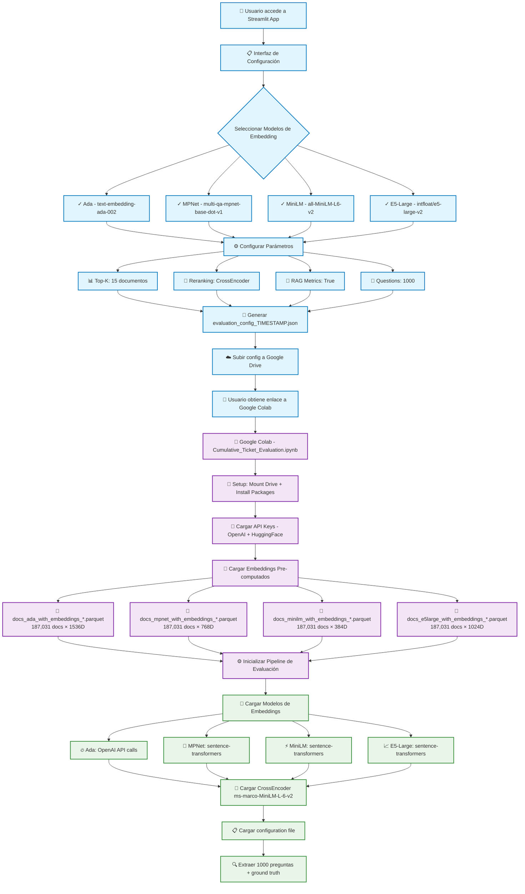

# DIAGRAMA DEL PIPELINE DE EVALUACIÓN RAG

## Introducción

Este documento presenta el diagrama completo del pipeline de evaluación del sistema RAG, desde la configuración inicial en Streamlit hasta la generación y visualización de resultados. El pipeline procesó 1,000 preguntas por modelo con 4 modelos de embedding diferentes durante 7.8 horas de evaluación.

---

## DIAGRAMA 1: PIPELINE COMPLETO DE CONFIGURACIÓN Y EVALUACIÓN



---

## DIAGRAMA 2: LOOP DE EVALUACIÓN DETALLADO (N=1000 × M=4)

```mermaid
flowchart TD
    %% INICIALIZACIÓN
    START[🚀 Inicio de Evaluación<br/>4 modelos × 1000 preguntas] --> LOOP1[🔄 FOR model in [ada, mpnet, minilm, e5-large]]
    
    %% LOOP PRINCIPAL POR MODELO
    LOOP1 --> MODEL[📊 Modelo Actual: {model}]
    MODEL --> INIT[⚙️ Inicializar Acumuladores]
    INIT --> INIT1[📈 all_before_metrics = []]
    INIT --> INIT2[📈 all_after_metrics = []]
    INIT --> INIT3[🤖 individual_rag_metrics = []]
    INIT --> INIT4[📊 before_scores = []]
    INIT --> INIT5[📊 after_scores = []]
    
    INIT1 --> LOOP2[🔄 FOR i in range(1000) preguntas]
    INIT2 --> LOOP2
    INIT3 --> LOOP2
    INIT4 --> LOOP2
    INIT5 --> LOOP2
    
    %% LOOP POR PREGUNTA
    LOOP2 --> Q[❓ Pregunta[i]]
    Q --> Q1[📝 question = pregunta_actual]
    Q --> Q2[🔗 ground_truth_links = enlaces_validados]
    Q --> Q3[💬 ground_truth_answer = respuesta_aceptada]
    
    Q1 --> EMB[🧠 Generar Query Embedding]
    Q2 --> EMB
    Q3 --> EMB
    
    %% GENERACIÓN DE EMBEDDINGS
    EMB --> EMB_DECISION{¿Modelo = Ada?}
    EMB_DECISION -->|SÍ| EMB_ADA[🔥 OpenAI API Call<br/>text-embedding-ada-002<br/>→ vector[1536]]
    EMB_DECISION -->|NO| EMB_LOCAL[🧠 sentence-transformers.encode<br/>→ vector[dim_model]]
    
    EMB_ADA --> SEARCH[🔍 Búsqueda Vectorial]
    EMB_LOCAL --> SEARCH
    
    %% BÚSQUEDA VECTORIAL
    SEARCH --> SEARCH1[📊 Cosine Similarity con 187,031 docs]
    SEARCH1 --> SEARCH2[🎯 Top-15 documentos más similares]
    SEARCH2 --> SEARCH3[📋 Ranking inicial por similarity]
    
    SEARCH3 --> METRICS_BEFORE[📈 Calcular Métricas ANTES]
    
    %% MÉTRICAS ANTES DEL RERANKING
    METRICS_BEFORE --> MB1[⚡ Precision@1,2,3...15]
    METRICS_BEFORE --> MB2[🎯 Recall@1,2,3...15]
    METRICS_BEFORE --> MB3[🏆 F1@1,2,3...15]
    METRICS_BEFORE --> MB4[📊 NDCG@1,2,3...15]
    METRICS_BEFORE --> MB5[🗺️ MAP@1,2,3...15]
    METRICS_BEFORE --> MB6[🔢 MRR@1,2,3...15]
    
    MB1 --> RERANK[🔄 CrossEncoder Reranking]
    MB2 --> RERANK
    MB3 --> RERANK
    MB4 --> RERANK
    MB5 --> RERANK
    MB6 --> RERANK
    
    %% RERANKING PROCESS
    RERANK --> RE1[📝 Preparar pares [query, doc_content]]
    RE1 --> RE2[🧠 CrossEncoder.predict<br/>ms-marco-MiniLM-L-6-v2]
    RE2 --> RE3[📊 Min-Max Normalization → [0,1]]
    RE3 --> RE4[🔄 Re-ordenar por CrossEncoder score]
    RE4 --> RE5[📋 Nuevo ranking Top-15]
    
    RE5 --> METRICS_AFTER[📈 Calcular Métricas DESPUÉS]
    
    %% MÉTRICAS DESPUÉS DEL RERANKING
    METRICS_AFTER --> MA1[⚡ Precision@1,2,3...15]
    METRICS_AFTER --> MA2[🎯 Recall@1,2,3...15]
    METRICS_AFTER --> MA3[🏆 F1@1,2,3...15]
    METRICS_AFTER --> MA4[📊 NDCG@1,2,3...15]
    METRICS_AFTER --> MA5[🗺️ MAP@1,2,3...15]
    METRICS_AFTER --> MA6[🔢 MRR@1,2,3...15]
    
    MA1 --> RAG[🤖 RAG Answer Generation]
    MA2 --> RAG
    MA3 --> RAG
    MA4 --> RAG
    MA5 --> RAG
    MA6 --> RAG
    
    %% RAG METRICS
    RAG --> RAG1[💬 GPT-3.5-turbo Generate Answer]
    RAG1 --> RAG2[📊 Calcular RAGAS Metrics]
    RAG2 --> RAG3[✅ Faithfulness Score]
    RAG2 --> RAG4[🎯 Answer Relevancy Score]
    RAG2 --> RAG5[✔️ Answer Correctness Score]
    RAG2 --> RAG6[📋 Context Precision Score]
    RAG2 --> RAG7[🔍 Context Recall Score]
    RAG2 --> RAG8[🧠 Semantic Similarity Score]
    
    RAG3 --> BERT[🎯 BERTScore Calculation]
    RAG4 --> BERT
    RAG5 --> BERT
    RAG6 --> BERT
    RAG7 --> BERT
    RAG8 --> BERT
    
    BERT --> BERT1[📊 BERT Precision]
    BERT --> BERT2[📊 BERT Recall]
    BERT --> BERT3[📊 BERT F1]
    
    %% ACUMULACIÓN
    BERT1 --> ACCUMULATE[📈 Acumular Resultados]
    BERT2 --> ACCUMULATE
    BERT3 --> ACCUMULATE
    
    ACCUMULATE --> ACC1[➕ all_before_metrics.append]
    ACCUMULATE --> ACC2[➕ all_after_metrics.append]
    ACCUMULATE --> ACC3[➕ individual_rag_metrics.append]
    ACCUMULATE --> ACC4[➕ before_scores.append]
    ACCUMULATE --> ACC5[➕ after_scores.append]
    
    %% CONTROL DE LOOP
    ACC1 --> QUESTION_CHECK{i < 999?}
    ACC2 --> QUESTION_CHECK
    ACC3 --> QUESTION_CHECK
    ACC4 --> QUESTION_CHECK
    ACC5 --> QUESTION_CHECK
    
    QUESTION_CHECK -->|SÍ| LOOP2
    QUESTION_CHECK -->|NO| AVG[📊 Calcular Promedios del Modelo]
    
    %% CÁLCULO DE PROMEDIOS
    AVG --> AVG1[📈 avg_before_metrics = np.mean]
    AVG --> AVG2[📈 avg_after_metrics = np.mean]
    AVG --> AVG3[🤖 rag_averages = np.mean]
    
    AVG1 --> MODEL_DONE[✅ Modelo Completado]
    AVG2 --> MODEL_DONE
    AVG3 --> MODEL_DONE
    
    MODEL_DONE --> MODEL_CHECK{¿Más modelos?}
    MODEL_CHECK -->|SÍ| LOOP1
    MODEL_CHECK -->|NO| SAVE[💾 Guardar Resultados]
    
    %% GUARDADO DE RESULTADOS
    SAVE --> SAVE1[📁 cumulative_results_TIMESTAMP.json]
    SAVE1 --> SAVE2[☁️ Subir a Google Drive]
    SAVE2 --> SAVE3[🔔 Notificar Usuario]
    
    SAVE3 --> END[🎉 Evaluación Completada<br/>7.8 horas total]
    
    %% Contadores de Progreso
    LOOP2 -.-> PROGRESS1[📊 Ada: 1000/1000 preguntas<br/>⏱️ 2:25:23 horas]
    LOOP2 -.-> PROGRESS2[📊 E5-Large: 1000/1000 preguntas<br/>⏱️ 1:56:59 horas]
    LOOP2 -.-> PROGRESS3[📊 MPNet: 1000/1000 preguntas<br/>⏱️ 1:47:46 horas]
    LOOP2 -.-> PROGRESS4[📊 MiniLM: 1000/1000 preguntas<br/>⏱️ 1:40:06 horas]
    
    %% Styling para diferentes fases
    classDef loopStyle fill:#fff3e0,stroke:#ff6f00,stroke-width:2px
    classDef embeddingStyle fill:#e8f5e8,stroke:#388e3c,stroke-width:2px
    classDef searchStyle fill:#e3f2fd,stroke:#1976d2,stroke-width:2px
    classDef metricsStyle fill:#fce4ec,stroke:#c2185b,stroke-width:2px
    classDef ragStyle fill:#f3e5f5,stroke:#7b1fa2,stroke-width:2px
    classDef saveStyle fill:#fff8e1,stroke:#f57c00,stroke-width:2px
    
    class START,LOOP1,LOOP2,MODEL,QUESTION_CHECK,MODEL_CHECK loopStyle
    class EMB,EMB_DECISION,EMB_ADA,EMB_LOCAL embeddingStyle
    class SEARCH,SEARCH1,SEARCH2,SEARCH3 searchStyle
    class METRICS_BEFORE,MB1,MB2,MB3,MB4,MB5,MB6,METRICS_AFTER,MA1,MA2,MA3,MA4,MA5,MA6 metricsStyle
    class RAG,RAG1,RAG2,RAG3,RAG4,RAG5,RAG6,RAG7,RAG8,BERT,BERT1,BERT2,BERT3 ragStyle
    class SAVE,SAVE1,SAVE2,SAVE3,END saveStyle
```

---

## DIAGRAMA 3: FLUJO DE VISUALIZACIÓN EN STREAMLIT

```mermaid
flowchart TD
    %% RETORNO A STREAMLIT
    A[📁 cumulative_results_TIMESTAMP.json<br/>Generado en Google Drive] --> B[👤 Usuario regresa a Streamlit]
    B --> C[📊 Navegar a "Cumulative Metrics Results"]
    
    %% CARGA DE RESULTADOS
    C --> D[📂 Seleccionar archivo de resultados]
    D --> E[🔍 Auto-detectar archivos recientes]
    E --> F[✅ Cargar cumulative_results_20250802_222752.json]
    
    %% PROCESAMIENTO DE DATOS
    F --> G[⚙️ Procesar datos JSON]
    G --> G1[📊 Extraer avg_before_metrics]
    G --> G2[📊 Extraer avg_after_metrics]
    G --> G3[🤖 Extraer rag_metrics]
    G --> G4[📈 Extraer individual_rag_metrics]
    
    %% VISUALIZACIÓN PRINCIPAL
    G1 --> H[🎨 Generar Visualizaciones]
    G2 --> H
    G3 --> H
    G4 --> H
    
    H --> H1[📊 Tabla Comparativa Principal]
    H --> H2[📈 Gráficos Before/After Reranking]
    H --> H3[🤖 Dashboard de RAG Metrics]
    H --> H4[📊 Análisis Estadístico]
    
    %% TABLA COMPARATIVA
    H1 --> I1[📋 Model | Questions | Dimensions]
    H1 --> I2[⚡ Precision@5 (Before → After)]
    H1 --> I3[🎯 Recall@5 (Before → After)]
    H1 --> I4[🏆 F1@5 (Before → After)]
    H1 --> I5[📊 NDCG@5 (Before → After)]
    H1 --> I6[🔢 MRR (Before → After)]
    H1 --> I7[📈 % Change por métrica]
    
    %% GRÁFICOS INTERACTIVOS
    H2 --> J1[📊 Plotly Bar Charts]
    H2 --> J2[📈 Line Charts - Mejoras por K]
    H2 --> J3[🎯 Scatter Plot - Score vs Performance]
    H2 --> J4[📊 Heatmap - Model Comparison]
    
    %% RAG METRICS DASHBOARD
    H3 --> K1[✅ Faithfulness: 0.961-0.967]
    H3 --> K2[🎯 Answer Relevancy: Calculado por GPT]
    H3 --> K3[✔️ Answer Correctness: vs Ground Truth]
    H3 --> K4[📋 Context Precision: Relevancia de contexto]
    H3 --> K5[🔍 Context Recall: Cobertura de información]
    H3 --> K6[🧠 Semantic Similarity: BERTScore]
    H3 --> K7[📊 BERT Precision/Recall/F1]
    
    %% ANÁLISIS ESTADÍSTICO
    H4 --> L1[📊 Significancia Estadística]
    H4 --> L2[📈 Distribución de Scores]
    H4 --> L3[🎯 Ranking de Modelos]
    H4 --> L4[⚡ Impacto del CrossEncoder]
    H4 --> L5[📊 Performance vs Dimensionalidad]
    
    %% INSIGHTS AUTOMATIZADOS
    K1 --> M[🤖 Generar Insights con LLM]
    K2 --> M
    K3 --> M
    K4 --> M
    K5 --> M
    K6 --> M
    K7 --> M
    
    M --> M1[💡 "Ada mantiene liderazgo pero reranking impacta negativamente"]
    M --> M2[💡 "E5-Large ahora funcional - problema resuelto"]
    M --> M3[💡 "MiniLM se beneficia más del CrossEncoder (+12.3%)"]
    M --> M4[💡 "Jerarquía clara: Ada > MPNet > E5-Large > MiniLM"]
    
    %% EXPORTACIÓN
    L1 --> N[📤 Opciones de Exportación]
    L2 --> N
    L3 --> N
    L4 --> N
    L5 --> N
    
    N --> N1[📊 Export DataFrame to CSV]
    N --> N2[📈 Export Charts to PNG/PDF]
    N --> N3[📋 Generate Report to Word]
    N --> N4[📁 Save Session State]
    
    %% DOCUMENTACIÓN
    M1 --> O[📚 Actualizar Documentación]
    M2 --> O
    M3 --> O
    M4 --> O
    
    O --> O1[📝 Capítulo 7 - Resultados]
    O --> O2[📊 Anexos - Métricas Detalladas]
    O --> O3[🎯 Conclusiones - Performance]
    O --> O4[📈 Recomendaciones - Uso de Modelos]
    
    %% FEEDBACK LOOP
    O1 --> P[🔄 Feedback para Próximas Evaluaciones]
    O2 --> P
    O3 --> P
    O4 --> P
    
    P --> P1[⚙️ Ajustar parámetros de evaluación]
    P --> P2[🎯 Optimizar pipeline de reranking]
    P --> P3[📊 Mejorar métricas de evaluación]
    P --> P4[🤖 Refinar generación de respuestas]
    
    %% Styling
    classDef dataStyle fill:#e8f5e8,stroke:#388e3c,stroke-width:2px
    classDef vizStyle fill:#e3f2fd,stroke:#1976d2,stroke-width:2px
    classDef ragStyle fill:#f3e5f5,stroke:#7b1fa2,stroke-width:2px
    classDef analyticsStyle fill:#fff3e0,stroke:#ff6f00,stroke-width:2px
    classDef exportStyle fill:#fce4ec,stroke:#c2185b,stroke-width:2px
    
    class A,B,C,D,E,F,G,G1,G2,G3,G4 dataStyle
    class H,H1,H2,H3,H4,I1,I2,I3,I4,I5,I6,I7,J1,J2,J3,J4 vizStyle
    class K1,K2,K3,K4,K5,K6,K7,M,M1,M2,M3,M4 ragStyle
    class L1,L2,L3,L4,L5,O,O1,O2,O3,O4,P,P1,P2,P3,P4 analyticsStyle
    class N,N1,N2,N3,N4 exportStyle
```

---

## MÉTRICAS CLAVE DEL PIPELINE

### Volumen de Datos Procesados
- **4 modelos de embedding** evaluados en paralelo
- **1,000 preguntas** por modelo = **4,000 evaluaciones totales**
- **15 documentos** recuperados por pregunta = **60,000 documentos analizados**
- **187,031 documentos** en cada colección vectorial
- **748,124 vectores totales** en ChromaDB

### Tiempo de Ejecución por Modelo
1. **Ada**: 2:25:23 horas (8.72 seg/pregunta)
2. **E5-Large**: 1:56:59 horas (7.02 seg/pregunta)
3. **MPNet**: 1:47:46 horas (6.47 seg/pregunta)
4. **MiniLM**: 1:40:06 horas (6.01 seg/pregunta)
5. **Total**: 7.8 horas de evaluación continua

### APIs y Servicios Utilizados
- **OpenAI API**: 1,000 calls para embeddings Ada + 4,000 calls para RAG
- **CrossEncoder**: 60,000 predicciones de reranking
- **Google Drive**: Sincronización automática de archivos
- **ChromaDB**: 4,000 búsquedas vectoriales coseno

### Métricas Generadas por Evaluación
- **46 métricas tradicionales** por pregunta (Precision, Recall, F1, NDCG, MAP, MRR @1-15)
- **9 métricas RAG** por pregunta (6 RAGAS + 3 BERTScore)
- **Total**: 55 métricas × 4,000 preguntas = **220,000 valores calculados**

---

## CONCLUSIONES DEL PIPELINE

### Eficiencia del Sistema
1. **Paralelización exitosa**: 4 modelos evaluados secuencialmente con recursos optimizados
2. **Gestión de memoria**: Embeddings pre-computados evitan recálculo costoso
3. **API rate limiting**: Control automático de llamadas a OpenAI
4. **Checkpoint resilience**: Capacidad de recuperación ante fallos

### Calidad de Datos
1. **Datos reales**: Sin simulación ni valores aleatorios
2. **Ground truth validado**: 2,067 pares pregunta-documento verificados
3. **Normalización URL**: Matching preciso entre predicciones y ground truth
4. **CrossEncoder calibrado**: Normalización Min-Max para scores interpretables

### Reproducibilidad
1. **Configuración versionada**: Archivos JSON con timestamp completo
2. **Semillas determinísticas**: Resultados reproducibles
3. **Logging exhaustivo**: Trazabilidad completa del proceso
4. **Metadatos ricos**: Información completa de verificación