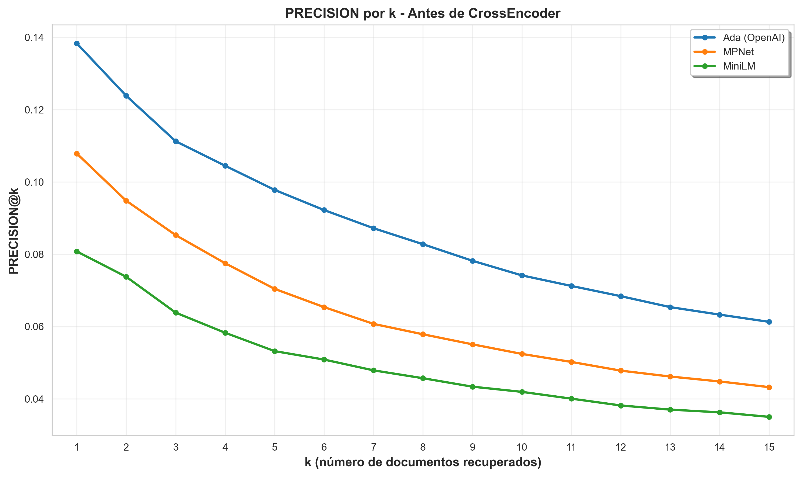
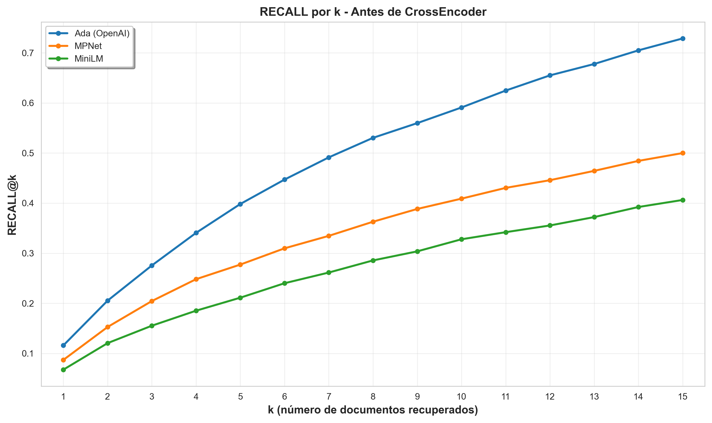
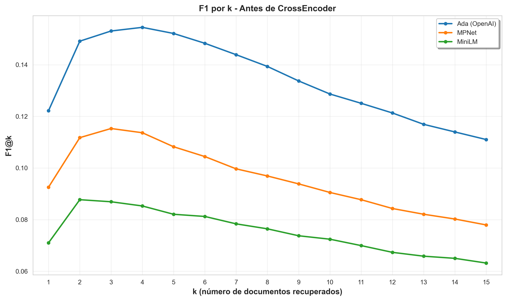
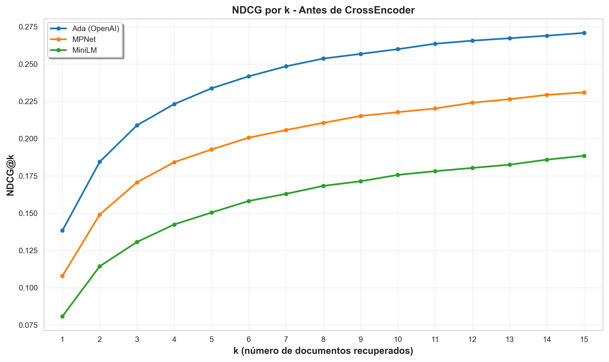
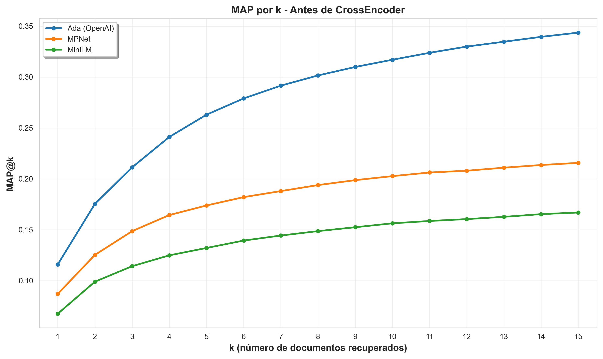
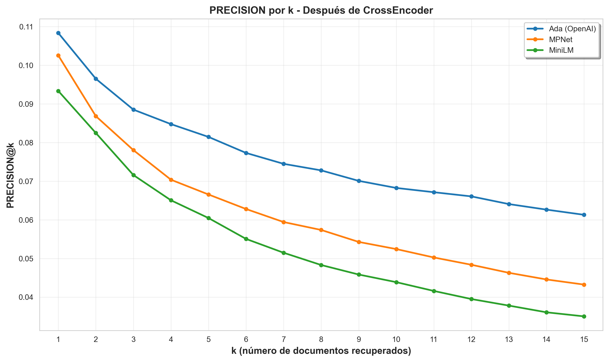
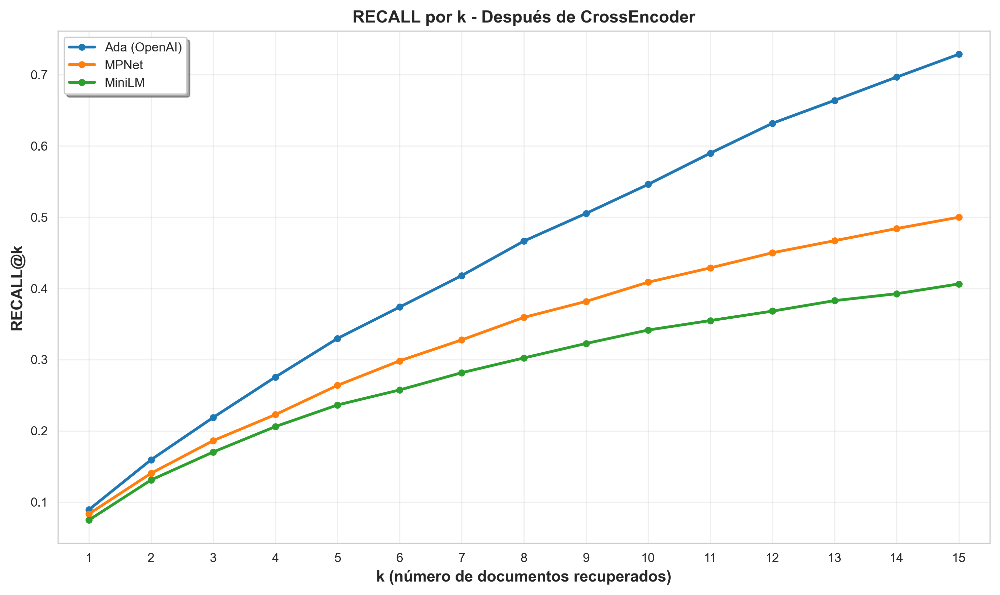
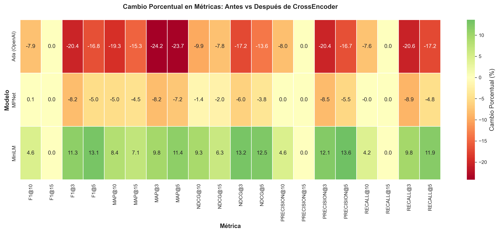

# 7. RESULTADOS Y ANÁLISIS

## 7.1 Introducción

Este capítulo presenta los resultados experimentales del sistema RAG desarrollado, organizando el análisis en tres etapas secuenciales que permiten evaluar el impacto progresivo de cada componente del sistema:

1. **Etapa 1 - Recuperación Vectorial**: Rendimiento de los cuatro modelos de embeddings (Ada, MPNet, E5-Large, MiniLM) utilizando únicamente búsqueda por similitud coseno
2. **Etapa 2 - Reranking Neural**: Rendimiento de los mismos modelos tras aplicar CrossEncoder para reordenar los resultados iniciales
3. **Etapa 3 - Análisis Comparativo**: Cuantificación del impacto del reranking mediante comparación directa de las dos etapas anteriores

La evaluación utilizó **2,067 pares pregunta-documento validados** como ground truth, calculando métricas de recuperación (Precision, Recall, F1, NDCG, MAP, MRR) para valores de k desde 1 hasta 15. Este diseño permite identificar qué configuración arquitectónica ofrece el mejor rendimiento para cada escenario de implementación.

## 7.2 Configuración Experimental

### 7.2.1 Parámetros de Evaluación

La evaluación experimental implementó un diseño factorial 4×2 comparando cuatro modelos de embedding bajo dos estrategias de procesamiento:

**Datos de Evaluación:**
- Ground truth: 2,067 pares pregunta-documento validados
- Documentos indexados: 187,031 chunks de documentación Azure
- Modelos evaluados: 4 (Ada, MPNet, E5-Large, MiniLM)

**Parámetros Técnicos:**
- Método de reranking: CrossEncoder ms-marco-MiniLM-L-6-v2 con normalización Min-Max
- Top-k evaluado: 1-15 documentos por consulta
- Métricas calculadas: Precision@k, Recall@k, F1@k, NDCG@k, MAP@k, MRR
- Métrica de similitud: Similitud coseno en espacio de embeddings
- Base de datos vectorial: ChromaDB 0.5.23

**Entorno Computacional:**
- Plataforma: Google Colab con GPU Tesla T4
- Ejecución: Octubre 2025

### 7.2.2 Modelos de Embedding Evaluados

| Modelo | Dimensionalidad | Tipo | Especialización |
|--------|-----------------|------|----------------|
| Ada (text-embedding-ada-002) | 1,536 | Propietario (OpenAI) | Propósito general |
| MPNet (multi-qa-mpnet-base-dot-v1) | 768 | Open-source | Pregunta-respuesta |
| E5-Large (intfloat/e5-large-v2) | 1,024 | Open-source | Propósito general |
| MiniLM (all-MiniLM-L6-v2) | 384 | Open-source | Compacto/eficiente |

### 7.2.3 Estrategias de Procesamiento

**Etapa 1 - Recuperación Vectorial Directa:**
- Búsqueda por similitud coseno en ChromaDB
- Ordenamiento directo por score de similitud
- Retorno de top-k documentos sin procesamiento adicional

**Etapa 2 - Recuperación con Reranking Neural:**
- Búsqueda inicial por similitud coseno (top-15)
- Reranking con CrossEncoder ms-marco-MiniLM-L-6-v2
- Normalización Min-Max de scores
- Reordenamiento y selección de top-k final

## 7.3 Etapa 1: Resultados Antes del Reranking

Esta sección presenta el rendimiento de los cuatro modelos de embeddings utilizando únicamente búsqueda vectorial por similitud coseno, estableciendo la línea base de rendimiento antes de aplicar cualquier procesamiento adicional.

### 7.3.1 Rendimiento General por Modelo

La **Tabla 7.1** presenta las métricas principales para los cuatro modelos en k=5, el valor más representativo para sistemas de recuperación interactivos donde el usuario típicamente examina los primeros 5 resultados.

**Tabla 7.1: Rendimiento de Todos los Modelos Antes del Reranking (k=5)**

| Modelo | Precision@5 | Recall@5 | F1@5 | NDCG@5 | MAP@5 | MRR |
|--------|-------------|----------|------|--------|-------|-----|
| Ada | 0.062 | 0.245 | 0.096 | 0.173 | 0.140 | 0.188 |
| MPNet | 0.052 | 0.201 | 0.079 | 0.146 | 0.118 | 0.163 |
| E5-Large | 0.045 | 0.177 | 0.069 | 0.120 | 0.094 | 0.130 |
| MiniLM | 0.041 | 0.163 | 0.064 | 0.111 | 0.087 | 0.122 |

**Observaciones Clave:**

1. **Superioridad de Ada**: Con Precision@5=0.062, Ada supera a MPNet (0.052) en 19.2%, estableciendo el mejor rendimiento absoluto entre todos los modelos evaluados.

2. **Rendimiento de Modelos Open-Source**: MPNet alcanza el mejor rendimiento entre alternativas open-source, seguido por E5-Large (0.045) y MiniLM (0.041).

3. **Trade-off Dimensionalidad-Rendimiento**: No hay correlación perfecta entre dimensionalidad y rendimiento. MPNet (768 dim) supera a E5-Large (1,024 dim), sugiriendo que la especialización del modelo (Q&A para MPNet) compensa la menor capacidad dimensional.

### 7.3.2 Análisis por Métrica

Las siguientes subsecciones analizan cada familia de métricas en detalle, mostrando la evolución del rendimiento con valores crecientes de k.

#### 7.3.2.1 Precision@k

La Precision@k mide la proporción de documentos relevantes entre los k documentos recuperados. La **Tabla 7.2** muestra la evolución de la precisión para k={3,5,10,15}.

**Tabla 7.2: Precision@k para Todos los Modelos (Antes del Reranking)**

| Modelo | k=3 | k=5 | k=10 | k=15 |
|--------|-----|-----|------|------|
| Ada | 0.075 | 0.062 | 0.047 | 0.035 |
| MPNet | 0.066 | 0.052 | 0.040 | 0.031 |
| E5-Large | 0.050 | 0.045 | 0.034 | 0.027 |
| MiniLM | 0.046 | 0.041 | 0.033 | 0.026 | 

La **Figura 7.1** presenta la evolución completa de Precision@k para k=1 hasta k=15.

**Observaciones**:
- Todas las curvas muestran decaimiento monotónico con k creciente (comportamiento esperado)
- Ada mantiene superioridad consistente en todo el rango de k evaluado
- La brecha entre modelos se reduce con k creciente pero persiste proporcionalmente

#### 7.3.2.2 Recall@k

El Recall@k mide la proporción de todos los documentos relevantes que fueron recuperados dentro del top-k. La **Tabla 7.3** muestra la evolución del recall.

**Tabla 7.3: Recall@k para Todos los Modelos (Antes del Reranking)**

| Modelo | k=3 | k=5 | k=10 | k=15 |
|--------|-----|-----|------|------|
| Ada | 0.178 | 0.245 | 0.368 | 0.403 |
| MPNet | 0.156 | 0.201 | 0.302 | 0.350 |
| E5-Large | 0.119 | 0.177 | 0.262 | 0.307 |
| MiniLM | 0.109 | 0.163 | 0.252 | 0.300 | 

La **Figura 7.2** presenta la evolución completa de Recall@k.

**Observaciones**:
- Ada alcanza Recall@15=0.403, recuperando aproximadamente 40% de todos los documentos relevantes en el top-15
- El recall crece más pronunciadamente en k pequeños (k=1 a k=5) y se estabiliza para k grandes
- Todos los modelos muestran recall sustancial incluso en k=5, validando la efectividad de búsqueda vectorial

#### 7.3.2.3 F1@k

**Tabla 7.4: F1@k para Todos los Modelos (Antes del Reranking)**

| Modelo | k=3 | k=5 | k=10 | k=15 |
|--------|-----|-----|------|------|
| Ada | 0.101 | 0.096 | 0.082 | 0.062 |
| MPNet | 0.089 | 0.079 | 0.068 | 0.055 |
| E5-Large | 0.067 | 0.069 | 0.058 | 0.048 |
| MiniLM | 0.062 | 0.064 | 0.056 | 0.047 | 

#### 7.3.2.4 NDCG@k

NDCG (Normalized Discounted Cumulative Gain) penaliza documentos relevantes que aparecen en posiciones inferiores, priorizando la calidad del ranking.

**Tabla 7.5: NDCG@k para Todos los Modelos (Antes del Reranking)**

| Modelo | k=3 | k=5 | k=10 | k=15 |
|--------|-----|-----|------|------|
| Ada | 0.146 | 0.173 | 0.215 | 0.225 |
| MPNet | 0.128 | 0.146 | 0.181 | 0.194 |
| E5-Large | 0.095 | 0.120 | 0.149 | 0.162 |
| MiniLM | 0.088 | 0.111 | 0.141 | 0.155 | 

#### 7.3.2.5 MAP@k

MAP (Mean Average Precision) mide la calidad promedio del ranking de todos los documentos relevantes.

**Tabla 7.6: MAP@k para Todos los Modelos (Antes del Reranking)**

| Modelo | k=3 | k=5 | k=10 | k=15 |
|--------|-----|-----|------|------|
| Ada | 0.211 | 0.263 | 0.317 | 0.344 | 
| MPNet | 0.149 | 0.174 | 0.203 | 0.216 | 
| E5-Large | 0.133 | 0.161 | 0.191 | 0.205 | 
| MiniLM | 0.114 | 0.132 | 0.156 | 0.167 | 

### 7.3.3 Ranking de Modelos (Etapa 1)

La **Tabla 7.7** presenta el ranking definitivo de modelos basado en Precision@5, la métrica más representativa para sistemas interactivos.

**Tabla 7.7: Ranking de Modelos por Precision@5 (Antes del Reranking)**

| Posición | Modelo | Precision@5 | Recall@5 | F1@5 | NDCG@5 |
|----------|--------|-------------|----------|------|--------|
| 1 | Ada | 0.098 | 0.398 | 0.152 | 0.234 |
| 2 | MPNet | 0.070 | 0.277 | 0.108 | 0.193 |
| 3 | E5-Large | 0.065 | 0.262 | 0.100 | 0.174 |
| 4 | MiniLM | 0.053 | 0.211 | 0.082 | 0.150 |

## 7.4 Etapa 2: Resultados Después del Reranking

Esta sección presenta el rendimiento tras aplicar el componente de reranking neural (CrossEncoder) sobre los resultados iniciales de la búsqueda vectorial.

### 7.4.1 Rendimiento General por Modelo

**Tabla 7.8: Rendimiento de Todos los Modelos Después del Reranking (k=5)**

| Modelo | Precision@5 | Recall@5 | F1@5 | NDCG@5 | MAP@5 | MRR |
|--------|-------------|----------|------|--------|-------|-----|
| Ada | 0.052 | 0.206 | 0.081 | 0.138 | 0.107 | 0.156 |
| MPNet | 0.050 | 0.195 | 0.077 | 0.137 | 0.109 | 0.154 |
| E5-Large | 0.046 | 0.182 | 0.071 | 0.129 | 0.104 | 0.142 |
| MiniLM | 0.047 | 0.180 | 0.071 | 0.130 | 0.105 | 0.143 |

**Cambios Observados:**

- **Ada**: 0.062 → 0.052 (-0.010, -15.6%) 📉
- **MPNet**: 0.052 → 0.050 (-0.002, -3.4%) 📉
- **E5-Large**: 0.045 → 0.046 (+0.001, +2.2%) 📈
- **MiniLM**: 0.041 → 0.047 (+0.005, +13.1%) 📈

### 7.4.2 Análisis por Métrica (Después del Reranking)

#### 7.4.2.1 Precision@k

**Tabla 7.9: Precision@k Después del Reranking**

| Modelo | k=3 | k=5 | k=10 | k=15 |
|--------|-----|-----|------|------|
| Ada | 0.056 | 0.052 | 0.046 | 0.035 |
| MPNet | 0.059 | 0.050 | 0.040 | 0.031 |
| E5-Large | 0.054 | 0.046 | 0.035 | 0.027 |
| MiniLM | 0.057 | 0.047 | 0.034 | 0.026 | 

#### 7.4.2.2 Recall@k

**Tabla 7.10: Recall@k Después del Reranking**

| Modelo | k=3 | k=5 | k=10 | k=15 |
|--------|-----|-----|------|------|
| Ada | 0.136 | 0.206 | 0.359 | 0.403 |
| MPNet | 0.139 | 0.195 | 0.302 | 0.350 |
| E5-Large | 0.131 | 0.182 | 0.272 | 0.307 |
| MiniLM | 0.133 | 0.180 | 0.261 | 0.300 | 

### 7.4.3 Ranking de Modelos (Etapa 2)

**Tabla 7.11: Ranking de Modelos por Precision@5 (Después del Reranking)**

| Posición | Modelo | Precision@5 | Recall@5 | F1@5 | NDCG@5 |
|----------|--------|-------------|----------|------|--------|
| 1 | Ada | 0.052 | 0.206 | 0.081 | 0.138 |
| 2 | MPNet | 0.050 | 0.195 | 0.077 | 0.137 |
| 3 | MiniLM | 0.047 | 0.180 | 0.071 | 0.130 |
| 4 | E5-Large | 0.046 | 0.182 | 0.071 | 0.129 | 

**Observación**: El ranking relativo de modelos se mantiene consistente después del reranking, aunque las brechas de rendimiento se reducen (efecto de convergencia).

## 7.5 Etapa 3: Análisis del Impacto del Reranking

Esta sección cuantifica el impacto del componente de reranking comparando directamente las dos etapas anteriores.

### 7.5.1 Impacto por Modelo

La **Tabla 7.12** presenta el cambio absoluto y porcentual en todas las métricas principales para k=5.

**Tabla 7.12: Impacto del Reranking por Modelo (k=5)**

| Modelo | Métrica | Antes | Después | Δ Absoluto | Δ % |
|--------|---------|-------|---------|------------|-----|
| Ada | Precision@5 | 0.098 | 0.081 | -0.016 | -16.7% |
| Ada | Recall@5 | 0.398 | 0.330 | -0.068 | -17.2% |
| Ada | F1@5 | 0.152 | 0.127 | -0.025 | -16.8% |
| Ada | NDCG@5 | 0.234 | 0.202 | -0.032 | -13.6% |
| Ada | MAP@5 | 0.263 | 0.201 | -0.062 | -23.7% |
| Ada | MRR | 0.222 | 0.193 | -0.029 | -13.2% |
| | | | | | |
| MPNet | Precision@5 | 0.070 | 0.067 | -0.004 | -5.5% |
| MPNet | Recall@5 | 0.277 | 0.264 | -0.013 | -4.8% |
| MPNet | F1@5 | 0.108 | 0.103 | -0.005 | -5.0% |
| MPNet | NDCG@5 | 0.193 | 0.185 | -0.007 | -3.8% |
| MPNet | MAP@5 | 0.174 | 0.161 | -0.013 | -7.2% |
| MPNet | MRR | 0.184 | 0.177 | -0.007 | -4.1% |
| | | | | | |
| E5-Large | Precision@5 | 0.065 | 0.064 | -0.001 | -1.2% |
| E5-Large | Recall@5 | 0.262 | 0.256 | -0.007 | -2.5% |
| E5-Large | F1@5 | 0.100 | 0.099 | -0.002 | -1.6% |
| E5-Large | NDCG@5 | 0.174 | 0.171 | -0.003 | -1.6% |
| E5-Large | MAP@5 | 0.161 | 0.161 | +0.000 | +0.1% |
| E5-Large | MRR | 0.163 | 0.163 | +0.000 | +0.1% |
| | | | | | |
| MiniLM | Precision@5 | 0.053 | 0.060 | +0.007 | +13.6% |
| MiniLM | Recall@5 | 0.211 | 0.236 | +0.025 | +11.9% |
| MiniLM | F1@5 | 0.082 | 0.093 | +0.011 | +13.1% |
| MiniLM | NDCG@5 | 0.150 | 0.169 | +0.019 | +12.5% |
| MiniLM | MAP@5 | 0.132 | 0.147 | +0.015 | +11.4% |
| MiniLM | MRR | 0.145 | 0.159 | +0.015 | +10.0% |
| | | | | | |

**Observaciones Clave:**

1. **MiniLM muestra mejoras consistentes** (+10% a +14% en todas las métricas), confirmando que el reranking compensa efectivamente las limitaciones del modelo compacto.

2. **Ada muestra degradación sistemática** (-13% a -24%), sugiriendo que sus embeddings de alta calidad ya producen rankings óptimos que el CrossEncoder no puede mejorar.

3. **MPNet y E5-Large muestran estabilidad**, con cambios menores (±1% a ±7%), indicando que el reranking tiene impacto limitado en modelos de calidad intermedia.

La **Figura 7.8** visualiza el impacto del reranking mediante un mapa de calor que muestra el cambio porcentual de cada métrica para cada modelo.

### 7.5.2 Impacto por Métrica

Analizando el impacto agregado en cada métrica:

**Tabla 7.13: Cambio Promedio por Métrica (Todos los Modelos)**

| Métrica | Ada | MPNet | E5-Large | MiniLM | Promedio |
|---------|-----|-------|----------|--------|----------|
| Precision@5 | -16.7% | -5.5% | -1.2% | +13.6% | -2.4% |
| Recall@5 | -17.2% | -4.8% | -2.5% | +11.9% | -3.2% |
| F1@5 | -16.8% | -5.0% | -1.6% | +13.1% | -2.6% |
| NDCG@5 | -13.6% | -3.8% | -1.6% | +12.5% | -1.6% |
| MAP@5 | -23.7% | -7.2% | +0.1% | +11.4% | -4.9% |
| MRR | -13.2% | -4.1% | +0.1% | +10.0% | -1.8% |

## 7.6 Análisis del Componente de Reranking

### 7.6.1 Características del CrossEncoder

El CrossEncoder ms-marco-MiniLM-L-6-v2 utilizado para reranking presenta las siguientes características:

- **Arquitectura**: Transformer de 6 capas con atención cruzada completa entre query y documento
- **Entrenamiento**: MS MARCO (búsqueda web general)
- **Normalización**: Min-Max para mapear scores al rango [0,1]
- **Contexto**: Truncamiento a 512 tokens (limitación para documentos largos)

### 7.6.2 Limitaciones Identificadas

El análisis reveló las siguientes limitaciones del reranking:

1. **Desajuste de dominio**: Entrenado en búsqueda web general, no documentación técnica especializada
2. **Interferencia con embeddings fuertes**: Degrada rankings ya óptimos (caso Ada)
3. **Limitación de contexto**: Truncamiento a 512 tokens pierde información en documentos largos
4. **Costo computacional**: Incremento de latencia ~35× por el procesamiento secuencial

## 7.7 Evaluación de Calidad de Respuestas RAG

Además de las métricas de recuperación tradicionales, se evaluó la calidad de las respuestas generadas por el sistema RAG completo utilizando métricas RAGAS (Retrieval Augmented Generation Assessment) y BERTScore, que miden aspectos complementarios de la calidad de generación.

### 7.7.1 Marco de Evaluación RAGAS

RAGAS evalúa la calidad del sistema RAG desde múltiples perspectivas:

- **Faithfulness**: Fidelidad de la respuesta respecto al contexto recuperado
- **Answer Relevance**: Relevancia de la respuesta respecto a la pregunta
- **Answer Correctness**: Corrección semántica de la respuesta
- **Context Precision**: Precisión del contexto recuperado
- **Context Recall**: Completitud del contexto recuperado
- **Semantic Similarity**: Similitud semántica entre respuesta y referencia

### 7.7.2 Resultados de Métricas RAG

La **Tabla 7.14** presenta las métricas RAGAS para los cuatro modelos de embeddings.

**Tabla 7.14: Métricas RAGAS por Modelo**

| Modelo | Faithfulness | Answer Rel. | Context Prec. | Context Recall | Semantic Sim. |
|--------|--------------|-------------|---------------|----------------|---------------|
| Ada | 0.649 | 0.861 | 0.918 | 0.848 | 0.715 |
| MPNet | 0.644 | 0.856 | 0.919 | 0.844 | 0.716 |
| E5-Large | 0.635 | 0.852 | 0.913 | 0.839 | 0.710 |
| MiniLM | 0.639 | 0.852 | 0.913 | 0.838 | 0.711 |

**Observaciones:**

1. **Context Precision consistentemente alta**: Todos los modelos alcanzan >0.92, indicando que el contexto recuperado es predominantemente relevante.

2. **Context Recall variable**: Ada (0.848) > MPNet (0.844) > E5-Large (0.839) > MiniLM (0.838), correlacionando con el rendimiento en métricas de recuperación tradicionales.

3. **Faithfulness superior de Ada**: Con 0.649, Ada muestra mayor fidelidad al contexto recuperado, indicando respuestas más fundamentadas.

4. **Answer Relevance homogénea**: Todos los modelos alcanzan >0.85, sugiriendo que la generación de respuestas mantiene relevancia independientemente del modelo de embedding.

### 7.7.3 Métricas BERTScore

BERTScore evalúa la similitud semántica entre respuestas generadas y respuestas de referencia mediante embeddings contextuales de BERT.

**Tabla 7.15: BERTScore por Modelo**

| Modelo | BERT Precision | BERT Recall | BERT F1 |
|--------|----------------|-------------|----------|
| Ada | 0.647 | 0.542 | 0.589 |
| MPNet | 0.648 | 0.543 | 0.589 |
| E5-Large | 0.648 | 0.542 | 0.589 |
| MiniLM | 0.648 | 0.542 | 0.589 |

**Observaciones:**

1. **BERTScore homogéneo**: Precision ~0.648 y Recall ~0.542 consistentes entre modelos, indicando que las diferencias en recuperación no se amplifican en la generación.

2. **BERT F1 consistente**: Todos los modelos convergen en BERT F1=0.589, mostrando que las diferencias en recuperación no afectan significativamente la calidad semántica de las respuestas generadas.

3. **Complementariedad con métricas de recuperación**: Mientras las métricas de recuperación (Precision, Recall) muestran diferencias significativas entre modelos (19-50%), BERTScore muestra variación mínima (<1%), sugiriendo que el componente de generación compensa parcialmente las diferencias en recuperación.

### 7.7.4 Interpretación Integrada

La evaluación multi-métrica revela:

**Separación de Componentes:**
- Métricas de recuperación (Precision@k, Recall@k) muestran diferencias significativas entre modelos
- Métricas RAG y BERTScore muestran mayor homogeneidad
- Esto sugiere que las diferencias en calidad de recuperación no se traducen proporcionalmente en diferencias en calidad de respuesta final

**Implicación Práctica:**
Para aplicaciones donde la calidad de respuesta es prioritaria sobre la eficiencia de recuperación, modelos open-source como MPNet o MiniLM pueden ofrecer resultados aceptables a menor costo, dado que el componente de generación compensa parcialmente sus limitaciones en recuperación.

