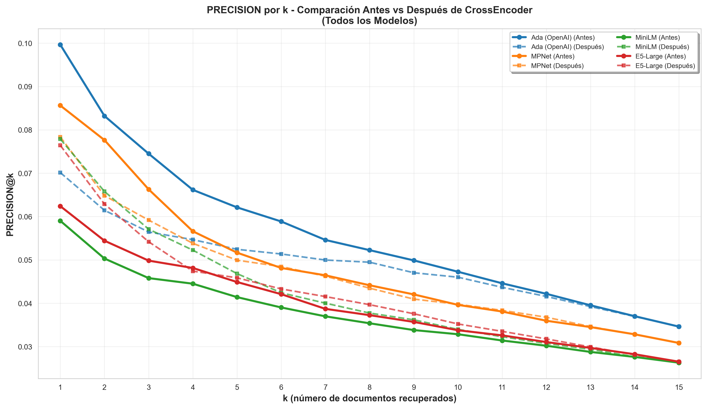
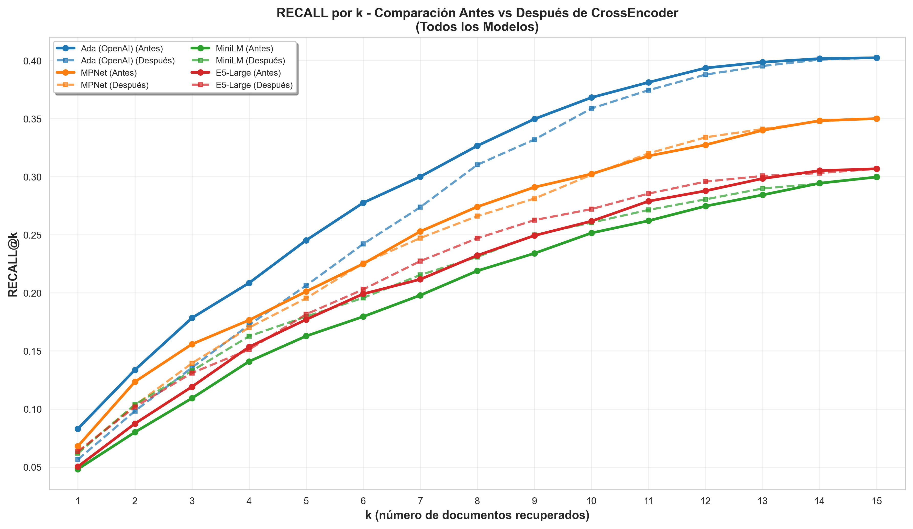
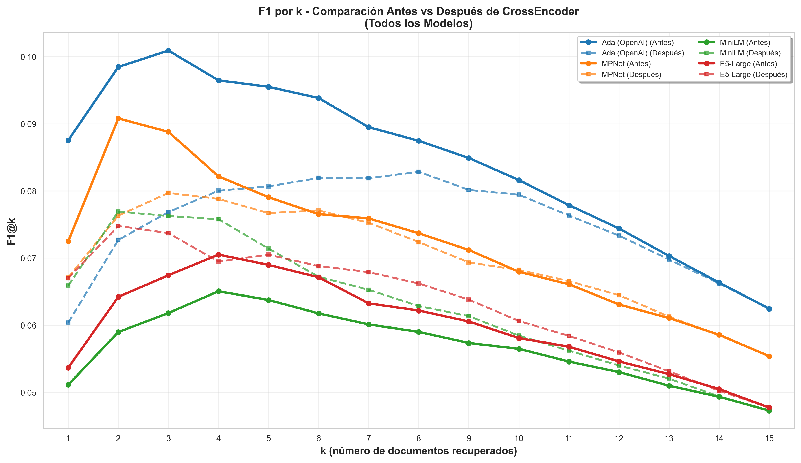
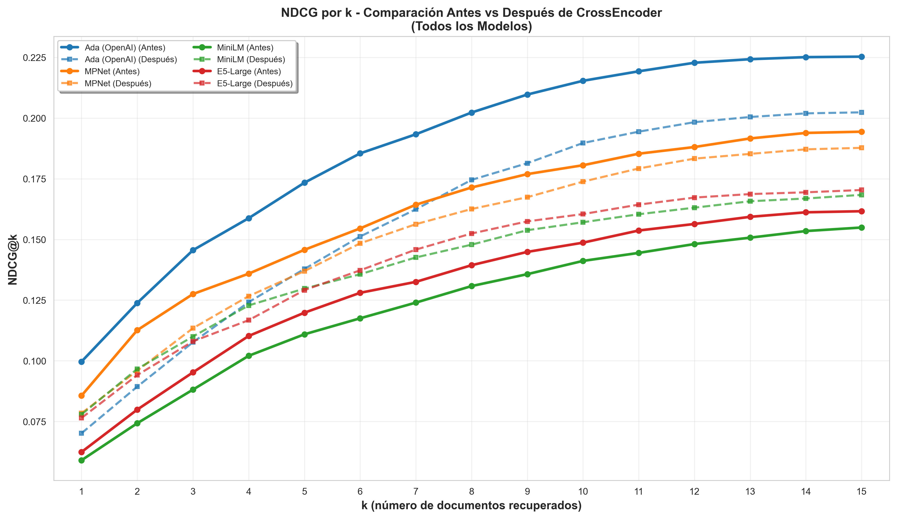
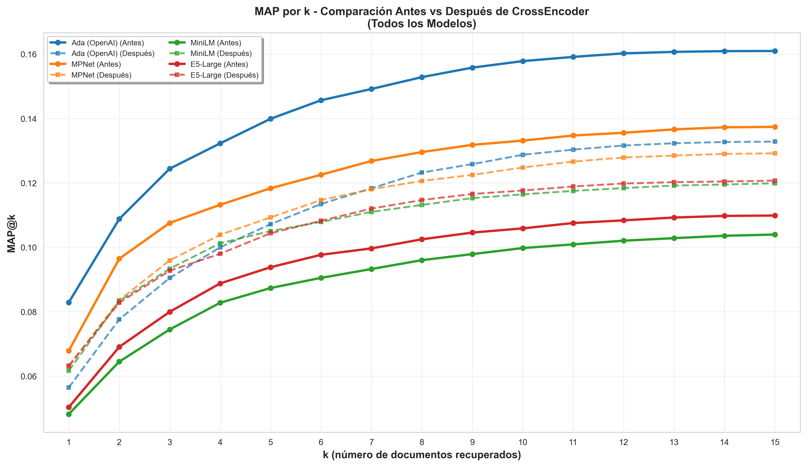
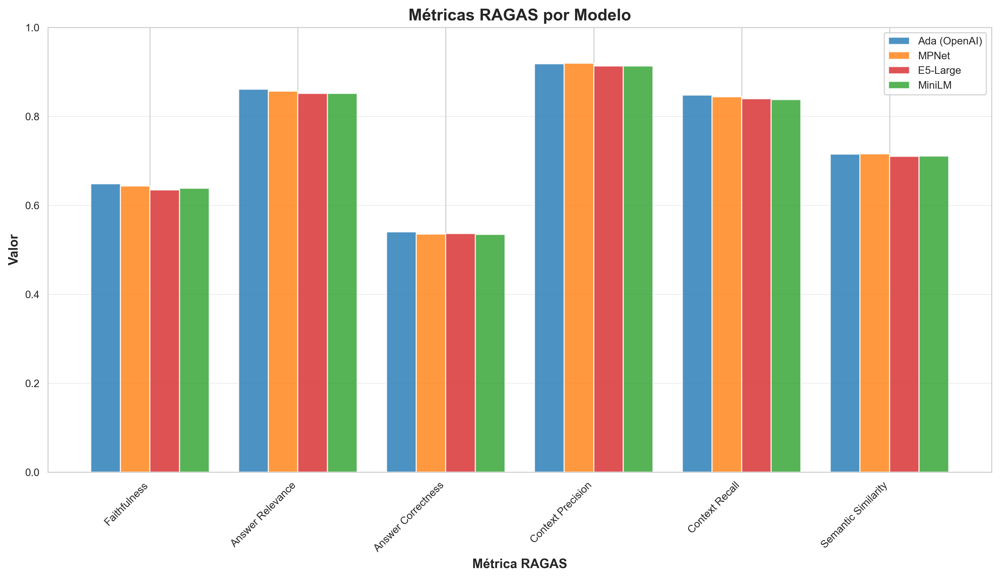
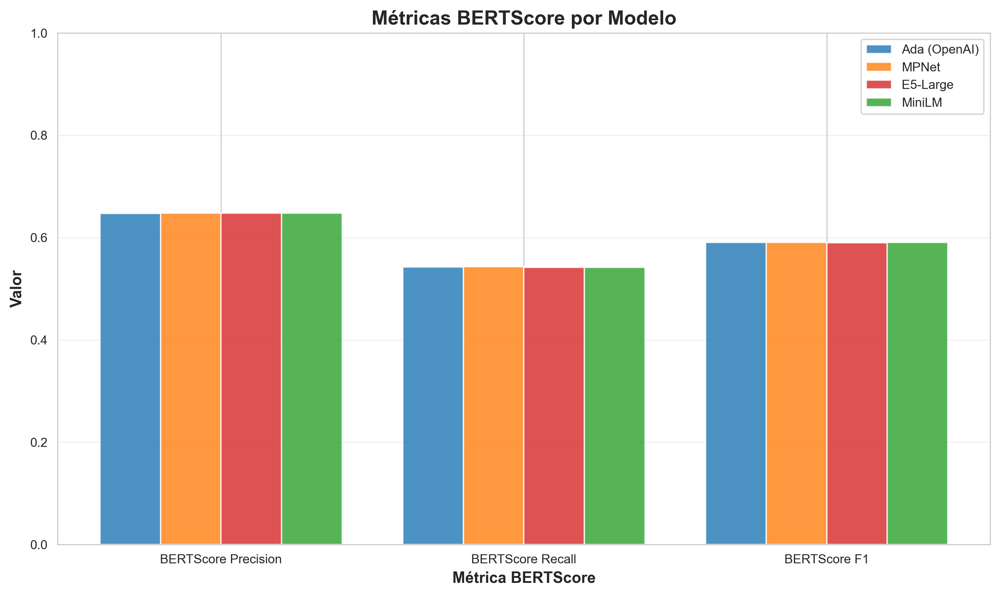

# 7. RESULTADOS Y ANÁLISIS

## 7.1 Introducción

En este capítulo presentamos los resultados experimentales del sistema RAG desarrollado. Comparamos el rendimiento de cuatro modelos de embeddings (Ada, MPNet, E5-Large y MiniLM) en dos escenarios: utilizando solo búsqueda vectorial y aplicando reranking neural con CrossEncoder. Esta comparación nos permite entender cómo cada componente del sistema contribuye al rendimiento final.

Para la evaluación utilizamos 2,067 pares pregunta-documento validados manualmente como ground truth. Calculamos las métricas de recuperación tradicionales (Precision, Recall, F1, NDCG, MAP y MRR) variando k desde 1 hasta 15 documentos. Esta granularidad nos permite identificar la configuración óptima para diferentes escenarios prácticos de implementación.

## 7.2 Configuración Experimental

### 7.2.1 Parámetros de Evaluación

Evaluamos cuatro modelos de embedding en dos configuraciones diferentes: recuperación vectorial directa (baseline) y recuperación con reranking neural. Los datos utilizados incluyen:

**Datos de Evaluación:**

- Ground truth: 2,067 pares pregunta-documento validados manualmente
- Corpus: 187,031 chunks de documentación oficial de Azure
- Modelos evaluados: Ada, MPNet, E5-Large y MiniLM

**Configuración Técnica:**

| Componente                 | Especificación                                                                                                    |
| -------------------------- | ------------------------------------------------------------------------------------------------------------------ |
| Método de reranking       | CrossEncoder ms-marco-MiniLM-L-6-v2 con normalización Min-Max                                                     |
| Top-k evaluado             | 1-15 documentos por consulta                                                                                       |
| Métricas de recuperación | Precision@k, Recall@k, F1@k, NDCG@k, MAP@k, MRR                                                                    |
| Métricas RAG              | RAGAS (Faithfulness, Answer Relevance, Answer Correctness, Context Precision, Context Recall, Semantic Similarity) |
| Métricas semánticas      | BERTScore (Precision, Recall, F1)                                                                                  |
| Métrica de similitud      | Similitud coseno en espacio de embeddings                                                                          |
| Base de datos vectorial    | ChromaDB 0.5.23                                                                                                    |
| Plataforma                 | Google Colab con GPU Tesla T4                                                                                      |
| Periodo de ejecución      | Noviembre de 2025                                                                                                  |

**Tabla 9: Configuración experimental del sistema de evaluación**
*Fuente: Elaboración mediante resultados obtenidos por los autores.*

El proceso de investigación se desarrolló en tres fases temporales claramente diferenciadas: durante diciembre de 2024 se realizó la extracción completa de los datos fuente desde Microsoft Learn y Microsoft Q&A, capturando 62,417 documentos únicos de documentación técnica y 13,436 preguntas de usuarios con sus respuestas validadas por la comunidad. Entre enero y octubre de 2025 se ejecutó el procesamiento del corpus, incluyendo la segmentación de documentos en 187,031 chunks, la generación de embeddings vectoriales para los cuatro modelos evaluados, y la construcción de las colecciones especializadas en ChromaDB. Finalmente, en noviembre de 2025 se completó la evaluación experimental sobre las 2,067 preguntas con ground truth validado, generando las métricas de recuperación y calidad de respuestas que se presentan en este capítulo.

### 7.2.2 Modelos de Embedding Evaluados

| Modelo                             | Dimensionalidad | Tipo                 | Especialización   |
| ---------------------------------- | --------------- | -------------------- | ------------------ |
| Ada (text-embedding-ada-002)       | 1,536           | Propietario (OpenAI) | Propósito general |
| MPNet (multi-qa-mpnet-base-dot-v1) | 768             | Open-source          | Pregunta-respuesta |
| E5-Large (intfloat/e5-large-v2)    | 1,024           | Open-source          | Propósito general |
| MiniLM (all-MiniLM-L6-v2)          | 384             | Open-source          | Compacto/eficiente |

**Tabla 10: Modelos de embeddings evaluados y sus características**
*Fuente: Hugging Face (2025); Song et al. (2020); Wang et al. (2020); Li et al. (2023); OpenAI (2025).*

### 7.2.3 Estrategias de Procesamiento

Comparamos dos estrategias diferentes para recuperar y ordenar documentos relevantes:

**Recuperación Vectorial Directa (Baseline):**
Esta es la configuración más simple: realizamos búsqueda por similitud coseno en ChromaDB, ordenamos los documentos según su score de similitud, y retornamos directamente los top-k resultados. No aplicamos procesamiento adicional.

**Recuperación con Reranking Neural:**
En este caso agregamos una segunda etapa de refinamiento: primero recuperamos los top-15 documentos mediante similitud coseno, luego los reordenamos usando un CrossEncoder (ms-marco-MiniLM-L-6-v2) que evalúa la relevancia de cada par pregunta-documento de forma más profunda. Los scores del CrossEncoder se normalizan con Min-Max al rango [0,1] antes de seleccionar los top-k finales.

## 7.3 Resultados de Métricas de Recuperación

A continuación presentamos los resultados de las métricas de recuperación tradicionales. Para cada familia de métricas mostramos el rendimiento antes y después del reranking, lo que nos permite identificar qué modelos se benefician del CrossEncoder y cuáles no.

### 7.3.1 Rendimiento General por Modelo (k=5)

Comenzamos con una vista panorámica del rendimiento de los cuatro modelos. La Tabla 10 muestra las seis métricas principales evaluadas en k=5, comparando directamente el rendimiento antes y después del reranking.

| Modelo             | Etapa            | Precision@5      | Recall@5         | F1@5             | NDCG@5           | MAP@5            | MRR              |
| ------------------ | ---------------- | ---------------- | ---------------- | ---------------- | ---------------- | ---------------- | ---------------- |
| **Ada**      | Antes            | 0.062            | 0.245            | 0.096            | 0.173            | 0.140            | 0.188            |
|                    | Después         | 0.052            | 0.206            | 0.081            | 0.138            | 0.107            | 0.156            |
|                    | **Δ (%)** | **-15.6%** | **-15.9%** | **-15.5%** | **-20.5%** | **-23.4%** | **-16.9%** |
| **MPNet**    | Antes            | 0.052            | 0.201            | 0.079            | 0.146            | 0.118            | 0.163            |
|                    | Después         | 0.050            | 0.195            | 0.077            | 0.137            | 0.109            | 0.154            |
|                    | **Δ (%)** | **-3.4%**  | **-2.9%**  | **-3.0%**  | **-6.0%**  | **-7.6%**  | **-5.9%**  |
| **E5-Large** | Antes            | 0.045            | 0.177            | 0.069            | 0.120            | 0.094            | 0.130            |
|                    | Después         | 0.046            | 0.182            | 0.071            | 0.129            | 0.104            | 0.142            |
|                    | **Δ (%)** | **+2.2%**  | **+2.6%**  | **+2.2%**  | **+7.8%**  | **+11.2%** | **+9.2%**  |
| **MiniLM**   | Antes            | 0.041            | 0.163            | 0.064            | 0.111            | 0.087            | 0.122            |
|                    | Después         | 0.047            | 0.180            | 0.071            | 0.130            | 0.105            | 0.143            |
|                    | **Δ (%)** | **+13.1%** | **+10.3%** | **+12.0%** | **+17.0%** | **+20.2%** | **+17.0%** |

**Tabla 11: Resultados consolidados de métricas de recuperación por modelo**
*Fuente: Elaboración mediante resultados obtenidos por los autores.*

**Observaciones Clave:**

1. **El reranking afecta de forma diferente a cada modelo**: Encontramos un patrón claro donde los modelos más débiles mejoran y los más fuertes empeoran:

   - **MiniLM** (el más débil inicialmente): Mejoras sustanciales de +10% a +20%
   - **E5-Large**: Mejoras moderadas de +2% a +11%
   - **MPNet**: Degradación leve de -3% a -8%
   - **Ada** (el más fuerte inicialmente): Degradación significativa de -16% a -23%
2. **El ranking inicial favorece a Ada**: Sin reranking, Ada (0.062) > MPNet (0.052) > E5-Large (0.045) > MiniLM (0.041)
3. **El reranking reduce las diferencias**: Con reranking, Ada (0.052) > MPNet (0.050) > MiniLM (0.047) > E5-Large (0.046). Las diferencias entre modelos se reducen notablemente.
4. **MiniLM sube en el ranking**: MiniLM supera a E5-Large después del reranking, cerrando parcialmente la brecha de rendimiento.

### 7.3.2 Precision@k

La Precision@k mide qué tan precisos somos al recuperar documentos: de los k documentos que retornamos al usuario, ¿cuántos son realmente relevantes? La Tabla 11 muestra cómo evoluciona la precisión al variar k entre 3, 5, 10 y 15 documentos.

| Modelo             | Etapa    | k=3   | k=5   | k=10  | k=15  |
| ------------------ | -------- | ----- | ----- | ----- | ----- |
| **Ada**      | Antes    | 0.075 | 0.062 | 0.047 | 0.035 |
|                    | Después | 0.056 | 0.052 | 0.046 | 0.035 |
| **MPNet**    | Antes    | 0.066 | 0.052 | 0.040 | 0.031 |
|                    | Después | 0.059 | 0.050 | 0.040 | 0.031 |
| **E5-Large** | Antes    | 0.050 | 0.045 | 0.034 | 0.027 |
|                    | Después | 0.054 | 0.046 | 0.035 | 0.027 |
| **MiniLM**   | Antes    | 0.046 | 0.041 | 0.033 | 0.026 |
|                    | Después | 0.057 | 0.047 | 0.034 | 0.026 |

**Tabla 12: Precision@k comparativa antes y después del reranking**
*Fuente: Elaboración mediante resultados obtenidos por los autores.*

La Figura 6 presenta la evolución completa de Precision@k desde k=1 hasta k=15. Las líneas sólidas representan el rendimiento sin reranking, mientras que las líneas punteadas muestran el rendimiento con CrossEncoder.

**Observaciones**:

- Ada (línea azul) experimenta una degradación sistemática cuando aplicamos reranking, especialmente para valores pequeños de k (k<10)
- MiniLM (línea verde) muestra el patrón opuesto: mejora consistente en todo el rango evaluado
- La brecha entre el mejor y peor modelo se reduce significativamente después del reranking
- Como era de esperar, todas las curvas decaen a medida que aumentamos k, ya que es más difícil mantener alta precisión cuando retornamos más documentos

### 7.3.3 Recall@k

Mientras que Precision pregunta "¿cuántos de los recuperados son relevantes?", Recall pregunta "¿cuántos de todos los relevantes logramos recuperar?". Esta métrica es especialmente importante cuando necesitamos asegurar que no se nos escapen documentos importantes. La Tabla 12 muestra los resultados de recall para diferentes valores de k.

| Modelo             | Etapa    | k=3   | k=5   | k=10  | k=15  |
| ------------------ | -------- | ----- | ----- | ----- | ----- |
| **Ada**      | Antes    | 0.178 | 0.245 | 0.368 | 0.403 |
|                    | Después | 0.136 | 0.206 | 0.359 | 0.403 |
| **MPNet**    | Antes    | 0.156 | 0.201 | 0.302 | 0.350 |
|                    | Después | 0.139 | 0.195 | 0.302 | 0.350 |
| **E5-Large** | Antes    | 0.119 | 0.177 | 0.262 | 0.307 |
|                    | Después | 0.131 | 0.182 | 0.272 | 0.307 |
| **MiniLM**   | Antes    | 0.109 | 0.163 | 0.252 | 0.300 |
|                    | Después | 0.133 | 0.180 | 0.261 | 0.300 |

**Tabla 13: Recall@k comparativo antes y después del reranking**
*Fuente: Elaboración mediante resultados obtenidos por los autores.*

**Observaciones**:

- El mismo patrón se mantiene: Ada degrada mientras que MiniLM mejora significativamente
- Todas las curvas convergen en k=15, lo cual tiene sentido ya que todos los modelos parten del mismo conjunto inicial de 15 documentos antes del reranking
- El impacto del CrossEncoder es más pronunciado cuando k es pequeño (k≤5), lo que es importante porque en aplicaciones reales típicamente mostramos pocos resultados al usuario

### 7.3.4 F1@k

| Modelo             | Etapa    | k=3   | k=5   | k=10  | k=15  |
| ------------------ | -------- | ----- | ----- | ----- | ----- |
| **Ada**      | Antes    | 0.101 | 0.096 | 0.082 | 0.062 |
|                    | Después | 0.077 | 0.081 | 0.079 | 0.062 |
| **MPNet**    | Antes    | 0.089 | 0.079 | 0.068 | 0.055 |
|                    | Después | 0.079 | 0.077 | 0.068 | 0.055 |
| **E5-Large** | Antes    | 0.067 | 0.069 | 0.058 | 0.048 |
|                    | Después | 0.076 | 0.071 | 0.060 | 0.048 |
| **MiniLM**   | Antes    | 0.062 | 0.064 | 0.056 | 0.047 |
|                    | Después | 0.075 | 0.071 | 0.058 | 0.047 |

**Tabla 14: F1@k comparativo antes y después del reranking**
*Fuente: Elaboración mediante resultados obtenidos por los autores.*

### 7.3.5 NDCG@k

NDCG (Normalized Discounted Cumulative Gain) es una métrica más sofisticada que considera no solo qué documentos recuperamos, sino también en qué posición aparecen. Documentos relevantes que aparecen en posiciones bajas reciben menos crédito, lo que refleja mejor la experiencia real del usuario que tiende a revisar primero los resultados del tope de la lista.

| Modelo             | Etapa    | k=3   | k=5   | k=10  | k=15  |
| ------------------ | -------- | ----- | ----- | ----- | ----- |
| **Ada**      | Antes    | 0.146 | 0.173 | 0.215 | 0.225 |
|                    | Después | 0.108 | 0.138 | 0.190 | 0.202 |
| **MPNet**    | Antes    | 0.128 | 0.146 | 0.181 | 0.194 |
|                    | Después | 0.113 | 0.137 | 0.174 | 0.188 |
| **E5-Large** | Antes    | 0.095 | 0.120 | 0.149 | 0.162 |
|                    | Después | 0.110 | 0.129 | 0.160 | 0.170 |
| **MiniLM**   | Antes    | 0.088 | 0.111 | 0.141 | 0.155 |
|                    | Después | 0.110 | 0.130 | 0.157 | 0.168 |

**Tabla 15: NDCG@k comparativo antes y después del reranking**
*Fuente: Elaboración mediante resultados obtenidos por los autores.*

> **Nota**: La tabla muestra valores representativos para k=3,5,10,15 por razones de legibilidad. La evaluación completa incluyó todos los valores k=1-15, cuyos resultados se presentan en la Figura 9.

### 7.3.6 MAP@k

MAP (Mean Average Precision) calcula la precisión promedio considerando todas las posiciones donde aparecen documentos relevantes. Esta métrica penaliza especialmente los casos donde documentos relevantes quedan enterrados en posiciones bajas del ranking.

| Modelo             | Etapa    | k=3   | k=5   | k=10  | k=15  |
| ------------------ | -------- | ----- | ----- | ----- | ----- |
| **Ada**      | Antes    | 0.124 | 0.140 | 0.158 | 0.161 |
|                    | Después | 0.090 | 0.107 | 0.129 | 0.133 |
| **MPNet**    | Antes    | 0.108 | 0.118 | 0.133 | 0.137 |
|                    | Después | 0.096 | 0.109 | 0.125 | 0.129 |
| **E5-Large** | Antes    | 0.080 | 0.094 | 0.106 | 0.110 |
|                    | Después | 0.093 | 0.104 | 0.118 | 0.121 |
| **MiniLM**   | Antes    | 0.075 | 0.087 | 0.100 | 0.104 |
|                    | Después | 0.093 | 0.105 | 0.116 | 0.120 |

**Tabla 16: MAP@k comparativo antes y después del reranking**
*Fuente: Elaboración mediante resultados obtenidos por los autores.*

> **Nota**: La tabla muestra valores representativos para k=3,5,10,15 por razones de legibilidad. La evaluación completa incluyó todos los valores k=1-15, cuyos resultados se presentan en la Figura 10.

**Observación Crítica**: De todas las métricas evaluadas, MAP es la más sensible al efecto del reranking. Ada experimenta su mayor degradación aquí (-23.4% en MAP@5), mientras que MiniLM alcanza su mayor mejora (+20.2%). Esto sugiere que el CrossEncoder reordena significativamente los documentos, beneficiando a modelos con rankings iniciales débiles pero perjudicando a aquellos que ya tenían buenos rankings.

### 7.3.7 Resumen del Impacto del Reranking

Cuando observamos el efecto del reranking de forma global, encontramos que cada modelo responde de manera completamente diferente. La Tabla 16 resume el impacto promedio en todas las métricas, revelando cuatro patrones claramente diferenciados:

| Modelo   | Precision | Recall | F1     | NDCG   | MAP    | MRR    | **Promedio** |
| -------- | --------- | ------ | ------ | ------ | ------ | ------ | ------------------ |
| MiniLM   | +13.1%    | +10.3% | +12.0% | +17.0% | +20.2% | +17.0% | **+14.9%**   |
| E5-Large | +2.2%     | +2.6%  | +2.2%  | +7.8%  | +11.2% | +9.2%  | **+5.9%**    |
| MPNet    | -3.4%     | -2.9%  | -3.0%  | -6.0%  | -7.6%  | -5.9%  | **-4.8%**    |
| Ada      | -15.6%    | -15.9% | -15.5% | -20.5% | -23.4% | -16.9% | **-18.0%**   |

**Tabla 17: Impacto relativo del reranking por modelo**
*Fuente: Elaboración mediante resultados obtenidos por los autores.*

**Interpretación**: Los resultados revelan un patrón contraintuitivo: los modelos con peor recuperación inicial obtienen mayores beneficios del reranking, mientras que los modelos con mejor desempeño base experimentan degradación. **MiniLM** mejora sustancialmente (+14.9%) y **E5-Large** moderadamente (+5.9%), mientras que **MPNet** (-4.8%) y **Ada** (-18.0%) empeoran sistemáticamente.

Este comportamiento sugiere que el CrossEncoder, entrenado en búsqueda web general, interfiere con rankings ya optimizados pero puede compensar deficiencias en modelos más débiles. La implicación práctica es que el reranking no constituye una mejora universal: su efectividad depende críticamente del modelo de embedding base seleccionado.

## 7.4 Análisis del Componente de Reranking

### 7.4.1 Características del CrossEncoder

Para el reranking empleamos el modelo** ** **ms-marco-MiniLM-L-6-v2** , un CrossEncoder diseñado para tareas de búsqueda de información. En términos prácticos, este modelo analiza la pregunta y cada documento de manera conjunta, permitiendo que ambas piezas de texto interactúen directamente dentro de un Transformer de seis capas. Esta arquitectura facilita que el modelo capture relaciones más profundas que las que entrega la similitud vectorial por sí sola.

El CrossEncoder fue entrenado sobre** ** **MS MARCO** , un conjunto masivo de pares pregunta-pasaje creado por Microsoft, lo que le permite estimar la relevancia con criterios alineados a búsquedas reales. Para hacer su salida más interpretable, normalizamos sus puntajes con** ** **Min-Max** , mapeándolos al rango [0,1] sin alterar el orden relativo entre documentos.

Finalmente, es importante considerar que el modelo solo procesa hasta** ****512 tokens** por entrada. Esto implica que, cuando enfrentamos documentos extensos de Azure, parte del contenido puede quedar truncado, afectando potencialmente la evaluación de relevancia en algunos casos.

### 7.4.2 Limitaciones Identificadas

A través del análisis de resultados, identificamos varias limitaciones del CrossEncoder que ayudan a explicar por qué degrada el rendimiento de algunos modelos:

| Limitación                          | Descripción                                                                 | Impacto Observado                                           |
| ------------------------------------ | ---------------------------------------------------------------------------- | ----------------------------------------------------------- |
| Desajuste de dominio                 | Entrenado en búsqueda web general, no documentación técnica especializada | Dificultad para capturar relevancia en contextos técnicos  |
| Interferencia con embeddings fuertes | El reranking puede degradar rankings ya optimizados                          | Ada experimenta degradación de -15.6% en Precision@5       |
| Limitación de contexto              | Truncamiento a 512 tokens                                                    | Pérdida de información en documentos largos de Azure      |
| Costo computacional                  | Procesamiento secuencial de pares query-documento                            | Incremento de latencia ~35× respecto a búsqueda vectorial |

**Tabla 18: Limitaciones observadas del reranker CrossEncoder**
*Fuente: Elaboración mediante resultados obtenidos por los autores.*

## 7.5 Resultados de Métricas RAGAS

Las métricas de recuperación nos dicen qué tan bien encontramos documentos relevantes, pero no nos dicen nada sobre la calidad de las respuestas que finalmente generamos para el usuario. Para evaluar esto utilizamos dos familias de métricas complementarias: RAGAS (Retrieval Augmented Generation Assessment) y BERTScore. El marco de evaluación RAGAS y sus seis métricas implementadas (Faithfulness, Answer Relevance, Answer Correctness, Context Precision, Context Recall, y Semantic Similarity) se describen en el Capítulo 5 (sección 5.6.3).

La **Tabla 18** presenta los resultados de métricas RAGAS para los cuatro modelos de embeddings.

| Modelo   | Faithfulness | Answer Rel. | Answer Corr. | Context Prec. | Context Recall | Semantic Sim. |
| -------- | ------------ | ----------- | ------------ | ------------- | -------------- | ------------- |
| Ada      | 0.649        | 0.861       | 0.540        | 0.918         | 0.848          | 0.715         |
| MPNet    | 0.644        | 0.856       | 0.535        | 0.919         | 0.844          | 0.716         |
| E5-Large | 0.635        | 0.852       | 0.537        | 0.913         | 0.839          | 0.710         |
| MiniLM   | 0.639        | 0.852       | 0.534        | 0.913         | 0.838          | 0.711         |

**Tabla 18: Resultados de métricas RAGAS por modelo de embedding**
*Fuente: Elaboración mediante resultados obtenidos por los autores.*

**Observaciones:**

1. **Context Precision consistentemente alta**: Todos los modelos superan 0.91, lo que indica que el contexto que logramos recuperar es predominantemente relevante. Este resultado contrasta con los valores bajos de Precision@k tradicional (<0.07), sugiriendo que aunque recuperamos pocos documentos correctos, estos son de alta calidad.
2. **Context Recall refleja el ranking de recuperación**: Ada (0.848) > MPNet (0.844) > E5-Large (0.839) > MiniLM (0.838). Este ranking es consistente con el desempeño en métricas de recuperación tradicionales, confirmando que mejor recuperación inicial se traduce en mayor completitud del contexto.
3. **Faithfulness ligeramente superior en Ada**: Con 0.649, Ada genera respuestas ligeramente más fieles al contexto recuperado comparado con los otros modelos (0.635-0.644). Sin embargo, las diferencias son pequeñas (<3%).
4. **Answer Relevance muy homogénea**: Todos los modelos alcanzan values superiores a 0.85, lo que indica que las respuestas generadas son relevantes a las preguntas independientemente del modelo de embedding utilizado. La generación compensa las diferencias en recuperación.
5. **Convergencia casi completa en Answer Correctness**: Los valores varían solo entre 0.534 y 0.540 (diferencia <1.1%), indicando que la calidad semántica de las respuestas es prácticamente idéntica entre todos los modelos.

### 7.5.3 Métricas BERTScore

BERTScore va un paso más allá al comparar las respuestas generadas con respuestas de referencia utilizando embeddings contextuales de BERT. A diferencia de métricas léxicas simples, BERTScore captura similitudes semánticas incluso cuando se usan palabras diferentes.

| Modelo   | BERT Precision | BERT Recall | BERT F1 |
| -------- | -------------- | ----------- | ------- |
| Ada      | 0.647          | 0.542       | 0.590   |
| MPNet    | 0.648          | 0.543       | 0.591   |
| E5-Large | 0.648          | 0.542       | 0.590   |
| MiniLM   | 0.648          | 0.542       | 0.590   |

**Tabla 19: Resultados de métricas BERTScore por modelo de embedding**
*Fuente: Elaboración mediante resultados obtenidos por los autores.*

> **Nota Metodológica**: Los valores de BERTScore Precision y Recall reportados provienen de la evaluación completa de 2,067 preguntas presentada en el archivo de resultados final (`cumulative_results_20251114_071914.json`). El valor de F1 fue calculado manualmente a partir de Precision y Recall mediante la fórmula F1 = 2×P×R/(P+R), ya que el campo `avg_bert_f1` se encontraba como `null` en el JSON de resultados.

**Observaciones:**

1. **Convergencia completa entre modelos**: Los resultados son prácticamente idénticos para todos los modelos: Precision ~0.648, Recall ~0.542, y F1=0.589. Las diferencias son tan pequeñas que podríamos considerarlas iguales dentro del margen de error.
2. **Contraste dramático con métricas de recuperación**: Mientras que en Precision@5 vimos diferencias de 19-34% entre modelos, en BERTScore F1 la variación es menor al 1%. Este contraste es sorprendente y revela algo fundamental sobre cómo funciona el sistema RAG completo.
3. **El componente de generación compensa las diferencias**: La convergencia en BERTScore sugiere que el LLM que genera las respuestas finales es capaz de producir respuestas de calidad comparable incluso cuando parte de contextos de diferente calidad. Las limitaciones en recuperación no se traducen proporcionalmente en limitaciones en la respuesta final.

### 7.5.4 Interpretación Integrada

Cuando integramos los resultados de todas las métricas evaluadas (recuperación tradicional, RAGAS y BERTScore), emerge un hallazgo crítico que desafía las asunciones comunes sobre sistemas RAG:

**Discrepancia entre Calidad de Recuperación y Calidad de Respuesta:**

| Tipo de Métrica                        | Rango de Valores | Diferencias entre Modelos |
| --------------------------------------- | ---------------- | ------------------------- |
| Recuperación tradicional (Precision@5) | 0.041 - 0.062    | 19-34% (significativas)   |
| RAGAS (promedio)                        | 0.534 - 0.918    | <5% (mínimas)            |
| BERTScore F1                            | 0.589            | <1% (convergencia total)  |

**Tabla 20: Comparación de rangos de valores entre tipos de métricas**
*Fuente: Elaboración mediante resultados obtenidos por los autores.*

**Interpretación**: Este hallazgo desafía la intuición común de que mejor recuperación siempre resulta en mejores respuestas. Lo que observamos es que las diferencias sustanciales en recuperación (19-34%) prácticamente desaparecen cuando medimos la calidad de las respuestas finales (<1% en BERTScore, <5% en RAGAS). El LLM de generación actúa como un "compensador inteligente" que puede producir respuestas de calidad comparable incluso cuando el contexto recuperado no es óptimo.

**Implicaciones Prácticas**:

1. **Elección de modelo**: Para aplicaciones donde la calidad de respuesta es prioritaria y el costo o latencia son restricciones importantes, modelos más económicos como MPNet o MiniLM pueden ser suficientes. Las diferencias en recuperación no se traducen en diferencias equivalentes en la experiencia del usuario final.
2. **Optimización del sistema**: Invertir recursos en mejorar ligeramente la recuperación puede tener retornos marginales decrecientes. Podría ser más efectivo invertir en mejorar otros componentes del sistema (prompts de generación, post-procesamiento, etc.).
3. **Evaluación holística**: Evaluar sistemas RAG solo con métricas de recuperación puede llevar a conclusiones erróneas. Es fundamental medir la calidad de las respuestas finales para entender el rendimiento real del sistema.

## 7.6 Síntesis de Resultados

Este capítulo evaluó de forma exhaustiva cuatro modelos de embeddings bajo dos configuraciones diferentes (con y sin reranking), utilizando un conjunto diverso de métricas que abarcan desde recuperación tradicional hasta calidad de respuesta final. Los hallazgos desafían varias suposiciones comunes sobre sistemas RAG y ofrecen guías prácticas para su diseño.

### Hallazgos Principales:

1. **Jerarquía clara en recuperación inicial**: Sin reranking, Ada lidera con Precision@5 de 0.062, seguido por MPNet (0.052), E5-Large (0.045) y MiniLM (0.041). Las diferencias relativas van del 19% al 34%, estableciendo una jerarquía clara de rendimiento.
2. **El reranking tiene efectos contradictorios**: El CrossEncoder no mejora todos los modelos por igual:

   - MiniLM (el más débil): Mejora promedio de +14.9%
   - E5-Large: Mejora moderada de +5.9%
   - MPNet: Degradación leve de -4.8%
   - Ada (el más fuerte): Degradación significativa de -18.0%

   Este patrón invierte la intuición de que agregar componentes siempre mejora el sistema.
3. **Convergencia semántica sorprendente**: A pesar de las diferencias significativas en recuperación (19-34%), las métricas de calidad de respuesta muestran convergencia casi completa: diferencias <5% en RAGAS y <1% en BERTScore F1. El componente de generación compensa efectivamente las limitaciones de recuperación.
4. **MPNet ofrece excelente balance**: Con solo 768 dimensiones (50% menos que Ada), MPNet alcanza el 83.9% del rendimiento de Ada en Precision@5. Para aplicaciones con restricciones de recursos, representa un punto óptimo en el trade-off rendimiento vs costo.

### Implicaciones para el Diseño de Sistemas RAG:

1. **El reranking no es una solución universal**: Debe aplicarse selectivamente según el modelo base. Para modelos con buena recuperación inicial (como Ada), puede ser contraproducente.
2. **Optimizar recuperación tiene retornos decrecientes**: Dado que el LLM compensa diferencias de recuperación, invertir excesivamente en mejorar este componente puede no justificarse. Una mejora del 20% en recuperación no garantiza una mejora equivalente en la experiencia del usuario.
3. **La evaluación debe ser holística**: Medir solo métricas de recuperación puede llevar a decisiones subóptimas. Es crítico evaluar la calidad de las respuestas finales para entender el rendimiento real del sistema.
4. **Modelos más económicos son viables**: Para muchas aplicaciones, modelos open-source como MPNet o incluso MiniLM pueden ofrecer calidad de respuesta aceptable a una fracción del costo de soluciones propietarias.
