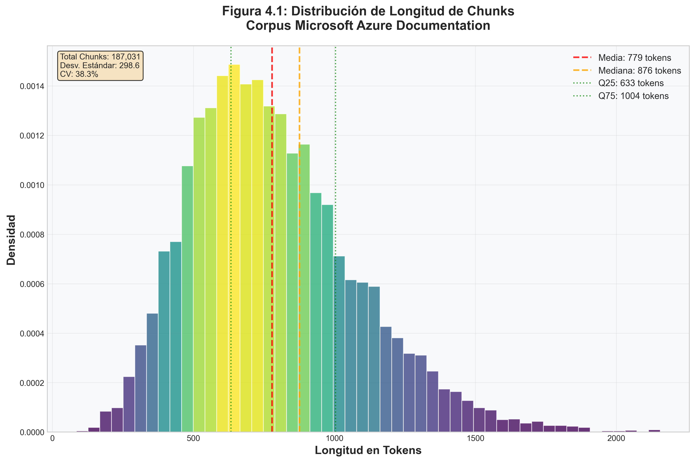
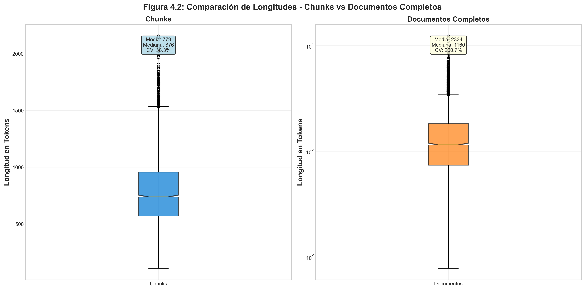
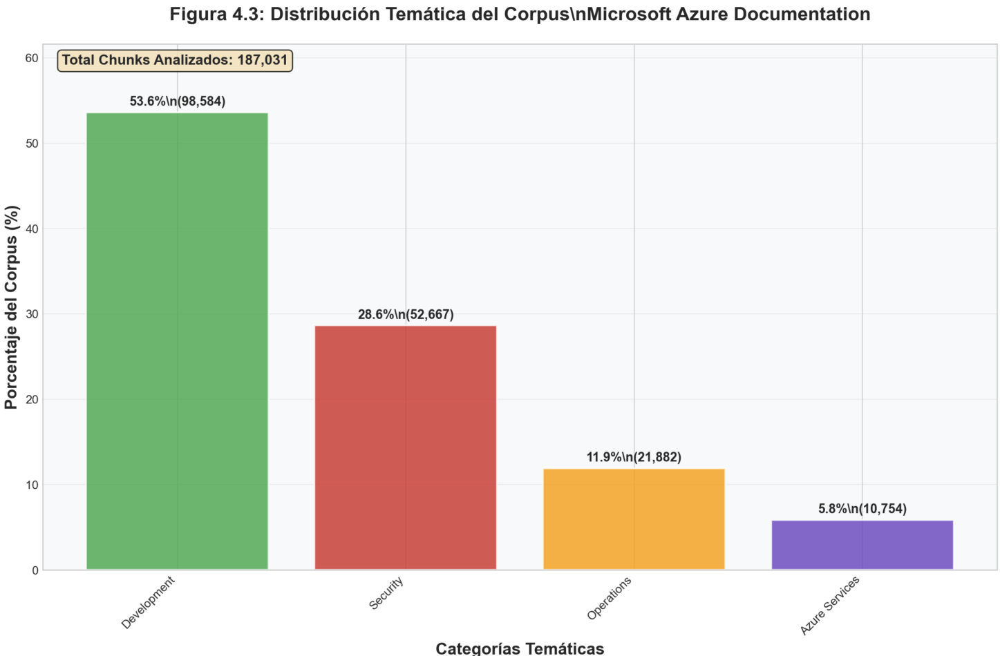
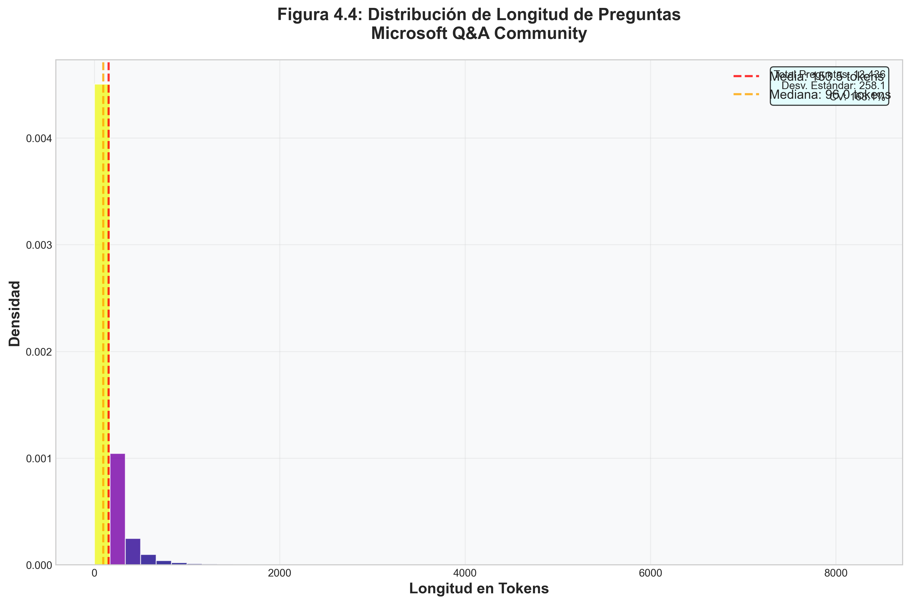

# 4. ANÁLISIS EXPLORATORIO DE DATOS

## 4.1 Introducción

El análisis exploratorio que se presenta a continuación caracteriza el corpus completo de documentación técnica de Microsoft Azure y el dataset de preguntas de Microsoft Q&A utilizado en esta investigación. Los datos fueron extraídos en diciembre de 2024, procesando íntegramente 62,417 documentos únicos de Microsoft Learn (Microsoft, 2025a) que generaron 187,031 chunks, junto con 13,436 preguntas reales de usuarios de Microsoft Q&A (Microsoft, 2025b).

La completitud del análisis es un aspecto fundamental: todas las métricas reportadas se calcularon sobre el 100% del corpus disponible, sin muestreo ni extrapolaciones. Esta exhaustividad permite establecer una línea base confiable para evaluar el desempeño del sistema RAG desarrollado.

## 4.2 Características del Corpus de Documentos

### 4.2.1 Composición General del Corpus

El corpus de documentación técnica de Microsoft Azure comprende 62,417 documentos únicos extraídos de Microsoft Learn durante diciembre de 2024. La segmentación de estos documentos generó 187,031 chunks procesables para indexación vectorial, lo que representa un ratio promedio de 3.0 chunks por documento. Esta fragmentación fue necesaria dado que muchos documentos técnicos de Azure exceden las capacidades de ventana contextual de los modelos de embedding utilizados. Todo el contenido está en inglés técnico especializado, reflejando el idioma predominante en la documentación oficial de Microsoft.

### 4.2.2 Análisis de Longitud de Documentos

#### Estadísticas de Chunks

El análisis completo de los 187,031 chunks mediante tokenización cl100k_base (OpenAI, 2025) reveló las siguientes características:

| Estadística              | Valor        |
| ------------------------- | ------------ |
| Media                     | 779.0 tokens |
| Mediana                   | 876.0 tokens |
| Desviación estándar     | 298.6 tokens |
| Mínimo                   | 1 token      |
| Máximo                   | 2,155 tokens |
| Q1 (25%)                  | 633 tokens   |
| Q3 (75%)                  | 1,004 tokens |
| Coeficiente de variación | 38.3%        |

  
   
  <em><strong>Figura 4.1:</strong> Distribución de longitud de chunks del corpus Microsoft Azure Documentation. Análisis completo de 187,031 chunks con tokenización cl100k_base.</em>

#### Estadísticas de Documentos Completos

Los documentos completos antes de la segmentación presentan características diferentes:

| Estadística              | Valor          |
| ------------------------- | -------------- |
| Media                     | 2,334.3 tokens |
| Mediana                   | 1,160.0 tokens |
| Desviación estándar     | 4,685.6 tokens |
| Mínimo                   | 3 tokens       |
| Máximo                   | 145,040 tokens |
| Q1 (25%)                  | 591 tokens     |
| Q3 (75%)                  | 2,308 tokens   |
| Coeficiente de variación | 200.7%         |

  
   
  <em><strong>Figura 4.2:</strong> Comparación de longitudes entre chunks segmentados y documentos completos. Box plots mostrando la reducción de variabilidad lograda mediante segmentación (CV de 200.7% a 38.3%).</em>

#### Interpretación de la Distribución

La distribución de longitudes presenta varias características relevantes para el diseño del sistema RAG:

**Sesgo positivo en chunks**: La media (779.0) es inferior a la mediana (876.0), indicando una distribución asimétrica con concentración hacia valores intermedios y una cola de chunks cortos que reducen la media. Este fenómeno es esperado en corpus técnicos que incluyen tanto elementos estructurales breves (headers, metadata) como secciones técnicas detalladas.

**Rango óptimo para embeddings**: El 50% central de los chunks (entre Q1 y Q3) se encuentra en el rango 633-1,004 tokens, compatible con modelos de embedding modernos que típicamente procesan ventanas contextuales de 512-2048 tokens eficientemente. Esta concentración en un rango favorable minimiza la necesidad de truncamiento o padding excesivo.

**Alta diversidad documental**: El coeficiente de variación de 200.7% en documentos completos refleja la naturaleza multifacética de la documentación Azure, que abarca desde guías rápidas hasta especificaciones técnicas exhaustivas de arquitecturas empresariales complejas. Esta variabilidad justifica la estrategia de segmentación adoptada.

**Variabilidad controlada en chunks**: El CV de 38.3% en chunks indica que la segmentación logró reducir significativamente la variabilidad (de 200.7% a 38.3%), manteniendo consistencia en la calidad de los embeddings sin perder riqueza semántica del contenido técnico.

### 4.2.3 Distribución Temática del Corpus

La clasificación temática se realizó mediante análisis de contenido basado en keywords con un sistema de puntuación ponderada, procesando la totalidad de los 187,031 chunks del corpus. Este análisis exhaustivo garantiza que las distribuciones temáticas reportadas reflejan fielmente la composición real del corpus sin sesgos de muestreo. Los criterios de clasificación establecieron cuatro categorías principales: Development agrupa contenido relacionado con código, APIs, SDKs y frameworks de desarrollo; Operations engloba deployment, monitoreo, administración y troubleshooting; Security cubre autenticación, autorización, compliance y encriptación; y Azure Services documenta servicios específicos de Azure con sus configuraciones y características particulares.

El análisis completo del corpus reveló la siguiente distribución temática:

| Categoría               | Chunks | Porcentaje |
| ------------------------ | ------ | ---------- |
| **Development**    | 98,584 | 53.6%      |
| **Security**       | 52,667 | 28.6%      |
| **Operations**     | 21,882 | 11.9%      |
| **Azure Services** | 10,754 | 5.8%       |

  
   
  <em><strong>Figura 4.3:</strong> Distribución temática del corpus Microsoft Azure Documentation. Análisis completo de 187,031 chunks clasificados en cuatro categorías principales mediante sistema de puntuación ponderada basado en keywords.</em>

La orientación técnica predominante hacia desarrollo de software (53.6%) es consistente con el propósito de la documentación oficial de Microsoft Learn, diseñada principalmente para desarrolladores, arquitectos e ingenieros que implementan soluciones técnicas. La significativa presencia de contenido de seguridad (28.6%) refleja la importancia crítica de este aspecto en implementaciones empresariales cloud. Las categorías de Operations (11.9%) y Azure Services (5.8%) complementan el corpus con información operacional y de servicios específicos. El contenido abarca múltiples dominios técnicos, proporcionando cobertura adecuada para consultas técnicas en diferentes áreas de la plataforma. Las cuatro categorías cubren el 99.9% del contenido total, indicando una clasificación exhaustiva sin fragmentación excesiva.

### 4.2.4 Análisis de Calidad del Corpus

#### Cobertura y Completitud

La cobertura del corpus es sustancial, procesando exitosamente 62,417 documentos únicos de Microsoft Learn relacionados con Azure. Los 62,417 documentos procesados generaron 187,031 chunks sin pérdida de documentos en la segmentación (100% de tasa de éxito). La pérdida de información textual es mínima y se atribuye principalmente a limitaciones en el parsing de contenido multimedia como imágenes, diagramas arquitectónicos, videos y componentes interactivos que no fueron capturados en el corpus textual.

#### Calidad de Contenido

Varios indicadores confirman la alta calidad del corpus. La longitud promedio de 779.0 tokens por chunk indica contenido sustancial con profundidad técnica adecuada. La desviación estándar de 298.6 tokens sugiere consistencia en la profundidad del contenido, evitando tanto chunks excesivamente fragmentados como chunks demasiado extensos que dificulten el procesamiento. La actualidad del corpus, extraído en diciembre de 2024, garantiza que refleja el estado actual de la plataforma Azure con sus servicios y capacidades más recientes.

#### Identificación de Limitaciones

El corpus presenta limitaciones inherentes que deben considerarse en la interpretación de resultados. La más significativa es la exclusión de contenido multimodal: imágenes, diagramas arquitectónicos, videos tutoriales y herramientas interactivas constituyen una porción sustancial del contenido original de Microsoft Learn pero no fueron capturados en el corpus textual.

Adicionalmente, el corpus está limitado al inglés, excluyendo documentación localizada que podría contener adaptaciones culturales o ejemplos regionales específicos. Temporalmente, el corpus representa un snapshot de diciembre de 2024 y no captura la evolución posterior de la plataforma Azure. Finalmente, el formato de texto plano pierde estructura visual, jerarquía de información y elementos de navegación que son parte integral de la experiencia de documentación en Microsoft Learn.

## 4.3 Características del Dataset de Preguntas

### 4.3.1 Composición del Dataset de Preguntas

El dataset de preguntas comprende 13,436 consultas reales extraídas de Microsoft Q&A (Microsoft, 2025b), la plataforma comunitaria oficial de soporte técnico de Microsoft. De estas preguntas, 6,070 (45.2% del total) incluyen enlaces a documentación de Microsoft Learn en sus respuestas aceptadas. Sin embargo, al validar estos enlaces contra la base de datos de documentos indexados, solo 2,067 preguntas (15.4% del total, equivalente al 34.1% de las que tienen enlaces) corresponden a documentos efectivamente presentes en el corpus.

Esta tasa de correspondencia del 34.1% establece el subconjunto con ground truth validado que permite evaluación rigurosa del sistema RAG. Las preguntas fueron recolectadas como datos históricos acumulados hasta diciembre de 2024, todas formuladas originalmente en inglés por usuarios reales enfrentando problemas técnicos concretos en la plataforma Azure.

### 4.3.2 Análisis de Longitud de Preguntas

El análisis de longitud mediante tokenización cl100k_base (OpenAI, 2025) del dataset de 13,436 preguntas reveló las siguientes características:

| Estadística              | Valor        |
| ------------------------- | ------------ |
| Media                     | 153.5 tokens |
| Mediana                   | 96.0 tokens  |
| Desviación estándar     | 258.1 tokens |
| Mínimo                   | 1 token      |
| Máximo                   | 8,304 tokens |
| Q1 (25%)                  | 56 tokens    |
| Q3 (75%)                  | 168 tokens   |
| Coeficiente de variación | 168.1%       |

  
   
  <em><strong>Figura 4.4:</strong> Distribución de longitud de preguntas del dataset Microsoft Q&A. Análisis de 13,436 preguntas con tokenización cl100k_base mostrando alta variabilidad (CV = 168.1%).</em>

La distribución presenta alta variabilidad (coeficiente de variación de 168.1%), reflejando la diversidad en complejidad de las consultas: desde preguntas breves y directas hasta consultas extensas que incluyen contexto detallado, logs de error, o descripciones de configuraciones complejas. El rango intercuartílico muestra que el 50% central de las preguntas tiene entre 56 y 168 tokens (Q1-Q3), con una mediana de 96 tokens. Esta variabilidad es característica de foros técnicos donde usuarios con diferentes niveles de experiencia formulan preguntas con grados variables de detalle y especificidad.

### 4.3.3 Características Cualitativas de las Preguntas

Mediante inspección visual del contenido textual de las 2,067 preguntas con ground truth validado, se identificaron cuatro patrones principales de consulta: preguntas procedurales caracterizadas por formulaciones tipo "how-to" y solicitudes de procedimientos específicos, consultas de troubleshooting identificadas por menciones de errores o problemas que requieren diagnóstico, preguntas conceptuales solicitando explicaciones de conceptos técnicos o diferencias entre servicios, y consultas de configuración centradas en especificación de parámetros y personalización de servicios. Esta observación cualitativa no incluyó anotación sistemática que permitiera cuantificar la distribución porcentual de cada tipo.

La complejidad técnica de las consultas varía considerablemente según el número de servicios y conceptos Azure involucrados simultáneamente. Las consultas abarcan desde tareas directas sobre funcionalidades específicas hasta escenarios multi-servicio que integran aspectos de seguridad, networking, compute y storage. Esta diversidad refleja el espectro completo de necesidades de soporte técnico en la plataforma Azure, desde usuarios principiantes formulando preguntas básicas hasta arquitectos diseñando soluciones empresariales complejas.

### 4.3.4 Análisis de Ground Truth

Del total de 13,436 preguntas, 6,070 (45.2%) incluyen enlaces a Microsoft Learn en sus respuestas aceptadas. Al validar estos enlaces contra la base de datos de documentos indexados, 2,067 preguntas (15.4% del total, equivalente al 34.1% de las 6,070 con enlaces) tienen documentos correspondientes efectivamente presentes en el corpus. Estas 2,067 preguntas constituyen el ground truth validado que permite evaluación rigurosa del sistema RAG.

Los 2,067 enlaces válidos referencian 1,669 URLs únicas normalizadas (eliminando fragmentos y parámetros de consulta). Esta multiplicidad (más preguntas que documentos únicos) indica que ciertos documentos fundamentales de Azure son referenciados por múltiples preguntas, reflejando tópicos de alto interés o servicios ampliamente utilizados. El subconjunto de 2,067 preguntas con correspondencia validada proporciona una base adecuada para evaluación estadística del sistema RAG, representando un 15.4% del dataset total con ground truth verificable.

#### Limitaciones del Ground Truth

El ground truth presenta varias limitaciones que afectan el alcance de la evaluación. La cobertura parcial es la más evidente: solo 15.4% de preguntas tienen enlaces correspondientes a documentos en la base de datos. El filtrado estricto durante la validación excluye el 65.9% de enlaces MS Learn que no corresponden a documentos indexados.

Existe también un sesgo de selección inherente: solo se consideraron enlaces en respuestas aceptadas por la comunidad, excluyendo potencialmente documentos relevantes mencionados en respuestas no aceptadas. El criterio adoptado considera un único documento relevante por pregunta, aunque en la práctica múltiples documentos podrían ser igualmente válidos para responder una consulta compleja.

Finalmente, existe un riesgo temporal: los enlaces pueden volverse obsoletos conforme Microsoft actualiza y reorganiza su documentación Azure. Esta limitación es inherente a cualquier corpus basado en contenido técnico que evoluciona rápidamente.

## 4.4 Hallazgos Principales del EDA

El análisis exploratorio reveló que el corpus de documentación es apropiado para investigación en recuperación semántica de información técnica, con 62,417 documentos únicos, 779.0 tokens promedio por chunk, y distribución temática cuantificada en cuatro categorías principales (Development 53.6%, Security 28.6%, Operations 11.9%, Azure Services 5.8%). La variabilidad controlada (CV = 38.3%) evita fragmentación excesiva. Las limitaciones incluyen ausencia de contenido multimodal y necesidad de actualización continua dada la rápida evolución de Azure.

El dataset de preguntas presenta diversidad apropiada con cuatro tipos principales de consulta (procedurales, troubleshooting, conceptuales, configuración) y complejidad variable. La autenticidad constituye un valor diferenciador: todas las preguntas provienen de usuarios reales. El ground truth validado comprende 2,067 preguntas (15.4% de las 13,436 usadas en evaluación), proporcionando cobertura adecuada para evaluación estadística. Las limitaciones principales son la cobertura parcial, sesgo temporal (datos hasta diciembre 2024), restricción a inglés, y criterio de un documento por pregunta que puede subestimar relevancia múltiple.

Las implicaciones para el sistema RAG incluyen oportunidades derivadas de la especialización técnica (53.6% Development) y desafíos relacionados con la variabilidad documental (σ = 298.6 tokens) y complejidad de consultas multi-servicio que requieren comprensión contextual avanzada. La longitud promedio de 779.0 tokens por chunk es compatible con modelos de embedding modernos.

Comparado con corpus académicos estándar (MS-MARCO con 8.8M documentos de 100 tokens, Natural Questions con 307K documentos de 800 tokens, SQuAD 2.0 con 150K documentos de 500 tokens), el corpus MS-Azure se diferencia por mayor especialización técnica, documentos más sustanciales, autenticidad de documentación oficial, y actualidad. Estas características lo hacen apropiado para investigación académica en recuperación de información especializada, con ground truth validado por comunidad técnica y metodología reproducible.
