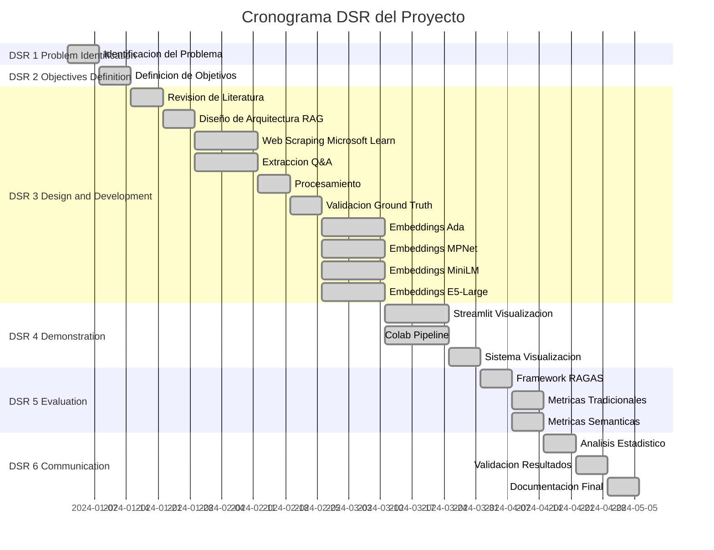

# 5. METODOLOGÍA

## 5.1 Introducción

Este proyecto utiliza la metodología Design Science Research (DSR) de Peffers et al. (2007), enfoque estándar para investigación que crea y evalúa artefactos tecnológicos innovadores (Hevner et al., 2004). El diseño metodológico se enfoca en construir, implementar y evaluar un sistema RAG (Retrieval-Augmented Generation) especializado en documentación técnica, que para este proyecto se utiliza la documentación de Microsoft Azure.

Este proyecto adopta un enfoque cuantitativo que permite evaluar de manera objetiva el rendimiento de la arquitectura propuesta. Para ello se utilizan métricas reconocidas y procedimientos estadísticos validados (Creswell & Creswell, 2017). El diseño experimental compara diferentes configuraciones de la arquitectura, analizando cómo cada una influye en el desempeño general del sistema en términos de recuperación de información y calidad de las respuestas generadas. Todo el proceso se desarrolló bajo criterios de reproducibilidad, trazabilidad y validez científica.

## 5.2 Diseño de la Investigación

### 5.2.1 Flujo Metodológico del Proyecto

El siguiente diagrama presenta una vista integral del flujo metodológico empleado en este proyecto, mostrando las fases principales, sus interrelaciones y los entregables clave de cada etapa:

### 5.2.2 Descripción de las Fases DSR

El flujo metodológico sigue el proceso DSR de Peffers et al. (2007), asegurando la calidad científica mediante un enfoque sistemático para desarrollo y evaluación de artefactos tecnológicos.

**DSR Fase 1: Problem Identification and Motivation (Semana 1)** identifica la problemática en sistemas de soporte técnico para documentación Azure: baja precisión en recuperación de información relevante, alta latencia en resolución de consultas técnicas, y dificultad para mantener actualizado el conocimiento frente a la rápida evolución de servicios cloud. Se establece así la motivación para un sistema RAG especializado que mejore la eficiencia y efectividad del soporte técnico.

**DSR Fase 2: Definition of Objectives for a Solution (Semana 2)** define los objetivos que el artefacto debe cumplir, derivados de las necesidades técnicas en soporte Azure. El objetivo general es desarrollar y evaluar un sistema de recuperación semántica basado en procesamiento de lenguaje natural, comparando la efectividad de diferentes modelos de embeddings y arquitecturas de recuperación. Los objetivos específicos son: (1) implementar y comparar múltiples arquitecturas de embeddings (open-source y propietarios), (2) diseñar un sistema de almacenamiento y recuperación vectorial con ChromaDB, (3) desarrollar mecanismos de reranking con CrossEncoders y normalización Min-Max, (4) evaluar el rendimiento con métricas tradicionales de recuperación y métricas especializadas RAG, y (5) establecer una metodología reproducible con herramientas de visualización.

**DSR Fase 3: Design and Development (Semanas 3-10)** es la fase más extensa. Comienza con revisión de literatura especializada en sistemas RAG y recuperación semántica (Semana 3), seguida del diseño arquitectónico detallado (Semana 4). En paralelo se ejecuta el scraping de Microsoft Learn y la extracción de Microsoft Q&A (Semanas 5-6), luego procesamiento, normalización y validación de ground truth (Semanas 7-8). La fase concluye con la generación paralela de embeddings vectoriales para cuatro modelos (Ada 1,536 dim, MPNet 768 dim, MiniLM 384 dim, E5-Large 1,024 dim) y su almacenamiento en ChromaDB (Semanas 9-10). También se implementa el CrossEncoder ms-marco-MiniLM-L-6-v2 con normalización Min-Max.

**DSR Fase 4: Demonstration (Semanas 11-13)** implementa y demuestra el uso del artefacto. Se desarrollan en paralelo dos componentes: la aplicación Streamlit para visualización interactiva de resultados experimentales, y notebooks Google Colab para ejecución automatizada del pipeline de evaluación (Semanas 11-12). Finalmente se implementan sistemas de visualización de métricas comparativas, gráficos de rendimiento y análisis estadísticos (Semana 13).

**DSR Fase 5: Evaluation (Semanas 14-15)** mide qué tan bien el artefacto resuelve el problema, comparando objetivos con resultados obtenidos. Se implementa el framework RAGAS para métricas especializadas (Semana 14), seguido de evaluaciones con métricas tradicionales de recuperación (Precision, Recall, F1, MRR, nDCG) y métricas semánticas mediante BERTScore (Semana 15). Se procesan las consultas con ground truth validado, evaluando 8 configuraciones experimentales (4 modelos × 2 estrategias: sin reranking y con CrossEncoder). Para cada configuración se recuperan los top-15 documentos y se calculan métricas para todos los valores de k desde 1 hasta 15, generando curvas de rendimiento.

**DSR Fase 6: Communication (Semanas 16-18)** comunica el problema, el artefacto desarrollado, el rigor del diseño y la efectividad demostrada. Se ejecuta análisis comparativo de métricas entre las 8 configuraciones experimentales (Semana 16), validación de resultados mediante análisis descriptivo (Semana 17), y preparación de documentación académica completa (Semana 18).

### 5.2.3 Diseño Experimental

Se adoptó un diseño experimental comparativo con enfoque cuantitativo, estructurado según los principios DSR (Hevner et al., 2004; Peffers et al., 2007). Este enfoque es apropiado para proyectos que crean y evalúan artefactos tecnológicos innovadores.

El diseño evalúa el impacto de diferentes componentes del sistema RAG mediante dos factores independientes: (1) modelo de embedding con cuatro alternativas (Ada, MPNet, MiniLM, E5-Large), seleccionados por su diversidad arquitectónica y validación en benchmarks, y (2) estrategia de procesamiento con dos niveles (recuperación vectorial directa, y recuperación seguida de reranking con CrossEncoder ms-marco-MiniLM-L-6-v2).

Esta estructura factorial 4×2 genera 8 configuraciones experimentales. Para cada una, el sistema recupera los top-15 documentos más relevantes y calcula métricas para todos los valores de k desde 1 hasta 15. Esto permite analizar el comportamiento en diferentes profundidades sin ejecutar recuperaciones independientes para cada k, generando curvas completas de rendimiento (Precision@k, Recall@k, F1@k, nDCG@k).

Cada consulta con ground truth validado se procesa a través de las 8 configuraciones, produciendo métricas para 15 valores de k y permitiendo análisis estadístico riguroso.

### 5.2.4 Paradigma de Evaluación

La evaluación se fundamenta en el paradigma de test collection descrito en el Capítulo 2 (sección 2.6), que requiere tres componentes esenciales: corpus de documentos, conjunto de consultas y juicios de relevancia. Este proyecto implementa estos componentes mediante scraping de documentación de Microsoft Learn, extracción de preguntas de Microsoft Q&A, y validación de enlaces entre preguntas y documentos oficiales proporcionados por expertos de la comunidad técnica en respuestas aceptadas.

### 5.2.5 Variables de Investigación

Las variables del estudio se clasifican en tres categorías principales para análisis riguroso de causalidad y evaluación del rendimiento del sistema RAG.

**Variables Independientes** se manipulan sistemáticamente para evaluar su impacto en el rendimiento del sistema. La arquitectura de embedding (categórica con cuatro niveles: Ada, MPNet, MiniLM, E5-Large) representa la primera variable independiente, seleccionando modelos con diferentes dimensionalidades y estrategias de entrenamiento para evaluar su efectividad en contenido técnico especializado. La estrategia de procesamiento de resultados (binaria: sin reranking, con reranking mediante CrossEncoder) constituye la segunda variable independiente, permitiendo cuantificar el impacto específico del componente de reranking mediante comparación directa de resultados pre y post reranking.

**Variables Dependientes** capturan diferentes aspectos del rendimiento mediante tres familias de métricas complementarias, todas continuas en el rango [0,1] y calculadas para valores de k desde 1 hasta 15. Las métricas tradicionales de recuperación incluyen Precision@k, Recall@k, F1@k, Mean Reciprocal Rank (MRR), Normalized Discounted Cumulative Gain (nDCG@k) y Mean Average Precision (MAP), descritas en el Capítulo 2. Las métricas especializadas RAG incluyen faithfulness, answer relevancy, context precision y context recall, descritas en el Capítulo 3. Las métricas semánticas incluyen BERTScore (precision, recall, F1), también descritas en el Capítulo 3. La utilización de múltiples familias de métricas permite una evaluación exhaustiva que capture tanto efectividad de recuperación como calidad de generación de respuestas.

Las variables de control garantizan consistencia experimental: configuración de hardware constante (Intel Core i7, 16GB RAM) para evitar variaciones por diferencias de capacidad computacional, versiones de software fijas (Python 3.12.2, ChromaDB 0.5.23, sentence-transformers 5.0.0) para eliminar efectos de actualizaciones de bibliotecas, temperatura de modelos generativos en 0.1 para minimizar variabilidad estocástica, y semillas aleatorias controladas (seed=42) para garantizar reproducibilidad exacta.

## 5.3 Recolección y Preparación de Datos

### 5.3.1 Estrategia de Recolección de Datos

La recolección de datos se ejecuta mediante web scraping sistemático y éticamente responsable, siguiendo las directrices establecidas para investigación académica con datos públicos (Landers & Behrend, 2015). La estrategia se fundamenta en dos corpus principales que proporcionan cobertura complementaria del dominio técnico de Azure.

El Corpus de Documentación Técnica se extrae de Microsoft Learn, la base de conocimiento oficial de Microsoft para sus productos cloud. Se implementa un scraper especializado utilizando Selenium WebDriver para páginas dinámicas y Beautiful Soup para parsing de HTML estructurado (Mitchell, 2018). La selección se limita específicamente a documentación relacionada con servicios de Microsoft Azure, garantizando coherencia temática y relevancia técnica para el caso de uso objetivo de soporte técnico especializado.

El proceso de extracción sigue protocolos éticos estrictos que incluyen respeto riguroso a robots.txt y términos de servicio de Microsoft, delays de 1-2 segundos entre requests consecutivos para evitar saturación de servidores, y limitación de concurrencia a un máximo de 3 conexiones simultáneas. El scraping se ejecuta durante horarios de baja demanda (madrugada hora del servidor) para minimizar el impacto en usuarios legítimos de la plataforma.

El Corpus de Consultas Técnicas se recolecta del foro público Microsoft Q&A, que representa consultas reales de usuarios en contextos de soporte técnico. Este corpus proporciona variabilidad lingüística natural, diversidad en la formulación de problemas técnicos, y autenticidad en la expresión de necesidades de información. La inclusión de preguntas con respuestas aceptadas por la comunidad garantiza que el ground truth refleje validación por expertos técnicos con experiencia práctica en Azure.

### 5.3.2 Procesamiento y Normalización de Datos

El procesamiento de datos sigue un pipeline sistemático de limpieza y normalización diseñado para optimizar la calidad de los embeddings. El preprocesamiento de documentos ejecuta cuatro transformaciones principales: extracción de contenido (elimina elementos HTML, JavaScript, CSS y otros componentes no textuales que introducen ruido), segmentación inteligente (divide documentos largos en chunks respetando límites de párrafo y sección para preservar coherencia semántica, considerando las restricciones de los modelos de embedding utilizados), normalización de texto (aplica conversión a UTF-8, eliminación de caracteres de control, y normalización de espacios en blanco), y preservación de estructura (mantiene metadatos esenciales como título, URL, y fecha de publicación para enriquecer el contexto de recuperación).

La normalización de URLs implementa un proceso riguroso para garantizar consistencia en la vinculación pregunta-documento: elimina parámetros de query string (tracking, session IDs), remueve fragmentos de anchor (#section), normaliza el esquema (http → https), y convierte a minúsculas el dominio. Esta normalización elimina variaciones superficiales que impedirían el matching correcto entre enlaces en respuestas de Q&A y URLs de documentos en el corpus.

La validación de ground truth sigue un proceso sistemático de filtrado multinivel. El filtrado inicial identifica preguntas que contengan enlaces a Microsoft Learn en sus respuestas aceptadas. La normalización aplica las reglas de estandarización URL para eliminar parámetros de tracking y variaciones de formato. La verificación de correspondencia filtra preguntas cuyos enlaces normalizados correspondan a documentos efectivamente presentes en el corpus indexado. El resultado produce un conjunto de preguntas con al menos un enlace validado a documentos del corpus, estableciendo un ground truth de alta calidad basado en correspondencias reales entre preguntas técnicas y documentación oficial.

### 5.3.3 Metodología de Análisis del Corpus

El corpus de documentos se caracteriza mediante análisis estadístico descriptivo que captura la diversidad y profundidad de la documentación técnica de Azure. Se calculan métricas de volumen incluyendo el total de documentos únicos recolectados y el número de chunks procesables generados tras la segmentación. Las características de longitud se miden mediante la longitud promedio y desviación estándar por chunk (en tokens), indicando variabilidad apropiada para modelos de embedding, y la longitud promedio y desviación estándar por documento original antes de segmentación, reflejando la diversidad desde tutoriales breves hasta especificaciones técnicas exhaustivas.

La distribución temática del corpus se analiza mediante clasificación automatizada de contenido basado en palabras clave con ponderación por frecuencia. La metodología emplea clasificación según presencia de términos técnicos característicos, operando sobre una muestra estratificada del corpus total. Las categorías temáticas principales incluyen: Development (contenido relacionado con SDKs, APIs, programación, DevOps y herramientas de desarrollo), Operations (documentación sobre monitoreo, automatización, gestión de infraestructura y troubleshooting), Security (materiales sobre autenticación, autorización, cumplimiento y servicios de seguridad), y Azure Services (servicios específicos de Azure con sus configuraciones y características particulares). Para cada categoría se calcula el porcentaje de representación en el corpus total y el número absoluto de chunks clasificados.

El corpus de preguntas se caracteriza mediante análisis de volumen total de consultas recolectadas y porcentaje de preguntas con enlaces validados que correspondan a documentos en el corpus. Las características lingüísticas se miden mediante longitud promedio y desviación estándar de preguntas (en tokens), capturando el rango desde consultas concisas hasta descripciones detalladas de problemas complejos, y longitud promedio y desviación estándar de respuestas, reflejando variabilidad en profundidad de explicaciones técnicas. La distribución temporal se analiza calculando el porcentaje de preguntas por período temporal (años), identificando si el corpus captura principalmente consultas sobre versiones recientes o históricas de servicios Azure.

## 5.4 Implementación de Arquitecturas de Embedding

### 5.4.1 Selección y Justificación de Modelos

La selección de modelos de embedding se basa en criterios de rendimiento en benchmarks especializados, disponibilidad para investigación académica, y complementariedad arquitectónica (Muennighoff et al., 2023). Los cuatro modelos seleccionados—OpenAI Ada (text-embedding-ada-002, 1,536 dim), Multi-QA MPNet (multi-qa-mpnet-base-dot-v1, 768 dim), MiniLM (all-MiniLM-L6-v2, 384 dim) y E5-Large (intfloat/e5-large-v2, 1,024 dim)—representan diferentes enfoques arquitectónicos y estrategias de entrenamiento que permiten evaluar el impacto de estas decisiones de diseño en el rendimiento final del sistema RAG. Las características técnicas detalladas de cada modelo, incluyendo sus arquitecturas, capacidades y limitaciones, se describen en el Capítulo 3 (sección 3.3).

### 5.4.2 Configuración Técnica de Embeddings

El proyecto utiliza dos entornos computacionales complementarios. El desarrollo de aplicaciones y análisis de resultados se realiza en un MacBook Pro 16,1 equipado con procesador Intel Core i7 de 6 núcleos a 2.6 GHz, 16 GB de memoria RAM DDR4, y almacenamiento SSD NVMe. La ejecución de búsquedas vectoriales y obtención de métricas experimentales se realiza en Google Colab con GPU Tesla T4 para optimizar tiempos de cómputo. El entorno de software utiliza Python 3.12.2 compilado con Clang 13.0.0, con dependencias críticas sentence-transformers 5.0.0, torch 2.2.2, y numpy 1.26.4 para garantizar compatibilidad y reproducibilidad entre ambos entornos.

El pipeline de generación de embeddings implementa un proceso estandarizado que maneja las particularidades de cada modelo. Para Ada, el sistema invoca la API de OpenAI con manejo de errores y fallback a embeddings proxy en caso de fallo de conectividad. Para modelos sentence-transformer (MPNet, MiniLM, E5-Large), el proceso aplica codificación directa con normalización L2 de vectores resultantes. Para MPNet específicamente, se agrega el prefijo "query:" a consultas según las recomendaciones del modelo para optimizar la representación de preguntas.

La generación masiva de embeddings procesa todos los chunks segmentados para cada uno de los cuatro modelos. Los vectores resultantes se almacenan en formato eficiente según la dimensionalidad de cada modelo: Ada con vectores de 1,536 dimensiones, E5-Large con vectores de 1,024 dimensiones, MPNet con vectores de 768 dimensiones, y MiniLM con vectores de 384 dimensiones. El proceso utiliza paralelización cuando sea posible para maximizar eficiencia computacional.

### 5.4.3 Almacenamiento en Base de Datos Vectorial

La selección de la base de datos vectorial consideró dos soluciones principales: ChromaDB y Weaviate, evaluando criterios técnicos específicos para investigación académica descritos en el Capítulo 2 (sección 2.3.3) y Capítulo 3 (sección 3.6). Los factores evaluados incluyeron latencia de consulta, escalabilidad, simplicidad de configuración, y compatibilidad con el entorno de experimentación (Google Colab). Tras este análisis comparativo, se seleccionó ChromaDB como solución definitiva, decisión cuya justificación técnica detallada se presenta en el Capítulo 6.

ChromaDB implementa una arquitectura de almacenamiento distribuida en colecciones especializadas por modelo de embedding, permitiendo comparaciones directas manteniendo aislamiento de datos y optimización específica por modelo. El proceso de búsqueda implementa similitud coseno en el espacio de embeddings para identificar candidatos potencialmente relevantes mediante algoritmos de búsqueda aproximada de vecinos más cercanos (ANN) como HNSW, descritos en el Capítulo 3 (sección 3.6.2).

## 5.5 Desarrollo de Mecanismos de Recuperación y Reranking

### 5.5.1 Pipeline de Recuperación Multi-Etapa

El sistema implementa un pipeline de recuperación de dos etapas optimizado para balance entre eficiencia y precisión, siguiendo el paradigma establecido por sistemas de recuperación de gran escala (Karpukhin et al., 2020; Qu et al., 2021). Este diseño multi-etapa permite procesar eficientemente grandes volúmenes de documentos mientras aplica modelos más sofisticados solo a un subconjunto prometedor de candidatos.

La Etapa 1 de Recuperación Vectorial (Dense Retrieval) utiliza similitud coseno en el espacio de embeddings para identificar candidatos potencialmente relevantes. El sistema genera un embedding vectorial para la consulta de usuario, calcula similitudes coseno entre este embedding y todos los embeddings de documentos almacenados en ChromaDB, y retorna los top-k documentos con mayor similitud. La selección del valor k para recuperación inicial se establece considerando el balance entre precision y recall, manteniendo eficiencia computacional para el pipeline completo. Se experimenta con diferentes valores de k para determinar la configuración óptima.

La Etapa 2 de Reranking con CrossEncoder procesa conjuntamente query y documento para generar scores de relevancia más precisos. El sistema toma los candidatos de la etapa anterior, forma pares [query, documento] para cada candidato, procesa cada par mediante el CrossEncoder obteniendo un score de relevancia, aplica normalización Min-Max para convertir scores al rango [0,1], reordena documentos según los scores normalizados, y retorna los documentos finales mejor rankeados. Este proceso de reranking permite aplicar un modelo más sofisticado (CrossEncoder con atención cruzada entre query y documento) solo a un subconjunto manejable de candidatos.

### 5.5.2 Justificación del CrossEncoder Seleccionado

El modelo cross-encoder/ms-marco-MiniLM-L-6-v2 se selecciona basándose en criterios técnicos y de compatibilidad con la infraestructura de investigación. Las características técnicas detalladas del modelo, incluyendo su arquitectura, entrenamiento en MS MARCO, y capacidades de reranking, se describen en el Capítulo 3 (sección 3.5.2). Los criterios específicos de selección para este proyecto incluyen compatibilidad con limitaciones de memoria en Google Colab, velocidad de inferencia adecuada para procesamiento de múltiples documentos por consulta, y estabilidad de scores apropiada para normalización Min-Max.

### 5.5.3 Estrategia de Normalización de Scores

El sistema establece como baseline los scores de recuperación vectorial sin reranking, permitiendo una comparación directa del impacto del CrossEncoder en las métricas de recuperación. Se aplica normalización Min-Max a los scores del CrossEncoder para garantizar comparabilidad entre diferentes consultas y sesiones de evaluación, transformando scores al rango [0,1] preservando relaciones ordinales. Los fundamentos teóricos de la normalización Min-Max y su justificación frente a alternativas como Z-score y sigmoid se describen en el Capítulo 3 (sección 3.5.2).

## 5.6 Framework de Evaluación Integral

### 5.6.1 Selección del Conjunto de Evaluación

Para la evaluación sistemática del sistema, se utiliza el conjunto de consultas con ground truth validado. Este conjunto representa las preguntas de Microsoft Q&A que tienen enlaces a documentación oficial de Microsoft Learn en sus respuestas aceptadas, y cuyos enlaces corresponden efectivamente a documentos presentes en el corpus indexado. La utilización del conjunto completo garantiza significancia estadística robusta y permite detectar diferencias de rendimiento entre configuraciones experimentales con alta confiabilidad.

### 5.6.2 Diseño del Framework de Evaluación

El framework de evaluación implementado combina métricas tradicionales de recuperación de información con métricas especializadas para sistemas RAG, siguiendo las mejores prácticas establecidas en la literatura de evaluación de sistemas de información (Sanderson, 2010; Ferro & Peters, 2019). La arquitectura del framework integra tres familias de métricas complementarias que capturan diferentes aspectos del rendimiento del sistema.

Las métricas tradicionales incluyen precision, recall, F1, mean reciprocal rank (MRR), normalized discounted cumulative gain (nDCG), y mean average precision (MAP), todas evaluadas a múltiples valores de k para capturar rendimiento en diferentes profundidades de recuperación. Las métricas RAG especializadas incluyen answer relevancy, context precision, context recall, y faithfulness, evaluando aspectos específicos de sistemas de generación aumentada. Las métricas semánticas incluyen BERTScore (precision, recall, F1), capturando similitud semántica profunda más allá del matching léxico superficial.

El framework ejecuta evaluación exhaustiva para cada consulta, calculando todas las métricas especificadas, agregando resultados mediante promediado aritmético para obtener métricas a nivel de sistema, y almacenando resultados detallados en formato JSON estructurado para análisis posterior y reproducibilidad.

### 5.6.3 Métricas de Evaluación

El sistema se evalúa mediante tres familias de métricas complementarias descritas en el Capítulo 2 (sección 2.6). Las métricas tradicionales de recuperación incluyen Precision@k, Recall@k, F1@k, Mean Reciprocal Rank (MRR), Normalized Discounted Cumulative Gain (nDCG@k) y Mean Average Precision (MAP), calculadas para valores de k desde 1 hasta 15. Estas métricas, con sus fórmulas y definiciones formales, se presentan en la Tabla 2.1 del Capítulo 2.

Las métricas especializadas RAG se implementan mediante la biblioteca RAGAS (Es et al., 2023) e incluyen Answer Relevancy, Context Precision, Context Recall y Faithfulness. Estas métricas evalúan aspectos específicos de sistemas de generación aumentada por recuperación, como la consistencia factual, la relevancia de la respuesta, y la calidad del contexto recuperado. Sus fórmulas y descripciones se presentan en la Tabla 2.2 del Capítulo 2.

Las métricas semánticas utilizan BERTScore con el modelo distiluse-base-multilingual-cased-v2, calculando precision, recall y F1 semánticos mediante embeddings contextualizados. Esta métrica captura similitud semántica profunda más allá del matching léxico superficial, siendo particularmente valiosa para evaluar paráfrasis y reformulaciones técnicas. Las fórmulas de BERTScore se presentan en la Tabla 2.3 del Capítulo 2.

### 5.6.4 Análisis Comparativo de Resultados

El análisis comparativo evalúa el rendimiento de las 8 configuraciones experimentales (4 modelos de embedding × 2 estrategias de procesamiento) mediante estadística descriptiva exhaustiva. Para cada métrica (Precision@k, Recall@k, F1@k, MRR, nDCG@k, MAP) se calculan medidas de tendencia central (media, mediana) y dispersión (desviación estándar, rango intercuartílico) a través de las consultas evaluadas. El análisis genera curvas completas de rendimiento para valores de k desde 1 hasta 15, permitiendo visualizar el comportamiento progresivo de cada configuración conforme aumenta la profundidad de recuperación.

La comparación entre configuraciones se realiza mediante análisis de diferencias absolutas y relativas en métricas de rendimiento, identificando patrones sistemáticos de superioridad de modelos específicos en distintos rangos de k. Se calcula la magnitud práctica de diferencias mediante efecto del tamaño (effect size) que cuantifica la relevancia práctica de las diferencias observadas independientemente de consideraciones de significancia estadística, proporcionando insights sobre qué configuraciones ofrecen mejoras sustanciales en rendimiento para aplicaciones reales.

### 5.6.5 Procedimientos de Reproducibilidad

El control de semillas aleatorias garantiza reproducibilidad exacta de resultados estocásticos. El sistema configura semillas para el generador random de Python, el generador de numpy, el generador de torch para CPU, y cuando esté disponible, el generador de torch para GPU (CUDA). La semilla seleccionada es 42, siguiendo la convención establecida en la comunidad de aprendizaje automático.

El logging exhaustivo implementa registro detallado de todas las operaciones para garantizar trazabilidad completa. El sistema registra marca de tiempo, nombre del módulo, nivel de severidad, y mensaje descriptivo para cada evento significativo. Los logs se almacenan tanto en archivo persistente como en salida estándar para facilitar debugging en tiempo real y análisis posterior.

La preservación de configuraciones garantiza que todas las configuraciones experimentales se serialicen en formato JSON estructurado. El archivo de configuración incluye la lista de modelos evaluados, los valores de k utilizados para métricas @k, el modelo de CrossEncoder específico, la versión del dataset utilizado, y la semilla aleatoria para reproducibilidad. Esta serialización permite replicación exacta de experimentos en el futuro.

## 5.7 Consideraciones Éticas y de Validez

### 5.7.1 Aspectos Éticos de la Investigación

Aunque todos los datos a utilizar son públicamente accesibles, se implementan protocolos éticos rigurosos. El uso responsable de datos públicos incluye respeto estricto a términos de servicio de Microsoft Learn y Microsoft Q&A, implementación de rate limiting para evitar sobrecarga de servidores mediante delays entre requests, anonimización de información de usuarios en preguntas del foro eliminando nombres y correos electrónicos, y cumplimiento con licencias Creative Commons (CC BY 4.0) de Microsoft Learn permitiendo uso académico con atribución apropiada.

La transparencia y reproducibilidad se garantizan mediante disponibilidad del código fuente completo para replicación independiente, documentación exhaustiva de datasets procesados con estadísticas descriptivas detalladas, especificación completa de procedimientos de evaluación incluyendo métricas y parámetros, y preservación de configuraciones experimentales en formato serializado JSON para reproducción exacta.

### 5.7.2 Validez Interna y Externa

La validez interna se garantiza mediante control riguroso de variables extrañas (confounding variables) a través de diseño experimental balanceado, asegurando que las diferencias observadas en las métricas se deban únicamente a los modelos de embedding y estrategias de reranking evaluados, y no a factores externos como variaciones en hardware, orden de procesamiento, o sesgo de selección. El uso de múltiples métricas independientes permite validación cruzada de conclusiones. La implementación de procedimientos de reproducibilidad estrictos mediante control de semillas aleatorias permite verificación independiente de resultados.

La validez externa reconoce que la generalización está limitada al dominio de documentación técnica de Azure. La transferibilidad potencial a dominios técnicos similares requiere adaptación del corpus y posible reentrenamiento de modelos. La representatividad de consultas se basa en datos reales de usuarios enfrentando problemas técnicos auténticos. Las limitaciones temporales surgen de la naturaleza estática del corpus que no captura evolución continua de la documentación Azure.

### 5.7.3 Limitaciones Metodológicas

Las limitaciones del ground truth incluyen dependencia de enlaces explícitos en respuestas aceptadas, lo que limita la cobertura a un subconjunto de las preguntas totales. Existe posible sesgo hacia documentos más frecuentemente referenciados por la comunidad técnica. La validación manual se ejecuta sobre una muestra representativa que, aunque significativa, no cubre el 100% de correspondencias.

Las limitaciones técnicas incluyen evaluación limitada a contenido textual con exclusión de multimedia (imágenes, videos, diagramas), restricciones de memoria que impiden uso de modelos de embedding de muy gran escala, y dependencia de APIs externas para algunos modelos (Ada) que introduce latencia variable y posibles fallos de conectividad.

Las limitaciones temporales surgen del corpus estático que no refleja evolución continua de documentación Azure, evaluación en punto único en el tiempo sin capturar variaciones temporales, y posible obsolescencia de algunos enlaces de referencia conforme Microsoft reorganice su documentación.
