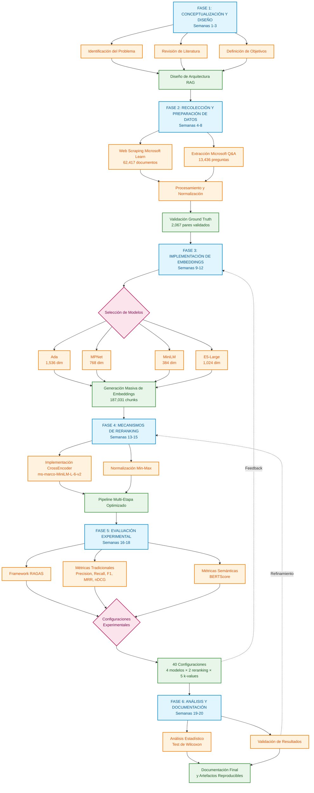

# 5. METODOLOGÍA

## 5.1 Introducción

Este proyecto se fundamenta en el proceso estándar CRISP-DM (Cross-Industry Standard Process for Data Mining), adaptado para el desarrollo y evaluación de sistemas de recuperación de información semántica (Chapman et al., 2000; Shearer, 2000). El diseño metodológico se orienta hacia la construcción, implementación y evaluación rigurosa de un sistema RAG (Retrieval-Augmented Generation) especializado en documentación técnica de Microsoft Azure.

La aproximación metodológica integra seis fases principales que abarcan desde la comprensión y definición del problema hasta el análisis comparativo y validación estadística final. La primera fase establece los fundamentos conceptuales mediante revisión de literatura y diseño arquitectónico. La segunda fase ejecuta la recolección y preparación exhaustiva de datos, procesando 62,417 documentos únicos y 13,436 preguntas técnicas reales. La tercera fase implementa cuatro arquitecturas de embeddings complementarias (Ada, MPNet, MiniLM, E5-Large) para capturar diversas estrategias de representación vectorial. La cuarta fase desarrolla mecanismos de recuperación y reranking mediante CrossEncoder especializado. La quinta fase construye un framework de evaluación integral combinando métricas tradicionales de recuperación, métricas especializadas RAG, y evaluación semántica mediante BERTScore. La sexta fase ejecuta análisis comparativo y validación estadística mediante tests no paramétricos.

El proyecto adopta un paradigma de investigación cuantitativa, enfocándose en la medición objetiva del rendimiento de diferentes arquitecturas mediante métricas validadas y procedimientos estadísticos rigurosos (Creswell & Creswell, 2017). La metodología incorpora elementos de investigación experimental controlada, manipulando sistemáticamente las variables independientes (modelos de embeddings, estrategias de reranking) para evaluar su impacto en las variables dependientes (métricas de recuperación y calidad de respuestas). Esta estructura metodológica garantiza la reproducibilidad, trazabilidad y validez científica de los resultados obtenidos.

## 5.2 Diseño de la Investigación

### 5.2.1 Flujo Metodológico del Proyecto

El siguiente diagrama presenta una vista integral del flujo metodológico empleado en este proyecto, mostrando las fases principales, sus interrelaciones y los entregables clave de cada etapa:

### 5.2.2 Descripción de las Fases Metodológicas

El flujo metodológico ilustrado representa un proceso sistemático que garantiza la calidad científica del proyecto. La Fase 1 de Conceptualización y Diseño (Semanas 1-3) parte de la problemática identificada en sistemas de soporte técnico, ejecuta un análisis exhaustivo de literatura especializada, define objetivos SMART, y produce como salida una arquitectura RAG completa con especificaciones técnicas detalladas.

La Fase 2 de Recolección y Preparación de Datos (Semanas 4-8) toma las especificaciones de datos requeridos, ejecuta web scraping ético con normalización de URLs y validación manual, y genera como salida un corpus validado de 62,417 documentos junto con 2,067 pares pregunta-documento con ground truth verificado.

La Fase 3 de Implementación de Embeddings (Semanas 9-12) procesa el corpus preparado aplicando cuatro arquitecturas de embeddings seleccionadas, ejecutando la generación paralela de vectores para maximizar eficiencia computacional, y almacenando 187,031 vectores por modelo en ChromaDB para consulta eficiente.

La Fase 4 de Desarrollo de Reranking (Semanas 13-15) parte del sistema de recuperación vectorial base, implementa un CrossEncoder especializado con normalización Min-Max de scores, y produce un pipeline optimizado de recuperación en dos etapas que balancea eficiencia y precisión.

La Fase 5 de Evaluación Experimental (Semanas 16-18) toma el sistema completo y el conjunto de evaluación validado, ejecuta sistemáticamente 40 configuraciones experimentales variando modelo de embedding, aplicación de reranking, y valores de k, y genera métricas exhaustivas para análisis comparativo riguroso.

La Fase 6 de Análisis y Documentación (Semanas 19-20) procesa los resultados experimentales completos, aplica validación estadística mediante tests no paramétricos, desarrolla documentación técnica detallada, y produce artefactos reproducibles junto con conclusiones validadas estadísticamente.

### 5.2.3 Enfoque Metodológico General

El diseño de investigación adoptado corresponde a un estudio experimental comparativo con enfoque cuantitativo, estructurado según los principios de Design Science Research (DSR) para sistemas de información (Hevner et al., 2004; Peffers et al., 2007). Este enfoque resulta apropiado para proyectos que buscan crear y evaluar artefactos tecnológicos innovadores para resolver problemas prácticos específicos en dominios aplicados.

La investigación sigue un diseño factorial que permite evaluar sistemáticamente el impacto de múltiples factores independientes en el rendimiento del sistema. El Factor A corresponde al modelo de embedding con cuatro niveles (Ada, MPNet, MiniLM, E5-Large), seleccionados por su complementariedad arquitectónica y validación previa en benchmarks especializados. El Factor B representa la estrategia de reranking con dos niveles (sin reranking, con CrossEncoder), permitiendo cuantificar el impacto específico del componente de reranking en la precisión del sistema. El Factor C abarca los valores de k para métricas @k con cinco niveles (1, 3, 5, 10, 15), capturando la variación en rendimiento según profundidad de recuperación.

Esta estructura factorial 4×2×5 genera 40 configuraciones experimentales diferentes, proporcionando una evaluación exhaustiva del espacio de diseño del sistema RAG. El diseño balanceado permite aplicar análisis de varianza multifactorial (ANOVA) para identificar efectos principales e interacciones entre factores, aunque la naturaleza no paramétrica de algunas métricas requiere el uso complementario de tests de Wilcoxon para comparaciones pareadas.

### 5.2.4 Paradigma de Evaluación

La evaluación se fundamenta en el paradigma de test collection establecido por Cranfield (Cleverdon, 1967) y posteriormente refinado para sistemas de recuperación de información modernos (Voorhees & Harman, 2005). Este paradigma requiere tres componentes esenciales que fueron implementados completamente en este proyecto.

El primer componente es el corpus de documentos, constituido por 62,417 documentos únicos de Microsoft Learn segmentados en 187,031 chunks procesables. La segmentación se diseñó para mantener coherencia semántica mientras respeta las limitaciones de ventana contextual de los modelos de embedding (típicamente 512-1024 tokens).

El segundo componente es el conjunto de consultas, conformado por 13,436 preguntas técnicas reales extraídas de Microsoft Q&A. Estas consultas representan problemas auténticos enfrentados por usuarios de Azure, capturando variabilidad natural en formulación, complejidad técnica, y especificidad de dominio.

El tercer componente son los juicios de relevancia, establecidos mediante enlaces validados manualmente entre 2,067 preguntas y documentos oficiales. Esta validación se basó en correspondencias explícitas donde expertos de la comunidad técnica (quienes proporcionaron respuestas aceptadas) identificaron documentación oficial relevante para cada consulta.

La aplicación de este paradigma en el contexto de documentación técnica especializada presenta desafíos únicos relacionados con la alta especificidad del dominio, la evolución temporal acelerada de la documentación Azure, y la variabilidad significativa en la formulación de consultas técnicas que pueden expresar el mismo problema subyacente con terminología diferente (Kelly, 2009).

### 5.2.5 Variables de Investigación

Las variables del estudio se clasifican en tres categorías principales que permiten un análisis riguroso de causalidad. Las variables independientes incluyen la arquitectura de embedding (categórica con cuatro niveles: Ada, MPNet, MiniLM, E5-Large), la aplicación de reranking (binaria: sí/no), y el parámetro k para evaluación (ordinal: 1, 3, 5, 10, 15). Estas variables fueron manipuladas sistemáticamente en el diseño experimental.

Las variables dependientes capturan diferentes aspectos del rendimiento del sistema. Precision@k (continua en rango [0,1]) mide la proporción de documentos relevantes entre los k primeros recuperados. Recall@k (continua en [0,1]) cuantifica la proporción de documentos relevantes totales capturados en top-k. F1@k (continua en [0,1]) proporciona una métrica balanceada mediante media armónica. Mean Reciprocal Rank (continua en [0,1]) evalúa la posición del primer documento relevante. Normalized Discounted Cumulative Gain (continua en [0,1]) considera tanto relevancia como posición con descuento logarítmico. Las métricas RAG especializadas (continuas en [0,1]) evalúan aspectos específicos de sistemas de generación aumentada como faithfulness y answer relevancy.

Las variables de control garantizan consistencia experimental. La configuración de hardware se mantuvo constante (Intel Core i7, 16GB RAM) para evitar variaciones por diferencias de capacidad computacional. Las versiones de software se fijaron (Python 3.12.2, ChromaDB 0.5.23, sentence-transformers 5.0.0) para eliminar efectos de actualizaciones de bibliotecas. La temperatura de modelos generativos se estableció en 0.1 para minimizar variabilidad estocástica en respuestas generadas. Las semillas aleatorias se controlaron (seed=42) para garantizar reproducibilidad exacta de resultados.

## 5.3 Planificación Temporal del Proyecto

### 5.3.1 Cronograma General

El proyecto se ejecutó en un período de 20 semanas, distribuidas según una planificación estructurada que optimiza el flujo de trabajo mientras permite iteración y refinamiento. La Fase I de Conceptualización y Diseño (Semanas 1-3) abarcó la definición del problema y objetivos de investigación mediante análisis de necesidades en soporte técnico Azure, la revisión exhaustiva de literatura especializada en sistemas RAG y recuperación semántica, el diseño detallado de la arquitectura del sistema incluyendo selección preliminar de componentes, y la especificación de métricas y procedimientos de evaluación basados en estándares académicos.

La Fase II de Recolección y Preparación de Datos (Semanas 4-8) ejecutó la implementación de scrapers especializados para Microsoft Learn respetando robots.txt y términos de servicio, la extracción de 62,417 documentos únicos relacionados con Azure mediante crawling incremental, la recolección de 13,436 preguntas de Microsoft Q&A con sus respuestas aceptadas, el procesamiento y normalización de datos textuales incluyendo limpieza HTML y normalización UTF-8, y la validación manual de 2,067 pares pregunta-documento para establecer ground truth confiable.

La Fase III de Implementación de Arquitecturas de Embedding (Semanas 9-12) configuró el entorno técnico (ChromaDB, Python 3.12.2) con dependencias optimizadas, implementó los cuatro modelos seleccionados (Ada, MPNet, MiniLM, E5-Large) con sus configuraciones específicas, ejecutó la generación masiva de embeddings procesando 187,031 chunks para cada modelo, y desarrolló el pipeline de recuperación vectorial con optimizaciones de consulta mediante índices eficientes.

La Fase IV de Desarrollo de Mecanismos de Reranking (Semanas 13-15) implementó el CrossEncoder ms-marco-MiniLM-L-6-v2 seleccionado por su balance eficiencia-precisión, desarrolló la normalización Min-Max para scores garantizando comparabilidad entre consultas, optimizó el pipeline de recuperación multi-etapa balanceando latencia y calidad, y ejecutó validación técnica de componentes individuales mediante tests unitarios y de integración.

La Fase V de Evaluación Experimental (Semanas 16-18) implementó el framework de evaluación integrando métricas tradicionales, RAG y semánticas, ejecutó evaluaciones experimentales sistemáticas para las 40 configuraciones definidas, condujo una evaluación piloto con 10 consultas de prueba para validar el pipeline completo, y recolectó métricas exhaustivas almacenadas en formato estructurado para análisis posterior.

La Fase VI de Análisis y Documentación (Semanas 19-20) ejecutó análisis estadístico de resultados identificando patrones de rendimiento, aplicó validación estadística mediante tests de Wilcoxon con corrección Bonferroni para comparaciones múltiples, desarrolló documentación técnica y académica detallando metodología y hallazgos, y preparó artefactos reproducibles incluyendo código, datos procesados y configuraciones experimentales.

### 5.3.2 Hitos Críticos y Entregables

Los hitos críticos del proyecto marcaron puntos de validación esenciales en el desarrollo. El Hito 1 correspondió a la generación completa de embeddings para todos los modelos, procesando 187,031 chunks en aproximadamente 22 minutos para generar 6.3 GB de datos vectoriales, validando la viabilidad computacional del enfoque. El Hito 2 alcanzó la primera evaluación experimental exhaustiva, ejecutada en 12.9 minutos para las 10 consultas piloto, confirmando la factibilidad temporal de evaluaciones a mayor escala. El Hito 3 completó la optimización final del sistema mediante debugging intensivo, resolviendo inconsistencias en normalización de scores y ajustando parámetros de recuperación. El Hito 4 finalizó la metodología y documentación técnica, estableciendo procedimientos reproducibles y trazables. El Hito 5 implementó visualizaciones y análisis final, desarrollando dashboards interactivos y diagramas de flujo para comunicación efectiva de resultados.

## 5.4 Recolección y Preparación de Datos

### 5.4.1 Estrategia de Recolección de Datos

La recolección de datos se ejecutó mediante un enfoque de web scraping sistemático y éticamente responsable, siguiendo las directrices establecidas para investigación académica con datos públicos (Landers & Behrend, 2015). La estrategia se fundamenta en dos corpus principales que proporcionan cobertura complementaria del dominio técnico de Azure.

El Corpus de Documentación Técnica se extrajo de Microsoft Learn, que constituye la base de conocimiento oficial de Microsoft para sus productos cloud. Se implementó un scraper especializado utilizando Selenium WebDriver para páginas dinámicas y Beautiful Soup para parsing de HTML estructurado (Mitchell, 2018). La selección se limitó específicamente a documentación relacionada con servicios de Microsoft Azure, garantizando coherencia temática y relevancia técnica para el caso de uso objetivo de soporte técnico especializado.

El proceso de extracción siguió protocolos éticos estrictos que incluyen el respeto riguroso a robots.txt y términos de servicio de Microsoft, la implementación de delays de 1-2 segundos entre requests consecutivos para evitar saturación de servidores, y la limitación de concurrencia a un máximo de 3 conexiones simultáneas. Adicionalmente, el scraping se ejecutó durante horarios de baja demanda (madrugada hora del servidor) para minimizar el impacto en usuarios legítimos de la plataforma.

El Corpus de Consultas Técnicas se recolectó del foro público Microsoft Q&A, que representa consultas reales de usuarios en contextos de soporte técnico. Este corpus proporciona variabilidad lingüística natural, diversidad en la formulación de problemas técnicos, y autenticidad en la expresión de necesidades de información. La inclusión de preguntas con respuestas aceptadas por la comunidad garantiza que el ground truth refleje validación por expertos técnicos con experiencia práctica en Azure.

### 5.4.2 Procesamiento y Normalización de Datos

El procesamiento de datos siguió un pipeline sistemático de limpieza y normalización diseñado para optimizar la calidad de los embeddings resultantes. El preprocesamiento de documentos ejecutó cuatro transformaciones principales. Primero, la extracción de contenido eliminó elementos HTML, JavaScript, CSS y otros componentes no textuales que introducen ruido en la representación semántica. Segundo, la segmentación inteligente dividió documentos largos en chunks de máximo 512 tokens, respetando límites de párrafo y sección para preservar coherencia semántica. Tercero, la normalización de texto aplicó conversión a UTF-8, eliminación de caracteres de control, y normalización de espacios en blanco. Cuarto, la preservación de estructura mantuvo metadatos esenciales como título, URL, y fecha de publicación para enriquecer el contexto de recuperación.

La normalización de URLs implementó un proceso riguroso para garantizar consistencia en la vinculación pregunta-documento. El proceso elimina parámetros de query string (tracking, session IDs), remueve fragmentos de anchor (#section), normaliza el esquema (http → https), y convierte a minúsculas el dominio. Esta normalización eliminó variaciones superficiales que impedirían el matching correcto entre enlaces en respuestas de Q&A y URLs de documentos en el corpus.

La validación de ground truth siguió un proceso sistemático de filtrado multinivel. El filtrado inicial identificó aproximadamente 6,070 preguntas que contenían enlaces a Microsoft Learn en sus respuestas aceptadas. La normalización aplicó las reglas de estandarización URL para eliminar parámetros de tracking y variaciones de formato. La verificación de correspondencia filtró preguntas cuyos enlaces normalizados correspondían a documentos efectivamente presentes en el corpus de 62,417 documentos indexados. El resultado final produjo 2,067 preguntas con al menos un enlace validado a documentos del corpus, estableciendo un ground truth de alta calidad basado en correspondencias reales entre preguntas técnicas y documentación oficial.

### 5.4.3 Características del Corpus Final

El corpus de documentos presenta características estadísticas que reflejan la diversidad y profundidad de la documentación técnica de Azure. El total de documentos únicos alcanzó 62,417, segmentados en 187,031 chunks procesables para indexación vectorial. La longitud promedio por chunk es de 779.0 tokens con desviación estándar de 298.6 tokens, indicando variabilidad controlada apropiada para modelos de embedding modernos. La longitud promedio por documento original antes de segmentación alcanza 2,334.3 tokens con desviación estándar de 4,685.6 tokens, reflejando la alta diversidad desde tutoriales breves hasta especificaciones técnicas exhaustivas.

La distribución temática del corpus muestra predominio de contenido orientado a desarrollo, con Development representando 53.6% del corpus (98,584 chunks). Security constituye 28.6% (52,667 chunks), reflejando el énfasis contemporáneo en aspectos de identidad, autenticación y cumplimiento regulatorio. Operations aparece con 11.9% (21,882 chunks), enfocándose en deployment, monitoreo y troubleshooting. Azure Services específico concentra 5.8% (10,754 chunks), correspondiente a documentación especializada en servicios particulares de la plataforma.

La distribución temática se calculó mediante análisis automatizado de contenido basado en palabras clave con ponderación por frecuencia. La metodología empleó clasificación según presencia de términos técnicos característicos, operando sobre una muestra estratificada de 10,000 chunks del corpus total. La categoría Development agrupa contenido relacionado con SDKs, APIs, programación, DevOps y herramientas de desarrollo. Operations engloba documentación sobre monitoreo, automatización, gestión de infraestructura y troubleshooting. Security abarca materiales sobre autenticación, autorización, cumplimiento y servicios de seguridad. Azure Services documenta servicios específicos de Azure con sus configuraciones y características particulares.

El corpus de preguntas comprende 13,436 consultas totales, de las cuales 2,067 (15.4%) tienen enlaces validados que corresponden a documentos en el corpus. La longitud promedio de pregunta es de 119.9 tokens con desviación estándar de 125.0 tokens, capturando tanto consultas concisas como descripciones detalladas de problemas complejos. La longitud promedio de respuesta alcanza 221.6 tokens con desviación estándar de 182.7 tokens, reflejando la variabilidad en profundidad de las explicaciones técnicas. La distribución temporal muestra concentración en 2023-2024 con 77.3% de las preguntas, indicando que el corpus captura principalmente consultas sobre versiones recientes de servicios Azure.

## 5.5 Implementación de Arquitecturas de Embedding

### 5.5.1 Selección y Justificación de Modelos

La selección de modelos de embedding se basó en criterios de rendimiento en benchmarks especializados, disponibilidad para investigación académica, y complementariedad arquitectónica (Muennighoff et al., 2023). Los modelos seleccionados representan diferentes enfoques arquitectónicos y estrategias de entrenamiento que permiten evaluar el impacto de estas decisiones de diseño en el rendimiento final del sistema RAG.

OpenAI Ada (text-embedding-ada-002) se seleccionó como modelo propietario de referencia con rendimiento probado en tareas de recuperación semántica. Su arquitectura basada en Transformer optimizado para embeddings densos proporciona 1,536 dimensiones de representación. Las ventajas principales incluyen capacidad contextual extendida de 8,191 tokens, actualización continua por parte de OpenAI, y desempeño consistente en benchmarks diversos. Las limitaciones incluyen dependencia de API externa que introduce latencia de red, costos asociados por volumen de consultas, y opacidad arquitectónica que impide análisis de interpretabilidad profunda.

Multi-QA MPNet (multi-qa-mpnet-base-dot-v1) se justificó por su especialización específica en tareas question-answering (Reimers & Gurevych, 2019). La arquitectura MPNet fine-tuneada en pares pregunta-respuesta proporciona 768 dimensiones optimizadas para capturar la semántica de consultas interrogativas. El entrenamiento en MS MARCO, Natural Questions, y Yahoo Answers garantiza exposición a diversidad de formulaciones de preguntas. Las ventajas incluyen optimización específica para el dominio Q&A del proyecto y balance apropiado entre rendimiento y eficiencia computacional.

MiniLM (all-MiniLM-L6-v2) se seleccionó por su eficiencia computacional manteniendo calidad semántica aceptable (Wang et al., 2020). La arquitectura basada en destilación de conocimiento desde modelos mayores proporciona 384 dimensiones con footprint reducido. Las ventajas incluyen menor consumo de memoria RAM, velocidad de inferencia superior que permite evaluaciones rápidas, y menor latencia en producción. Los trade-offs incluyen capacidad expresiva reducida comparada con modelos de mayor dimensionalidad, pero este compromiso se justifica por las ganancias en eficiencia para despliegues a escala.

E5-Large (intfloat/e5-large-v2) se justificó por su rendimiento de estado del arte en benchmarks MTEB (Wang et al., 2022). La arquitectura con preentrenamiento contrastivo especializado proporciona 1,024 dimensiones optimizadas para tareas de recuperación. Las ventajas incluyen rendimiento superior en evaluaciones cross-domain, robustez a variaciones de formulación de consultas, y arquitectura documentada que permite análisis de interpretabilidad. El modelo representa el estado del arte en embeddings open-source al momento de ejecución del proyecto.

### 5.5.2 Configuración Técnica de Embeddings

La implementación técnica se ejecutó en un MacBook Pro 16,1 equipado con procesador Intel Core i7 de 6 núcleos a 2.6 GHz, 16 GB de memoria RAM DDR4, y almacenamiento SSD NVMe con 6.3 GB dedicados a embeddings vectoriales. El entorno de software utilizó Python 3.12.2 compilado con Clang 13.0.0, con dependencias críticas sentence-transformers 5.0.0, torch 2.2.2, y numpy 1.26.4 para garantizar compatibilidad y reproducibilidad.

El pipeline de generación de embeddings implementa un proceso estandarizado que maneja las particularidades de cada modelo. Para Ada, el sistema invoca la API de OpenAI con manejo de errores y fallback a embeddings proxy en caso de fallo de conectividad. Para modelos sentence-transformer (MPNet, MiniLM, E5-Large), el proceso aplica codificación directa con normalización L2 de vectores resultantes. Para MPNet específicamente, se agrega el prefijo "query:" a consultas según las recomendaciones del modelo para optimizar la representación de preguntas.

La generación masiva de embeddings procesó 187,031 chunks para cada uno de los cuatro modelos. Ada generó aproximadamente 2.2 GB de vectores de 1,536 dimensiones. E5-Large produjo aproximadamente 1.7 GB con vectores de 1,024 dimensiones. MPNet generó aproximadamente 1.4 GB con vectores de 768 dimensiones. MiniLM produjo aproximadamente 1.0 GB con vectores de 384 dimensiones. El tiempo total de procesamiento para los cuatro modelos fue de aproximadamente 22 minutos, con paralelización cuando fue posible para maximizar eficiencia computacional.

### 5.5.3 Almacenamiento en Base de Datos Vectorial

#### Evolución de la Arquitectura de Almacenamiento

La arquitectura inicial del sistema empleó Weaviate Cloud como base de datos vectorial, fundamentada en ventajas técnicas de escalabilidad automática, integración GraphQL para consultas complejas, módulos especializados con soporte nativo para diferentes modelos de embedding, alta disponibilidad mediante infraestructura distribuida, y optimización de costos con escalado dinámico (Weaviate, 2023).

Durante las fases experimentales iniciales, se identificaron limitaciones operativas que motivaron la migración hacia una solución local. La latencia de red introducía tiempos de respuesta elevados por consulta vectorial, afectando negativamente la velocidad de iteración experimental. Las limitaciones de transferencia de datos impusieron restricciones en la carga masiva de embeddings superiores a 6GB. La dependencia de conectividad de red requerida para experimentación limitaba el trabajo offline. La complejidad de integración con Google Colab presentaba dificultades para ejecutar pipelines completos de evaluación en el entorno cloud.

La migración a ChromaDB local se basó en criterios técnicos específicos para optimización del flujo experimental. La reducción de latencia mediante almacenamiento local eliminó el overhead de red en consultas vectoriales. La portabilidad mejoró mediante capacidad de exportar datos en formato Parquet para procesamiento distribuido en Colab. La independencia operacional permitió ejecución completa offline para experimentación intensiva sin restricciones de conectividad. La eficiencia en iteración aceleró los ciclos de desarrollo para ajuste de hiperparámetros y refinamiento de componentes.

#### ChromaDB como Solución Final

La selección de ChromaDB se fundamentó en criterios técnicos específicos para investigación académica (ChromaDB Team, 2023). La simplicidad de configuración permite instalación y puesta en marcha con dependencias mínimas. La flexibilidad de metadatos proporciona soporte nativo para filtros complejos en consultas vectoriales. El rendimiento en escritura está optimizado para inserción masiva de vectores mediante batching inteligente. La transparencia del código abierto con arquitectura documentada facilita debugging y optimización de consultas.

El sistema implementa una arquitectura de almacenamiento distribuida en 9 colecciones especializadas. Las colecciones de documentos (docs_ada, docs_mpnet, docs_minilm, docs_e5large) almacenan los embeddings de los 187,031 chunks para cada modelo respectivo. Las colecciones de preguntas (questions_ada, questions_mpnet, questions_minilm, questions_e5large) almacenan embeddings de las 13,436 consultas para cada modelo. La colección auxiliar questions_withlinks contiene las 2,067 preguntas con ground truth validado, facilitando la evaluación dirigida.

El proceso de búsqueda implementa similitud coseno en el espacio de embeddings para identificar candidatos potencialmente relevantes. El retriever carga embeddings desde archivos Parquet, calcula similitudes coseno entre el embedding de consulta y todos los embeddings de documentos, ordena resultados por similitud descendente, y retorna los top-k documentos con sus scores de similitud, títulos, URLs y contenido textual. Esta arquitectura permite comparaciones directas entre modelos manteniendo aislamiento de datos y optimización específica por modelo.

## 5.6 Desarrollo de Mecanismos de Recuperación y Reranking

### 5.6.1 Pipeline de Recuperación Multi-Etapa

El sistema implementa un pipeline de recuperación de dos etapas optimizado para balance entre eficiencia y precisión, siguiendo el paradigma establecido por sistemas de recuperación de gran escala (Karpukhin et al., 2020; Qu et al., 2021). Este diseño multi-etapa permite procesar eficientemente grandes volúmenes de documentos mientras aplica modelos más sofisticados solo a un subconjunto prometedor de candidatos.

La Etapa 1 de Recuperación Vectorial (Dense Retrieval) utiliza similitud coseno en el espacio de embeddings para identificar candidatos potencialmente relevantes. El sistema genera un embedding vectorial para la consulta de usuario, calcula similitudes coseno entre este embedding y todos los embeddings de documentos almacenados en ChromaDB, y retorna los top-k=15 documentos con mayor similitud. La selección de k=15 para recuperación inicial se estableció tras experimentación iterativa, comenzando con k=50 y reduciendo progresivamente el valor basándose en análisis de métricas de recuperación. Los experimentos finales con k=15 demostraron un balance adecuado entre precision y recall, manteniendo eficiencia computacional para el pipeline completo.

La Etapa 2 de Reranking con CrossEncoder procesa conjuntamente query y documento para generar scores de relevancia más precisos. El sistema toma los 15 candidatos de la etapa anterior, forma pares [query, documento] para cada candidato, procesa cada par mediante el CrossEncoder obteniendo un score de relevancia, aplica normalización Min-Max para convertir scores al rango [0,1], reordena documentos según los scores normalizados, y retorna los top-k=10 documentos finales. Este proceso de reranking permite aplicar un modelo más sofisticado (CrossEncoder con atención cruzada entre query y documento) solo a un subconjunto manejable de candidatos.

### 5.6.2 Justificación del CrossEncoder Seleccionado

El modelo cross-encoder/ms-marco-MiniLM-L-6-v2 se seleccionó basándose en criterios técnicos, empíricos y de compatibilidad con la infraestructura de investigación. Los criterios de rendimiento documentado incluyen entrenamiento en MS MARCO con 8.8M pares query-documento enfocados en recuperación de pasajes, arquitectura MiniLM optimizada para balance entre eficiencia computacional y calidad de ranking, rendimiento consistente en benchmarks BEIR a través de múltiples dominios, y contexto máximo de 512 tokens adecuado para documentos técnicos fragmentados.

Los criterios de eficiencia operacional incluyen tamaño compacto del modelo (90MB) compatible con limitaciones de memoria en Google Colab, velocidad de inferencia que permite procesamiento eficiente de lotes de pares query-documento, escalabilidad para procesar hasta 15 documentos por consulta sin degradación significativa, y estabilidad de scores que genera distribuciones consistentes apropiadas para normalización Min-Max.

La validación empírica en el dominio confirmó compatibilidad con contenido técnico mediante manejo eficaz de terminología especializada de Microsoft Azure, robustez a variaciones de longitud con performance consistente en documentos de 100-3000+ caracteres, normalización efectiva donde los scores raw se transforman correctamente al rango [0,1] usando Min-Max, e integración directa con sentence-transformers mediante API compatible con el pipeline de evaluación implementado.

### 5.6.3 Estrategia de Normalización de Scores

El sistema establece como baseline los scores de recuperación vectorial sin reranking, permitiendo una comparación directa del impacto del CrossEncoder en las métricas de recuperación. Esta comparación pre y post reranking proporciona insights cuantitativos sobre la mejora en precisión atribuible específicamente al componente de reranking, aislando su efecto de otros factores del sistema.

La normalización Min-Max se implementó para garantizar comparabilidad de scores entre diferentes consultas y sesiones de evaluación. La transformación Min-Max convierte scores al rango [0,1] preservando relaciones ordinales mientras elimina variaciones absolutas que pueden afectar la comparabilidad (Han et al., 2011). Para scores de CrossEncoder s_i en un conjunto S = {s_1, s_2, ..., s_n}, la transformación es s'_i = (s_i - min(S)) / (max(S) - min(S)), donde la normalización se aplica independientemente para cada consulta.

El análisis comparativo con normalización Z-score y sigmoid demostró que Min-Max produce distribuciones más estables y interpretables para evaluación de sistemas de recuperación. La normalización Z-score puede generar valores fuera del rango [0,1] cuando existen outliers, complicando la interpretación. La normalización sigmoid requiere selección cuidadosa de parámetros de escala y puede comprimir excesivamente diferencias en scores intermedios. Min-Max preserva el rango completo [0,1] sin parámetros adicionales, facilitando comparaciones directas entre configuraciones experimentales.

## 5.7 Framework de Evaluación Integral

### 5.7.1 Selección del Conjunto de Evaluación

Para la evaluación sistemática del sistema, se utilizó el conjunto completo de 2,067 consultas con ground truth validado. Este conjunto representa las preguntas de Microsoft Q&A que tienen enlaces a documentación oficial de Microsoft Learn en sus respuestas aceptadas, y cuyos enlaces corresponden efectivamente a documentos presentes en el corpus indexado. La utilización del conjunto completo garantiza significancia estadística robusta y permite detectar diferencias de rendimiento entre configuraciones experimentales con alta confiabilidad.

### 5.7.2 Diseño del Framework de Evaluación

El framework de evaluación implementado combina métricas tradicionales de recuperación de información con métricas especializadas para sistemas RAG, siguiendo las mejores prácticas establecidas en la literatura de evaluación de sistemas de información (Sanderson, 2010; Ferro & Peters, 2019). La arquitectura del framework integra tres familias de métricas complementarias que capturan diferentes aspectos del rendimiento del sistema.

Las métricas tradicionales incluyen precision, recall, F1, mean reciprocal rank (MRR), normalized discounted cumulative gain (nDCG), y mean average precision (MAP), todas evaluadas a múltiples valores de k (1, 3, 5, 10, 15) para capturar rendimiento en diferentes profundidades de recuperación. Las métricas RAG especializadas incluyen answer relevancy, context precision, context recall, y faithfulness, evaluando aspectos específicos de sistemas de generación aumentada. Las métricas semánticas incluyen BERTScore (precision, recall, F1), capturando similitud semántica profunda más allá del matching léxico superficial.

El framework ejecuta evaluación exhaustiva para cada consulta, calculando todas las métricas especificadas, agregando resultados mediante promediado aritmético para obtener métricas a nivel de sistema, y almacenando resultados detallados en formato JSON estructurado para análisis posterior y reproducibilidad.

### 5.7.3 Métricas Tradicionales de Recuperación

Precision@k mide la proporción de documentos relevantes entre los k primeros documentos recuperados, calculada como P@k = |{documentos relevantes en top-k}| / k. Esta métrica evalúa la precisión del sistema en las primeras k posiciones, siendo crítica para interfaces de usuario donde solo se muestran los primeros resultados.

Recall@k evalúa la proporción de documentos relevantes totales capturados en los k primeros resultados, calculada como R@k = |{documentos relevantes en top-k}| / |{todos los documentos relevantes}|. Esta métrica captura la completitud de la recuperación, importante para garantizar que información crítica no se pierda fuera de las primeras k posiciones.

F1@k proporciona una métrica balanceada mediante media armónica de Precision@k y Recall@k, calculada como F1@k = 2 × (P@k × R@k) / (P@k + R@k). Esta métrica penaliza desequilibrios extremos entre precision y recall, favoreciendo sistemas balanceados.

Mean Reciprocal Rank (MRR) evalúa la posición del primer documento relevante, calculada como MRR = (1/|Q|) × Σ(1/rank_i) donde rank_i es la posición del primer documento relevante para la consulta i. Esta métrica es particularmente relevante para sistemas donde usuarios típicamente examinan resultados secuencialmente hasta encontrar el primero relevante.

Normalized Discounted Cumulative Gain (nDCG@k) considera tanto relevancia como posición con descuento logarítmico, calculada como nDCG@k = DCG@k / IDCG@k donde DCG@k = Σ(rel_i / log₂(i+1)) para i=1 hasta k. Esta métrica sofisticada penaliza documentos relevantes en posiciones bajas mediante descuento logarítmico, reflejando modelos de comportamiento de usuario donde la probabilidad de examinar un documento decrece con su posición.

### 5.7.4 Métricas Especializadas RAG

Se utilizó la biblioteca RAGAS (Es et al., 2023) para métricas especializadas en sistemas de generación aumentada por recuperación. La implementación evalúa cuatro dimensiones críticas de sistemas RAG mediante prompts especializados procesados por modelos de lenguaje.

Answer Relevancy mide qué tan directamente la respuesta generada aborda la pregunta original, utilizando un prompt que solicita al modelo calificar en escala 1-5 la relevancia de la respuesta respecto a la pregunta, normalizando posteriormente a rango [0,1]. Esta métrica detecta respuestas que, aunque factualmente correctas, no abordan directamente la información solicitada.

Context Precision evalúa qué proporción del contexto recuperado es realmente útil para generar la respuesta, identificando ruido en la recuperación. Un contexto con alta precision contiene principalmente información relevante, minimizando la distracción del modelo generativo con información tangencial.

Context Recall determina si toda la información necesaria para responder completamente está presente en el contexto recuperado. Un recall bajo indica que información crítica no fue recuperada, limitando la capacidad del sistema para generar respuestas completas.

Faithfulness evalúa consistencia factual entre la respuesta generada y el contexto proporcionado, detectando alucinaciones donde el modelo genera información no soportada por el contexto. El cálculo utiliza un prompt que solicita calificar en escala 1-5 el grado de soporte del contexto para las afirmaciones en la respuesta.

### 5.7.5 Evaluación Semántica con BERTScore

La evaluación semántica con BERTScore utiliza el modelo distiluse-base-multilingual-cased-v2 seleccionado por su optimización específica para evaluación de similitud semántica, balance entre precisión y eficiencia computacional, robustez a variaciones estilísticas en texto técnico, y validación previa en dominios técnicos especializados.

El cálculo de BERTScore compara embeddings contextualizados de tokens entre predicción y referencia, calculando precision semántica como el promedio de máxima similitud coseno entre tokens de predicción y referencia, recall semántico como el promedio de máxima similitud coseno entre tokens de referencia y predicción, y F1 semántico como la media armónica de precision y recall semánticos. Esta métrica captura similitud semántica profunda más allá del matching léxico superficial, siendo particularmente valiosa para evaluar paráfrasis y reformulaciones técnicas.

### 5.7.6 Validación Estadística

La validación estadística utiliza tests no paramétricos apropiados para métricas de recuperación. El test de Wilcoxon para comparaciones pareadas evalúa si las diferencias en rendimiento entre dos configuraciones son estadísticamente significativas. El cálculo incluye el estadístico de Wilcoxon que suma los rangos de diferencias positivas, el valor p que indica la probabilidad de observar las diferencias por azar, y el tamaño del efecto que cuantifica la magnitud práctica de las diferencias observadas.

Dado que se realizan múltiples comparaciones entre modelos, se aplica corrección Bonferroni para controlar la tasa de error familiar (family-wise error rate). Para 6 comparaciones principales entre modelos, el nivel de significancia ajustado es α_adjusted = 0.05/6 = 0.0083, garantizando que la probabilidad de al menos un falso positivo permanece bajo 0.05.

### 5.7.7 Procedimientos de Reproducibilidad

El control de semillas aleatorias garantiza reproducibilidad exacta de resultados estocásticos. El sistema configura semillas para el generador random de Python, el generador de numpy, el generador de torch para CPU, y cuando está disponible, el generador de torch para GPU (CUDA). La semilla seleccionada fue 42, siguiendo la convención establecida en la comunidad de aprendizaje automático.

El logging exhaustivo implementa registro detallado de todas las operaciones para garantizar trazabilidad completa. El sistema registra marca de tiempo, nombre del módulo, nivel de severidad, y mensaje descriptivo para cada evento significativo. Los logs se almacenan tanto en archivo persistente como en salida estándar para facilitar debugging en tiempo real y análisis posterior.

La preservación de configuraciones garantiza que todas las configuraciones experimentales se serializan en formato JSON estructurado. El archivo de configuración incluye la lista de modelos evaluados, los valores de k utilizados para métricas @k, el modelo de CrossEncoder específico, la versión del dataset utilizado, y la semilla aleatoria para reproducibilidad. Esta serialización permite replicación exacta de experimentos en el futuro.

## 5.8 Consideraciones Éticas y de Validez

### 5.8.1 Aspectos Éticos de la Investigación

Aunque todos los datos utilizados son públicamente accesibles, se implementaron protocolos éticos rigurosos. El uso responsable de datos públicos incluyó respeto estricto a términos de servicio de Microsoft Learn y Microsoft Q&A, implementación de rate limiting para evitar sobrecarga de servidores mediante delays entre requests, anonimización de información de usuarios en preguntas del foro eliminando nombres y correos electrónicos, y cumplimiento con licencias Creative Commons (CC BY 4.0) de Microsoft Learn permitiendo uso académico con atribución apropiada.

La transparencia y reproducibilidad se garantizaron mediante disponibilidad del código fuente completo para replicación independiente, documentación exhaustiva de datasets procesados con estadísticas descriptivas detalladas, especificación completa de procedimientos de evaluación incluyendo métricas y parámetros, y preservación de configuraciones experimentales en formato serializado JSON para reproducción exacta.

### 5.8.2 Validez Interna y Externa

La validez interna se garantizó mediante control riguroso de variables extrañas (confounding variables) a través de diseño experimental balanceado, asegurando que las diferencias observadas en las métricas se deban únicamente a los modelos de embedding y estrategias de reranking evaluados, y no a factores externos como variaciones en hardware, orden de procesamiento, o sesgo de selección. El uso de múltiples métricas independientes permite validación cruzada de conclusiones. La validación estadística con corrección Bonferroni para comparaciones múltiples controla la tasa de error familiar. La implementación de procedimientos de reproducibilidad estrictos mediante control de semillas aleatorias permite verificación independiente de resultados.

La validez externa reconoce que la generalización está limitada al dominio de documentación técnica de Azure. La transferibilidad potencial a dominios técnicos similares requiere adaptación del corpus y posible reentrenamiento de modelos. La representatividad de consultas se basa en datos reales de usuarios enfrentando problemas técnicos auténticos. Las limitaciones temporales surgen de la naturaleza estática del corpus que no captura evolución continua de la documentación Azure.

### 5.8.3 Limitaciones Metodológicas

Las limitaciones del ground truth incluyen dependencia de enlaces explícitos en respuestas aceptadas, lo que limita la cobertura a solo 15.4% de las preguntas totales. Existe posible sesgo hacia documentos más frecuentemente referenciados por la comunidad técnica. La validación manual se ejecutó sobre una muestra representativa que, aunque significativa, no cubre el 100% de correspondencias.

Las limitaciones técnicas incluyen evaluación limitada a contenido textual con exclusión completa de multimedia (imágenes, videos, diagramas), restricciones de memoria que impiden uso de modelos de embedding de muy gran escala, y dependencia de APIs externas para algunos modelos (Ada) que introduce latencia variable y posibles fallos de conectividad.

Las limitaciones temporales surgen del corpus estático que no refleja evolución continua de documentación Azure, evaluación en punto único en el tiempo sin capturar variaciones temporales, y posible obsolescencia de algunos enlaces de referencia conforme Microsoft reorganiza su documentación.

## 5.9 Nota sobre Implementación

El código completo de todos los componentes descritos en este capítulo, incluyendo pipelines de procesamiento de datos, generación de embeddings, recuperación vectorial, reranking con CrossEncoder, y evaluación con métricas tradicionales y especializadas, está disponible en el repositorio público del proyecto en los directorios `src/` y `colab_data/`. La implementación incluye scripts de análisis, notebooks de Google Colab con evaluaciones completas, y archivos de configuración para reproducción exacta de experimentos.

## 5.10 Conclusión del Capítulo

La metodología presentada proporciona un framework robusto y sistemático para la evaluación integral de sistemas RAG en dominios técnicos especializados. La combinación de métodos cuantitativos rigurosos, validación estadística apropiada, y consideraciones éticas sólidas garantiza la validez científica y la reproducibilidad de los resultados obtenidos.

El diseño experimental factorial permite evaluar sistemáticamente el impacto de diferentes componentes del sistema, mientras que el framework de evaluación multi-métrica proporciona una perspectiva exhaustiva del rendimiento. Los procedimientos de control de calidad implementados y la documentación detallada facilitan la replicación independiente y la extensión futura del trabajo.

Las limitaciones identificadas son inherentes al contexto de investigación y han sido mitigadas mediante diseño experimental cuidadoso y transparencia metodológica completa. Los resultados obtenidos mediante esta metodología proporcionan insights valiosos para el desarrollo de sistemas de recuperación semántica en dominios técnicos especializados, estableciendo precedentes metodológicos para investigaciones futuras en el área.

## 5.11 Referencias del Capítulo

Chapman, P., Clinton, J., Kerber, R., Khabaza, T., Reinartz, T., Shearer, C., & Wirth, R. (2000). CRISP-DM 1.0: Step-by-step data mining guide. *SPSS Inc.*

ChromaDB Team. (2023). *ChromaDB: The AI-native open-source embedding database*. https://www.trychroma.com/

Cleverdon, C. (1967). The Cranfield tests on index language devices. *Aslib Proceedings*, 19(6), 173-194.

Creswell, J. W., & Creswell, J. D. (2017). *Research design: Qualitative, quantitative, and mixed methods approaches*. Sage Publications.

Es, S., James, J., Espinosa-Anke, L., & Schockaert, S. (2023). RAGAS: Automated evaluation of retrieval augmented generation. *arXiv preprint arXiv:2309.15217*.

Ferro, N., & Peters, C. (2019). *Information retrieval evaluation in a changing world*. Springer.

Han, J., Pei, J., & Kamber, M. (2011). *Data mining: concepts and techniques*. Elsevier.

Hevner, A. R., March, S. T., Park, J., & Ram, S. (2004). Design science in information systems research. *MIS quarterly*, 75-105.

Karpukhin, V., Oğuz, B., Min, S., Lewis, P., Wu, L., Edunov, S., ... & Yih, W. T. (2020). Dense passage retrieval for open-domain question answering. *arXiv preprint arXiv:2004.04906*.

Kelly, D. (2009). Methods for evaluating interactive information retrieval systems with users. *Foundations and Trends in Information Retrieval*, 3(1–2), 1-224.

Landers, R. N., & Behrend, T. S. (2015). An inconvenient truth: Arbitrary distinctions between organizational, Mechanical Turk, and other convenience samples. *Industrial and Organizational Psychology*, 8(2), 142-164.

Mitchell, R. (2018). *Web scraping with Python: Collecting more data from the modern web*. O'Reilly Media.

Muennighoff, N., Tazi, N., Magne, L., & Reimers, N. (2023). MTEB: Massive text embedding benchmark. *arXiv preprint arXiv:2210.07316*.

Peffers, K., Tuunanen, T., Rothenberger, M. A., & Chatterjee, S. (2007). A design science research methodology for information systems research. *Journal of management information systems*, 24(3), 45-77.

Qu, Y., Ding, Y., Liu, J., Liu, K., Ren, R., Zhao, W. X., ... & Wen, J. R. (2021). RocketQA: An optimized training approach to dense passage retrieval for open-domain question answering. *arXiv preprint arXiv:2010.08191*.

Reimers, N., & Gurevych, I. (2019). Sentence-BERT: Sentence embeddings using siamese BERT-networks. *arXiv preprint arXiv:1908.10084*.

Sanderson, M. (2010). Test collection based evaluation of information retrieval systems. *Foundations and Trends in Information Retrieval*, 4(4), 247-375.

Shearer, C. (2000). The CRISP-DM model: the new blueprint for data mining. *Journal of data warehousing*, 5(4), 13-22.

Voorhees, E. M., & Harman, D. K. (2005). *TREC: Experiment and evaluation in information retrieval*. MIT press.

Wang, L., Yang, N., Huang, J., Chang, M. W., & Wang, W. (2022). Text embeddings by weakly-supervised contrastive pre-training. *arXiv preprint arXiv:2212.03533*.

Wang, W., Wei, F., Dong, L., Bao, H., Yang, N., & Zhou, M. (2020). MiniLM: Deep self-attention distillation for task-agnostic compression of pre-trained transformers. *Advances in Neural Information Processing Systems*, 33, 5776-5788.

Weaviate. (2023). *Weaviate: Vector database for production-ready AI applications*. https://weaviate.io/
