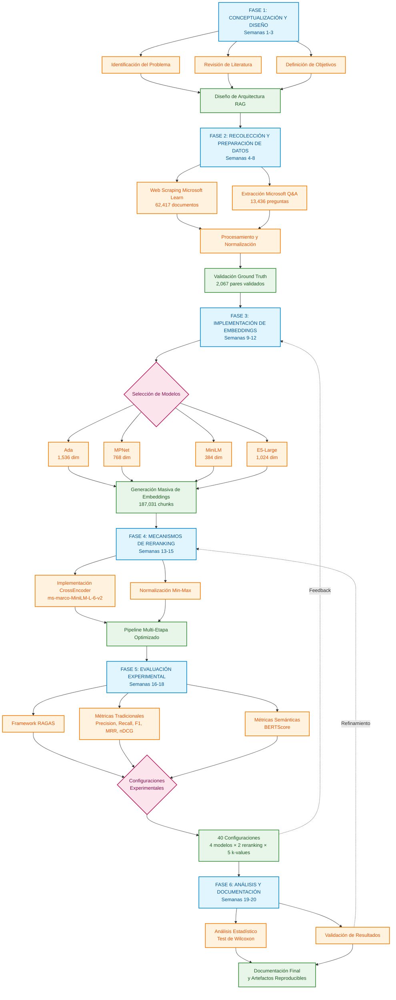

# BACKUP: Diagrama de flujo original del Capítulo 5

Este archivo contiene el diagrama flowchart original antes de ser reemplazado por el diagrama Gantt.

```mermaid
flowchart TB
    %% Estilos
    classDef phaseStyle fill:#e1f5fe,stroke:#0288d1,stroke-width:2px,color:#01579b
    classDef processStyle fill:#fff3e0,stroke:#f57c00,stroke-width:2px,color:#e65100
    classDef outputStyle fill:#e8f5e9,stroke:#388e3c,stroke-width:2px,color:#1b5e20
    classDef decisionStyle fill:#fce4ec,stroke:#c2185b,stroke-width:2px,color:#880e4f

    %% Fase 1: Conceptualización
    A["FASE 1: CONCEPTUALIZACIÓN Y DISEÑO<br>Semanas 1-3"]:::phaseStyle
    A --> A1[Identificación del Problema]:::processStyle
    A --> A2[Revisión de Literatura]:::processStyle
    A --> A3[Definición de Objetivos]:::processStyle
    A1 --> A4[Diseño de Arquitectura RAG]:::outputStyle
    A2 --> A4
    A3 --> A4

    %% Fase 2: Recolección de Datos
    A4 --> B["FASE 2: RECOLECCIÓN Y PREPARACIÓN DE DATOS<br>Semanas 4-8"]:::phaseStyle
    B --> B1["Web Scraping Microsoft Learn<br>62,417 documentos"]:::processStyle
    B --> B2["Extracción Microsoft Q&A<br>13,436 preguntas"]:::processStyle
    B1 --> B3[Procesamiento y Normalización]:::processStyle
    B2 --> B3
    B3 --> B4["Validación Ground Truth<br>2,067 pares validados"]:::outputStyle

    %% Fase 3: Implementación de Embeddings
    B4 --> C["FASE 3: IMPLEMENTACIÓN DE EMBEDDINGS<br>Semanas 9-12"]:::phaseStyle
    C --> C1{Selección de Modelos}:::decisionStyle
    C1 --> C2["Ada<br>1,536 dim"]:::processStyle
    C1 --> C3["MPNet<br>768 dim"]:::processStyle
    C1 --> C4["MiniLM<br>384 dim"]:::processStyle
    C1 --> C5["E5-Large<br>1,024 dim"]:::processStyle
    C2 --> C6["Generación Masiva de Embeddings<br>187,031 chunks"]:::outputStyle
    C3 --> C6
    C4 --> C6
    C5 --> C6

    %% Fase 4: Desarrollo de Reranking
    C6 --> D["FASE 4: MECANISMOS DE RERANKING<br>Semanas 13-15"]:::phaseStyle
    D --> D1["Implementación CrossEncoder<br>ms-marco-MiniLM-L-6-v2"]:::processStyle
    D --> D2[Normalización Min-Max]:::processStyle
    D1 --> D3[Pipeline Multi-Etapa Optimizado]:::outputStyle
    D2 --> D3

    %% Fase 5: Evaluación
    D3 --> E["FASE 5: EVALUACIÓN EXPERIMENTAL<br>Semanas 16-18"]:::phaseStyle
    E --> E1[Framework RAGAS]:::processStyle
    E --> E2["Métricas Tradicionales<br>Precision, Recall, F1, MRR, nDCG"]:::processStyle
    E --> E3["Métricas Semánticas<br>BERTScore"]:::processStyle
    E1 --> E4{"Configuraciones<br>Experimentales"}:::decisionStyle
    E2 --> E4
    E3 --> E4
    E4 --> E5["40 Configuraciones<br>4 modelos × 2 reranking × 5 k-values"]:::outputStyle

    %% Fase 6: Análisis
    E5 --> F["FASE 6: ANÁLISIS Y DOCUMENTACIÓN<br>Semanas 19-20"]:::phaseStyle
    F --> F1["Análisis Estadístico<br>Test de Wilcoxon"]:::processStyle
    F --> F2[Validación de Resultados]:::processStyle
    F1 --> F3["Documentación Final<br>y Artefactos Reproducibles"]:::outputStyle
    F2 --> F3

    %% Iteraciones y Feedback
    E5 -.->|Feedback| C
    F2 -.->|Refinamiento| D
```
