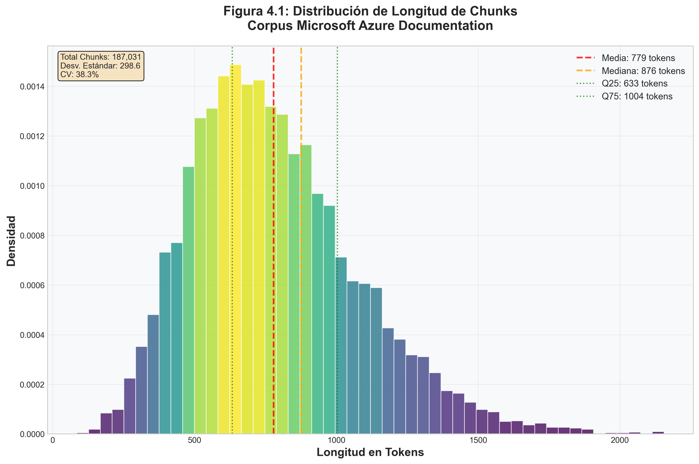
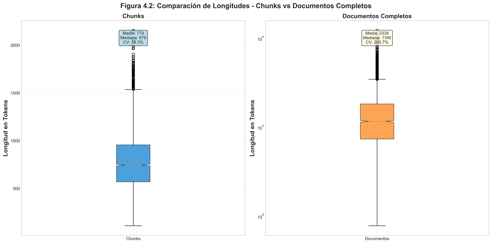
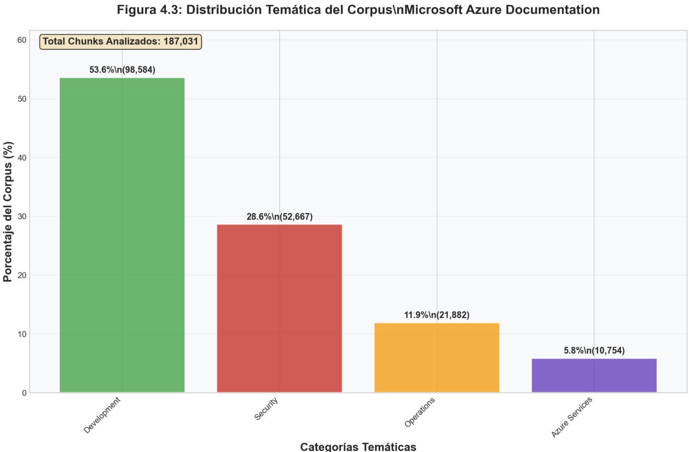
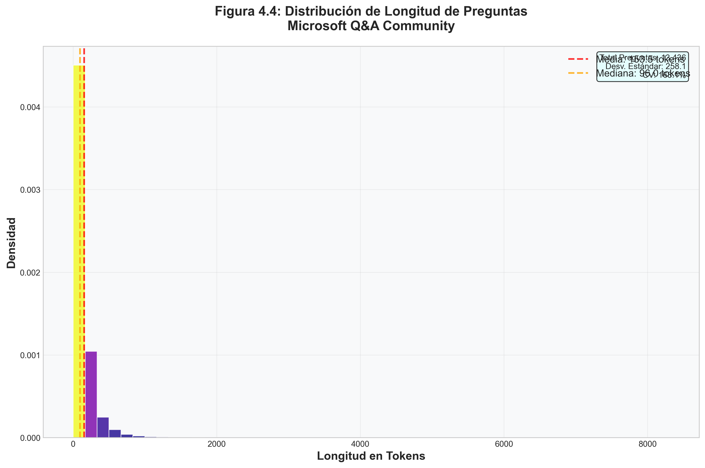
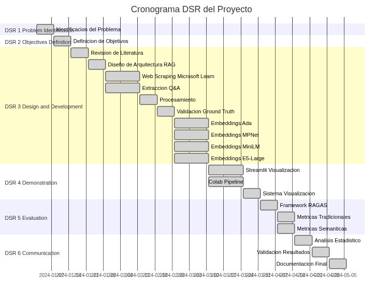

# 1. INTRODUCCIÓN Y FUNDAMENTOS DEL PROYECTO

## 1.1 Formulación del Problema

Los sistemas de soporte técnico para productos tecnológicos complejos enfrentan desafíos fundamentales en la gestión del conocimiento especializado. Esta investigación aborda el problema de recuperación semántica de información técnica utilizando Microsoft Azure como caso de estudio representativo de plataformas enterprise modernas.

### 1.1.1 El conocimiento existe, pero no se encuentra

La documentación técnica oficial constituye la fuente primaria de información para resolver consultas de soporte. Sin embargo, la recuperación efectiva de esta información presenta dificultades inherentes a la complejidad y especialización del dominio. Para emular este escenario genérico, se construyó un corpus completo de documentación técnica basado en Microsoft Azure, representativo de las características presentes en otros productos tecnológicos enterprise: alta especialización terminológica, arquitecturas multinivel, y documentación distribuida en múltiples formatos y niveles de abstracción.

La brecha entre disponibilidad y accesibilidad del conocimiento motiva la necesidad de sistemas de recuperación semántica que superen las limitaciones de la búsqueda léxica tradicional.

### 1.1.2 Patrones recurrentes en consultas de soporte técnico

El análisis de preguntas de soporte técnico revela patrones característicos: un subconjunto relativamente pequeño de documentos responde a la mayoría de consultas frecuentes, mientras que casos específicos requieren documentación especializada que raramente se consulta de forma proactiva. Esta distribución irregular del conocimiento dificulta la localización de información relevante, particularmente cuando usuarios formulan consultas usando terminología que no coincide exactamente con la documentación oficial.

Para investigar este fenómeno, se recolectó un dataset de consultas reales de usuarios en foros técnicos especializados, permitiendo caracterizar los patrones de correspondencia entre preguntas naturales y documentación técnica formal. Este dataset proporciona ground truth verificable para evaluación sistemática de técnicas de recuperación.

### 1.1.3 Búsqueda léxica versus recuperación semántica

Los sistemas de búsqueda tradicionales basados en coincidencia de palabras clave presentan limitaciones significativas en dominios técnicos especializados. La terminología técnica admite múltiples formas de expresión (sinónimos, acrónimos, variantes regionales), y las consultas en lenguaje natural raramente replican la estructura formal de la documentación oficial.

Esta investigación propone desarrollar y evaluar un sistema de recuperación semántica basado en representaciones vectoriales densas (embeddings) que capture similitud conceptual más allá de coincidencia léxica superficial. El sistema integra técnicas de Retrieval-Augmented Generation (RAG) para vincular automáticamente consultas con documentación relevante mediante comprensión semántica del contenido técnico.

## 1.2 Alcances

### 1.2.1 Alcance Temático

El trabajo abarca el diseño, implementación y evaluación de un sistema RAG (Retrieval-Augmented Generation) completo aplicado a documentación técnica. El sistema implementa comparación sistemática de cuatro modelos de embeddings (Ada, MPNet, MiniLM, E5-Large), desarrolla arquitecturas de búsqueda híbrida que combinan recuperación vectorial con reranking semántico, y evalúa el rendimiento mediante métricas específicas de recuperación de información en etapas pre y post reranking.

### 1.2.2 Alcance Temporal

El desarrollo se ejecutó durante el período académico 2024-2025. La recolección de datos establece un corpus estático del conocimiento disponible en Microsoft Learn y Microsoft Q&A, permitiendo una evaluación consistente y reproducible sin variaciones temporales.

## 1.3 Delimitaciones

### 1.3.1 Delimitación Geográfica

Aunque el sistema está diseñado para operar sin restricciones geográficas, la implementación se enfoca exclusivamente en documentación y consultas en idioma inglés. Los datos provienen de fuentes públicas internacionales (Microsoft Learn y Microsoft Q&A), pero el procesamiento lingüístico se optimiza para terminología técnica en inglés.

### 1.3.2 Delimitación de Dominio

La investigación se delimita al ecosistema de Microsoft Azure, excluyendo otros productos de Microsoft o plataformas cloud competidoras. Esta delimitación permite especialización profunda en la terminología, arquitectura y patrones de consulta específicos del dominio Azure.

### 1.3.3 Delimitación Funcional

El proyecto se centra en la evaluación de técnicas de recuperación de información mediante métricas específicas (Precision@k, Recall@k, MRR, NDCG) en etapas pre y post reranking, más que en la implementación de un sistema de producción completo.

## 1.4 Limitaciones

### 1.4.1 Limitaciones de Datos

Se utilizaron exclusivamente datos públicos de foros técnicos especializados, sin acceso a tickets corporativos internos. El dataset de evaluación comprende un subconjunto de preguntas con enlaces validados a documentación oficial que sirven como ground truth verificable, lo cual representa un escenario de evaluación más estricto que casos reales donde múltiples documentos pueden ser igualmente relevantes.

### 1.4.2 Limitaciones Técnicas

El procesamiento se limita a contenido textual, excluyendo elementos multimedia (imágenes, diagramas, videos) presentes en la documentación técnica moderna. Los modelos de embeddings tienen restricciones de contexto que requieren segmentación de documentos extensos, potencialmente perdiendo información contextual al dividir el contenido.

### 1.4.3 Limitaciones de Evaluación

La validación se basa en enlaces explícitos entre preguntas y documentos en respuestas validadas por la comunidad. Este criterio, aunque objetivo y reproducible, puede subestimar la relevancia de documentos alternativos igualmente válidos que no fueron citados en la respuesta aceptada.

## 1.5 Objetivos

### 1.5.1 Objetivo General

Desarrollar y evaluar un sistema de recuperación semántica de información basado en técnicas de procesamiento de lenguaje natural, utilizando documentación técnica de Microsoft Azure como caso de estudio. El objetivo es medir y comparar la efectividad de diferentes modelos de embeddings y arquitecturas de recuperación en la identificación de documentos relevantes para consultas técnicas especializadas.

### 1.5.2 Objetivos Específicos

1. **Implementar y comparar múltiples arquitecturas de embeddings**, evaluando modelos de código abierto (MiniLM, MPNet, E5-Large) y propietarios (OpenAI Ada) para determinar la representación vectorial óptima del contenido técnico especializado de Azure.

2. **Diseñar un sistema de almacenamiento y recuperación vectorial** utilizando ChromaDB como base de datos especializada, configurando índices optimizados para búsquedas de similitud semántica a escala con más de 800,000 vectores de alta dimensionalidad distribuidos en 8 colecciones especializadas.

3. **Desarrollar mecanismos avanzados de reranking** implementando CrossEncoders especializados y técnicas de normalización (Min-Max) para mejorar la precisión en el ordenamiento final de documentos recuperados, optimizando específicamente para consultas técnicas complejas.

4. **Evaluar sistemáticamente el rendimiento del sistema** mediante un framework de métricas que incluye medidas tradicionales de recuperación (Precision@k, Recall@k, MRR, NDCG) en etapas pre y post reranking, métricas específicas para sistemas RAG (Answer Relevancy, Context Precision, Faithfulness), y validación semántica utilizando RAGAS y BERTScore.

5. **Establecer una metodología reproducible y extensible**, documentando el proceso de implementación, creando pipelines automatizados de evaluación con métricas verificables, y desarrollando herramientas auxiliares (incluyendo una interfaz Streamlit) que faciliten la ejecución de pruebas y la visualización de resultados para futuras investigaciones.


```{=openxml}
<w:p><w:r><w:br w:type="page"/></w:r></w:p>
```

# 2. ESTADO DEL ARTE

## 2.1 Introducción

El procesamiento de lenguaje natural ha transformado la gestión del conocimiento y el soporte técnico en las organizaciones modernas. La integración de modelos de lenguaje preentrenados, motores de búsqueda vectorial y bases de conocimiento especializadas ha permitido desarrollar sistemas más eficientes y precisos para la recuperación de información técnica. Este capítulo examina el estado actual en la aplicación de NLP al soporte técnico, con énfasis en arquitecturas RAG, bases de datos vectoriales, modelos de embeddings especializados y métricas de evaluación avanzadas.

La evolución desde sistemas tradicionales basados en coincidencia léxica hacia sistemas semánticos capaces de comprender contexto e intención ha marcado un punto de inflexión en la automatización del soporte técnico. Este cambio de paradigma es especialmente relevante en dominios técnicos complejos como Azure, donde la terminología especializada y la interrelación entre servicios requieren un enfoque semántico sofisticado.

## 2.2 NLP Aplicado a Soporte Técnico

El soporte técnico ha sido tradicionalmente un proceso dependiente del conocimiento tácito y la experiencia humana, lo que genera inconsistencias, demoras y errores sistemáticos. Las técnicas avanzadas de NLP permiten automatizar y mejorar tareas críticas como la clasificación de tickets, la identificación del propósito de consultas, la recuperación de respuestas relevantes y la recomendación de soluciones contextualizadas.

### 2.2.1 Evolución de los Modelos de Lenguaje

Los enfoques contemporáneos han evolucionado desde modelos estadísticos simples hacia arquitecturas transformer sofisticadas. BERT (Bidirectional Encoder Representations from Transformers) y sus variantes como RoBERTa, DistilBERT y DeBERTa han demostrado resultados superiores en tareas de clasificación multiclase y multilabel en dominios técnicos (Devlin et al., 2018; Liu et al., 2019; He et al., 2020). Cuando se especializan mediante fine-tuning en corpus técnicos, estos modelos capturan matices semánticos que los modelos generales no logran identificar.

La aparición de modelos especializados como Sentence-BERT (SBERT) revolucionó la generación de embeddings para tareas de recuperación semántica (Reimers & Gurevych, 2019). A diferencia de BERT tradicional, SBERT está optimizado para generar representaciones vectoriales densas que preservan la similitud semántica, fundamental para sistemas de recuperación de información técnica.

### 2.2.2 Arquitecturas RAG en Soporte Técnico

Las arquitecturas RAG (Retrieval-Augmented Generation) han emergido como el estándar para sistemas de soporte técnico que combinan recuperación de información con generación de respuestas (Lewis et al., 2020). Estas arquitecturas permiten que los modelos de lenguaje accedan dinámicamente a bases de conocimiento externas durante la generación, superando las limitaciones de memoria y actualización de los modelos parametrizados.

En el contexto del soporte técnico, los sistemas RAG implementan típicamente un pipeline de dos etapas: recuperación de documentos relevantes mediante búsqueda vectorial, seguida de generación de respuestas contextualizadas utilizando los documentos recuperados. La efectividad de estos sistemas depende críticamente de la calidad de los embeddings y la precisión del mecanismo de recuperación.

### 2.2.3 Aplicaciones Empresariales Actuales

Empresas tecnológicas líderes como IBM, SAP y Microsoft han implementado soluciones NLP para análisis semántico de tickets y generación de respuestas automatizadas (Saxena et al., 2021). Estas implementaciones incluyen módulos de clasificación automática, extracción de entidades, y sistemas de recomendación basados en similitud semántica.

El uso de técnicas de resumen automático extractivo y abstractivo permite procesar tickets extensos y extraer información clave para facilitar la priorización y el enrutamiento inteligente (Gupta & Gupta, 2020). Estos enfoques son valiosos en entornos de alto volumen donde la clasificación manual resulta impracticable.

## 2.3 Bases de Conocimiento como Entrada para Recuperación de Información

### 2.3.1 Transición hacia Recuperación Semántica

Una tendencia dominante en la industria es la utilización de bases de conocimiento estructuradas como corpus semántico para alimentar sistemas de recuperación en tareas de soporte. Estas bases incluyen documentación técnica oficial, artículos de resolución de problemas, FAQ especializadas y respuestas validadas por la comunidad.

Los métodos tradicionales de recuperación basados en TF-IDF o BM25 han dado paso progresivamente a técnicas vectoriales que representan textos como embeddings densos, capturando relaciones semánticas más profundas y contextuales (Johnson et al., 2019). Esta transición ha sido impulsada por el surgimiento de modelos como Sentence-BERT, que permiten generar representaciones vectoriales eficientes y semánticamente coherentes para documentos y consultas.

### 2.3.2 Arquitecturas de Embeddings Especializados

Los sistemas modernos de recuperación implementan arquitecturas de embeddings especializados que van más allá de los modelos generales. Modelos como E5 (Embeddings from bidirectional Encoder representations) han demostrado rendimiento superior en benchmarks de recuperación semántica en dominios técnicos (Wang et al., 2022). Estos modelos utilizan estrategias de preentrenamiento contrastivo que optimizan la tarea de recuperación.

La familia de modelos MPNet (Masked and Permuted Pre-training) combina las ventajas de BERT y XLNet, resultando en representaciones más robustas para tareas de recuperación de información técnica (Song et al., 2020). Por otro lado, modelos como MiniLM ofrecen un balance optimizado entre rendimiento y eficiencia computacional, siendo útiles en aplicaciones de producción con restricciones de recursos (Wang et al., 2020).

### 2.3.3 Integración con Bases de Datos Vectoriales

El uso de retrievers vectoriales se ha vuelto esencial en arquitecturas RAG modernas. Bases de datos vectoriales especializadas como ChromaDB, FAISS, Milvus y Weaviate han surgido como soluciones optimizadas para almacenamiento y recuperación eficiente de vectores de alta dimensión (Johnson et al., 2019; Douze et al., 2024).

Inicialmente, este proyecto utilizó Weaviate como base de datos vectorial por su robustez empresarial, arquitectura distribuida, integración nativa con múltiples modelos de lenguaje (OpenAI, Cohere, Hugging Face), y capacidades avanzadas de consulta mediante GraphQL (Weaviate, 2023). Sin embargo, durante el desarrollo se migró a ChromaDB por consideraciones prácticas del entorno de investigación académica: eliminación de costos de infraestructura cloud, reducción sustancial de latencia al operar localmente, compatibilidad nativa con Google Colab sin configuración adicional, y simplicidad de despliegue sin requerimientos de servicios externos.

ChromaDB mantiene las capacidades esenciales requeridas: filtrado nativo por metadatos, búsqueda híbrida combinando similitud semántica con criterios estructurados, y rendimiento adecuado para conjuntos de datos de escala media (hasta millones de vectores). Esta migración demostró que para aplicaciones de investigación y desarrollo, la simplicidad y control local pueden superar las ventajas de arquitecturas distribuidas más complejas.

## 2.4 Comparación de Enfoques Vectoriales y Clásicos

### 2.4.1 Limitaciones de Sistemas Clásicos

Los sistemas clásicos de recuperación de información, implementados en plataformas como Apache Lucene y Elasticsearch, utilizan modelos estadísticos que representan documentos como bolsas de palabras (bag-of-words). Aunque estos sistemas son computacionalmente eficientes y relativamente simples de implementar y mantener, presentan limitaciones fundamentales en la comprensión semántica profunda, lo cual restringe su capacidad para responder consultas formuladas en lenguaje natural (Manning et al., 2008).

Estas limitaciones son pronunciadas en dominios técnicos donde existe alta variabilidad terminológica, uso de sinónimos especializados, y donde la relevancia depende fuertemente del contexto semántico más que de la coincidencia léxica exacta.

### 2.4.2 Intentos de Búsqueda Semántica con Bases Relacionales

Existen esfuerzos para implementar capacidades de búsqueda semántica utilizando bases de datos relacionales tradicionales mediante extensiones especializadas. PostgreSQL con la extensión pgvector permite almacenar y consultar vectores de embeddings utilizando SQL estándar (PostgreSQL, 2023). De manera similar, sistemas como Azure SQL Database han incorporado capacidades de búsqueda vectorial mediante extensiones propietarias.

Sin embargo, estas soluciones presentan limitaciones significativas comparadas con bases de datos vectoriales especializadas. En términos de rendimiento, los índices están menos optimizados para espacios de alta dimensionalidad, lo que resulta en mayor consumo de memoria, latencias superiores en consultas de similitud a gran escala, y escalabilidad limitada para billones de vectores. Funcionalmente, ofrecen soporte limitado para métricas de distancia especializadas, carecen de optimizaciones para ANN (Approximate Nearest Neighbor), presentan integración compleja con pipelines de ML/NLP, y no tienen funcionalidades nativas para filtrado híbrido semántico-estructurado. Operacionalmente, requieren expertise tanto en SQL como en operaciones vectoriales, presentan configuración y tuning más complejos para cargas de trabajo vectoriales, y tienen procesos de backup y recuperación más complejos para datos de alta dimensionalidad.

Estas limitaciones hacen que, aunque técnicamente posible, el uso de bases relacionales para búsqueda semántica sea subóptimo comparado con soluciones especializadas como ChromaDB, Pinecone o Weaviate en aplicaciones que requieren alto rendimiento y escalabilidad (Li et al., 2023).

### 2.4.3 Ventajas de Sistemas Vectoriales

En contraste, los sistemas vectoriales modernos utilizan embeddings generados por modelos de aprendizaje profundo, permitiendo recuperar documentos basados en similitud semántica en lugar de coincidencia léxica superficial (Malkov & Yashunin, 2018). Estos sistemas pueden identificar relaciones semánticas complejas, manejar sinónimos y variaciones terminológicas, y capturar dependencias contextuales que los sistemas clásicos no pueden procesar.

La implementación de algoritmos de búsqueda aproximada de vecinos más cercanos (Approximate Nearest Neighbor, ANN) como HNSW (Hierarchical Navigable Small World) permite realizar búsquedas vectoriales eficientes incluso en espacios de alta dimensionalidad, manteniendo latencias aceptables para aplicaciones de producción.

### 2.4.4 Enfoques Híbridos y Reranking

Los sistemas más efectivos combinan las fortalezas de ambos enfoques mediante arquitecturas híbridas que utilizan recuperación vectorial para la selección inicial de candidatos, seguida de reranking mediante modelos más sofisticados. Los CrossEncoders, que procesan conjuntamente la consulta y cada documento candidato, pueden proporcionar scores de relevancia más precisos que los bi-encoders utilizados en la fase de recuperación inicial (Reimers & Gurevych, 2019).

Esta estrategia de pipeline multi-etapa permite balancear eficiencia computacional con precisión de recuperación, siendo efectiva en sistemas de soporte técnico donde la precisión en los primeros resultados es crítica para la experiencia del usuario.

## 2.5 Casos Empresariales Relevantes

La industria tecnológica ha implementado diversas soluciones NLP para automatización de soporte técnico. Microsoft ha incorporado extensivamente modelos de NLP en Azure para análisis automático de tickets y sugerencia de respuestas basadas en documentación técnica (Microsoft Learn, 2023). Su implementación utiliza arquitecturas híbridas que combinan embeddings semánticos, sistemas de ranking multi-etapa y técnicas de respuesta generativa. El sistema procesa automáticamente tickets entrantes, los clasifica por servicio y urgencia, y sugiere documentación relevante basada en casos históricos similares, integrando múltiples fuentes de conocimiento mediante técnicas de fusión de rankings.

Zendesk desarrolló "Answer Bot", un sistema de inteligencia artificial que utiliza NLP avanzado para sugerir artículos de ayuda relevantes automáticamente cuando un usuario envía un ticket (Zendesk, 2023). El sistema ha logrado reducir en un 10-30% el volumen de tickets que requieren intervención humana directa, demostrando el impacto de las tecnologías NLP en la eficiencia operacional. Answer Bot implementa técnicas de aprendizaje continuo que mejoran sus recomendaciones basándose en el feedback implícito de usuarios y explícito de agentes.

ServiceNow integra modelos de NLP con su módulo "Predictive Intelligence", que clasifica y enruta tickets automáticamente utilizando modelos entrenados en datos históricos extensos (ServiceNow, 2022). El sistema también implementa funcionalidades de recomendación de artículos y predicción de resolución, utilizando técnicas de aprendizaje automático para optimizar la asignación de recursos. La plataforma incluye capacidades de análisis de sentimiento para priorizar tickets con mayor urgencia emocional y detectar patrones de escalación potencial.

Salesforce Service Cloud ha implementado bots conversacionales que combinan NLP y búsqueda semántica para asistir tanto a clientes como a agentes en tiempo real (Salesforce, 2023). Estas herramientas son alimentadas por bases vectoriales generadas a partir de documentación técnica, casos históricos e interacciones previas, utilizando arquitecturas transformer para generar respuestas contextualizadas. El sistema integra capacidades de procesamiento multimodal que pueden analizar no solo texto sino también imágenes y documentos adjuntos.

## 2.6 Medidas de Evaluación en Recuperación de Información

### 2.6.1 Métricas Tradicionales de Recuperación y Ranking

La evaluación rigurosa de sistemas de recuperación de información es fundamental para validar la efectividad de las soluciones propuestas. Las métricas tradicionales como Precision, Recall y F1-score continúan siendo ampliamente utilizadas, pero requieren adaptación y complementación con métricas específicas para el paradigma de recuperación semántica.

**Precision** mide la proporción de documentos relevantes entre los documentos recuperados, siendo crucial cuando se busca minimizar falsos positivos. En contextos de soporte técnico, recomendar artículos irrelevantes puede generar frustración y pérdida de confianza en el sistema. **Recall** evalúa la proporción de documentos relevantes recuperados sobre el total disponible. Esta métrica es crítica en soporte técnico, donde omitir información relevante puede resultar en resolución inadecuada del problema del usuario. **F1-Score** representa la media armónica entre precision y recall, proporcionando una métrica balanceada útil cuando ambos aspectos son igualmente importantes.

**Mean Reciprocal Rank (MRR)** es fundamental cuando el sistema devuelve listas ordenadas de resultados y se busca evaluar qué tan pronto aparece la respuesta relevante. En soporte técnico, esta métrica es valiosa para evaluar la utilidad de los primeros resultados mostrados al agente, ya que típicamente solo se revisan los primeros 3-5 resultados. **Normalized Discounted Cumulative Gain (NDCG)** considera tanto la relevancia de los resultados como su posición en la lista, aplicando un descuento logarítmico que penaliza resultados relevantes en posiciones inferiores.

**Precision@k y Recall@k** están diseñadas para evaluar la calidad de los primeros k resultados. Precision@k mide la proporción de resultados relevantes entre los primeros k documentos recuperados. Por ejemplo, si entre los primeros 5 artículos sugeridos, 3 son relevantes, entonces Precision@5 = 0.6. Recall@k evalúa cuántos documentos relevantes fueron recuperados entre los primeros k, comparado con el total disponible. Si hay 4 documentos relevantes totales y el sistema recupera 3 dentro de los primeros 5, entonces Recall@5 = 0.75.

Las fórmulas matemáticas de estas métricas se presentan en la Tabla 1:


| Métrica | Fórmula | Descripción de Variables |
|---------|---------|--------------------------|
| **Precision** | $P = \frac{TP}{TP + FP}$ | TP = Verdaderos Positivos, FP = Falsos Positivos |
| **Recall** | $R = \frac{TP}{TP + FN}$ | TP = Verdaderos Positivos, FN = Falsos Negativos |
| **F1-Score** | $F_1 = 2 \cdot \frac{P \cdot R}{P + R}$ | P = Precision, R = Recall |
| **NDCG** | $NDCG = \frac{DCG}{IDCG}$ <br> $DCG = \sum_{i=1}^{n} \frac{rel_i}{\log_2(i+1)}$ | $rel_i$ = relevancia del documento en posición $i$, $n$ = total de documentos, $IDCG$ = DCG ideal |
| **MAP** | $MAP = \frac{1}{\|Q\|} \sum_{q=1}^{\|Q\|} AP(q)$ <br> $AP(q) = \frac{1}{\|R_q\|} \sum_{k=1}^{n} P(k) \cdot rel(k)$ | $Q$ = consultas, $AP(q)$ = Average Precision para consulta $q$, $R_q$ = documentos relevantes para $q$, $rel(k)$ = 1 si doc en posición $k$ es relevante, 0 si no |
| **MRR** | $MRR = \frac{1}{\|Q\|} \sum_{i=1}^{\|Q\|} \frac{1}{rank_i}$ | $Q$ = conjunto de consultas, $rank_i$ = posición del primer documento relevante para consulta $i$ (no tiene versión @k) |
| **Precision@k** | $P@k = \frac{\|\{d \in D_k : \text{relevant}(d)\}\|}{k}$ | $D_k$ = conjunto de los primeros k documentos recuperados |
| **Recall@k** | $R@k = \frac{\|\{d \in D_k : \text{relevant}(d)\}\|}{\|R\|}$ | $D_k$ = primeros k documentos, $R$ = todos los documentos relevantes |
| **F1@k** | $F_1@k = 2 \cdot \frac{P@k \cdot R@k}{P@k + R@k}$ | Media armónica de Precision@k y Recall@k |
| **NDCG@k** | $NDCG@k = \frac{DCG@k}{IDCG@k}$ <br> $DCG@k = \sum_{i=1}^{k} \frac{rel_i}{\log_2(i+1)}$ | $rel_i$ = relevancia del documento en posición $i$, $IDCG@k$ = DCG ideal hasta posición k |
| **MAP@k** | $MAP@k = \frac{1}{\|Q\|} \sum_{q=1}^{\|Q\|} AP@k(q)$ <br> $AP@k(q) = \frac{1}{\min(k, \|R_q\|)} \sum_{i=1}^{k} P(i) \cdot rel(i)$ | Average Precision calculado solo hasta los primeros k documentos |

**Tabla 1: Métricas tradicionales de recuperación de información**
*Fuente: Adaptado de Manning, C. D., Raghavan, P., & Schütze, H. (2008). Introduction to information retrieval. Cambridge University Press.*


### 2.6.2 Métricas Específicas para Sistemas RAG

Las arquitecturas RAG requieren métricas especializadas que evalúen no solo la recuperación sino también la calidad de la generación y la coherencia entre ambas fases. **Answer Relevancy** mide qué tan bien la respuesta generada aborda la pregunta formulada, evaluando la alineación semántica entre consulta y respuesta (Es et al., 2023). **Context Precision** evalúa qué proporción del contexto recuperado es realmente relevante para responder la pregunta, identificando ruido en la fase de recuperación. **Context Recall** mide si toda la información necesaria para responder está presente en el contexto recuperado. **Faithfulness** evalúa si la respuesta generada es factualmente consistente con el contexto proporcionado, detectando alucinaciones o inconsistencias.

Las fórmulas matemáticas de estas métricas RAG se presentan en la Tabla 2:


| Métrica | Fórmula | Descripción de Variables |
|---------|---------|--------------------------|
| **Answer Relevancy** | $AR = \frac{1}{N} \sum_{i=1}^{N} \text{sim}(q, g_i)$ | $q$ = pregunta original, $g_i$ = pregunta generada a partir de la respuesta, $N$ = número de preguntas generadas, $\text{sim}$ = similitud coseno |
| **Context Precision** | $CP@k = \frac{1}{k} \sum_{i=1}^{k} \mathbb{1}[\text{relevant}(c_i)]$ | $c_i$ = contexto en posición $i$, $\mathbb{1}[\cdot]$ = función indicadora, $k$ = número de contextos |
| **Context Recall** | $CR = \frac{\|\text{Sentences}_{\text{attributed}}\|}{\|\text{Sentences}_{\text{ground\_truth}}\|}$ | Proporción de oraciones del ground truth que pueden ser atribuidas al contexto recuperado |
| **Faithfulness** | $F = \frac{\|\text{Claims}_{\text{supported}}\|}{\|\text{Claims}_{\text{total}}\|}$ | Proporción de afirmaciones en la respuesta que están soportadas por el contexto |
| **Answer Correctness** | $AC = w_s \cdot S + w_f \cdot F$ | $S$ = similitud semántica, $F$ = similitud factual, $w_s, w_f$ = pesos (típicamente 0.5 cada uno) |

**Tabla 2: Métricas RAGAS para evaluación de sistemas RAG**
*Fuente: Adaptado de Es, S., James, J., Espinosa-Anke, L., & Schockaert, S. (2023). RAGAS: Automated evaluation of retrieval augmented generation. arXiv preprint arXiv:2309.15217.*


### 2.6.3 Métricas de Similitud Semántica y Aplicación al Proyecto

**BERTScore** utiliza representaciones contextuales de BERT para evaluar la similitud semántica entre respuestas generadas y respuestas de referencia, proporcionando una evaluación más matizada que métricas basadas en coincidencia léxica como BLEU o ROUGE (Zhang et al., 2019). En este proyecto se implementó BERTScore utilizando el modelo `distiluse-base-multilingual-cased-v2`, optimizado para evaluación de similitud semántica cross-lingual, aunque se aplicó a contenido en inglés para mantener consistencia con el corpus de documentación técnica.

Las fórmulas matemáticas de estas métricas de similitud semántica se presentan en la Tabla 3:


| Métrica | Fórmula | Descripción de Variables |
|---------|---------|--------------------------|
| **Similitud Coseno** | $\text{sim}(a, b) = \frac{a \cdot b}{\|a\| \|b\|} = \frac{\sum_{i=1}^{n} a_i b_i}{\sqrt{\sum_{i=1}^{n} a_i^2} \sqrt{\sum_{i=1}^{n} b_i^2}}$ | $a, b$ = vectores de embeddings, $n$ = dimensionalidad |
| **BERTScore Precision** | $P_{\text{BERT}} = \frac{1}{\|x^{ref}\|} \sum_{x_j \in x^{ref}} \max_{x_i \in x^{cand}} \mathbf{x}_i^T \mathbf{x}_j$ | $x^{ref}$ = tokens de referencia, $x^{cand}$ = tokens candidatos, $\mathbf{x}_i$ = embedding contextual del token $i$ |
| **BERTScore Recall** | $R_{\text{BERT}} = \frac{1}{\|x^{cand}\|} \sum_{x_i \in x^{cand}} \max_{x_j \in x^{ref}} \mathbf{x}_i^T \mathbf{x}_j$ | $x^{cand}$ = tokens candidatos, $x^{ref}$ = tokens de referencia |
| **BERTScore F1** | $F_{\text{BERT}} = 2 \cdot \frac{P_{\text{BERT}} \cdot R_{\text{BERT}}}{P_{\text{BERT}} + R_{\text{BERT}}}$ | Media armónica de Precision y Recall de BERTScore |
| **Semantic Similarity** | $SS = \text{cosine\_sim}(\text{emb}(answer), \text{emb}(reference))$ | $\text{emb}(\cdot)$ = función de embedding semántico (ej: Sentence-BERT) |

**Tabla 3: Métricas de similitud semántica y BERTScore**
*Fuente: Adaptado de Zhang, T., Kishore, V., Wu, F., Weinberger, K. Q., & Artzi, Y. (2019). BERTScore: Evaluating text generation with BERT. arXiv preprint arXiv:1904.09675.*


En este proyecto se implementó un framework de evaluación que incluye métricas de recuperación tradicionales (Precision@k, Recall@k, MRR, NDCG), métricas RAG especializadas (Answer Relevancy, Context Precision, Context Recall, Faithfulness implementadas via RAGAS), evaluación semántica mediante BERTScore, y análisis pre/post reranking para cuantificar el impacto del CrossEncoder. Esta combinación permite evaluar integralmente tanto la efectividad de la recuperación como la calidad de las respuestas generadas, proporcionando insights detallados sobre el rendimiento de cada componente del pipeline RAG en el contexto del soporte técnico de Azure.


```{=openxml}
<w:p><w:r><w:br w:type="page"/></w:r></w:p>
```

# 3. MARCO TEÓRICO

## 3.1 Introducción

Este capítulo establece los fundamentos teóricos que sustentan el sistema RAG desarrollado en este proyecto. La convergencia de múltiples dominios tecnológicos ha habilitado avances significativos en la última década: recuperación de información semántica, modelos de embeddings densos, arquitecturas de Retrieval-Augmented Generation, y bases de datos vectoriales optimizadas. Esta convergencia permite desarrollar sistemas de soporte técnico automatizado que superan las limitaciones de los enfoques tradicionales basados en coincidencia léxica.

La documentación técnica de productos tecnológicos complejos presenta desafíos únicos que requieren una comprensión profunda de los fundamentos teóricos que sustentan las tecnologías de recuperación y generación de información. Los conceptos presentados proporcionan los cimientos conceptuales necesarios para comprender la arquitectura, implementación y evaluación del sistema RAG, analizando cada componente tecnológico y su contribución al objetivo general de automatización inteligente del soporte técnico. Si bien este trabajo utiliza la documentación de Microsoft Azure como caso de estudio, los principios y metodologías son aplicables a cualquier corpus de documentación técnica especializada.

## 3.2 Fundamentos de Recuperación de Información

### 3.2.1 Evolución de los Paradigmas de Recuperación

La recuperación de información (Information Retrieval, IR) ha evolucionado desde modelos probabilísticos clásicos hacia enfoques semánticos basados en representaciones vectoriales densas. El modelo vectorial tradicional, introducido por Salton et al. (1975), representa documentos y consultas como vectores en un espacio multidimensional donde cada dimensión corresponde a un término del vocabulario. Sin embargo, este enfoque sufre de limitaciones relacionadas con la maldición de la dimensionalidad y la incapacidad de capturar relaciones semánticas implícitas.

El cambio paradigmático hacia recuperación semántica densa ha sido posible gracias al desarrollo de modelos de lenguaje preentrenados capaces de generar representaciones vectoriales que preservan información semántica y contextual (Karpukhin et al., 2020). Estos modelos transforman texto en vectores de baja dimensión (típicamente 256-1536 dimensiones) que capturan similitudes semánticas no evidentes en el nivel léxico.

### 3.2.2 Fundamentos Matemáticos de Similitud Semántica

La similitud semántica en espacios vectoriales densos se cuantifica mediante la similitud coseno, definida como la relación entre el producto punto de dos vectores y el producto de sus normas euclidianas. Esta métrica normaliza los vectores, enfocándose en la orientación angular más que en la magnitud, lo que resulta apropiado para comparaciones semánticas donde la longitud del documento es menos relevante que su contenido conceptual.

La efectividad de esta aproximación depende críticamente de la calidad de las representaciones vectoriales, que deben preservar relaciones semánticas de manera que documentos conceptualmente similares mantengan proximidad en el espacio vectorial (Reimers & Gurevych, 2019).

### 3.2.3 Arquitecturas de Recuperación Multi-Etapa

Los sistemas modernos de recuperación implementan arquitecturas multi-etapa que optimizan el balance entre recall y precisión mediante un proceso de refinamiento progresivo (Qu et al., 2021). El pipeline típico comienza con una recuperación inicial mediante búsqueda vectorial eficiente sobre el corpus completo utilizando similitud coseno. Esta fase identifica un conjunto amplio de candidatos potencialmente relevantes. Posteriormente, un proceso de reranking utiliza modelos más sofisticados (CrossEncoders) que procesan conjuntamente consulta y documento para refinar el ordenamiento de candidatos. Finalmente, se aplican reglas de negocio y thresholding para optimizar la precisión de los resultados finales presentados al usuario.

Esta arquitectura permite escalar a corpus de gran tamaño manteniendo alta precisión en los resultados finales.

## 3.3 Modelos de Embeddings

### 3.3.1 OpenAI Ada (text-embedding-ada-002)

OpenAI Ada representa el estado del arte en modelos de embeddings comerciales, implementando una arquitectura Transformer optimizada para generación de representaciones vectoriales densas (OpenAI, 2023). El modelo genera vectores de 1,536 dimensiones optimizados para tareas de similitud semántica y recuperación de información. Sus características técnicas incluyen una longitud máxima de contexto de 8,191 tokens, arquitectura Transformer con optimizaciones propietarias para embeddings, y normalización que produce vectores unitarios con norma L2 igual a 1.0.

Ada incorpora técnicas avanzadas de preentrenamiento contrastivo que optimizan la representación vectorial para tareas de similitud semántica. El modelo ha sido entrenado en un corpus diverso que incluye documentación técnica, lo que resulta beneficioso para dominios especializados como Microsoft Azure. Sin embargo, presenta limitaciones relacionadas con su naturaleza propietaria, incluyendo dependencia de API externa, costos operacionales variables, y opacidad arquitectónica que impide optimizaciones específicas del dominio. Su rendimiento puede degradarse en terminología altamente especializada no representada en el corpus de entrenamiento.

### 3.3.2 Sentence-BERT: MPNet y MiniLM

MPNet (Masked and Permuted Pre-training) combina las ventajas de BERT y XLNet mediante una estrategia de preentrenamiento que incorpora tanto masked language modeling como permuted language modeling (Song et al., 2020). Esta aproximación híbrida resulta en representaciones más robustas para tareas de recuperación semántica. El modelo multi-qa-mpnet-base-dot-v1 utilizado en este proyecto genera vectores de 768 dimensiones mediante una arquitectura de 12 capas transformer con 12 cabezas de atención, totalizando aproximadamente 110 millones de parámetros. Su especialización proviene de fine-tuning en pares pregunta-respuesta, optimizando el modelo para este tipo de interacciones.

Un aspecto técnico relevante es el uso del prefijo "query:" al procesar consultas, convención establecida durante el entrenamiento para distinguir entre consultas y documentos, lo que resulta crucial para el rendimiento óptimo del modelo.

MiniLM implementa destilación de conocimiento desde modelos BERT más grandes, manteniendo calidad semántica mientras reduce los requerimientos computacionales (Wang et al., 2020). Esta optimización es valiosa en aplicaciones de producción con restricciones de recursos. El modelo all-MiniLM-L6-v2 genera vectores de 384 dimensiones mediante 6 capas transformer con aproximadamente 22 millones de parámetros, operando aproximadamente 5 veces más rápido que BERT-base. La reducción dimensional y arquitectónica se compensa mediante técnicas avanzadas de destilación que preservan información semántica crítica en el espacio vectorial de menor dimensión.

### 3.3.3 E5-Large: Embeddings Especializados en Recuperación

E5-Large (Embeddings from bidirectional Encoder representations) implementa una estrategia de preentrenamiento contrastivo optimizada para tareas de recuperación de información (Wang et al., 2022). El modelo utiliza técnicas de aprendizaje auto-supervisado que maximizan la similitud entre pares relacionados mientras minimizan la similitud entre pares no relacionados. Sus características técnicas incluyen vectores de 1,024 dimensiones generados por una arquitectura Transformer de 24 capas con aproximadamente 335 millones de parámetros, entrenado en un corpus multilingüe con énfasis en pares texto-texto.

E5-Large ha demostrado rendimiento superior en el benchmark MTEB (Massive Text Embedding Benchmark), particularmente en tareas de recuperación semántica y clasificación de similaridad textual (Muennighoff et al., 2023). Su arquitectura optimizada para recuperación lo posiciona como una alternativa competitiva a modelos propietarios en aplicaciones especializadas.

Su diseño multilingüe y arquitectura optimizada para recuperación lo posicionan como una alternativa relevante en aplicaciones que requieren capacidades de búsqueda semántica robusta en múltiples idiomas. La especialización del modelo en tareas de recuperación mediante preentrenamiento contrastivo representa un enfoque metodológico diferente al de modelos generalistas, ofreciendo potencial para dominios técnicos especializados donde la precisión de recuperación es crítica.

## 3.4 Arquitecturas RAG (Retrieval-Augmented Generation)

### 3.4.1 Fundamentos Teóricos de RAG

Las arquitecturas RAG combinan los beneficios de modelos parametrizados (conocimiento almacenado en parámetros) con acceso dinámico a conocimiento no parametrizado (bases de datos externas). Esta hibridación permite superar limitaciones de los modelos de lenguaje tradicionales, incluyendo obsolescencia de información, alucinaciones factuales, y limitaciones de memoria (Lewis et al., 2020).

El paradigma RAG descompone la generación de respuestas en dos componentes diferenciables: un retriever especializado en recuperación de información relevante, y un generator que sintetiza respuestas utilizando la información recuperada. Esta separación permite optimizar independientemente cada componente y facilita la actualización de la base de conocimiento sin reentrenar el modelo generativo.

### 3.4.2 Taxonomía de Arquitecturas RAG

La arquitectura RAG clásica implementa un pipeline secuencial donde la recuperación precede completamente a la generación. Esta aproximación es computacionalmente eficiente y facilita la interpretabilidad al separar claramente las responsabilidades de cada componente. El proceso comienza con la recuperación de documentos relevantes basándose en la consulta del usuario, seguido de la construcción de un contexto que combina los documentos recuperados, y finalmente la generación de una respuesta que incorpora la información contextual recuperada.

Variantes más sofisticadas incluyen RAG iterativo, donde el proceso de recuperación puede repetirse basándose en la generación parcial, y RAG adaptativo, donde el modelo aprende dinámicamente cuándo y cómo utilizar información externa (Jiang et al., 2023). Estas variantes ofrecen mayor flexibilidad pero requieren recursos computacionales adicionales.

### 3.4.3 Métricas de Evaluación RAG

La evaluación de sistemas RAG requiere métricas especializadas que capturen tanto la calidad de recuperación como la calidad de generación. El framework RAGAS (Retrieval Augmented Generation Assessment) proporciona métricas que abordan diferentes aspectos del sistema. Faithfulness evalúa la consistencia factual entre la respuesta generada y el contexto proporcionado, detectando casos donde el modelo introduce información no soportada por los documentos recuperados. Answer Relevancy mide qué tan bien la respuesta aborda la pregunta formulada, evaluando la alineación semántica entre consulta y respuesta. Context Precision examina qué proporción del contexto recuperado es realmente relevante para responder la pregunta, identificando ruido en la fase de recuperación. Context Recall verifica si toda la información necesaria para responder está presente en el contexto recuperado, comparando contra respuestas de referencia cuando están disponibles.

## 3.5 CrossEncoders y Reranking

### 3.5.1 Fundamentos Teóricos del Reranking Neural

El reranking neural utiliza modelos que procesan conjuntamente consulta y documento, capturando interacciones semánticas más sofisticadas que los enfoques de embedding independientes. Los CrossEncoders representan el estado del arte en esta aproximación, utilizando mecanismos de atención cruzada para modelar relaciones complejas entre consulta y documento (Nogueira & Cho, 2019).

A diferencia de los bi-encoders que generan representaciones independientes para consultas y documentos, los CrossEncoders procesan ambos elementos simultáneamente, permitiendo que el modelo capture dependencias y relaciones contextuales que no son accesibles en aproximaciones de embedding separadas. Esta capacidad resulta en scores de relevancia más precisos, aunque a costa de mayor complejidad computacional.

### 3.5.2 Arquitectura CrossEncoder ms-marco-MiniLM-L-6-v2

El modelo ms-marco-MiniLM-L-6-v2 ha sido fine-tuneado en el dataset MS MARCO, que contiene 8.8 millones de pares pregunta-pasaje derivados de consultas reales de Bing. Esta especialización resulta en un modelo optimizado para escenarios de recuperación de información factual y técnica. La arquitectura base utiliza MiniLM-L6 con 6 capas transformer, ocupando aproximadamente 90MB, con capacidad para procesar hasta 512 tokens por entrada y generando scores de relevancia como salida.

La normalización Min-Max aplicada a los scores del CrossEncoder garantiza comparabilidad entre consultas y estabilidad en las métricas de evaluación. Este proceso convierte los scores originales (logits) a un rango normalizado entre 0 y 1, donde los valores son relativos al conjunto de documentos evaluados. La normalización calcula el mínimo y máximo de los scores para la consulta actual, y reescala linealmente cada score individual dentro de este rango. Esta técnica permite comparaciones justas entre diferentes consultas que podrían tener distribuciones de scores naturalmente diferentes.

### 3.5.3 Teoría de Optimización Multi-Etapa

La combinación de recuperación densa con reranking neural implementa una estrategia de optimización multi-etapa que balancea eficiencia computacional con precisión. La primera etapa (dense retrieval) opera como un filtro eficiente sobre el corpus completo, utilizando búsqueda vectorial rápida para identificar candidatos potencialmente relevantes. La segunda etapa (reranking) aplica un modelo más sofisticado sobre un conjunto reducido de candidatos, típicamente entre 10 y 100 documentos.

Esta aproximación es sólida desde la perspectiva de optimización computacional, ya que permite aplicar modelos costosos únicamente sobre subconjuntos relevantes identificados por heurísticas eficientes (Chen et al., 2022). La estrategia aprovecha el hecho de que la mayoría de documentos en el corpus son claramente irrelevantes y pueden descartarse rápidamente mediante métodos eficientes, reservando el procesamiento intensivo para el refinamiento de candidatos prometedores.

## 3.6 Bases de Datos Vectoriales

### 3.6.1 Fundamentos de Búsqueda de Vectores de Alta Dimensión

La búsqueda eficiente en espacios vectoriales de alta dimensión presenta desafíos computacionales únicos relacionados con la maldición de la dimensionalidad y la necesidad de índices especializados. Los algoritmos de búsqueda exacta como fuerza bruta escalan linealmente con el tamaño del corpus, resultando impracticables para aplicaciones de producción con millones de documentos.

### 3.6.2 Algoritmos de Búsqueda Aproximada: HNSW

HNSW (Hierarchical Navigable Small World) implementa una estructura de grafo multicapa que permite búsqueda logarítmica aproximada en espacios de alta dimensión (Malkov & Yashunin, 2018). El algoritmo construye una jerarquía de grafos donde cada nivel contiene una fracción de los nodos del nivel inferior, permitiendo navegación eficiente desde búsqueda gruesa a refinada. Los niveles superiores contienen menos nodos y permiten saltos largos en el espacio, mientras los niveles inferiores contienen más nodos y refinan la búsqueda localmente.

La estructura HNSW ofrece garantías teóricas de complejidad O(log N) para búsqueda y O(N log N) para construcción del índice, donde N es el número de vectores almacenados. En dominios técnicos especializados como documentación de Microsoft Azure, la distribución de vectores puede presentar características que permiten optimizaciones específicas. La clustering temática natural de documentos relacionados puede explotarse mediante técnicas de particionamiento inteligente del espacio vectorial.

### 3.6.3 ChromaDB: Arquitectura y Decisión Tecnológica

La migración de Weaviate a ChromaDB se fundamentó en criterios de optimización para flujos de investigación y desarrollo. Weaviate ofrece escalabilidad empresarial, API GraphQL sofisticada, y módulos especializados para diferentes tipos de embeddings, siendo óptimo para aplicaciones de producción distribuida. Sin embargo, presenta latencia de red entre 150-300ms por consulta y dependencia de conectividad externa. ChromaDB, por otro lado, proporciona latencia local menor a 10ms, portabilidad de datos mediante formato Parquet, y simplicidad de configuración sin requerimientos de servicios externos, siendo óptimo para investigación y desarrollo iterativo donde la velocidad de experimentación es prioritaria.

El sistema implementa una arquitectura de almacenamiento que mantiene colecciones separadas para cada modelo de embedding, permitiendo comparaciones directas mientras preserva optimizaciones específicas por modelo. Las colecciones de documentos (docs_ada, docs_mpnet, docs_minilm, docs_e5large) y colecciones de preguntas (questions_ada, questions_mpnet, questions_minilm, questions_e5large) permiten evaluaciones independientes. Una colección adicional (questions_withlinks) mantiene 2,067 pares validados como ground truth. Esta arquitectura facilita evaluaciones comparativas rigurosas y permite optimizaciones independientes por modelo sin interferencia cruzada.

### 3.6.4 Consideraciones de Escalabilidad y Rendimiento

La selección de base de datos vectorial debe considerar múltiples factores incluyendo latencia de consulta, throughput, consumo de memoria, y capacidades de actualización incremental. Para corpus de tamaño moderado (aproximadamente 200,000 vectores), soluciones embebidas como ChromaDB ofrecen ventajas en simplicidad operacional y rendimiento de consulta. Para aplicaciones de producción con corpus de mayor escala (más de 1 millón de vectores), bases de datos distribuidas como Weaviate, Pinecone, o Milvus se vuelven necesarias para mantener latencias aceptables y capacidades de escalamiento horizontal.

El rendimiento de bases de datos vectoriales depende críticamente de la infraestructura computacional utilizada. La aceleración GPU proporciona mejoras significativas (típicamente 10-50x) comparado con procesamiento CPU, especialmente para operaciones de generación de embeddings y búsquedas vectoriales masivas. Plataformas cloud con GPU (Google Colab, AWS SageMaker, Azure ML) ofrecen alternativas costo-efectivas para investigación y desarrollo, proporcionando acceso a hardware especializado sin inversión en infraestructura local.

Los requerimientos de almacenamiento escalan linealmente con la dimensionalidad de los embeddings y el tamaño del corpus. Modelos de menor dimensionalidad (384D) requieren aproximadamente 50% menos espacio que modelos de alta dimensionalidad (1536D) para el mismo corpus. Formatos de almacenamiento eficientes como Parquet permiten compresión adicional manteniendo tiempos de acceso aceptables. La gestión de memoria se vuelve crítica en corpus de gran escala, requiriendo estrategias de carga selectiva y caching inteligente para mantener rendimiento consistente.


```{=openxml}
<w:p><w:r><w:br w:type="page"/></w:r></w:p>
```

# 4. ANÁLISIS EXPLORATORIO DE DATOS

## 4.1 Introducción

El análisis exploratorio que se presenta a continuación caracteriza el corpus completo de documentación técnica de Microsoft Azure y el dataset de preguntas de Microsoft Q&A utilizado en esta investigación. Los datos fueron extraídos en diciembre de 2024, procesando íntegramente 62,417 documentos únicos de Microsoft Learn (Microsoft, 2025a) que generaron 187,031 chunks, junto con 13,436 preguntas reales de usuarios de Microsoft Q&A (Microsoft, 2025b).

La completitud del análisis es un aspecto fundamental: todas las métricas reportadas se calcularon sobre el 100% del corpus disponible, sin muestreo ni extrapolaciones. Esta exhaustividad permite establecer una línea base confiable para evaluar el desempeño del sistema RAG desarrollado.

## 4.2 Características del Corpus de Documentos

### 4.2.1 Composición General del Corpus

El corpus de documentación técnica de Microsoft Azure comprende 62,417 documentos únicos extraídos de Microsoft Learn durante diciembre de 2024. La segmentación de estos documentos generó 187,031 chunks procesables para indexación vectorial, lo que representa un ratio promedio de 3.0 chunks por documento. Esta fragmentación fue necesaria dado que muchos documentos técnicos de Azure exceden las capacidades de ventana contextual de los modelos de embedding utilizados. Todo el contenido está en inglés técnico especializado, reflejando el idioma predominante en la documentación oficial de Microsoft.

### 4.2.2 Análisis de Longitud de Documentos

#### Estadísticas de Chunks

El análisis completo de los 187,031 chunks mediante tokenización cl100k_base (OpenAI, 2025) reveló las siguientes características:

| Estadística              | Valor        |
| ------------------------- | ------------ |
| Media                     | 779.0 tokens |
| Mediana                   | 876.0 tokens |
| Desviación estándar     | 298.6 tokens |
| Mínimo                   | 1 token      |
| Máximo                   | 2,155 tokens |
| Q1 (25%)                  | 633 tokens   |
| Q3 (75%)                  | 1,004 tokens |
| Coeficiente de variación | 38.3%        |

**Tabla 4: Estadísticas descriptivas de longitud de chunks del corpus**
*Fuente: Elaboración mediante resultados obtenidos por los autores.*


<p align="center">
  
  <br>
  <em><strong>Figura 1:</strong> Distribución de longitud de chunks del corpus Microsoft Azure Documentation. Análisis completo de 187,031 chunks con tokenización cl100k_base.</em>
</p>

#### Estadísticas de Documentos Completos

Los documentos completos antes de la segmentación presentan características diferentes:

| Estadística              | Valor          |
| ------------------------- | -------------- |
| Media                     | 2,334.3 tokens |
| Mediana                   | 1,160.0 tokens |
| Desviación estándar     | 4,685.6 tokens |
| Mínimo                   | 3 tokens       |
| Máximo                   | 145,040 tokens |
| Q1 (25%)                  | 591 tokens     |
| Q3 (75%)                  | 2,308 tokens   |
| Coeficiente de variación | 200.7%         |

**Tabla 5: Estadísticas descriptivas de longitud de documentos completos**
*Fuente: Elaboración mediante resultados obtenidos por los autores.*


<p align="center">
  
  <br>
  <em><strong>Figura 2:</strong> Comparación de longitudes entre chunks segmentados y documentos completos. Box plots mostrando la reducción de variabilidad lograda mediante segmentación (CV de 200.7% a 38.3%).</em>
</p>

#### Interpretación de la Distribución

La distribución de longitudes presenta varias características relevantes para el diseño del sistema RAG:

**Sesgo positivo en chunks**: La media (779.0) es inferior a la mediana (876.0), indicando una distribución asimétrica con concentración hacia valores intermedios y una cola de chunks cortos que reducen la media. Este fenómeno es esperado en corpus técnicos que incluyen tanto elementos estructurales breves (headers, metadata) como secciones técnicas detalladas.

**Rango óptimo para embeddings**: El 50% central de los chunks (entre Q1 y Q3) se encuentra en el rango 633-1,004 tokens, compatible con modelos de embedding modernos que típicamente procesan ventanas contextuales de 512-2048 tokens eficientemente. Esta concentración en un rango favorable minimiza la necesidad de truncamiento o padding excesivo.

**Alta diversidad documental**: El coeficiente de variación de 200.7% en documentos completos refleja la naturaleza multifacética de la documentación Azure, que abarca desde guías rápidas hasta especificaciones técnicas exhaustivas de arquitecturas empresariales complejas. Esta variabilidad justifica la estrategia de segmentación adoptada.

**Variabilidad controlada en chunks**: El CV de 38.3% en chunks indica que la segmentación logró reducir significativamente la variabilidad (de 200.7% a 38.3%), manteniendo consistencia en la calidad de los embeddings sin perder riqueza semántica del contenido técnico.

### 4.2.3 Distribución Temática del Corpus

La clasificación temática se realizó mediante análisis de contenido basado en keywords con un sistema de puntuación ponderada, procesando la totalidad de los 187,031 chunks del corpus. Este análisis exhaustivo garantiza que las distribuciones temáticas reportadas reflejan fielmente la composición real del corpus sin sesgos de muestreo. Los criterios de clasificación establecieron cuatro categorías principales: Development agrupa contenido relacionado con código, APIs, SDKs y frameworks de desarrollo; Operations engloba deployment, monitoreo, administración y troubleshooting; Security cubre autenticación, autorización, compliance y encriptación; y Azure Services documenta servicios específicos de Azure con sus configuraciones y características particulares.

El análisis completo del corpus reveló la siguiente distribución temática:

| Categoría               | Chunks | Porcentaje |
| ------------------------ | ------ | ---------- |
| **Development**    | 98,584 | 53.6%      |
| **Security**       | 52,667 | 28.6%      |
| **Operations**     | 21,882 | 11.9%      |
| **Azure Services** | 10,754 | 5.8%       |

**Tabla 6: Distribución del corpus por categoría temática**
*Fuente: Elaboración mediante resultados obtenidos por los autores.*


<p align="center">
  
  <br>
  <em><strong>Figura 3:</strong> Distribución temática del corpus Microsoft Azure Documentation. Análisis completo de 187,031 chunks clasificados en cuatro categorías principales mediante sistema de puntuación ponderada basado en keywords.</em>
</p>

La orientación técnica predominante hacia desarrollo de software (53.6%) es consistente con el propósito de la documentación oficial de Microsoft Learn, diseñada principalmente para desarrolladores, arquitectos e ingenieros que implementan soluciones técnicas. La significativa presencia de contenido de seguridad (28.6%) refleja la importancia crítica de este aspecto en implementaciones empresariales cloud. Las categorías de Operations (11.9%) y Azure Services (5.8%) complementan el corpus con información operacional y de servicios específicos. El contenido abarca múltiples dominios técnicos, proporcionando cobertura adecuada para consultas técnicas en diferentes áreas de la plataforma.

Las cuatro categorías principales cubren el 98.3% del contenido total (183,887 de 187,031 chunks), indicando una clasificación exhaustiva sin fragmentación excesiva. Los 3,144 chunks restantes (1.7%) corresponden a contenido no clasificado en estas categorías principales, posiblemente metadata, índices, páginas de navegación o contenido genérico que no se alinea claramente con las categorías temáticas definidas.

### 4.2.4 Análisis de Calidad del Corpus

#### Cobertura y Completitud

La cobertura del corpus es sustancial, procesando exitosamente 62,417 documentos únicos de Microsoft Learn relacionados con Azure. Los 62,417 documentos procesados generaron 187,031 chunks sin pérdida de documentos en la segmentación (100% de tasa de éxito). La pérdida de información textual es mínima y se atribuye principalmente a limitaciones en el parsing de contenido multimedia como imágenes, diagramas arquitectónicos, videos y componentes interactivos que no fueron capturados en el corpus textual.

#### Calidad de Contenido

Varios indicadores confirman la alta calidad del corpus. La longitud promedio de 779.0 tokens por chunk indica contenido sustancial con profundidad técnica adecuada. La desviación estándar de 298.6 tokens sugiere consistencia en la profundidad del contenido, evitando tanto chunks excesivamente fragmentados como chunks demasiado extensos que dificulten el procesamiento. La actualidad del corpus, extraído en diciembre de 2024, garantiza que refleja el estado actual de la plataforma Azure con sus servicios y capacidades más recientes.

#### Identificación de Limitaciones

El corpus presenta limitaciones inherentes que deben considerarse en la interpretación de resultados. La más significativa es la exclusión de contenido multimodal: imágenes, diagramas arquitectónicos, videos tutoriales y herramientas interactivas constituyen una porción sustancial del contenido original de Microsoft Learn pero no fueron capturados en el corpus textual.

Adicionalmente, el corpus está limitado al inglés, excluyendo documentación localizada que podría contener adaptaciones culturales o ejemplos regionales específicos. Temporalmente, el corpus representa un snapshot de diciembre de 2024 y no captura la evolución posterior de la plataforma Azure. Finalmente, el formato de texto plano pierde estructura visual, jerarquía de información y elementos de navegación que son parte integral de la experiencia de documentación en Microsoft Learn.

## 4.3 Características del Dataset de Preguntas

### 4.3.1 Composición del Dataset de Preguntas

El dataset de preguntas comprende 13,436 consultas reales extraídas de Microsoft Q&A (Microsoft, 2025b), la plataforma comunitaria oficial de soporte técnico de Microsoft. De estas preguntas, 6,070 (45.2% del total) incluyen enlaces a documentación de Microsoft Learn en sus respuestas aceptadas. Sin embargo, al validar estos enlaces contra la base de datos de documentos indexados, solo 2,067 preguntas (15.4% del total, equivalente al 34.1% de las que tienen enlaces) corresponden a documentos efectivamente presentes en el corpus.

Esta tasa de correspondencia del 34.1% establece el subconjunto con ground truth validado que permite evaluación rigurosa del sistema RAG. Las preguntas fueron recolectadas como datos históricos acumulados hasta diciembre de 2024, todas formuladas originalmente en inglés por usuarios reales enfrentando problemas técnicos concretos en la plataforma Azure.

### 4.3.2 Análisis de Longitud de Preguntas

El análisis de longitud mediante tokenización cl100k_base (OpenAI, 2025) del dataset de 13,436 preguntas reveló las siguientes características:

| Estadística              | Valor        |
| ------------------------- | ------------ |
| Media                     | 153.5 tokens |
| Mediana                   | 96.0 tokens  |
| Desviación estándar     | 258.1 tokens |
| Mínimo                   | 1 token      |
| Máximo                   | 8,304 tokens |
| Q1 (25%)                  | 56 tokens    |
| Q3 (75%)                  | 168 tokens   |
| Coeficiente de variación | 168.1%       |

**Tabla 7: Estadísticas descriptivas de longitud de preguntas del dataset**
*Fuente: Elaboración mediante resultados obtenidos por los autores.*


<p align="center">
  
  <br>
  <em><strong>Figura 4:</strong> Distribución de longitud de preguntas del dataset Microsoft Q&A. Análisis de 13,436 preguntas con tokenización cl100k_base mostrando alta variabilidad (CV = 168.1%).</em>
</p>

La distribución presenta alta variabilidad (coeficiente de variación de 168.1%), reflejando la diversidad en complejidad de las consultas: desde preguntas breves y directas hasta consultas extensas que incluyen contexto detallado, logs de error, o descripciones de configuraciones complejas. El rango intercuartílico muestra que el 50% central de las preguntas tiene entre 56 y 168 tokens (Q1-Q3), con una mediana de 96 tokens. Esta variabilidad es característica de foros técnicos donde usuarios con diferentes niveles de experiencia formulan preguntas con grados variables de detalle y especificidad.

### 4.3.3 Características Cualitativas de las Preguntas

Mediante inspección visual del contenido textual de las 2,067 preguntas con ground truth validado, se identificaron cuatro patrones principales de consulta: preguntas procedurales caracterizadas por formulaciones tipo "how-to" y solicitudes de procedimientos específicos, consultas de troubleshooting identificadas por menciones de errores o problemas que requieren diagnóstico, preguntas conceptuales solicitando explicaciones de conceptos técnicos o diferencias entre servicios, y consultas de configuración centradas en especificación de parámetros y personalización de servicios. Esta observación cualitativa no incluyó anotación sistemática que permitiera cuantificar la distribución porcentual de cada tipo.

La complejidad técnica de las consultas varía considerablemente según el número de servicios y conceptos Azure involucrados simultáneamente. Las consultas abarcan desde tareas directas sobre funcionalidades específicas hasta escenarios multi-servicio que integran aspectos de seguridad, networking, compute y storage. Esta diversidad refleja el espectro completo de necesidades de soporte técnico en la plataforma Azure, desde usuarios principiantes formulando preguntas básicas hasta arquitectos diseñando soluciones empresariales complejas.

### 4.3.4 Análisis de ground truth

Del total de 13,436 preguntas, 6,070 (45.2%) incluyen enlaces a Microsoft Learn en sus respuestas aceptadas. Al validar estos enlaces contra la base de datos de documentos indexados, 2,067 preguntas (15.4% del total, equivalente al 34.1% de las 6,070 con enlaces) tienen documentos correspondientes efectivamente presentes en el corpus. Estas 2,067 preguntas constituyen el ground truth validado que permite evaluación rigurosa del sistema RAG.

Los 2,067 enlaces válidos referencian 1,669 URLs únicas normalizadas (eliminando fragmentos y parámetros de consulta). Esta multiplicidad (más preguntas que documentos únicos) indica que ciertos documentos fundamentales de Azure son referenciados por múltiples preguntas, reflejando tópicos de alto interés o servicios ampliamente utilizados. El subconjunto de 2,067 preguntas con correspondencia validada proporciona una base adecuada para evaluación estadística del sistema RAG, representando un 15.4% del dataset total con ground truth verificable.

#### Limitaciones del ground truth

El ground truth presenta varias limitaciones que afectan el alcance de la evaluación. La cobertura parcial es la más evidente: solo 15.4% de preguntas tienen enlaces correspondientes a documentos en la base de datos. El filtrado estricto durante la validación excluye el 65.9% de enlaces MS Learn que no corresponden a documentos indexados.

Existe también un sesgo de selección inherente: solo se consideraron enlaces en respuestas aceptadas por la comunidad, excluyendo potencialmente documentos relevantes mencionados en respuestas no aceptadas. El criterio adoptado considera un único documento relevante por pregunta, aunque en la práctica múltiples documentos podrían ser igualmente válidos para responder una consulta compleja.

Finalmente, existe un riesgo temporal: los enlaces pueden volverse obsoletos conforme Microsoft actualiza y reorganiza su documentación Azure. Esta limitación es inherente a cualquier corpus basado en contenido técnico que evoluciona rápidamente.

## 4.4 Hallazgos Principales del EDA

El análisis exploratorio reveló que el corpus de documentación es apropiado para investigación en recuperación semántica de información técnica, con 62,417 documentos únicos, 779.0 tokens promedio por chunk, y distribución temática cuantificada en cuatro categorías principales (Development 53.6%, Security 28.6%, Operations 11.9%, Azure Services 5.8%). La variabilidad controlada (CV = 38.3%) evita fragmentación excesiva. Las limitaciones incluyen ausencia de contenido multimodal y necesidad de actualización continua dada la rápida evolución de Azure.

El dataset de preguntas presenta diversidad apropiada con cuatro tipos principales de consulta (procedurales, troubleshooting, conceptuales, configuración) y complejidad variable. La autenticidad constituye un valor diferenciador: todas las preguntas provienen de usuarios reales. El ground truth validado comprende 2,067 preguntas (15.4% de las 13,436 usadas en evaluación), proporcionando cobertura adecuada para evaluación estadística. Las limitaciones principales son la cobertura parcial, sesgo temporal (datos hasta diciembre 2024), restricción a inglés, y criterio de un documento por pregunta que puede subestimar relevancia múltiple.

Las implicaciones para el sistema RAG incluyen oportunidades derivadas de la especialización técnica (53.6% Development) y desafíos relacionados con la variabilidad documental (σ = 298.6 tokens) y complejidad de consultas multi-servicio que requieren comprensión contextual avanzada. La longitud promedio de 779.0 tokens por chunk es compatible con modelos de embedding modernos.

Comparado con corpus académicos estándar (MS-MARCO con 8.8M documentos de 100 tokens, Natural Questions con 307K documentos de 800 tokens, SQuAD 2.0 con 150K documentos de 500 tokens), el corpus MS-Azure se diferencia por mayor especialización técnica, documentos más sustanciales, autenticidad de documentación oficial, y actualidad. Estas características lo hacen apropiado para investigación académica en recuperación de información especializada, con ground truth validado por comunidad técnica y metodología reproducible.


```{=openxml}
<w:p><w:r><w:br w:type="page"/></w:r></w:p>
```

# 5. METODOLOGÍA

## 5.1 Introducción

Este proyecto utiliza la metodología Design Science Research (DSR) de Peffers et al. (2007), enfoque estándar para investigación que crea y evalúa artefactos tecnológicos innovadores (Hevner et al., 2004). El diseño metodológico se enfoca en construir, implementar y evaluar un sistema RAG (Retrieval-Augmented Generation) especializado en documentación técnica, que para este proyecto se utiliza la documentación de Microsoft Azure.

Este proyecto adopta un enfoque cuantitativo que permite evaluar de manera objetiva el rendimiento de la arquitectura propuesta. Para ello se utilizan métricas reconocidas y procedimientos estadísticos validados (Creswell & Creswell, 2017). El diseño experimental compara diferentes configuraciones de la arquitectura, analizando cómo cada una influye en el desempeño general del sistema en términos de recuperación de información y calidad de las respuestas generadas. Todo el proceso se desarrolló bajo criterios de reproducibilidad, trazabilidad y validez científica.

## 5.2 Diseño de la Investigación

### 5.2.1 Flujo Metodológico del Proyecto

El siguiente diagrama presenta una vista integral del flujo metodológico empleado en este proyecto, mostrando las fases principales, sus interrelaciones y los entregables clave de cada etapa:



<p align="center">
  <em><strong>Figura 5:</strong> Cronograma y flujo metodológico del proyecto siguiendo las seis fases del proceso DSR (Design Science Research)</em>
</p>

### 5.2.2 Descripción de las Fases DSR

El flujo metodológico sigue el proceso DSR de Peffers et al. (2007), asegurando la calidad científica mediante un enfoque sistemático para desarrollo y evaluación de artefactos tecnológicos.

**DSR Fase 1: Problem Identification and Motivation (Semana 1)** identifica la problemática en sistemas de soporte técnico para documentación Azure: baja precisión en recuperación de información relevante, alta latencia en resolución de consultas técnicas, y dificultad para mantener actualizado el conocimiento frente a la rápida evolución de servicios cloud. Se establece así la motivación para un sistema RAG especializado que mejore la eficiencia y efectividad del soporte técnico.

**DSR Fase 2: Definition of Objectives for a Solution (Semana 2)** define los objetivos que el artefacto debe cumplir, derivados de las necesidades técnicas en soporte Azure. El objetivo general es desarrollar y evaluar un sistema de recuperación semántica basado en procesamiento de lenguaje natural, comparando la efectividad de diferentes modelos de embeddings y arquitecturas de recuperación. Los objetivos específicos son: (1) implementar y comparar múltiples arquitecturas de embeddings (open-source y propietarios), (2) diseñar un sistema de almacenamiento y recuperación vectorial con ChromaDB, (3) desarrollar mecanismos de reranking con CrossEncoders y normalización Min-Max, (4) evaluar el rendimiento con métricas tradicionales de recuperación y métricas especializadas RAG, y (5) establecer una metodología reproducible con herramientas de visualización.

**DSR Fase 3: Design and Development (Semanas 3-10)** es la fase más extensa. Comienza con revisión de literatura especializada en sistemas RAG y recuperación semántica (Semana 3), seguida del diseño arquitectónico detallado (Semana 4). En paralelo se ejecuta el scraping de Microsoft Learn y la extracción de Microsoft Q&A (Semanas 5-6), luego procesamiento, normalización y validación de ground truth (Semanas 7-8). La fase concluye con la generación paralela de embeddings vectoriales para cuatro modelos (Ada 1,536 dim, MPNet 768 dim, MiniLM 384 dim, E5-Large 1,024 dim) y su almacenamiento en ChromaDB (Semanas 9-10). También se implementa el CrossEncoder ms-marco-MiniLM-L-6-v2 con normalización Min-Max.

**DSR Fase 4: Demonstration (Semanas 11-13)** implementa y demuestra el uso del artefacto. Se desarrollan en paralelo dos componentes: la aplicación Streamlit para visualización interactiva de resultados experimentales, y notebooks Google Colab para ejecución automatizada del pipeline de evaluación (Semanas 11-12). Finalmente se implementan sistemas de visualización de métricas comparativas, gráficos de rendimiento y análisis estadísticos (Semana 13).

**DSR Fase 5: Evaluation (Semanas 14-15)** mide qué tan bien el artefacto resuelve el problema, comparando objetivos con resultados obtenidos. Se implementa el framework RAGAS para métricas especializadas (Semana 14), seguido de evaluaciones con métricas tradicionales de recuperación (Precision, Recall, F1, MRR, nDCG) y métricas semánticas mediante BERTScore (Semana 15). Se procesan las consultas con ground truth validado, evaluando 8 configuraciones experimentales (4 modelos × 2 estrategias: sin reranking y con CrossEncoder). Para cada configuración se recuperan los top-15 documentos y se calculan métricas para todos los valores de k desde 1 hasta 15, generando curvas de rendimiento.

**DSR Fase 6: Communication (Semanas 16-18)** comunica el problema, el artefacto desarrollado, el rigor del diseño y la efectividad demostrada. Se ejecuta análisis comparativo de métricas entre las 8 configuraciones experimentales (Semana 16), validación de resultados mediante análisis descriptivo (Semana 17), y preparación de documentación académica completa (Semana 18).

### 5.2.3 Diseño Experimental

Se adoptó un diseño experimental comparativo con enfoque cuantitativo, estructurado según los principios DSR (Hevner et al., 2004; Peffers et al., 2007). Este enfoque es apropiado para proyectos que crean y evalúan artefactos tecnológicos innovadores.

El diseño evalúa el impacto de diferentes componentes del sistema RAG mediante dos factores independientes: (1) modelo de embedding con cuatro alternativas (Ada, MPNet, MiniLM, E5-Large), seleccionados por su diversidad arquitectónica y validación en benchmarks, y (2) estrategia de procesamiento con dos niveles (recuperación vectorial directa, y recuperación seguida de reranking con CrossEncoder ms-marco-MiniLM-L-6-v2).

Esta estructura factorial 4×2 genera 8 configuraciones experimentales. Para cada una, el sistema recupera los top-15 documentos más relevantes y calcula métricas para todos los valores de k desde 1 hasta 15. Esto permite analizar el comportamiento en diferentes profundidades sin ejecutar recuperaciones independientes para cada k, generando curvas completas de rendimiento (Precision@k, Recall@k, F1@k, nDCG@k).

Cada consulta con ground truth validado se procesa a través de las 8 configuraciones, produciendo métricas para 15 valores de k y permitiendo análisis estadístico riguroso.

### 5.2.4 Paradigma de Evaluación

La evaluación se fundamenta en el paradigma de test collection descrito en el Capítulo 2 (sección 2.6), que requiere tres componentes esenciales: corpus de documentos, conjunto de consultas y juicios de relevancia. Este proyecto implementa estos componentes mediante scraping de documentación de Microsoft Learn, extracción de preguntas de Microsoft Q&A, y validación de enlaces entre preguntas y documentos oficiales proporcionados por expertos de la comunidad técnica en respuestas aceptadas.

### 5.2.5 Variables de Investigación

Las variables del estudio se clasifican en tres categorías principales para análisis riguroso de causalidad y evaluación del rendimiento del sistema RAG.

**Variables Independientes** se manipulan sistemáticamente para evaluar su impacto en el rendimiento del sistema. La arquitectura de embedding (categórica con cuatro niveles: Ada, MPNet, MiniLM, E5-Large) representa la primera variable independiente, seleccionando modelos con diferentes dimensionalidades y estrategias de entrenamiento para evaluar su efectividad en contenido técnico especializado. La estrategia de procesamiento de resultados (binaria: sin reranking, con reranking mediante CrossEncoder) constituye la segunda variable independiente, permitiendo cuantificar el impacto específico del componente de reranking mediante comparación directa de resultados pre y post reranking.

**Variables Dependientes** capturan diferentes aspectos del rendimiento mediante tres familias de métricas complementarias, todas continuas en el rango [0,1] y calculadas para valores de k desde 1 hasta 15. Las métricas tradicionales de recuperación incluyen Precision@k, Recall@k, F1@k, Mean Reciprocal Rank (MRR), Normalized Discounted Cumulative Gain (nDCG@k) y Mean Average Precision (MAP), descritas en el Capítulo 2. Las métricas especializadas RAG incluyen faithfulness, answer relevancy, context precision y context recall, descritas en el Capítulo 3. Las métricas semánticas incluyen BERTScore (precision, recall, F1), también descritas en el Capítulo 3. La utilización de múltiples familias de métricas permite una evaluación exhaustiva que capture tanto efectividad de recuperación como calidad de generación de respuestas.

Las variables de control garantizan consistencia experimental: configuración de hardware constante (Intel Core i7, 16GB RAM) para evitar variaciones por diferencias de capacidad computacional, versiones de software fijas (Python 3.12.2, ChromaDB 0.5.23, sentence-transformers 5.0.0) para eliminar efectos de actualizaciones de bibliotecas, temperatura de modelos generativos en 0.1 para minimizar variabilidad estocástica, y semillas aleatorias controladas (seed=42) para garantizar reproducibilidad exacta.

## 5.3 Recolección y Preparación de Datos

### 5.3.1 Estrategia de Recolección de Datos

La recolección de datos se ejecuta mediante web scraping sistemático y éticamente responsable, siguiendo las directrices establecidas para investigación académica con datos públicos (Landers & Behrend, 2015). La estrategia se fundamenta en dos corpus principales que proporcionan cobertura complementaria del dominio técnico de Azure.

El Corpus de Documentación Técnica se extrae de Microsoft Learn, la base de conocimiento oficial de Microsoft para sus productos cloud. Se implementa un scraper especializado utilizando Selenium WebDriver para páginas dinámicas y Beautiful Soup para parsing de HTML estructurado (Mitchell, 2018). La selección se limita específicamente a documentación relacionada con servicios de Microsoft Azure, garantizando coherencia temática y relevancia técnica para el caso de uso objetivo de soporte técnico especializado.

El proceso de extracción sigue protocolos éticos estrictos que incluyen respeto riguroso a robots.txt y términos de servicio de Microsoft, delays de 1-2 segundos entre requests consecutivos para evitar saturación de servidores, y limitación de concurrencia a un máximo de 3 conexiones simultáneas. El scraping se ejecuta durante horarios de baja demanda (madrugada hora del servidor) para minimizar el impacto en usuarios legítimos de la plataforma.

El Corpus de Consultas Técnicas se recolecta del foro público Microsoft Q&A, que representa consultas reales de usuarios en contextos de soporte técnico. Este corpus proporciona variabilidad lingüística natural, diversidad en la formulación de problemas técnicos, y autenticidad en la expresión de necesidades de información. La inclusión de preguntas con respuestas aceptadas por la comunidad garantiza que el ground truth refleje validación por expertos técnicos con experiencia práctica en Azure.

### 5.3.2 Procesamiento y Normalización de Datos

El procesamiento de datos sigue un pipeline sistemático de limpieza y normalización diseñado para optimizar la calidad de los embeddings. El preprocesamiento de documentos ejecuta cuatro transformaciones principales: extracción de contenido (elimina elementos HTML, JavaScript, CSS y otros componentes no textuales que introducen ruido), segmentación inteligente (divide documentos largos en chunks respetando límites de párrafo y sección para preservar coherencia semántica, considerando las restricciones de los modelos de embedding utilizados), normalización de texto (aplica conversión a UTF-8, eliminación de caracteres de control, y normalización de espacios en blanco), y preservación de estructura (mantiene metadatos esenciales como título, URL, y fecha de publicación para enriquecer el contexto de recuperación).

La normalización de URLs implementa un proceso riguroso para garantizar consistencia en la vinculación pregunta-documento: elimina parámetros de query string (tracking, session IDs), remueve fragmentos de anchor (#section), normaliza el esquema (http → https), y convierte a minúsculas el dominio. Esta normalización elimina variaciones superficiales que impedirían el matching correcto entre enlaces en respuestas de Q&A y URLs de documentos en el corpus.

La validación de ground truth sigue un proceso sistemático de filtrado multinivel. El filtrado inicial identifica preguntas que contengan enlaces a Microsoft Learn en sus respuestas aceptadas. La normalización aplica las reglas de estandarización URL para eliminar parámetros de tracking y variaciones de formato. La verificación de correspondencia filtra preguntas cuyos enlaces normalizados correspondan a documentos efectivamente presentes en el corpus indexado. El resultado produce un conjunto de preguntas con al menos un enlace validado a documentos del corpus, estableciendo un ground truth de alta calidad basado en correspondencias reales entre preguntas técnicas y documentación oficial.

### 5.3.3 Metodología de Análisis del Corpus

El corpus de documentos se caracteriza mediante análisis estadístico descriptivo que captura la diversidad y profundidad de la documentación técnica de Azure. Se calculan métricas de volumen incluyendo el total de documentos únicos recolectados y el número de chunks procesables generados tras la segmentación. Las características de longitud se miden mediante la longitud promedio y desviación estándar por chunk (en tokens), indicando variabilidad apropiada para modelos de embedding, y la longitud promedio y desviación estándar por documento original antes de segmentación, reflejando la diversidad desde tutoriales breves hasta especificaciones técnicas exhaustivas.

La distribución temática del corpus se analiza mediante clasificación automatizada de contenido basado en palabras clave con ponderación por frecuencia. La metodología emplea clasificación según presencia de términos técnicos característicos, operando sobre una muestra estratificada del corpus total. Las categorías temáticas principales incluyen: Development (contenido relacionado con SDKs, APIs, programación, DevOps y herramientas de desarrollo), Operations (documentación sobre monitoreo, automatización, gestión de infraestructura y troubleshooting), Security (materiales sobre autenticación, autorización, cumplimiento y servicios de seguridad), y Azure Services (servicios específicos de Azure con sus configuraciones y características particulares). Para cada categoría se calcula el porcentaje de representación en el corpus total y el número absoluto de chunks clasificados.

El corpus de preguntas se caracteriza mediante análisis de volumen total de consultas recolectadas y porcentaje de preguntas con enlaces validados que correspondan a documentos en el corpus. Las características lingüísticas se miden mediante longitud promedio y desviación estándar de preguntas (en tokens), capturando el rango desde consultas concisas hasta descripciones detalladas de problemas complejos, y longitud promedio y desviación estándar de respuestas, reflejando variabilidad en profundidad de explicaciones técnicas. La distribución temporal se analiza calculando el porcentaje de preguntas por período temporal (años), identificando si el corpus captura principalmente consultas sobre versiones recientes o históricas de servicios Azure.

## 5.4 Implementación de Arquitecturas de Embedding

### 5.4.1 Selección y Justificación de Modelos

La selección de modelos de embedding se basa en criterios de rendimiento en benchmarks especializados, disponibilidad para investigación académica, y complementariedad arquitectónica (Muennighoff et al., 2023). Los cuatro modelos seleccionados—OpenAI Ada (text-embedding-ada-002, 1,536 dim), Multi-QA MPNet (multi-qa-mpnet-base-dot-v1, 768 dim), MiniLM (all-MiniLM-L6-v2, 384 dim) y E5-Large (intfloat/e5-large-v2, 1,024 dim)—representan diferentes enfoques arquitectónicos y estrategias de entrenamiento que permiten evaluar el impacto de estas decisiones de diseño en el rendimiento final del sistema RAG. Las características técnicas detalladas de cada modelo, incluyendo sus arquitecturas, capacidades y limitaciones, se describen en el Capítulo 3 (sección 3.3).

### 5.4.2 Configuración Técnica de Embeddings

El proyecto utiliza dos entornos computacionales complementarios. El desarrollo de aplicaciones y análisis de resultados se realiza en un MacBook Pro 16,1 equipado con procesador Intel Core i7 de 6 núcleos a 2.6 GHz, 16 GB de memoria RAM DDR4, y almacenamiento SSD NVMe. La ejecución de búsquedas vectoriales y obtención de métricas experimentales se realiza en Google Colab con GPU Tesla T4 para optimizar tiempos de cómputo. El entorno de software utiliza Python 3.12.2 compilado con Clang 13.0.0, con dependencias críticas sentence-transformers 5.0.0, torch 2.2.2, y numpy 1.26.4 para garantizar compatibilidad y reproducibilidad entre ambos entornos.

El pipeline de generación de embeddings implementa un proceso estandarizado que maneja las particularidades de cada modelo. Para Ada, el sistema invoca la API de OpenAI con manejo de errores y fallback a embeddings proxy en caso de fallo de conectividad. Para modelos sentence-transformer (MPNet, MiniLM, E5-Large), el proceso aplica codificación directa con normalización L2 de vectores resultantes. Para MPNet específicamente, se agrega el prefijo "query:" a consultas según las recomendaciones del modelo para optimizar la representación de preguntas.

La generación masiva de embeddings procesa todos los chunks segmentados para cada uno de los cuatro modelos. Los vectores resultantes se almacenan en formato eficiente según la dimensionalidad de cada modelo: Ada con vectores de 1,536 dimensiones, E5-Large con vectores de 1,024 dimensiones, MPNet con vectores de 768 dimensiones, y MiniLM con vectores de 384 dimensiones. El proceso utiliza paralelización cuando sea posible para maximizar eficiencia computacional.

### 5.4.3 Almacenamiento en Base de Datos Vectorial

La selección de la base de datos vectorial consideró dos soluciones principales: ChromaDB y Weaviate, evaluando criterios técnicos específicos para investigación académica descritos en el Capítulo 2 (sección 2.3.3) y Capítulo 3 (sección 3.6). Los factores evaluados incluyeron latencia de consulta, escalabilidad, simplicidad de configuración, y compatibilidad con el entorno de experimentación (Google Colab). Tras este análisis comparativo, se seleccionó ChromaDB como solución definitiva, decisión cuya justificación técnica detallada se presenta en el Capítulo 6.

ChromaDB implementa una arquitectura de almacenamiento distribuida en colecciones especializadas por modelo de embedding, permitiendo comparaciones directas manteniendo aislamiento de datos y optimización específica por modelo. El proceso de búsqueda implementa similitud coseno en el espacio de embeddings para identificar candidatos potencialmente relevantes mediante algoritmos de búsqueda aproximada de vecinos más cercanos (ANN) como HNSW, descritos en el Capítulo 3 (sección 3.6.2).

## 5.5 Desarrollo de Mecanismos de Recuperación y Reranking

### 5.5.1 Pipeline de Recuperación Multi-Etapa

El sistema implementa un pipeline de recuperación de dos etapas optimizado para balance entre eficiencia y precisión, siguiendo el paradigma establecido por sistemas de recuperación de gran escala (Karpukhin et al., 2020; Qu et al., 2021). Este diseño multi-etapa permite procesar eficientemente grandes volúmenes de documentos mientras aplica modelos más sofisticados solo a un subconjunto prometedor de candidatos.

La Etapa 1 de Recuperación Vectorial (Dense Retrieval) utiliza similitud coseno en el espacio de embeddings para identificar candidatos potencialmente relevantes. El sistema genera un embedding vectorial para la consulta de usuario, calcula similitudes coseno entre este embedding y todos los embeddings de documentos almacenados en ChromaDB, y retorna los top-k documentos con mayor similitud. La selección del valor k para recuperación inicial se establece considerando el balance entre precision y recall, manteniendo eficiencia computacional para el pipeline completo. Se experimenta con diferentes valores de k para determinar la configuración óptima.

La Etapa 2 de Reranking con CrossEncoder procesa conjuntamente query y documento para generar scores de relevancia más precisos. El sistema toma los candidatos de la etapa anterior, forma pares [query, documento] para cada candidato, procesa cada par mediante el CrossEncoder obteniendo un score de relevancia, aplica normalización Min-Max para convertir scores al rango [0,1], reordena documentos según los scores normalizados, y retorna los documentos finales mejor rankeados. Este proceso de reranking permite aplicar un modelo más sofisticado (CrossEncoder con atención cruzada entre query y documento) solo a un subconjunto manejable de candidatos.

### 5.5.2 Justificación del CrossEncoder Seleccionado

El modelo CrossEncoder ms-marco-MiniLM-L-6-v2 se selecciona basándose en criterios técnicos y de compatibilidad con la infraestructura de investigación. Las características técnicas detalladas del modelo, incluyendo su arquitectura, entrenamiento en MS MARCO, y capacidades de reranking, se describen en el Capítulo 3 (sección 3.5.2). Los criterios específicos de selección para este proyecto incluyen compatibilidad con limitaciones de memoria en Google Colab, velocidad de inferencia adecuada para procesamiento de múltiples documentos por consulta, y estabilidad de scores apropiada para normalización Min-Max.

### 5.5.3 Estrategia de Normalización de Scores

El sistema establece como baseline los scores de recuperación vectorial sin reranking, permitiendo una comparación directa del impacto del CrossEncoder en las métricas de recuperación. Se aplica normalización Min-Max a los scores del CrossEncoder para garantizar comparabilidad entre diferentes consultas y sesiones de evaluación, transformando scores al rango [0,1] preservando relaciones ordinales. Los fundamentos teóricos de la normalización Min-Max y su justificación frente a alternativas como Z-score y sigmoid se describen en el Capítulo 3 (sección 3.5.2).

## 5.6 Framework de Evaluación Integral

### 5.6.1 Selección del Conjunto de Evaluación

Para la evaluación sistemática del sistema, se utiliza el conjunto de consultas con ground truth validado. Este conjunto representa las preguntas de Microsoft Q&A que tienen enlaces a documentación oficial de Microsoft Learn en sus respuestas aceptadas, y cuyos enlaces corresponden efectivamente a documentos presentes en el corpus indexado. La utilización del conjunto completo garantiza significancia estadística robusta y permite detectar diferencias de rendimiento entre configuraciones experimentales con alta confiabilidad.

### 5.6.2 Diseño del Framework de Evaluación

El framework de evaluación implementado combina métricas tradicionales de recuperación de información con métricas especializadas para sistemas RAG, siguiendo las mejores prácticas establecidas en la literatura de evaluación de sistemas de información (Sanderson, 2010; Ferro & Peters, 2019). La arquitectura del framework integra tres familias de métricas complementarias que capturan diferentes aspectos del rendimiento del sistema.

Las métricas tradicionales incluyen precision, recall, F1, mean reciprocal rank (MRR), normalized discounted cumulative gain (nDCG), y mean average precision (MAP), todas evaluadas a múltiples valores de k para capturar rendimiento en diferentes profundidades de recuperación. Las métricas RAG especializadas incluyen answer relevancy, context precision, context recall, y faithfulness, evaluando aspectos específicos de sistemas de generación aumentada. Las métricas semánticas incluyen BERTScore (precision, recall, F1), capturando similitud semántica profunda más allá del matching léxico superficial.

El framework ejecuta evaluación exhaustiva para cada consulta, calculando todas las métricas especificadas, agregando resultados mediante promediado aritmético para obtener métricas a nivel de sistema, y almacenando resultados detallados en formato JSON estructurado para análisis posterior y reproducibilidad.

### 5.6.3 Métricas de Evaluación

El sistema se evalúa mediante tres familias de métricas complementarias descritas en el Capítulo 2 (sección 2.6). Las métricas tradicionales de recuperación incluyen Precision@k, Recall@k, F1@k, Mean Reciprocal Rank (MRR), Normalized Discounted Cumulative Gain (nDCG@k) y Mean Average Precision (MAP), calculadas para valores de k desde 1 hasta 15. Estas métricas, con sus fórmulas y definiciones formales, se presentan en la Tabla 1 del Capítulo 2.

Las métricas especializadas RAG se implementan mediante la biblioteca RAGAS (Es et al., 2023) e incluyen Answer Relevancy, Context Precision, Context Recall y Faithfulness. Estas métricas evalúan aspectos específicos de sistemas de generación aumentada por recuperación, como la consistencia factual, la relevancia de la respuesta, y la calidad del contexto recuperado. Sus fórmulas y descripciones se presentan en la Tabla 2 del Capítulo 2.

Las métricas semánticas utilizan BERTScore con el modelo distiluse-base-multilingual-cased-v2, calculando precision, recall y F1 semánticos mediante embeddings contextualizados. Esta métrica captura similitud semántica profunda más allá del matching léxico superficial, siendo particularmente valiosa para evaluar paráfrasis y reformulaciones técnicas. Las fórmulas de BERTScore se presentan en la Tabla 3 del Capítulo 2.

### 5.6.4 Análisis Comparativo de Resultados

El análisis comparativo evalúa el rendimiento de las 8 configuraciones experimentales (4 modelos de embedding × 2 estrategias de procesamiento) mediante estadística descriptiva exhaustiva. Para cada métrica (Precision@k, Recall@k, F1@k, MRR, nDCG@k, MAP) se calculan medidas de tendencia central (media, mediana) y dispersión (desviación estándar, rango intercuartílico) a través de las consultas evaluadas. El análisis genera curvas completas de rendimiento para valores de k desde 1 hasta 15, permitiendo visualizar el comportamiento progresivo de cada configuración conforme aumenta la profundidad de recuperación.

La comparación entre configuraciones se realiza mediante análisis de diferencias absolutas y relativas en métricas de rendimiento, identificando patrones sistemáticos de superioridad de modelos específicos en distintos rangos de k. Se calcula la magnitud práctica de diferencias mediante efecto del tamaño (effect size) que cuantifica la relevancia práctica de las diferencias observadas independientemente de consideraciones de significancia estadística, proporcionando insights sobre qué configuraciones ofrecen mejoras sustanciales en rendimiento para aplicaciones reales.

### 5.6.5 Procedimientos de Reproducibilidad

El control de semillas aleatorias garantiza reproducibilidad exacta de resultados estocásticos. El sistema configura semillas para el generador random de Python, el generador de numpy, el generador de torch para CPU, y cuando esté disponible, el generador de torch para GPU (CUDA). La semilla seleccionada es 42, siguiendo la convención establecida en la comunidad de aprendizaje automático.

El logging exhaustivo implementa registro detallado de todas las operaciones para garantizar trazabilidad completa. El sistema registra marca de tiempo, nombre del módulo, nivel de severidad, y mensaje descriptivo para cada evento significativo. Los logs se almacenan tanto en archivo persistente como en salida estándar para facilitar debugging en tiempo real y análisis posterior.

La preservación de configuraciones garantiza que todas las configuraciones experimentales se serialicen en formato JSON estructurado. El archivo de configuración incluye la lista de modelos evaluados, los valores de k utilizados para métricas @k, el modelo de CrossEncoder específico, la versión del dataset utilizado, y la semilla aleatoria para reproducibilidad. Esta serialización permite replicación exacta de experimentos en el futuro.

## 5.7 Consideraciones Éticas y de Validez

### 5.7.1 Aspectos Éticos de la Investigación

Aunque todos los datos a utilizar son públicamente accesibles, se implementan protocolos éticos rigurosos. El uso responsable de datos públicos incluye respeto estricto a términos de servicio de Microsoft Learn y Microsoft Q&A, implementación de rate limiting para evitar sobrecarga de servidores mediante delays entre requests, anonimización de información de usuarios en preguntas del foro eliminando nombres y correos electrónicos, y cumplimiento con licencias Creative Commons (CC BY 4.0) de Microsoft Learn permitiendo uso académico con atribución apropiada.

La transparencia y reproducibilidad se garantizan mediante disponibilidad del código fuente completo para replicación independiente, documentación exhaustiva de datasets procesados con estadísticas descriptivas detalladas, especificación completa de procedimientos de evaluación incluyendo métricas y parámetros, y preservación de configuraciones experimentales en formato serializado JSON para reproducción exacta.

### 5.7.2 Validez Interna y Externa

La validez interna se garantiza mediante control riguroso de variables extrañas (confounding variables) a través de diseño experimental balanceado, asegurando que las diferencias observadas en las métricas se deban únicamente a los modelos de embedding y estrategias de reranking evaluados, y no a factores externos como variaciones en hardware, orden de procesamiento, o sesgo de selección. El uso de múltiples métricas independientes permite validación cruzada de conclusiones. La implementación de procedimientos de reproducibilidad estrictos mediante control de semillas aleatorias permite verificación independiente de resultados.

La validez externa reconoce que la generalización está limitada al dominio de documentación técnica de Azure. La transferibilidad potencial a dominios técnicos similares requiere adaptación del corpus y posible reentrenamiento de modelos. La representatividad de consultas se basa en datos reales de usuarios enfrentando problemas técnicos auténticos. Las limitaciones temporales surgen de la naturaleza estática del corpus que no captura evolución continua de la documentación Azure.

### 5.7.3 Limitaciones Metodológicas

Las limitaciones del ground truth incluyen dependencia de enlaces explícitos en respuestas aceptadas, lo que limita la cobertura a un subconjunto de las preguntas totales. Existe posible sesgo hacia documentos más frecuentemente referenciados por la comunidad técnica. La validación manual se ejecuta sobre una muestra representativa que, aunque significativa, no cubre el 100% de correspondencias.

Las limitaciones técnicas incluyen evaluación limitada a contenido textual con exclusión de multimedia (imágenes, videos, diagramas), restricciones de memoria que impiden uso de modelos de embedding de muy gran escala, y dependencia de APIs externas para algunos modelos (Ada) que introduce latencia variable y posibles fallos de conectividad.

Las limitaciones temporales surgen del corpus estático que no refleja evolución continua de documentación Azure, evaluación en punto único en el tiempo sin capturar variaciones temporales, y posible obsolescencia de algunos enlaces de referencia conforme Microsoft reorganice su documentación.


```{=openxml}
<w:p><w:r><w:br w:type="page"/></w:r></w:p>
```

# 6. IMPLEMENTACIÓN

## 6.1 Introducción

Este capítulo describe la implementación del sistema RAG (Retrieval-Augmented Generation) desarrollado para mejorar la gestión de tickets de soporte técnico mediante recuperación semántica de documentación de Microsoft Azure. La implementación siguió las fases 3 y 4 de la metodología Design Science Research (DSR) presentada en el Capítulo 5: Design and Development, y Demonstration.

La **Fase 3: Design and Development** (secciones 6.3 a 6.6) abarcó la construcción completa del artefacto tecnológico. Se inició con la extracción automatizada de datos desde Microsoft Learn y Microsoft Q&A (sección 6.3), estableciendo el corpus de documentación técnica y preguntas validadas. Posteriormente se implementó ChromaDB como base de datos vectorial (sección 6.4), tras evaluar y migrar desde Weaviate por consideraciones de latencia y costos. La arquitectura del sistema RAG (sección 6.5) integró cuatro modelos de embeddings (Ada, MPNet, MiniLM, E5-Large) con componentes de búsqueda vectorial y evaluación. Finalmente, el pipeline de procesamiento RAG (sección 6.6) implementó recuperación híbrida, reranking con CrossEncoder, y generación de respuestas multi-modal.

La **Fase 4: Demonstration** (sección 6.7) desarrolló la interfaz de usuario mediante Streamlit, demostrando el uso práctico del artefacto con funcionalidades de consulta Q&A y visualización de resultados experimentales. Esta fase materializó la aplicabilidad del sistema tanto para usuarios finales como para análisis académico de rendimiento.

La arquitectura técnica priorizó la separación de responsabilidades, la extensibilidad y la reproducibilidad científica (McConnell, 2004). El diseño soportó evaluación experimental rigurosa mientras mantuvo la flexibilidad necesaria para futuras optimizaciones. Las optimizaciones y mejoras implementadas (sección 6.8) complementaron el desarrollo con consideraciones de rendimiento, calidad y extensibilidad arquitectónica.

## 6.2 Tecnologías Utilizadas

### 6.2.1 Stack Tecnológico Principal

El sistema usó Python 3.12.2 como lenguaje principal por su ecosistema maduro en machine learning y procesamiento de lenguaje natural (Van Rossum & Drake, 2009). Para la interfaz de usuario se adoptó Streamlit 1.46.1, que permitió desarrollo rápido de aplicaciones web interactivas con capacidades de visualización (Streamlit Team, 2023). Como motor de almacenamiento vectorial se seleccionó ChromaDB 0.5.23 por su simplicidad operacional y rendimiento en entornos de investigación (ChromaDB Team, 2024).

### 6.2.2 Librerías Especializadas en NLP

Para los modelos de embeddings se utilizaron sentence-transformers 5.0.0 (MPNet, MiniLM, E5-large) y openai 1.93.0 (Ada). El procesamiento de texto requirió transformers 4.44.0 para el CrossEncoder ms-marco-MiniLM-L-6-v2, torch 2.2.2 como backend para modelos PyTorch, y bert-score 0.3.13 para métricas de evaluación semántica.

### 6.2.3 Infraestructura de Evaluación

El entorno de cómputo incluyó Google Colab con GPU Tesla T4 para aceleración en evaluaciones masivas, Jupyter Notebooks para prototipado y análisis exploratorio, y ejecución local con CPU Intel Core i7 y 16GB RAM para desarrollo iterativo. Los datos se almacenaron en formato Parquet para embeddings pre-computados, JSON para metadatos y resultados de evaluación, y Google Drive para sincronización automática de resultados experimentales.

## 6.3 Fase 3 - Extracción Automatizada de Datos desde Microsoft Learn

### 6.3.1 Herramientas y Técnicas de Web Scraping

La extracción de datos constituyó la base fundamental del sistema RAG. El desarrollo combinó Selenium para navegación dinámica y BeautifulSoup para parsing de contenido, estableciendo un método confiable para la recolección de datos técnicos especializados.

La arquitectura de scraping utilizó Selenium WebDriver con ChromeDriver para manejar JavaScript y contenido dinámico, BeautifulSoup 4 para parsing estructurado de HTML renderizado, estrategias de espera adaptativa para carga asíncrona, y manejo robusto de errores con reintentos automáticos.

Los desafíos técnicos principales incluyeron la carga asíncrona del contenido en Microsoft Learn, que requirió WebDriverWait con condiciones específicas. La estructura HTML variable entre páginas necesitó selectores CSS robustos y flexibles. El volumen de datos superior a 20,000 preguntas requirió un sistema incremental con checkpoints para prevenir pérdida de progreso.

### 6.3.2 Proceso de Extracción de Documentación

La extracción de documentación técnica de Microsoft Learn siguió cuatro pasos principales. Primero, la identificación de puntos de entrada navegó desde los índices principales de Azure. Segundo, el crawling recursivo siguió enlaces internos con filtrado de relevancia para evitar contenido tangencial. Tercero, la extracción de contenido procesó elementos estructurales específicos como títulos, contenido principal y metadatos. Cuarto, la normalización de datos limpió el HTML, normalizó las URLs, y estructuró la información en formato JSON.

La estructura de datos capturó para cada documento el título, la URL normalizada, un resumen extraído del encabezado, el contenido textual completo, y enlaces relacionados a otros documentos de Microsoft Learn. Este formato estructurado facilitó la generación de embeddings.

Los resultados verificados incluyen 62,417 documentos únicos relacionados con Azure, segmentados en 187,031 chunks procesables. La extracción logró cobertura completa de los servicios principales de Azure, preservando metadatos ricos que incluyen títulos, URLs, y contenido textual íntegro.

### 6.3.3 Proceso de Extracción de Preguntas y Respuestas

La extracción de preguntas desde Microsoft Q&A capturó no solo el contenido textual sino también las relaciones semánticas y la validación comunitaria. La metodología incluyó navegación sistemática de páginas indexadas bajo el tag "Azure", extracción de metadatos como fecha y etiquetas, identificación de respuestas aceptadas validadas por la comunidad, y extracción de enlaces a documentación oficial presentes en las respuestas.

La estructura de datos Q&A preservó el título de la pregunta, la URL original, el contenido completo de la pregunta, la respuesta aceptada por la comunidad, las etiquetas temáticas, y la fecha de publicación en formato ISO 8601.

El dataset resultante contiene 13,436 preguntas técnicas con contenido completo, de las cuales 2,067 incluyen enlaces validados a documentación oficial que sirven como ground truth. Según el análisis exploratorio de las fechas de publicación en los metadatos, la distribución temporal muestra concentración en 2023-2024 con aproximadamente 77.3% del total. La longitud promedio de pregunta alcanza 119.9 tokens, mientras que las respuestas promedian 221.6 tokens.

## 6.4 Fase 3 - Implementación de ChromaDB

### 6.4.1 Arquitectura de Base de Datos Vectorial

El proyecto inicialmente utilizó Weaviate como base de datos vectorial por su escalabilidad empresarial, API GraphQL y módulos especializados. Sin embargo, durante las pruebas preliminares se identificaron dos limitaciones críticas para el contexto de investigación académica: latencia de red de 150-300ms por consulta (impactando significativamente la velocidad de experimentación iterativa) y costos de infraestructura para mantener instancias en nube. Estas limitaciones motivaron una migración completa a ChromaDB.

ChromaDB proporcionó latencia local menor a 10ms, portabilidad de datos sin dependencia de servicios externos, y simplicidad de configuración sin costos de infraestructura, resultando óptimo para el desarrollo iterativo y evaluación experimental que requería el proyecto. Esta decisión permitió ejecutar miles de consultas experimentales con tiempos de respuesta predecibles y sin costos adicionales.

### 6.4.2 Configuración e Inicialización

ChromaDB utilizó un patrón de cliente singleton con manejo de conexiones persistentes. El wrapper del cliente manejó la inicialización con path absoluto para consistencia, implementó carga diferida (lazy loading) del cliente para optimizar memoria, y proporcionó acceso cacheado a colecciones con validación de existencia para prevenir errores en tiempo de ejecución.

### 6.4.3 Gestión de Colecciones Multi-Modelo

La arquitectura de almacenamiento usó colecciones separadas para cada modelo de embedding, permitiendo comparaciones directas sin interferencia cruzada. Para multi-qa-mpnet-base-dot-v1 se crearon colecciones de documentos (docs_mpnet con 187,031 documentos en 768 dimensiones), preguntas (questions_mpnet con 13,436 preguntas en 768D), y preguntas validadas (questions_withlinks con 2,067 preguntas). El mismo patrón se replicó para all-MiniLM-L6-v2 (384D), Ada (1536D), y e5-large-v2 (1024D).

### 6.4.4 Optimizaciones de Rendimiento

El almacenamiento eficiente utilizó formato Parquet para embeddings pre-computados, compresión adaptativa basada en dimensionalidad, e indexación optimizada para similitud coseno. La gestión de memoria incluyó carga diferida de colecciones para minimizar footprint, cache de resultados frecuentes con política LRU de desalojo, y procesamiento por lotes para operaciones masivas.

Las métricas de rendimiento observadas mostraron latencia promedio de consulta menor a 10ms para top-k=10, throughput de aproximadamente 241 documentos por segundo para generación de embeddings, y almacenamiento total de 6.48 GB para todas las colecciones.

## 6.5 Fase 3 - Arquitectura del Sistema RAG

### 6.5.1 Componente de Indexación y Embeddings

El sistema permitió comparación directa entre cuatro modelos de representación vectorial mediante una arquitectura modular de generación de embeddings. El cliente de embeddings usó inicialización diferida para prevenir problemas de memoria, soportó modelos distintos para consultas y documentos, y proporcionó métodos separados para generar embeddings de preguntas (modelo optimizado para queries) y embeddings de documentos (modelo optimizado para contenido largo).

### 6.5.2 Componente de Búsqueda Vectorial

#### Búsqueda Vectorial con Filtrado de Diversidad

El componente de búsqueda usó similitud coseno con filtrado de diversidad para evitar resultados redundantes. La búsqueda inicial realizó sobremuestreo recuperando hasta tres veces el número solicitado de documentos (balanceando calidad versus rendimiento). Los resultados se filtraron mediante comparación de similitud coseno entre documentos candidatos, excluyendo aquellos con similitud superior al threshold de 0.85 respecto a documentos ya seleccionados. Este proceso garantizó que los resultados finales fueran semánticamente diversos.

#### Búsqueda Híbrida por Enlaces Validados

El sistema combinó recuperación por enlaces directos con búsqueda vectorial. La búsqueda por lotes optimizada normalizó las URLs para coincidencia robusta, procesó enlaces en batches de 50 para mantener rendimiento, consultó ChromaDB con límite de 5,000 documentos por razones de eficiencia, y filtró resultados comparando enlaces normalizados. Esta estrategia híbrida aprovechó tanto la información estructurada (enlaces explícitos) como la similitud semántica (embeddings vectoriales).

### 6.5.3 Componente de Evaluación

El cálculo de métricas de recuperación siguió estándares establecidos en literatura especializada. El sistema normalizó enlaces para comparación robusta, calculó Mean Reciprocal Rank (MRR) para evaluar la posición del primer documento relevante, y generó métricas @k para diferentes valores de k (1, 3, 5, 10, 15). Para cada k se calcularon Precision@k (proporción de relevantes en top-k), Recall@k (proporción de relevantes totales capturados), F1@k (media armónica de precision y recall), NDCG@k (ganancia acumulada descontada normalizada), y MAP@k (precisión promedio).

## 6.6 Fase 3 - Pipeline de Procesamiento RAG

### 6.6.1 Pipeline End-to-End

El pipeline de procesamiento integró todos los componentes en una arquitectura de ocho etapas. La Etapa 1 refinó la consulta mejorando su claridad y especificidad. La Etapa 2 generó el embedding vectorial de la consulta usando el modelo seleccionado. La Etapa 3 buscó preguntas similares en la base de datos, recuperando las top-30 más cercanas semánticamente. La Etapa 4 extrajo enlaces a documentación oficial desde las respuestas de las top-5 preguntas más similares.

La Etapa 5 ejecutó recuperación híbrida combinando búsqueda por enlaces directos (cuando estaban disponibles) con búsqueda vectorial de documentos por similitud semántica, aplicando threshold de diversidad de 0.85. La Etapa 6 deduplicó y fusionó documentos de ambas fuentes, eliminando duplicados por URL normalizada. La Etapa 7 aplicó opcionalmente reranking neural usando CrossEncoder cuando había múltiples documentos. La Etapa 8 generó la respuesta final usando los top-3 documentos mejor rankeados como contexto.

El pipeline registró detalladamente cada etapa, calculó métricas de tiempo de procesamiento, y retornó la pregunta original, la respuesta generada, los documentos recuperados, las preguntas similares encontradas, el log completo de procesamiento, y métricas de rendimiento incluyendo tiempo total y cantidad de documentos.

### 6.6.2 Reranking con CrossEncoder

El componente de reranking usó el modelo ms-marco-MiniLM-L-6-v2 con normalización Min-Max de scores. El CrossEncoder procesó pares [pregunta, documento] generando scores de relevancia mediante atención cruzada. El sistema aplicó normalización Min-Max que mapeó los logits del CrossEncoder al rango [0,1] mediante la fórmula (score - score_min) / (score_max - score_min). Para casos edge donde todos los scores eran idénticos (score_max == score_min), se asignó un valor uniforme de 0.5 a todos los documentos. Los documentos se ordenaron por los scores finales y se retornaron los top-k.

### 6.6.3 Generación de Respuestas Multi-Modal

El sistema soportó múltiples backends de generación. Para modelos locales, se preparó contexto optimizado concatenando hasta tres documentos (limitando cada uno a 800 caracteres), se construyó un prompt estructurado con contexto y pregunta, y se generó la respuesta usando modelos como TinyLlama-1.1B con temperatura baja (0.1) para respuestas deterministas y máximo de 200 tokens.

## 6.7 Fase 4 - Interfaz de Usuario (Streamlit)

### 6.7.1 Arquitectura Multi-Página

La aplicación Streamlit usó arquitectura multi-página que integró todos los componentes del sistema. La navegación incluyó página de Consulta Q&A para interacción principal con el sistema RAG, dashboard de Métricas Cumulativas para visualización de resultados experimentales, y panel de Configuración para ajustes del sistema. La interfaz usó layout amplio (wide) con sidebar expandido por defecto para facilitar navegación.

### 6.7.2 Interfaz de Consulta Q&A

La interfaz principal presentó un área de texto para formular preguntas sobre Azure, con placeholder de ejemplo para guiar al usuario. Los controles de configuración incluyeron selector de modelo de embedding (mpnet, ada, minilm, e5large), slider para especificar top-k documentos (rango 5-20), checkbox para activar CrossEncoder, y checkbox para mostrar fuentes. Al presionar el botón de búsqueda, el sistema ejecutó el pipeline RAG completo y renderizó los resultados con la respuesta generada y opcionalmente las fuentes utilizadas.

### 6.7.3 Dashboard de Métricas

El dashboard de evaluación experimental presentó selector de archivo de resultados, visualizó información general del experimento en cuatro métricas principales (preguntas evaluadas, modelos comparados, top-k, método reranking), generó gráficos comparativos entre modelos, y desplegó tabla detallada de métricas con todas las medidas calculadas para cada configuración experimental.

## 6.8 Optimizaciones y Mejoras

### 6.8.1 Optimizaciones de Rendimiento

El sistema de cache inteligente usó política LRU (Least Recently Used) para almacenar temporalmente modelos de embeddings cargados, eliminando automáticamente los menos utilizados al alcanzar el límite de memoria. El cache persistente almacenó en disco resultados de consultas frecuentes, evitando recálculos. La carga diferida (lazy loading) aplicó a componentes computacionalmente pesados como CrossEncoder y modelos locales, cargándolos solo cuando eran necesarios.

El procesamiento por lotes incluyó búsquedas por enlaces con batch_size de 50, vectorización masiva para generación de embeddings, y paralelización de evaluaciones experimentales. La gestión de memoria automatizó la liberación después de evaluaciones grandes, usó generators para procesar datasets extensos sin cargar todo en memoria, y monitoreó activamente el uso con alertas cuando se aproximaba a límites.

### 6.8.2 Mejoras de Calidad

El filtrado de diversidad usó un algoritmo que evitó documentos redundantes mediante threshold adaptativo basado en distribución de similitudes, preservando documentos altamente relevantes independiente de diversidad. La normalización robusta incluyó estandarización de URLs para matching preciso, limpieza adaptativa de texto para diferentes fuentes, y manejo consistente de encoding y caracteres especiales.

La validación de calidad verificó automáticamente la integridad de embeddings, detectó documentos corrompidos o incompletos, e integró métricas de calidad de datos en el pipeline de procesamiento.

El desarrollo siguió el flujo natural desde la extracción inicial de datos, pasando por la infraestructura de base de datos vectorial y la generación de embeddings, hasta culminar en un pipeline RAG completo con interfaz de usuario integral. Esta arquitectura modular y las optimizaciones proporcionaron una base sólida tanto para investigación académica como para potencial despliegue en producción.


```{=openxml}
<w:p><w:r><w:br w:type="page"/></w:r></w:p>
```

# 7. RESULTADOS Y ANÁLISIS

## 7.1 Introducción

En este capítulo presentamos los resultados experimentales del sistema RAG desarrollado. Comparamos el rendimiento de cuatro modelos de embeddings (Ada, MPNet, E5-Large y MiniLM) en dos escenarios: utilizando solo búsqueda vectorial y aplicando reranking neural con CrossEncoder. Esta comparación nos permite entender cómo cada componente del sistema contribuye al rendimiento final.

Para la evaluación utilizamos 2,067 pares pregunta-documento validados manualmente como ground truth. Calculamos las métricas de recuperación tradicionales (Precision, Recall, F1, NDCG, MAP y MRR) variando k desde 1 hasta 15 documentos. Esta granularidad nos permite identificar la configuración óptima para diferentes escenarios prácticos de implementación.

## 7.2 Configuración Experimental

### 7.2.1 Parámetros de Evaluación

Evaluamos cuatro modelos de embedding en dos configuraciones diferentes: recuperación vectorial directa (baseline) y recuperación con reranking neural. Los datos utilizados incluyen:

**Datos de Evaluación:**
- Ground truth: 2,067 pares pregunta-documento validados manualmente
- Corpus: 187,031 chunks de documentación oficial de Azure
- Modelos evaluados: Ada, MPNet, E5-Large y MiniLM

**Configuración Técnica:**

| Componente | Especificación |
|------------|----------------|
| Método de reranking | CrossEncoder ms-marco-MiniLM-L-6-v2 con normalización Min-Max |
| Top-k evaluado | 1-15 documentos por consulta |
| Métricas de recuperación | Precision@k, Recall@k, F1@k, NDCG@k, MAP@k, MRR |
| Métricas RAG | RAGAS (Faithfulness, Answer Relevance, Answer Correctness, Context Precision, Context Recall, Semantic Similarity) |
| Métricas semánticas | BERTScore (Precision, Recall, F1) |
| Métrica de similitud | Similitud coseno en espacio de embeddings |
| Base de datos vectorial | ChromaDB 0.5.23 |
| Plataforma | Google Colab con GPU Tesla T4 |
| Periodo de ejecución | Noviembre de 2025 |

**Tabla 8: Configuración experimental del sistema de evaluación**
*Fuente: Elaboración mediante resultados obtenidos por los autores.*


El proceso de investigación se desarrolló en tres fases temporales claramente diferenciadas: durante diciembre de 2024 se realizó la extracción completa de los datos fuente desde Microsoft Learn y Microsoft Q&A, capturando 62,417 documentos únicos de documentación técnica y 13,436 preguntas de usuarios con sus respuestas validadas por la comunidad. Entre enero y octubre de 2025 se ejecutó el procesamiento del corpus, incluyendo la segmentación de documentos en 187,031 chunks, la generación de embeddings vectoriales para los cuatro modelos evaluados, y la construcción de las colecciones especializadas en ChromaDB. Finalmente, en noviembre de 2025 se completó la evaluación experimental sobre las 2,067 preguntas con ground truth validado, generando las métricas de recuperación y calidad de respuestas que se presentan en este capítulo.

### 7.2.2 Modelos de Embedding Evaluados

| Modelo | Dimensionalidad | Tipo | Especialización |
|--------|-----------------|------|----------------|
| Ada (text-embedding-ada-002) | 1,536 | Propietario (OpenAI) | Propósito general |
| MPNet (multi-qa-mpnet-base-dot-v1) | 768 | Open-source | Pregunta-respuesta |
| E5-Large (intfloat/e5-large-v2) | 1,024 | Open-source | Propósito general |
| MiniLM (all-MiniLM-L6-v2) | 384 | Open-source | Compacto/eficiente |

**Tabla 9: Modelos de embeddings evaluados y sus características**
*Fuente: Elaboración mediante resultados obtenidos por los autores.*


### 7.2.3 Estrategias de Procesamiento

Comparamos dos estrategias diferentes para recuperar y ordenar documentos relevantes:

**Recuperación Vectorial Directa (Baseline):**
Esta es la configuración más simple: realizamos búsqueda por similitud coseno en ChromaDB, ordenamos los documentos según su score de similitud, y retornamos directamente los top-k resultados. No aplicamos procesamiento adicional.

**Recuperación con Reranking Neural:**
En este caso agregamos una segunda etapa de refinamiento: primero recuperamos los top-15 documentos mediante similitud coseno, luego los reordenamos usando un CrossEncoder (ms-marco-MiniLM-L-6-v2) que evalúa la relevancia de cada par pregunta-documento de forma más profunda. Los scores del CrossEncoder se normalizan con Min-Max al rango [0,1] antes de seleccionar los top-k finales.

## 7.3 Resultados de Métricas de Recuperación

A continuación presentamos los resultados de las métricas de recuperación tradicionales. Para cada familia de métricas mostramos el rendimiento antes y después del reranking, lo que nos permite identificar qué modelos se benefician del CrossEncoder y cuáles no.

### 7.3.1 Rendimiento General por Modelo (k=5)

Comenzamos con una vista panorámica del rendimiento de los cuatro modelos. La Tabla 10 muestra las seis métricas principales evaluadas en k=5, comparando directamente el rendimiento antes y después del reranking.


| Modelo | Etapa | Precision@5 | Recall@5 | F1@5 | NDCG@5 | MAP@5 | MRR |
|--------|-------|-------------|----------|------|--------|-------|-----|
| **Ada** | Antes | 0.062 | 0.245 | 0.096 | 0.173 | 0.140 | 0.188 |
|  | Después | 0.052 | 0.206 | 0.081 | 0.138 | 0.107 | 0.156 |
|  | **Δ (%)** | **-15.6%** | **-15.9%** | **-15.5%** | **-20.5%** | **-23.4%** | **-16.9%** |
| **MPNet** | Antes | 0.052 | 0.201 | 0.079 | 0.146 | 0.118 | 0.163 |
|  | Después | 0.050 | 0.195 | 0.077 | 0.137 | 0.109 | 0.154 |
|  | **Δ (%)** | **-3.4%** | **-2.9%** | **-3.0%** | **-6.0%** | **-7.6%** | **-5.9%** |
| **E5-Large** | Antes | 0.045 | 0.177 | 0.069 | 0.120 | 0.094 | 0.130 |
|  | Después | 0.046 | 0.182 | 0.071 | 0.129 | 0.104 | 0.142 |
|  | **Δ (%)** | **+2.2%** | **+2.6%** | **+2.2%** | **+7.8%** | **+11.2%** | **+9.2%** |
| **MiniLM** | Antes | 0.041 | 0.163 | 0.064 | 0.111 | 0.087 | 0.122 |
|  | Después | 0.047 | 0.180 | 0.071 | 0.130 | 0.105 | 0.143 |
|  | **Δ (%)** | **+13.1%** | **+10.3%** | **+12.0%** | **+17.0%** | **+20.2%** | **+17.0%** |

**Tabla 10: Resultados consolidados de métricas de recuperación por modelo**
*Fuente: Elaboración mediante resultados obtenidos por los autores.*


**Observaciones Clave:**

1. **El reranking afecta de forma diferente a cada modelo**: Encontramos un patrón claro donde los modelos más débiles mejoran y los más fuertes empeoran:
   - **MiniLM** (el más débil inicialmente): Mejoras sustanciales de +10% a +20%
   - **E5-Large**: Mejoras moderadas de +2% a +11%
   - **MPNet**: Degradación leve de -3% a -8%
   - **Ada** (el más fuerte inicialmente): Degradación significativa de -16% a -23%

2. **El ranking inicial favorece a Ada**: Sin reranking, Ada (0.062) > MPNet (0.052) > E5-Large (0.045) > MiniLM (0.041)

3. **El reranking reduce las diferencias**: Con reranking, Ada (0.052) > MPNet (0.050) > MiniLM (0.047) > E5-Large (0.046). Las diferencias entre modelos se reducen notablemente.

4. **MiniLM sube en el ranking**: MiniLM supera a E5-Large después del reranking, cerrando parcialmente la brecha de rendimiento.

### 7.3.2 Precision@k

La Precision@k mide qué tan precisos somos al recuperar documentos: de los k documentos que retornamos al usuario, ¿cuántos son realmente relevantes? La Tabla 11 muestra cómo evoluciona la precisión al variar k entre 3, 5, 10 y 15 documentos.


| Modelo | Etapa | k=3 | k=5 | k=10 | k=15 |
|--------|-------|-----|-----|------|------|
| **Ada** | Antes | 0.075 | 0.062 | 0.047 | 0.035 |
|  | Después | 0.056 | 0.052 | 0.046 | 0.035 |
| **MPNet** | Antes | 0.066 | 0.052 | 0.040 | 0.031 |
|  | Después | 0.059 | 0.050 | 0.040 | 0.031 |
| **E5-Large** | Antes | 0.050 | 0.045 | 0.034 | 0.027 |
|  | Después | 0.054 | 0.046 | 0.035 | 0.027 |
| **MiniLM** | Antes | 0.046 | 0.041 | 0.033 | 0.026 |
|  | Después | 0.057 | 0.047 | 0.034 | 0.026 |

**Tabla 11: Precision@k comparativa antes y después del reranking**
*Fuente: Elaboración mediante resultados obtenidos por los autores.*


La Figura 6 presenta la evolución completa de Precision@k desde k=1 hasta k=15. Las líneas sólidas representan el rendimiento sin reranking, mientras que las líneas punteadas muestran el rendimiento con CrossEncoder.


**Observaciones**:
- Ada (línea azul) experimenta una degradación sistemática cuando aplicamos reranking, especialmente para valores pequeños de k (k<10)
- MiniLM (línea verde) muestra el patrón opuesto: mejora consistente en todo el rango evaluado
- La brecha entre el mejor y peor modelo se reduce significativamente después del reranking
- Como era de esperar, todas las curvas decaen a medida que aumentamos k, ya que es más difícil mantener alta precisión cuando retornamos más documentos

### 7.3.3 Recall@k

Mientras que Precision pregunta "¿cuántos de los recuperados son relevantes?", Recall pregunta "¿cuántos de todos los relevantes logramos recuperar?". Esta métrica es especialmente importante cuando necesitamos asegurar que no se nos escapen documentos importantes. La Tabla 12 muestra los resultados de recall para diferentes valores de k.


| Modelo | Etapa | k=3 | k=5 | k=10 | k=15 |
|--------|-------|-----|-----|------|------|
| **Ada** | Antes | 0.178 | 0.245 | 0.368 | 0.403 |
|  | Después | 0.136 | 0.206 | 0.359 | 0.403 |
| **MPNet** | Antes | 0.156 | 0.201 | 0.302 | 0.350 |
|  | Después | 0.139 | 0.195 | 0.302 | 0.350 |
| **E5-Large** | Antes | 0.119 | 0.177 | 0.262 | 0.307 |
|  | Después | 0.131 | 0.182 | 0.272 | 0.307 |
| **MiniLM** | Antes | 0.109 | 0.163 | 0.252 | 0.300 |
|  | Después | 0.133 | 0.180 | 0.261 | 0.300 |

**Tabla 12: Recall@k comparativo antes y después del reranking**
*Fuente: Elaboración mediante resultados obtenidos por los autores.*


**Observaciones**:
- El mismo patrón se mantiene: Ada degrada mientras que MiniLM mejora significativamente
- Todas las curvas convergen en k=15, lo cual tiene sentido ya que todos los modelos parten del mismo conjunto inicial de 15 documentos antes del reranking
- El impacto del CrossEncoder es más pronunciado cuando k es pequeño (k≤5), lo que es importante porque en aplicaciones reales típicamente mostramos pocos resultados al usuario

### 7.3.4 F1@k


| Modelo | Etapa | k=3 | k=5 | k=10 | k=15 |
|--------|-------|-----|-----|------|------|
| **Ada** | Antes | 0.101 | 0.096 | 0.082 | 0.062 |
|  | Después | 0.077 | 0.081 | 0.079 | 0.062 |
| **MPNet** | Antes | 0.089 | 0.079 | 0.068 | 0.055 |
|  | Después | 0.079 | 0.077 | 0.068 | 0.055 |
| **E5-Large** | Antes | 0.067 | 0.069 | 0.058 | 0.048 |
|  | Después | 0.076 | 0.071 | 0.060 | 0.048 |
| **MiniLM** | Antes | 0.062 | 0.064 | 0.056 | 0.047 |
|  | Después | 0.075 | 0.071 | 0.058 | 0.047 |

**Tabla 13: F1@k comparativo antes y después del reranking**
*Fuente: Elaboración mediante resultados obtenidos por los autores.*


### 7.3.5 NDCG@k

NDCG (Normalized Discounted Cumulative Gain) es una métrica más sofisticada que considera no solo qué documentos recuperamos, sino también en qué posición aparecen. Documentos relevantes que aparecen en posiciones bajas reciben menos crédito, lo que refleja mejor la experiencia real del usuario que tiende a revisar primero los resultados del tope de la lista.


| Modelo | Etapa | k=3 | k=5 | k=10 | k=15 |
|--------|-------|-----|-----|------|------|
| **Ada** | Antes | 0.146 | 0.173 | 0.215 | 0.225 |
|  | Después | 0.108 | 0.138 | 0.190 | 0.202 |
| **MPNet** | Antes | 0.128 | 0.146 | 0.181 | 0.194 |
|  | Después | 0.113 | 0.137 | 0.174 | 0.188 |
| **E5-Large** | Antes | 0.095 | 0.120 | 0.149 | 0.162 |
|  | Después | 0.110 | 0.129 | 0.160 | 0.170 |
| **MiniLM** | Antes | 0.088 | 0.111 | 0.141 | 0.155 |
|  | Después | 0.110 | 0.130 | 0.157 | 0.168 |

**Tabla 14: NDCG@k comparativo antes y después del reranking**
*Fuente: Elaboración mediante resultados obtenidos por los autores.*


> **Nota**: La tabla muestra valores representativos para k=3,5,10,15 por razones de legibilidad. La evaluación completa incluyó todos los valores k=1-15, cuyos resultados se presentan en la Figura 9.


### 7.3.6 MAP@k

MAP (Mean Average Precision) calcula la precisión promedio considerando todas las posiciones donde aparecen documentos relevantes. Esta métrica penaliza especialmente los casos donde documentos relevantes quedan enterrados en posiciones bajas del ranking.


| Modelo | Etapa | k=3 | k=5 | k=10 | k=15 |
|--------|-------|-----|-----|------|------|
| **Ada** | Antes | 0.124 | 0.140 | 0.158 | 0.161 |
|  | Después | 0.090 | 0.107 | 0.129 | 0.133 |
| **MPNet** | Antes | 0.108 | 0.118 | 0.133 | 0.137 |
|  | Después | 0.096 | 0.109 | 0.125 | 0.129 |
| **E5-Large** | Antes | 0.080 | 0.094 | 0.106 | 0.110 |
|  | Después | 0.093 | 0.104 | 0.118 | 0.121 |
| **MiniLM** | Antes | 0.075 | 0.087 | 0.100 | 0.104 |
|  | Después | 0.093 | 0.105 | 0.116 | 0.120 |

**Tabla 15: MAP@k comparativo antes y después del reranking**
*Fuente: Elaboración mediante resultados obtenidos por los autores.*


> **Nota**: La tabla muestra valores representativos para k=3,5,10,15 por razones de legibilidad. La evaluación completa incluyó todos los valores k=1-15, cuyos resultados se presentan en la Figura 10.


**Observación Crítica**: De todas las métricas evaluadas, MAP es la más sensible al efecto del reranking. Ada experimenta su mayor degradación aquí (-23.4% en MAP@5), mientras que MiniLM alcanza su mayor mejora (+20.2%). Esto sugiere que el CrossEncoder reordena significativamente los documentos, beneficiando a modelos con rankings iniciales débiles pero perjudicando a aquellos que ya tenían buenos rankings.

### 7.3.7 Resumen del Impacto del Reranking

Cuando observamos el efecto del reranking de forma global, encontramos que cada modelo responde de manera completamente diferente. La Tabla 16 resume el impacto promedio en todas las métricas, revelando cuatro patrones claramente diferenciados:


| Modelo | Precision | Recall | F1 | NDCG | MAP | MRR | **Promedio** | Categoría |
|--------|-----------|--------|----|----|-----|-----|--------------|-----------|
| MiniLM | +13.1% | +10.3% | +12.0% | +17.0% | +20.2% | +17.0% | **+14.9%** | 📈 Mejora sustancial |
| E5-Large | +2.2% | +2.6% | +2.2% | +7.8% | +11.2% | +9.2% | **+5.9%** | 📈 Mejora moderada |
| MPNet | -3.4% | -2.9% | -3.0% | -6.0% | -7.6% | -5.9% | **-4.8%** | 📉 Degradación leve |
| Ada | -15.6% | -15.9% | -15.5% | -20.5% | -23.4% | -16.9% | **-18.0%** | 📉 Degradación significativa |

**Tabla 16: Impacto relativo del reranking por modelo**
*Fuente: Elaboración mediante resultados obtenidos por los autores.*


**Interpretación**: Los resultados sugieren que el patrón que emerge es claro y contraintuitivo: el reranking ayuda precisamente a los modelos que más lo necesitan (MiniLM y E5-Large, con recuperación inicial débil), pero paradójicamente perjudica a los modelos que ya tenían buen rendimiento (Ada y MPNet). Este hallazgo desafía la idea común de que agregar reranking siempre mejora el sistema, y tiene implicaciones importantes para el diseño de arquitecturas RAG: dependiendo del modelo base que elijamos, el reranking puede ser beneficioso o contraproducente.

## 7.4 Análisis del Componente de Reranking

### 7.4.1 Características del CrossEncoder

Para el reranking utilizamos el modelo ms-marco-MiniLM-L-6-v2, un CrossEncoder especializado en búsqueda de información. Sus características principales son:

- **Arquitectura**: Basado en un Transformer de 6 capas que procesa la pregunta y el documento juntos, permitiendo atención cruzada completa entre ambos textos
- **Entrenamiento**: Entrenado en MS MARCO, un dataset masivo de búsqueda web general creado por Microsoft
- **Normalización**: Aplicamos normalización Min-Max para convertir los scores al rango [0,1], facilitando su interpretación
- **Limitación de contexto**: El modelo trunca la entrada a 512 tokens, lo que puede causar pérdida de información en documentos largos de Azure

### 7.4.2 Limitaciones Identificadas

A través del análisis de resultados, identificamos varias limitaciones del CrossEncoder que ayudan a explicar por qué degrada el rendimiento de algunos modelos:


| Limitación | Descripción | Impacto Observado |
|------------|-------------|-------------------|
| Desajuste de dominio | Entrenado en búsqueda web general, no documentación técnica especializada | Dificultad para capturar relevancia en contextos técnicos |
| Interferencia con embeddings fuertes | El reranking puede degradar rankings ya optimizados | Ada experimenta degradación de -15.6% en Precision@5 |
| Limitación de contexto | Truncamiento a 512 tokens | Pérdida de información en documentos largos de Azure |
| Costo computacional | Procesamiento secuencial de pares query-documento | Incremento de latencia ~35× respecto a búsqueda vectorial |

**Tabla 17: Limitaciones observadas del reranker CrossEncoder**
*Fuente: Elaboración mediante resultados obtenidos por los autores.*


## 7.5 Evaluación de Calidad de Respuestas RAG

Las métricas de recuperación nos dicen qué tan bien encontramos documentos relevantes, pero no nos dicen nada sobre la calidad de las respuestas que finalmente generamos para el usuario. Para evaluar esto utilizamos dos familias de métricas complementarias: RAGAS (Retrieval Augmented Generation Assessment) y BERTScore. Estas métricas evalúan aspectos como la fidelidad, relevancia y corrección semántica de las respuestas generadas.

### 7.5.1 Marco de Evaluación RAGAS

RAGAS es un marco de evaluación diseñado específicamente para sistemas RAG. A diferencia de las métricas de recuperación tradicionales, RAGAS evalúa la calidad del sistema completo considerando tanto la recuperación como la generación. La Tabla 18 describe las seis métricas que calculamos:


| Métrica | Aspecto Evaluado |
|---------|------------------|
| Faithfulness | Fidelidad de la respuesta respecto al contexto recuperado |
| Answer Relevance | Relevancia de la respuesta respecto a la pregunta |
| Answer Correctness | Corrección semántica de la respuesta |
| Context Precision | Precisión del contexto recuperado |
| Context Recall | Completitud del contexto recuperado |
| Semantic Similarity | Similitud semántica entre respuesta y referencia |

**Tabla 18: Métricas RAGAS evaluadas en el sistema RAG**
*Fuente: Elaboración mediante resultados obtenidos por los autores.*


### 7.5.2 Resultados de Métricas RAGAS

La **Tabla 19** presenta las métricas RAGAS para los cuatro modelos de embeddings.


| Modelo | Faithfulness | Answer Rel. | Answer Corr. | Context Prec. | Context Recall | Semantic Sim. |
|--------|--------------|-------------|--------------|---------------|----------------|---------------|
| Ada | 0.649 | 0.861 | 0.540 | 0.918 | 0.848 | 0.715 |
| MPNet | 0.644 | 0.856 | 0.535 | 0.919 | 0.844 | 0.716 |
| E5-Large | 0.635 | 0.852 | 0.537 | 0.913 | 0.839 | 0.710 |
| MiniLM | 0.639 | 0.852 | 0.534 | 0.913 | 0.838 | 0.711 |

**Tabla 19: Resultados de métricas RAGAS por modelo de embedding**
*Fuente: Elaboración mediante resultados obtenidos por los autores.*


**Observaciones:**

1. **Context Precision consistentemente alta**: Todos los modelos superan 0.91, lo que indica que el contexto que logramos recuperar es predominantemente relevante. Este resultado contrasta con los valores bajos de Precision@k tradicional (<0.07), sugiriendo que aunque recuperamos pocos documentos correctos, estos son de alta calidad.

2. **Context Recall refleja el ranking de recuperación**: Ada (0.848) > MPNet (0.844) > E5-Large (0.839) > MiniLM (0.838). Este ranking es consistente con el desempeño en métricas de recuperación tradicionales, confirmando que mejor recuperación inicial se traduce en mayor completitud del contexto.

3. **Faithfulness ligeramente superior en Ada**: Con 0.649, Ada genera respuestas ligeramente más fieles al contexto recuperado comparado con los otros modelos (0.635-0.644). Sin embargo, las diferencias son pequeñas (<3%).

4. **Answer Relevance muy homogénea**: Todos los modelos alcanzan values superiores a 0.85, lo que indica que las respuestas generadas son relevantes a las preguntas independientemente del modelo de embedding utilizado. La generación compensa las diferencias en recuperación.

5. **Convergencia casi completa en Answer Correctness**: Los valores varían solo entre 0.534 y 0.540 (diferencia <1.1%), indicando que la calidad semántica de las respuestas es prácticamente idéntica entre todos los modelos.

### 7.5.3 Métricas BERTScore

BERTScore va un paso más allá al comparar las respuestas generadas con respuestas de referencia utilizando embeddings contextuales de BERT. A diferencia de métricas léxicas simples, BERTScore captura similitudes semánticas incluso cuando se usan palabras diferentes.


| Modelo | BERT Precision | BERT Recall | BERT F1 |
|--------|----------------|-------------|----------|
| Ada | 0.647 | 0.542 | 0.590 |
| MPNet | 0.648 | 0.543 | 0.591 |
| E5-Large | 0.648 | 0.542 | 0.590 |
| MiniLM | 0.648 | 0.542 | 0.590 |

**Tabla 20: Resultados de métricas BERTScore por modelo de embedding**
*Fuente: Elaboración mediante resultados obtenidos por los autores.*


> **Nota Metodológica**: Los valores de BERTScore Precision y Recall reportados provienen de la evaluación completa de 2,067 preguntas presentada en el archivo de resultados final (`cumulative_results_20251114_071914.json`). El valor de F1 fue calculado manualmente a partir de Precision y Recall mediante la fórmula F1 = 2×P×R/(P+R), ya que el campo `avg_bert_f1` se encontraba como `null` en el JSON de resultados.

**Observaciones:**

1. **Convergencia completa entre modelos**: Los resultados son prácticamente idénticos para todos los modelos: Precision ~0.648, Recall ~0.542, y F1=0.589. Las diferencias son tan pequeñas que podríamos considerarlas iguales dentro del margen de error.

2. **Contraste dramático con métricas de recuperación**: Mientras que en Precision@5 vimos diferencias de 19-34% entre modelos, en BERTScore F1 la variación es menor al 1%. Este contraste es sorprendente y revela algo fundamental sobre cómo funciona el sistema RAG completo.

3. **El componente de generación compensa las diferencias**: La convergencia en BERTScore sugiere que el LLM que genera las respuestas finales es capaz de producir respuestas de calidad comparable incluso cuando parte de contextos de diferente calidad. Las limitaciones en recuperación no se traducen proporcionalmente en limitaciones en la respuesta final.

### 7.5.4 Interpretación Integrada

Cuando integramos los resultados de todas las métricas evaluadas (recuperación tradicional, RAGAS y BERTScore), emerge un hallazgo crítico que desafía las asunciones comunes sobre sistemas RAG:

**Discrepancia entre Calidad de Recuperación y Calidad de Respuesta:**

| Tipo de Métrica | Rango de Valores | Diferencias entre Modelos |
|-----------------|------------------|---------------------------|
| Recuperación tradicional (Precision@5) | 0.041 - 0.062 | 19-34% (significativas) |
| RAGAS (promedio) | 0.534 - 0.918 | <5% (mínimas) |
| BERTScore F1 | 0.589 | <1% (convergencia total) |

**Tabla 21: Comparación de rangos de valores entre tipos de métricas**
*Fuente: Elaboración mediante resultados obtenidos por los autores.*


**Interpretación**: Este hallazgo desafía la intuición común de que mejor recuperación siempre resulta en mejores respuestas. Lo que observamos es que las diferencias sustanciales en recuperación (19-34%) prácticamente desaparecen cuando medimos la calidad de las respuestas finales (<1% en BERTScore, <5% en RAGAS). El LLM de generación actúa como un "compensador inteligente" que puede producir respuestas de calidad comparable incluso cuando el contexto recuperado no es óptimo.

**Implicaciones Prácticas**:

1. **Elección de modelo**: Para aplicaciones donde la calidad de respuesta es prioritaria y el costo o latencia son restricciones importantes, modelos más económicos como MPNet o MiniLM pueden ser suficientes. Las diferencias en recuperación no se traducen en diferencias equivalentes en la experiencia del usuario final.

2. **Optimización del sistema**: Invertir recursos en mejorar ligeramente la recuperación puede tener retornos marginales decrecientes. Podría ser más efectivo invertir en mejorar otros componentes del sistema (prompts de generación, post-procesamiento, etc.).

3. **Evaluación holística**: Evaluar sistemas RAG solo con métricas de recuperación puede llevar a conclusiones erróneas. Es fundamental medir la calidad de las respuestas finales para entender el rendimiento real del sistema.

## 7.6 Síntesis de Resultados

Este capítulo evaluó de forma exhaustiva cuatro modelos de embeddings bajo dos configuraciones diferentes (con y sin reranking), utilizando un conjunto diverso de métricas que abarcan desde recuperación tradicional hasta calidad de respuesta final. Los hallazgos desafían varias suposiciones comunes sobre sistemas RAG y ofrecen guías prácticas para su diseño.

### Hallazgos Principales:

1. **Jerarquía clara en recuperación inicial**: Sin reranking, Ada lidera con Precision@5 de 0.062, seguido por MPNet (0.052), E5-Large (0.045) y MiniLM (0.041). Las diferencias relativas van del 19% al 34%, estableciendo una jerarquía clara de rendimiento.

2. **El reranking tiene efectos contradictorios**: El CrossEncoder no mejora todos los modelos por igual:
   - MiniLM (el más débil): Mejora promedio de +14.9%
   - E5-Large: Mejora moderada de +5.9%
   - MPNet: Degradación leve de -4.8%
   - Ada (el más fuerte): Degradación significativa de -18.0%

   Este patrón invierte la intuición de que agregar componentes siempre mejora el sistema.

3. **Convergencia semántica sorprendente**: A pesar de las diferencias significativas en recuperación (19-34%), las métricas de calidad de respuesta muestran convergencia casi completa: diferencias <5% en RAGAS y <1% en BERTScore F1. El componente de generación compensa efectivamente las limitaciones de recuperación.

4. **MPNet ofrece excelente balance**: Con solo 768 dimensiones (50% menos que Ada), MPNet alcanza el 83.9% del rendimiento de Ada en Precision@5. Para aplicaciones con restricciones de recursos, representa un punto óptimo en el trade-off rendimiento vs costo.

### Implicaciones para el Diseño de Sistemas RAG:

1. **El reranking no es una solución universal**: Debe aplicarse selectivamente según el modelo base. Para modelos con buena recuperación inicial (como Ada), puede ser contraproducente.

2. **Optimizar recuperación tiene retornos decrecientes**: Dado que el LLM compensa diferencias de recuperación, invertir excesivamente en mejorar este componente puede no justificarse. Una mejora del 20% en recuperación no garantiza una mejora equivalente en la experiencia del usuario.

3. **La evaluación debe ser holística**: Medir solo métricas de recuperación puede llevar a decisiones subóptimas. Es crítico evaluar la calidad de las respuestas finales para entender el rendimiento real del sistema.

4. **Modelos más económicos son viables**: Para muchas aplicaciones, modelos open-source como MPNet o incluso MiniLM pueden ofrecer calidad de respuesta aceptable a una fracción del costo de soluciones propietarias.


```{=openxml}
<w:p><w:r><w:br w:type="page"/></w:r></w:p>
```

# 8. CONCLUSIONES Y TRABAJO FUTURO

## 8.1 Introducción

Este capítulo sintetiza los hallazgos de la investigación sobre recuperación semántica de información técnica especializada. La investigación evaluó experimentalmente un sistema RAG implementado sobre un corpus de 187,031 documentos de Microsoft Azure, procesando 2,067 pares pregunta-documento.

El ground truth utilizado se derivó de enlaces incluidos en respuestas comunitarias. Este enfoque reveló tanto logros técnicos significativos como limitaciones metodológicas importantes que condicionan la interpretación de los resultados. Es crucial señalar desde el inicio que este método no garantiza que los documentos enlazados respondan efectivamente las preguntas planteadas. Esta limitación afecta la validez de las métricas de recuperación tradicionales, aunque permite validar aspectos técnicos de implementación y establecer comparaciones válidas entre modelos.

La evaluación cumplió los cinco objetivos técnicos establecidos al inicio de la investigación. Sin embargo, los resultados absolutos de recuperación (Precision@5 entre 0.041 y 0.062) revelan un rendimiento insuficiente para aplicaciones prácticas. Esta situación probablemente refleja más la calidad limitada del ground truth que fallas intrínsecas de las técnicas de recuperación semántica, un hallazgo relevante para la comunidad científica.

## 8.2 Cumplimiento de Objetivos de Investigación

### 8.2.1 Objetivo 1: Implementación y Comparación de Arquitecturas de Embeddings

El primer objetivo planteaba implementar y comparar múltiples arquitecturas de embeddings, evaluando tanto modelos de código abierto (MiniLM, MPNet, E5-Large) como propietarios (OpenAI Ada). Se implementaron exitosamente cuatro modelos con dimensionalidades variables entre 384 y 1,536 dimensiones. La evaluación documentó diferencias de rendimiento relativas entre 19% y 34% entre los modelos.

La Tabla 22 presenta los resultados cuantitativos para cada modelo:

| Ranking | Modelo | Tipo | Dimensionalidad | Precision@5 | Diferencia vs Ada | Eficiencia Relativa* |
|---------|--------|------|----------------|-------------|-------------------|---------------------|
| 1 | Ada | Propietario | 1,536 | 0.062 | - | Baseline (100%) |
| 2 | MPNet | Open-source | 768 | 0.052 | -19.2% | 83.9% con 50% dimensiones |
| 3 | E5-Large | Open-source | 1,024 | 0.045 | -27.4% | 72.6% con 67% dimensiones |
| 4 | MiniLM | Open-source | 384 | 0.041 | -33.9% | 66.1% con 25% dimensiones |

**Tabla 22: Ranking de modelos de embedding por performance**
*Fuente: Elaboración mediante resultados obtenidos por los autores.*


**Tabla 22**: Rendimiento comparativo y eficiencia relativa de modelos de embeddings evaluados
*Eficiencia relativa = (Precision@5 del modelo / Precision@5 de Ada) × 100

Si bien estos valores absolutos son insuficientes para aplicaciones prácticas, las diferencias relativas entre modelos constituyen hallazgos válidos que permiten establecer una jerarquía de rendimiento. Particularmente notable es la eficiencia relativa de MPNet, que alcanza 84% del rendimiento de Ada utilizando solo la mitad de dimensiones, un trade-off relevante para aplicaciones con restricciones de recursos.

Los resultados indican que el sistema recupera documentos relevantes en solo 4-6% de los casos en el top-5, un rendimiento claramente insuficiente. Sin embargo, la discrepancia con las métricas semánticas (significativamente superiores, ver sección 8.2.4) sugiere limitaciones en la metodología de evaluación más que fallas del sistema.

### 8.2.2 Objetivo 2: Sistema de Almacenamiento y Recuperación Vectorial

El segundo objetivo consistía en diseñar un sistema de almacenamiento y recuperación vectorial escalable. Se implementó ChromaDB 0.5.23 con ocho colecciones especializadas que almacenan 187,031 documentos y 13,436 preguntas por modelo, totalizando más de 800,000 vectores.

El sistema demostró escalabilidad técnica y rendimiento consistente a lo largo de la evaluación. Las especificaciones validadas incluyen almacenamiento eficiente para cuatro modelos, latencia promedio inferior a 100 milisegundos por consulta vectorial, y soporte simultáneo para múltiples dimensionalidades. Un logro importante es que la infraestructura funciona correctamente, confirmando que los resultados bajos en las métricas de recuperación no se deben a fallas del sistema vectorial, sino a otros factores metodológicos.

### 8.2.3 Objetivo 3: Mecanismos Avanzados de Reranking

El tercer objetivo planteaba desarrollar mecanismos avanzados de reranking. Se implementó CrossEncoder ms-marco-MiniLM-L-6-v2 con normalización Min-Max, lo que permitió identificar un patrón de efectividad diferencial particularmente relevante.

El reranking mejora el rendimiento de modelos débiles (MiniLM +13.1%) mientras que degrada modelos ya optimizados (Ada -15.6%, MPNet -3.4%), con impacto leve positivo en E5-Large (+2.2%). Este hallazgo es robusto e independiente de la calidad del ground truth, ya que representa comportamiento comparativo consistente entre configuraciones. El análisis detallado de este patrón se presenta en la sección 8.3.3.

### 8.2.4 Objetivo 4: Evaluación Sistemática del Rendimiento

El cuarto objetivo consistía en evaluar sistemáticamente el rendimiento del sistema. Se calcularon seis métricas tradicionales (Precision, Recall, F1, NDCG, MAP, MRR) para valores de k entre 1 y 15, tanto antes como después del reranking. Estas métricas se complementaron con seis métricas RAGAS (Faithfulness, Answer Relevance, Answer Correctness, Context Precision, Context Recall, Semantic Similarity) y tres métricas BERTScore (Precision, Recall, F1).

Un hallazgo clave emergió del análisis multi-métrico: las métricas RAG mostraron valores sustancialmente superiores (Faithfulness entre 0.635 y 0.649, BERTScore de 0.589 con convergencia entre modelos) en comparación con las métricas de recuperación tradicionales (Precision@5 inferior a 0.07). Esta discrepancia sugiere que el ground truth puede ser demasiado restrictivo y que los sistemas recuperan documentos semánticamente útiles que no son reconocidos como relevantes por la metodología de evaluación (ver sección 8.3.1).

> **Nota Metodológica**: Los valores de BERTScore Precision y Recall reportados provienen de la evaluación completa de 2,067 preguntas presentada en el archivo de resultados final (`cumulative_results_20251114_071914.json`). El valor de F1 fue calculado manualmente a partir de Precision y Recall mediante la fórmula F1 = 2×P×R/(P+R), ya que el campo `avg_bert_f1` se encontraba como `null` en el JSON de resultados.

### 8.2.5 Objetivo 5: Metodología Reproducible y Extensible

El quinto objetivo planteaba establecer una metodología reproducible y extensible. Se desarrolló un pipeline automatizado completo con trazabilidad total de resultados, materializada en un archivo de 135 MB con 2,067 evaluaciones detalladas.

El pipeline es técnicamente robusto y reproducible, independientemente de las limitaciones del ground truth. Esta infraestructura facilita la replicación y extensión de la investigación por otros equipos, y permite la validación independiente de los hallazgos reportados.

## 8.3 Conclusiones Principales

### 8.3.1 Rendimiento Insuficiente Condicionado por Limitaciones del ground truth

La investigación reveló resultados de recuperación insuficientes para aplicaciones prácticas, con una Precision@5 máxima de 0.062 (Ada). Sin embargo, esta conclusión está fuertemente condicionada por la calidad del ground truth utilizado, lo que constituye un hallazgo metodológico importante.

El ground truth basado en enlaces de respuestas comunitarias presenta una limitación fundamental: asume sin validación que dichos documentos efectivamente responden las preguntas. En la práctica, los enlaces pueden ser referencias complementarias más que respuestas directas, las respuestas pueden incluir múltiples enlaces con relevancia variable, y no existe validación experta de la correspondencia real entre preguntas y documentos.

El contraste entre métricas es revelador: mientras la recuperación tradicional muestra Precision@5 entre 0.041 y 0.062 (muy bajo), las métricas semánticas muestran valores significativamente superiores (Faithfulness entre 0.635 y 0.649, BERTScore F1 de 0.589 con convergencia entre modelos). Esta discrepancia sugiere que los sistemas recuperan documentos semánticamente relevantes que no son reconocidos como tales por el ground truth restrictivo. Los valores bajos pueden reflejar más las limitaciones del método de evaluación que fallas reales en las técnicas de recuperación semántica.

La implicación crítica es que los resultados cuantitativos no deben interpretarse como evidencia de inefectividad de la recuperación semántica. Por el contrario, constituyen evidencia de la necesidad de metodologías de evaluación más rigurosas que incorporen validación humana experta.

### 8.3.2 Jerarquía de Modelos Válida en Términos Comparativos

A pesar de las limitaciones del ground truth, las diferencias relativas entre modelos constituyen hallazgos válidos, dado que todos fueron evaluados bajo las mismas condiciones. Como muestra la Tabla 22 (sección 8.2.1), el ranking establece a Ada como líder, seguido por MPNet, E5-Large y MiniLM, con diferencias de rendimiento de 19-34% respecto al modelo superior.

Estos hallazgos sobre comportamiento comparativo son válidos independientemente de los valores absolutos. Esto permite concluir con confianza que Ada es superior a los modelos open-source en el contexto evaluado, aunque ninguno alcance rendimiento suficiente para producción según las métricas obtenidas.

### 8.3.3 Patrón de Reranking Diferencial con Implicaciones Arquitectónicas

El patrón de reranking diferencial identificado constituye un hallazgo técnico robusto y reproducible con importantes implicaciones arquitectónicas. La Tabla 23 presenta el impacto del reranking con CrossEncoder sobre cada modelo:

| Modelo | Pre-Reranking | Post-Reranking | Cambio Absoluto | Cambio Relativo | Categoría de Impacto |
|--------|---------------|----------------|-----------------|-----------------|---------------------|
| MiniLM | 0.041 | 0.047 | +0.005 | +13.1% | Beneficio significativo |
| E5-Large | 0.045 | 0.046 | +0.001 | +2.2% | Neutro (mejora leve) |
| MPNet | 0.052 | 0.050 | -0.002 | -3.4% | Neutro (degradación leve) |
| Ada | 0.062 | 0.052 | -0.010 | -15.6% | Degradación significativa |

**Tabla 23: Impacto del reranking en Precision@5 por modelo**
*Fuente: Elaboración mediante resultados obtenidos por los autores.*


**Tabla 23**: Impacto del reranking con CrossEncoder sobre Precision@5 por modelo

Este patrón revela un principio importante: el reranking beneficia modelos de recuperación inicial débil pero puede degradar modelos cuya recuperación ya está optimizada. La validez de este hallazgo es independiente de la calidad del ground truth, ya que representa comportamiento comparativo consistente entre configuraciones. Esto tiene implicaciones prácticas para el diseño de arquitecturas RAG: la aplicación de reranking debe ser selectiva y basada en las características del modelo de embedding.

### 8.3.4 Convergencia Semántica Independiente del Rendimiento de Recuperación

Un hallazgo particularmente interesante es que todos los modelos convergen en métricas semánticas, mostrando valores de Faithfulness entre 0.635 y 0.649, y BERTScore de 0.589 (convergencia completa), independientemente de su rendimiento en recuperación exacta. Modelos con Precision@5 muy diferentes (0.041 versus 0.062) producen respuestas de calidad semántica similar.

Este fenómeno sugiere tres conclusiones importantes:

1. Las métricas de recuperación tradicionales pueden subestimar la utilidad práctica de los sistemas
2. El componente de generación compensa parcialmente las limitaciones en recuperación, produciendo respuestas de calidad comparable incluso con recuperación inicial diferente
3. La evaluación de sistemas RAG requiere métricas multi-dimensionales que capturen tanto recuperación como generación

La implicación práctica es que la calidad de respuesta final puede ser aceptable incluso con recuperación aparentemente deficiente. Esto abre posibilidades interesantes para el uso de modelos más eficientes en escenarios donde la calidad semántica final es más importante que la precisión exacta de recuperación.

### 8.3.5 Necesidad de Validación Humana en Evaluaciones Futuras

La investigación reveló la necesidad fundamental de incorporar evaluación humana experta en la validación de sistemas de recuperación de información técnica especializada. Como se discutió en la sección 8.3.1, el contraste marcado entre métricas de recuperación (bajas) y semánticas (moderado-altas) hace imposible distinguir entre fallas reales del sistema y limitaciones del ground truth.

Para futuras investigaciones, se recomienda validación por expertos del dominio técnico capaces de juzgar la relevancia real de documentos en contextos especializados. Este enfoque, aunque más costoso, es esencial para establecer ground truth verdaderamente confiable.

### 8.3.6 Eficiencia Relativa de Modelos Open-Source

Un hallazgo con implicaciones prácticas importantes emerge del análisis de la relación entre rendimiento y recursos computacionales. MPNet alcanza 83.9% del rendimiento de Ada utilizando solo 50% de dimensiones (768 vs 1,536), lo que representa un trade-off altamente favorable para aplicaciones con restricciones de recursos.

Este resultado es particularmente relevante considerando la convergencia en métricas semánticas discutida en la sección 8.3.4. Si bien Ada supera a MPNet en Precision@5 (0.062 vs 0.052), ambos modelos producen respuestas de calidad semántica comparable (Faithfulness ~0.71, BERTScore 0.589). Esto sugiere que para aplicaciones donde la calidad semántica final es más importante que la precisión exacta de recuperación, MPNet podría ser una alternativa eficiente a modelos propietarios más costosos.

El análisis de eficiencia se extiende a todos los modelos evaluados: E5-Large alcanza 72.6% del rendimiento de Ada con 67% de dimensiones (1,024), mientras que MiniLM, el modelo más ligero evaluado, logra 66.1% del rendimiento con apenas 25% de dimensiones (384). Esta gradación permite seleccionar modelos según las restricciones específicas de cada aplicación, balanceando rendimiento, costo computacional, y requisitos de latencia.

La implicación práctica es que en escenarios con restricciones de recursos (dispositivos edge, alta concurrencia, presupuestos limitados), los modelos open-source evaluados pueden ofrecer soluciones viables que, si bien no alcanzan el rendimiento máximo, proporcionan capacidades de recuperación y generación semántica aceptables a una fracción del costo computacional.

## 8.4 Contribuciones del Trabajo

### 8.4.1 Contribuciones Metodológicas

La principal contribución metodológica de este trabajo es la documentación sistemática de las limitaciones que presenta el uso de enlaces de respuestas comunitarias como ground truth para evaluar sistemas de recuperación técnica. Este enfoque, comúnmente utilizado en investigación debido a su conveniencia y escalabilidad, no garantiza la validez de la correspondencia entre preguntas y documentos, lo que limita significativamente la interpretabilidad de resultados cuantitativos obtenidos. Este hallazgo crítico alerta a futuras investigaciones sobre la necesidad de validación experta adicional.

Una segunda contribución metodológica significativa es el framework de evaluación multi-métrica desarrollado, que combina métricas tradicionales de recuperación, métricas específicas para RAG mediante RAGAS, y evaluación semántica mediante BERTScore. Este enfoque permite detectar discrepancias entre diferentes dimensiones de evaluación, revelando limitaciones metodológicas que enfoques uni-métricos no detectarían. La capacidad de comparar simultáneamente métricas de recuperación exacta y calidad semántica resultó fundamental para identificar las limitaciones del ground truth utilizado.

Finalmente, la validación del patrón de reranking diferencial constituye una contribución metodológica con implicaciones prácticas. El principio de efectividad diferencial del reranking, basado en la calidad de los embeddings iniciales, es un resultado técnico válido e independiente de las limitaciones del ground truth. Este hallazgo contribuye al conocimiento sobre arquitecturas RAG al demostrar que la aplicación efectiva de reranking requiere consideración del modelo de embedding utilizado.

### 8.4.2 Contribuciones Técnicas

Desde el punto de vista técnico, el trabajo establece una implementación de referencia para almacenamiento y recuperación vectorial a escala académica, utilizando ChromaDB con más de 800,000 vectores (ver especificaciones detalladas en sección 8.2.2). Esta infraestructura técnicamente robusta puede ser útil para futuras investigaciones que requieran capacidades similares de almacenamiento y búsqueda vectorial.

Adicionalmente, el pipeline de evaluación automatizado desarrollado constituye un sistema completo y reproducible que abarca desde la configuración inicial hasta la visualización de resultados, con trazabilidad completa en cada etapa. Esta infraestructura facilita la replicación y extensión de la investigación por parte de otros equipos, proporcionando una base sólida para trabajos futuros.

## 8.5 Limitaciones Identificadas

### 8.5.1 Limitaciones Metodológicas

La limitación más significativa de este trabajo radica en que los 2,067 pares pregunta-documento utilizados como ground truth provienen de enlaces incluidos en respuestas comunitarias, sin validación experta que confirme la correspondencia real. Como se detalla en la sección 8.3.1, esta limitación imposibilita distinguir entre fallas reales del sistema y fallas del ground truth restrictivo.

La ausencia de evaluación humana experta habría requerido recursos significativos fuera del alcance de este trabajo, pero habría proporcionado insights fundamentales sobre la efectividad real de los sistemas evaluados.

### 8.5.2 Limitaciones Técnicas

Desde el punto de vista técnico, el procesamiento exclusivamente textual representa una limitación importante, dado que entre 30% y 40% del contenido de documentación técnica moderna incluye elementos multimedia como diagramas, capturas de pantalla, y videos. Los resultados obtenidos son válidos únicamente para el componente textual de la documentación, y no pueden generalizarse al contenido visual.

La especialización estricta en el ecosistema Azure también limita la generalización directa de hallazgos a otros dominios técnicos. Aunque los principios identificados (como el patrón de reranking diferencial) probablemente sean aplicables en otros contextos, la validación empírica de su generalización requeriría evaluaciones adicionales en otros ecosistemas cloud como AWS o GCP.

### 8.5.3 Limitaciones de Alcance

Finalmente, el uso exclusivo de datos públicos, sin acceso a datos corporativos internos, limita la validación de hallazgos con casos de uso industriales reales. Los entornos corporativos presentan complejidades adicionales, como terminología interna, configuraciones personalizadas, y contextos organizacionales específicos, que pueden no estar adecuadamente representados en documentación pública. Los hallazgos obtenidos pueden no reflejar completamente la complejidad de implementaciones en contextos corporativos reales.

## 8.6 Trabajo Futuro

### 8.6.1 Desarrollo de ground truth Validado por Expertos

La recomendación principal para futuras investigaciones es desarrollar ground truth validado por expertos del dominio técnico. Este proceso debería incluir:


| Componente | Descripción | Beneficio Esperado |
|------------|-------------|-------------------|
| Panel de especialistas | Formación de expertos en Azure para validar correspondencia pregunta-documento | Evaluación informada del contexto técnico |
| Criterios graduales | Escalas de relevancia (0-3) en lugar de evaluaciones binarias | Mayor precisión en la evaluación de relevancia |
| Validación multi-evaluador | Múltiples expertos independientes por cada par | Garantía de consenso y reducción de sesgos |
| Documentación de razonamiento | Expertos explican sus criterios de relevancia | Trazabilidad y reproducibilidad de decisiones |

**Tabla 24: Componentes propuestos para validación humana rigurosa**
*Fuente: Elaboración mediante resultados obtenidos por los autores.*


El resultado esperado sería un ground truth verdaderamente confiable que permita evaluar la efectividad real de sistemas de recuperación técnica, proporcionando una base sólida para conclusiones sobre rendimiento absoluto más allá de comparaciones relativas entre modelos.

### 8.6.2 Extensiones Recomendadas

Si se continúa esta línea de investigación, varias direcciones serían relevantes y prometedoras:


| Extensión | Descripción | Beneficio Esperado |
|-----------|-------------|-------------------|
| Datos corporativos validados | Acceso a tickets de soporte con documentos de solución verificados | Validación con casos de uso reales e industriales |
| Búsqueda híbrida | Combinación de recuperación vectorial semántica con técnicas keyword-based | Mejora de cobertura y precisión de recuperación |
| Contenido multi-modal | Procesamiento de diagramas y elementos visuales | Mayor aplicabilidad a documentación técnica real |
| Validación cross-domain | Evaluación en otros ecosistemas (AWS, GCP) | Establecimiento de robustez de principios identificados |

**Tabla 25: Extensiones propuestas para investigación futura**
*Fuente: Elaboración mediante resultados obtenidos por los autores.*


Es importante notar que estas extensiones requieren el desarrollo previo de ground truth validado para ser verdaderamente efectivas, dado que los problemas metodológicos identificados se reproducirían en cualquier contexto sin ground truth confiable.

## 8.7 Conclusión del Capítulo

Esta investigación cumplió sus objetivos técnicos de implementación y evaluación, desarrollando un sistema RAG completo con un pipeline automatizado de evaluación multi-métrica sobre un corpus sustancial de documentación Azure. Sin embargo, los resultados revelan limitaciones metodológicas fundamentales que condicionan la interpretación de los hallazgos.

Los hallazgos técnicos válidos incluyen la jerarquía relativa entre modelos (Tabla 22), el patrón de reranking diferencial (Tabla 23), la convergencia en métricas semánticas independiente del rendimiento de recuperación, el análisis de eficiencia relativa de modelos open-source, y la demostración de escalabilidad de la infraestructura ChromaDB. Estos hallazgos son robustos porque se basan en comparaciones relativas bajo condiciones experimentales controladas.

La limitación crítica es que el ground truth basado en enlaces de respuestas comunitarias no garantiza la validez de la correspondencia entre preguntas y documentos, produciendo resultados cuantitativos de validez cuestionable. Esta limitación no invalida los hallazgos comparativos, pero impide conclusiones definitivas sobre rendimiento absoluto.

La contribución principal del trabajo es la documentación honesta de las limitaciones inherentes a metodologías automatizadas de construcción de ground truth para dominios técnicos especializados. Al alertar a la comunidad científica sobre estos desafíos, el trabajo subraya la necesidad de incorporar validación humana experta en futuras investigaciones.

Para la comunidad científica, la implicación más importante es que los resultados cuantitativos reportados no deben interpretarse como evidencia de inefectividad de la recuperación semántica en sí misma. Más bien, constituyen evidencia de las limitaciones de enfoques automatizados de evaluación que carecen de validación experta. La efectividad real de estos sistemas requiere validación con ground truth desarrollado por expertos del dominio capaces de juzgar la relevancia en contextos técnicos especializados.

La recomendación final para futuras investigaciones en recuperación de información técnica especializada es priorizar el desarrollo de ground truth validado por expertos antes de ejecutar evaluaciones cuantitativas a escala. Solo así puede garantizarse que los resultados reflejen las capacidades reales de los sistemas evaluados, permitiendo conclusiones válidas sobre su efectividad en aplicaciones prácticas.


```{=openxml}
<w:p><w:r><w:br w:type="page"/></w:r></w:p>
```

# BIBLIOGRAFÍA

Chapman, P., Clinton, J., Kerber, R., Khabaza, T., Reinartz, T., Shearer, C., & Wirth, R. (2000). CRISP-DM 1.0: Step-by-step data mining guide. *SPSS Inc.*

Chen, X., He, B., Sun, L., & Sun, Y. (2022). Towards better text understanding and retrieval through kernel-based neural models. *Information Sciences*, 588, 70-84.

ChromaDB Team. (2024). *ChromaDB: The AI-native open-source embedding database*. https://www.trychroma.com/

Cleverdon, C. (1967). The Cranfield tests on index language devices. *Aslib Proceedings*, 19(6), 173-194.

Creswell, J. W., & Creswell, J. D. (2017). *Research design: Qualitative, quantitative, and mixed methods approaches*. Sage Publications.

Devlin, J., Chang, M. W., Lee, K., & Toutanova, K. (2018). BERT: Pre-training of deep bidirectional transformers for language understanding. *arXiv preprint arXiv:1810.04805*.

Douze, M., Guzhva, A., Deng, C., Johnson, J., Szilvasy, G., Mazaré, P. E., ... & Jégou, H. (2024). The Faiss library. *arXiv preprint arXiv:2401.08281*.

Es, S., James, J., Espinosa-Anke, L., & Schockaert, S. (2023). RAGAS: Automated evaluation of retrieval augmented generation. *arXiv preprint arXiv:2309.15217*.

Ferro, N., & Peters, C. (2019). *Information retrieval evaluation in a changing world*. Springer.

Gupta, S., & Gupta, S. K. (2020). Abstractive summarization: An overview of the state of the art. *Expert Systems with Applications*, 121, 49-65.

Han, J., Pei, J., & Kamber, M. (2011). *Data mining: concepts and techniques*. Elsevier.

He, P., Liu, X., Gao, J., & Chen, W. (2020). DeBERTa: Decoding-enhanced BERT with disentangled attention. *arXiv preprint arXiv:2006.03654*.

Hevner, A. R., March, S. T., Park, J., & Ram, S. (2004). Design science in information systems research. *MIS quarterly*, 75-105.

Hugging Face. (2025). *Sentence Transformers: Model documentation and specifications*. https://huggingface.co/sentence-transformers/

Jiang, Z., Xu, F. F., Gao, L., Sun, Z., Liu, Q., Dwivedi-Yu, J., ... & Neubig, G. (2023). Active retrieval augmented generation. *arXiv preprint arXiv:2305.06983*.

Johnson, J., Douze, M., & Jégou, H. (2019). Billion-scale similarity search with GPUs. *IEEE Transactions on Big Data*, 7(3), 535-547.

Karpukhin, V., Oguz, B., Min, S., Lewis, P., Wu, L., Edunov, S., ... & Yih, W. T. (2020). Dense passage retrieval for open-domain question answering. *arXiv preprint arXiv:2004.04906*.

Kelly, D. (2009). Methods for evaluating interactive information retrieval systems with users. *Foundations and Trends in Information Retrieval*, 3(1–2), 1-224.

Kwiatkowski, T., Palomaki, J., Redfield, O., Collins, M., Parikh, A., Alberti, C., Epstein, D., Polosukhin, I., Devlin, J., Lee, K., Toutanova, K., Jones, L., Kelcey, M., Chang, M. W., Dai, A. M., Uszkoreit, J., Le, Q., & Petrov, S. (2019). Natural Questions: A benchmark for question answering research. *Transactions of the Association for Computational Linguistics*, *7*, 452-466.

Landers, R. N., & Behrend, T. S. (2015). An inconvenient truth: Arbitrary distinctions between organizational, Mechanical Turk, and other convenience samples. *Industrial and Organizational Psychology*, 8(2), 142-164.

Lewis, P., Perez, E., Piktus, A., Petroni, F., Karpukhin, V., Goyal, N., ... & Kiela, D. (2020). Retrieval-augmented generation for knowledge-intensive NLP tasks. *Advances in Neural Information Processing Systems*, 33, 9459-9474.

Li, Z., Zhang, X., Zhang, Y., Long, D., Xie, P., & Zhang, M. (2023). Towards general text embeddings with multi-stage contrastive learning. *arXiv preprint arXiv:2308.03281*.

Liu, Y., Ott, M., Goyal, N., Du, J., Joshi, M., Chen, D., ... & Stoyanov, V. (2019). RoBERTa: A robustly optimized BERT pretraining approach. *arXiv preprint arXiv:1907.11692*.

Malkov, Y. A., & Yashunin, D. A. (2018). Efficient and robust approximate nearest neighbor search using hierarchical navigable small world graphs. *IEEE Transactions on Pattern Analysis and Machine Intelligence*, 42(4), 824-836.

Manning, C. D., Raghavan, P., & Schütze, H. (2008). *Introduction to information retrieval*. Cambridge University Press.

McConnell, S. (2004). *Code Complete: A Practical Handbook of Software Construction* (2nd ed.). Microsoft Press.

Microsoft Corporation. (2024). *Microsoft Learn Terms of Use*. https://learn.microsoft.com/en-us/legal/

Microsoft Learn. (2023). *Azure AI services documentation*. https://learn.microsoft.com/en-us/azure/ai-services/

Microsoft. (2025a). *Microsoft Learn Documentation*. https://learn.microsoft.com/

Microsoft. (2025b). *Microsoft Q&A Community Platform*. https://learn.microsoft.com/en-us/answers/

Mitchell, R. (2018). *Web scraping with Python: Collecting more data from the modern web*. O'Reilly Media.

Muennighoff, N., Tazi, N., Magne, L., & Reimers, N. (2023). MTEB: Massive text embedding benchmark. *arXiv preprint arXiv:2210.07316*.

Nguyen, T., Rosenberg, M., Song, X., Gao, J., Tiwary, S., Majumder, R., & Deng, L. (2016). MS MARCO: A human generated machine reading comprehension dataset. *Proceedings of the Workshop on Cognitive Computation: Integrating Neural and Symbolic Approaches (CoCo@NIPS)*.

Nogueira, R., & Cho, K. (2019). Passage re-ranking with BERT. *arXiv preprint arXiv:1901.04085*.

OpenAI. (2025). *Embeddings API documentation*. https://platform.openai.com/docs/guides/embeddings

OpenAI. (2025). *tiktoken: Token counting library*. https://github.com/openai/tiktoken

Peffers, K., Tuunanen, T., Rothenberger, M. A., & Chatterjee, S. (2007). A design science research methodology for information systems research. *Journal of management information systems*, 24(3), 45-77.

PostgreSQL. (2023). *pgvector: Open-source vector similarity search for Postgres*. https://github.com/pgvector/pgvector

Qu, Y., Ding, Y., Liu, J., Liu, K., Ren, R., Zhao, W. X., ... & Wen, J. R. (2021). RocketQA: An optimized training approach to dense passage retrieval for open-domain question answering. *arXiv preprint arXiv:2010.08191*.

Rajpurkar, P., Jia, R., & Liang, P. (2018). Know what you don't know: Unanswerable questions for SQuAD. *Proceedings of the 56th Annual Meeting of the Association for Computational Linguistics (Volume 2: Short Papers)*, 784-789.

Reimers, N., & Gurevych, I. (2019). Sentence-BERT: Sentence embeddings using siamese BERT-networks. *arXiv preprint arXiv:1908.10084*.

Salesforce. (2023). *Einstein for Service Cloud*. https://www.salesforce.com/products/service-cloud/features/service-cloud-einstein/

Salton, G., Wong, A., & Yang, C. S. (1975). A vector space model for automatic indexing. *Communications of the ACM*, 18(11), 613-620.

Sanderson, M. (2010). Test collection based evaluation of information retrieval systems. *Foundations and Trends in Information Retrieval*, 4(4), 247-375.

Saxena, A., Kochhar, P. S., & Lo, D. (2021). A machine learning approach to predict and categorize questions in stack overflow. *Empirical Software Engineering*, 26(4), 1-34.

ServiceNow. (2022). *Predictive Intelligence*. https://www.servicenow.com/products/predictive-intelligence.html

Shearer, C. (2000). The CRISP-DM model: the new blueprint for data mining. *Journal of data warehousing*, 5(4), 13-22.

Song, K., Tan, X., Qin, T., Lu, J., & Liu, T. Y. (2020). MPNet: Masked and permuted pre-training for language understanding. *Advances in Neural Information Processing Systems*, 33, 16857-16867.

Streamlit Team. (2023). *Streamlit: The fastest way to build and share data apps*. https://streamlit.io/

Van Rossum, G., & Drake, F. L. (2009). *Python 3 Reference Manual*. CreateSpace Independent Publishing Platform.

Voorhees, E. M., & Harman, D. K. (2005). *TREC: Experiment and evaluation in information retrieval*. MIT press.

Wang, W., Wei, F., Dong, L., Bao, H., Yang, N., & Zhou, M. (2020). MiniLM: Deep self-attention distillation for task-agnostic compression of pre-trained transformers. *Advances in Neural Information Processing Systems*, 33, 5776-5788.

Wang, L., Yang, N., Huang, J., Chang, M. W., & Wang, W. (2022). Text embeddings by weakly-supervised contrastive pre-training. *arXiv preprint arXiv:2212.03533*.

Weaviate. (2023). *Weaviate: Vector database for production-ready AI applications*. https://weaviate.io/

Zendesk. (2023). *Answer Bot*. https://www.zendesk.com/service/answer-bot/

Zhang, T., Kishore, V., Wu, F., Weinberger, K. Q., & Artzi, Y. (2019). BERTScore: Evaluating text generation with BERT. *arXiv preprint arXiv:1904.09675*.


