# Diagrama de Flujo - Pipeline de Evaluación RAG

## Diagrama del Proceso Completo de Evaluación

```mermaid
flowchart TB
    %% Estilos
    classDef setupStyle fill:#e3f2fd,stroke:#1976d2,stroke-width:2px,color:#0d47a1
    classDef configStyle fill:#fff3e0,stroke:#f57c00,stroke-width:2px,color:#e65100
    classDef processStyle fill:#f3e5f5,stroke:#7b1fa2,stroke-width:2px,color:#4a148c
    classDef loopStyle fill:#e8f5e9,stroke:#388e3c,stroke-width:2px,color:#1b5e20
    classDef metricsStyle fill:#fce4ec,stroke:#c2185b,stroke-width:2px,color:#880e4f
    classDef ragStyle fill:#e0f7fa,stroke:#0097a7,stroke-width:2px,color:#006064
    classDef outputStyle fill:#fff9c4,stroke:#f9a825,stroke-width:2px,color:#f57f17
    classDef decisionStyle fill:#ffebee,stroke:#d32f2f,stroke-width:2px,color:#b71c1c

    %% FASE 1: PREPARACIÓN
    START([🚀 INICIO]):::setupStyle
    START --> SETUP[FASE 1: PREPARACIÓN<br/>📦 Instalación de librerías<br/>🔌 Conexión Google Drive<br/>🤖 Carga de modelos]:::setupStyle

    %% FASE 2: CONFIGURACIÓN
    SETUP --> CONFIG[FASE 2: CONFIGURACIÓN<br/>📄 Lectura archivo config<br/>❓ Carga de preguntas validadas<br/>⚙️ Parámetros top-k y reranking]:::configStyle

    CONFIG --> LOADDATA[Carga de Embeddings<br/>📊 4 archivos Parquet<br/>🔢 187,031 vectores por modelo<br/>📝 Metadatos documentos]:::configStyle

    %% FASE 3: LOOP POR MODELO
    LOADDATA --> MODELLOOP{Para cada modelo<br/>Ada, E5-Large<br/>MPNet, MiniLM}:::loopStyle

    %% FASE 4: LOOP POR PREGUNTA
    MODELLOOP -->|Siguiente modelo| QLOOP{Para cada pregunta<br/>en configuración}:::loopStyle

    %% Generación de embedding de consulta
    QLOOP -->|Siguiente pregunta| GENEMB[Generación Embedding Consulta<br/>🔤 Pregunta → Vector<br/>📏 Dimensión según modelo<br/>OpenAI API para Ada<br/>SentenceTransformers para otros]:::processStyle

    %% Búsqueda por similitud
    GENEMB --> SEARCH[BÚSQUEDA VECTORIAL<br/>📊 Similitud coseno<br/>🔍 vs 187,031 documentos<br/>📈 Ordenamiento descendente]:::processStyle

    %% Recuperación de top-k
    SEARCH --> TOPK[Recuperación Top-K<br/>📋 Top-15 documentos<br/>🔗 Links, títulos, contenido<br/>💯 Scores de similitud coseno]:::processStyle

    %% Métricas PRE-RERANKING
    TOPK --> PREKLOOP{Para cada k<br/>1, 3, 5, 10, 15}:::loopStyle

    PREKLOOP --> PREMETRICS[CÁLCULO MÉTRICAS @k PRE-RERANKING<br/>✓ Precision@k<br/>✓ Recall@k<br/>✓ F1@k<br/>✓ NDCG@k<br/>✓ MAP@k<br/>✓ MRR@k]:::metricsStyle

    PREMETRICS --> PREKLOOP
    PREKLOOP -->|Completado| STOREPRE[💾 Almacenar métricas<br/>PRE-reranking]:::metricsStyle

    %% RERANKING CON CROSSENCODER
    STOREPRE --> RERANK[RERANKING CROSSENCODER<br/>🧠 Modelo: mxbai-rerank-xsmall-v1<br/>📊 Procesamiento título + contenido<br/>🎯 Scores de relevancia]:::processStyle

    RERANK --> NORMALIZE[Normalización Min-Max<br/>📐 Scores entre 0 y 1<br/>🔄 Reordenamiento final]:::processStyle

    %% Métricas POST-RERANKING
    NORMALIZE --> POSTKLOOP{Para cada k<br/>1, 3, 5, 10, 15}:::loopStyle

    POSTKLOOP --> POSTMETRICS[CÁLCULO MÉTRICAS @k POST-RERANKING<br/>✓ Precision@k<br/>✓ Recall@k<br/>✓ F1@k<br/>✓ NDCG@k<br/>✓ MAP@k<br/>✓ MRR@k<br/>✓ CrossEncoder Score]:::metricsStyle

    POSTMETRICS --> POSTKLOOP
    POSTKLOOP -->|Completado| STOREPOST[💾 Almacenar métricas<br/>POST-reranking]:::metricsStyle

    %% MÉTRICAS RAG
    STOREPOST --> GENANS[Generación de Respuesta<br/>💬 GPT-3.5-turbo<br/>📝 Contexto: Top-3 documentos<br/>🎲 Temperature=0 determinístico]:::ragStyle

    GENANS --> RAGMETRICS[MÉTRICAS RAGAS<br/>📊 Single API call combinada<br/>✓ Faithfulness 1-5<br/>✓ Answer Relevancy 1-5<br/>✓ Answer Correctness 1-5<br/>✓ Context Precision 1-5<br/>✓ Context Recall 1-5<br/>🔄 Normalización 0 a 1]:::ragStyle

    RAGMETRICS --> BERTSCORE[MÉTRICAS BERTSCORE<br/>📐 Modelo: DeBERTa-base-mnli<br/>✓ Precision semántica<br/>✓ Recall semántico<br/>✓ F1 semántico<br/>🔗 Semantic Similarity MPNet]:::ragStyle

    BERTSCORE --> STORERAG[💾 Almacenar métricas RAG]:::ragStyle

    %% Continuar loop
    STORERAG --> QLOOP

    %% Fin del loop de preguntas
    QLOOP -->|Todas evaluadas| AVGMETRICS[Cálculo de Promedios<br/>📊 Agregación de métricas<br/>📈 Estadísticas del modelo<br/>💯 Tasas de éxito]:::processStyle

    AVGMETRICS --> MODELLOOP

    %% Fin del loop de modelos y guardado
    MODELLOOP -->|Todos evaluados| SAVERESULTS[GUARDADO DE RESULTADOS<br/>📦 Estructura JSON compatible Streamlit<br/>💾 cumulative_results_YYYYMMDD_HHMMSS.json<br/>🕐 Timestamp zona Chile<br/>📊 Métricas por modelo y agregadas<br/>🔬 Metadata de verificación]:::outputStyle

    SAVERESULTS --> END([🎉 FIN]):::setupStyle
```



## Descripción de las Fases

### 🚀 FASE 1: PREPARACIÓN (Setup)
- Instalación y carga de librerías necesarias (PyTorch, sentence-transformers, OpenAI, etc.)
- Conexión a Google Drive para acceso a datos
- Carga de API keys (OpenAI, HuggingFace)
- Inicialización de modelos de embeddings y CrossEncoder
- Configuración de cache para OpenAI API

### ⚙️ FASE 2: CONFIGURACIÓN
- Lectura del archivo de configuración JSON más reciente
- Carga de preguntas con ground truth validado
- Obtención de parámetros de evaluación (top-k, método reranking)
- Validación de disponibilidad de modelos
- Carga de embeddings precomputados desde archivos Parquet

### 🔄 FASE 3: LOOP POR MODELO
Para cada modelo (Ada, E5-Large, MPNet, MiniLM):
- Procesamiento independiente de todas las preguntas
- Generación de métricas específicas del modelo

### ❓ FASE 4: LOOP POR PREGUNTA
Para cada pregunta del dataset:

#### 4.1 Búsqueda Vectorial (Similitud Coseno)
- Generación de embedding de la pregunta usando el modelo actual
- Cálculo de similitud coseno vs. 187,031 documentos indexados
- Recuperación de Top-K=15 documentos más similares

#### 4.2 Métricas PRE-Reranking
Ciclo para k ∈ {1, 3, 5, 10, 15}:
- **Precision@k**: Proporción de relevantes en top-k
- **Recall@k**: Proporción de relevantes totales capturados
- **F1@k**: Media armónica de Precision y Recall
- **NDCG@k**: Ganancia acumulada descontada normalizada
- **MAP@k**: Precisión promedio
- **MRR@k**: Reciprocal rank del primer relevante

#### 4.3 Reranking con CrossEncoder
- Procesamiento conjunto [pregunta, documento] con atención cruzada
- Batch size adaptativo según longitud de contenido
- Generación de scores de relevancia
- Normalización Min-Max de scores → [0, 1]
- Reordenamiento final de documentos

#### 4.4 Métricas POST-Reranking
Ciclo para k ∈ {1, 3, 5, 10, 15}:
- Mismas métricas que PRE-reranking calculadas sobre lista reordenada
- Métricas adicionales: CrossEncoder Score promedio

### 🤖 FASE 5: MÉTRICAS RAG

#### 5.1 Generación de Respuesta
- Uso de GPT-3.5-turbo con temperatura=0 (determinístico)
- Contexto: Top-3 documentos post-reranking
- Cache de respuestas para eficiencia

#### 5.2 RAGAS Metrics (API Call Única)
Single API call para 5 métricas (escala 1-5 → normalización [0,1]):
- **Faithfulness**: Consistencia con contexto
- **Answer Relevancy**: Relevancia respecto a pregunta
- **Answer Correctness**: Comparación con ground truth
- **Context Precision**: Precisión del contexto recuperado
- **Context Recall**: Completitud del contexto

#### 5.3 BERTScore y Semantic Similarity
- **BERTScore** (DeBERTa-base-mnli):
  - Precision, Recall, F1 semánticos
- **Semantic Similarity**:
  - Similitud coseno entre embeddings de respuesta y ground truth

### 💾 FASE 6: PREPARACIÓN Y GUARDADO
- Agregación de métricas por modelo
- Cálculo de promedios y estadísticas
- Generación de timestamp (zona horaria Chile)
- Guardado en formato JSON compatible con Streamlit
- Resumen de resultados y estadísticas de cache

## Optimizaciones Implementadas

### 🧠 GPU Memory Management
- Limpieza cada 100 preguntas
- Batch size adaptativo según longitud de documentos
- Liberación explícita de variables

### 💾 OpenAI API Cache
- Cache de respuestas por hash (pregunta + contexto)
- Hit rate típico: ~100% en re-evaluaciones
- Ahorro estimado: $0.05 por query cacheada

### ⚡ Performance
- Single API call para RAGAS (6 calls → 1, ahorro 83%)
- Modelo semántico cargado una sola vez (reutilizado 2,067 veces)
- Procesamiento por lotes con tamaños optimizados

## Métricas de Salida

### Por Modelo y Pregunta:
- **Pre-reranking**: 7 métricas × 5 valores de k = 35 métricas
- **Post-reranking**: 8 métricas × 5 valores de k = 40 métricas
- **RAG**: 9 métricas (6 RAGAS + 3 BERTScore)
- **Total**: ~84 métricas por pregunta por modelo

### Agregados por Modelo:
- Promedios de todas las métricas
- Estadísticas de scores (coseno, CrossEncoder)
- Tasas de éxito y disponibilidad
- Comparaciones pre/post reranking

## Formato de Salida

```json
{
  "config": {
    "num_questions": 2067,
    "models_evaluated": 4,
    "reranking_method": "crossencoder",
    "top_k": 15
  },
  "evaluation_info": {
    "timestamp": "2025-10-29T00:30:45-03:00",
    "timezone": "America/Santiago",
    "total_duration_seconds": 57.8,
    "data_verification": {
      "is_real_data": true,
      "rag_framework": "Complete_RAGAS_with_OpenAI_API"
    }
  },
  "results": {
    "ada": { /* métricas completas */ },
    "e5-large": { /* métricas completas */ },
    "mpnet": { /* métricas completas */ },
    "minilm": { /* métricas completas */ }
  }
}
```
