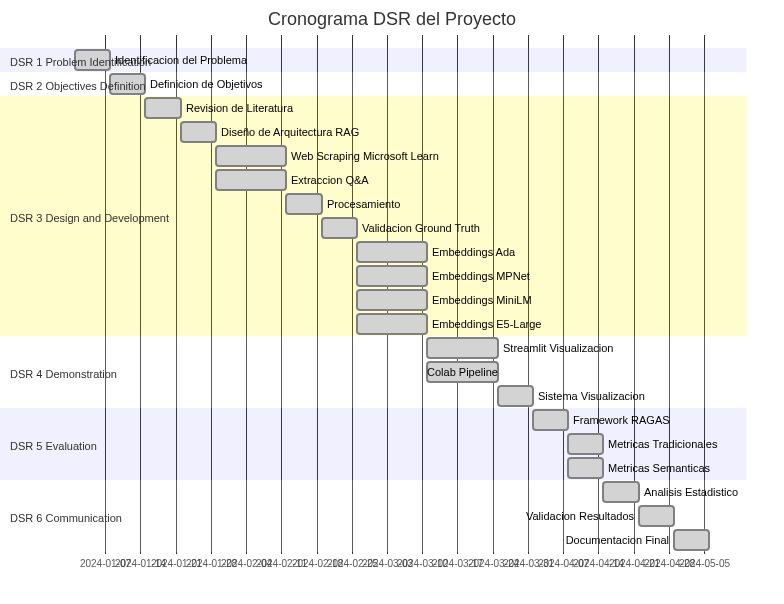

# Instrucciones para Generar Imagen del Diagrama Mermaid

## Diagrama del Capítulo 5 - Cronograma DSR

### Paso 1: Copiar el código Mermaid

El código mermaid del capítulo 5 está en las líneas 15-52 del archivo `capitulo_5_metodologia.md`.

### Paso 2: Usar Mermaid Live Editor

1. Ir a: https://mermaid.live/
2. Pegar el código mermaid
3. Exportar como PNG con alta resolución (recomendado: ancho 1200-1400px)
4. Guardar como: `img/Capitulo5FlujoMetodologico.png`

### Paso 3: Actualizar el markdown

Reemplazar el bloque de código mermaid con:

```markdown


**Figura 5.1:** Cronograma y flujo metodológico del proyecto siguiendo el proceso DSR
```

## Alternativa: Usar mermaid-cli

Si tienes Node.js instalado:

```bash
npm install -g @mermaid-js/mermaid-cli

# Extraer el código a un archivo
cd /Users/haroldgomez/Documents/ProyectoTituloMAgister/SupportModel/Docs/Octubre2025
sed -n '/```mermaid/,/```$/p' capitulo_5_metodologia.md | sed '1d;$d' > mermaid_temp.mmd

# Generar la imagen
mmdc -i mermaid_temp.mmd -o img/Capitulo5FlujoMetodologico.png -w 1400 -b transparent

# Limpiar
rm mermaid_temp.mmd
```
