# 📓 Notebook de Evaluación Multi-Modelo - Diagrama de Flujo

## 🎯 **Propósito**
Evaluación completa de múltiples modelos de embeddings usando datos reales de ChromaDB exportados, con métricas de retrieval, LLM reranking y RAG.

---

## 🔄 **Flujo Principal del Notebook**

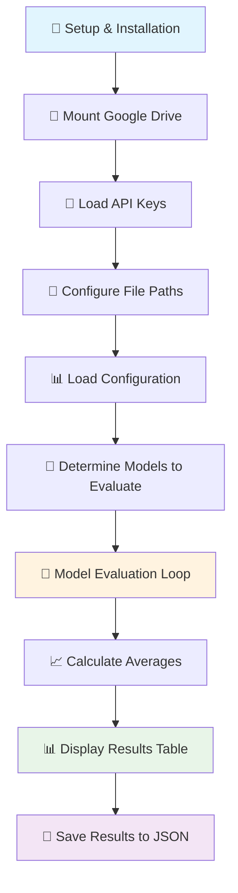

---

## 📦 **Celda 1-3: Configuración Inicial**

### 🔧 **Setup & Installation**
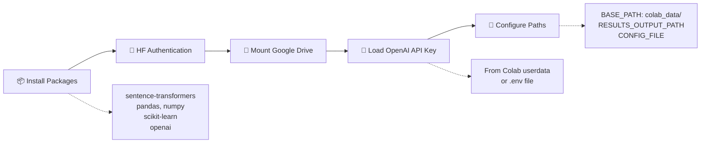

---

## 🏗️ **Celda 4-9: Clases y Funciones Core**

### 📊 **Core Classes Architecture**
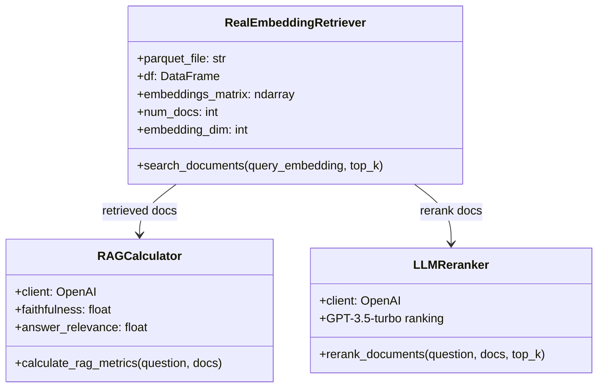

### 🔢 **Metrics Functions Flow**
```mermaid
graph LR
    A[Retrieved Documents] --> B[normalize_link()]
    B --> C[Ground Truth Links]
    C --> D{Calculate Metrics}
    D --> E[Precision@k]
    D --> F[Recall@k] 
    D --> G[F1@k]
    D --> H[NDCG@k]
    D --> I[MAP@k]
    D --> J[MRR]
    
    E --> K[Return Metrics Dict]
    F --> K
    G --> K
    H --> K
    I --> K
    J --> K
```

---

## 🎯 **Celda 10-13: Configuración y Mappings**

### 📋 **Configuration Loading**
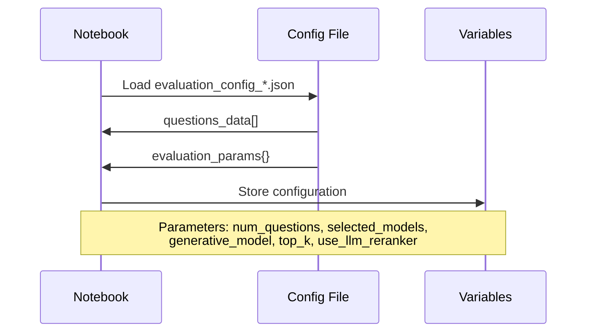

### 🗺️ **Model Mappings**
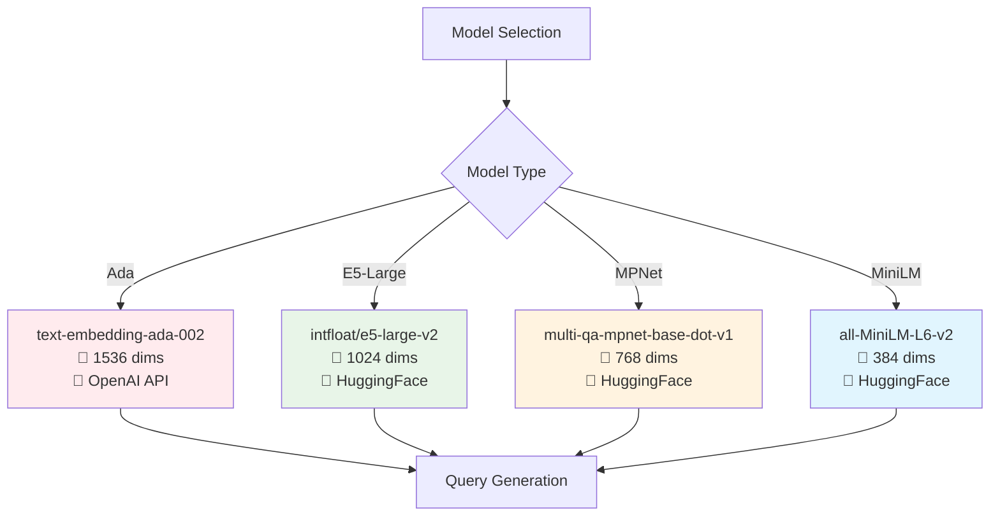

---

## 🔄 **Celda 14: Evaluation Loop (CORAZÓN DEL NOTEBOOK)**

### 🎯 **Main Evaluation Flow**
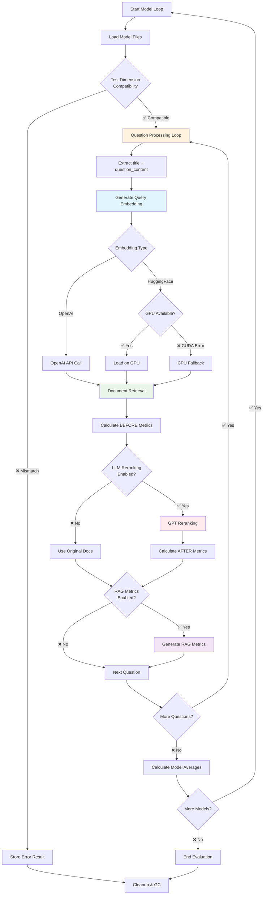

### 🔍 **Query Construction Detail**
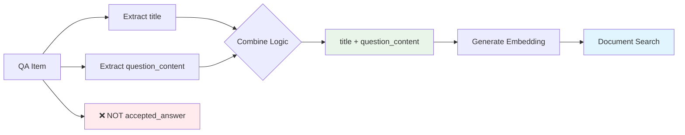

### 🧠 **Memory Management Flow**
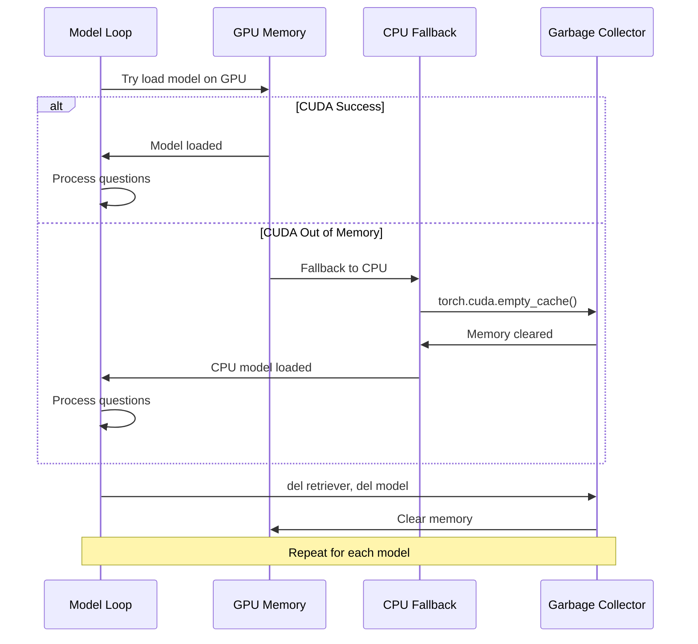

---

## 📊 **Celda 15-16: Results Processing**

### 📈 **Results Summary Generation**
```mermaid
flowchart LR
    A[all_model_results] --> B[Filter Successful Models]
    B --> C[Create Summary Table]
    C --> D[Calculate Performance Insights]
    D --> E[Find Top Performer]
    E --> F[Display Results]
    
    A --> G[Filter Error Models]
    G --> H[Display Error Details]
    
    B --> I[Extract Metrics]
    I --> J[P@5, R@5, F1@5, MRR]
    I --> K[RAG Metrics]
    I --> L[Improvement Deltas]
    
    J --> C
    K --> C
    L --> C
    
    style C fill:#e8f5e8
    style F fill:#e1f5fe
    style H fill:#ffebee
```

### 🔍 **Debug Information Flow**
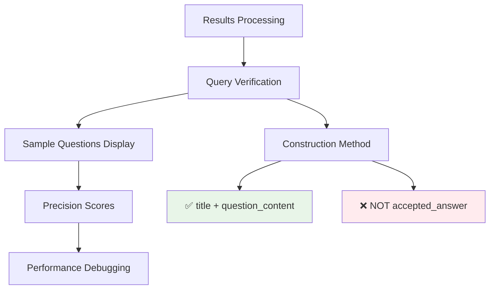

---

## 💾 **Celda 17-18: Results Storage**

### 🗃️ **JSON Structure Generation**
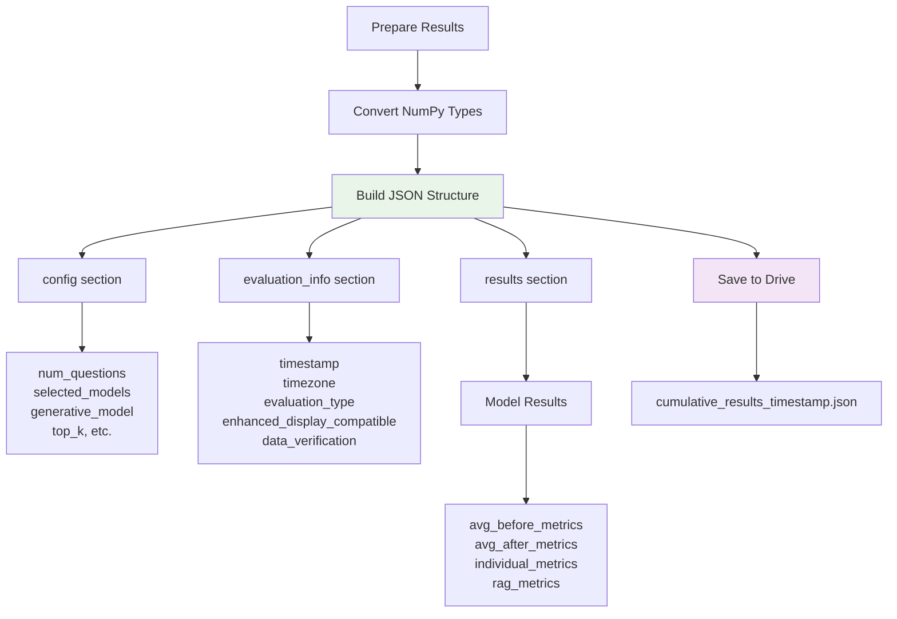

### 📁 **File Output Structure**
```
📁 /content/drive/MyDrive/TesisMagister/acumulative/
├── 📄 cumulative_results_{timestamp}.json
├── 📊 Results compatible with Streamlit display
├── 🔍 All model metrics (before/after LLM reranking)
├── 🤖 RAG metrics for each model
└── ✅ Data verification flags
```

---

## 🎛️ **Control Flow & Error Handling**

### ⚠️ **Error Handling Strategy**
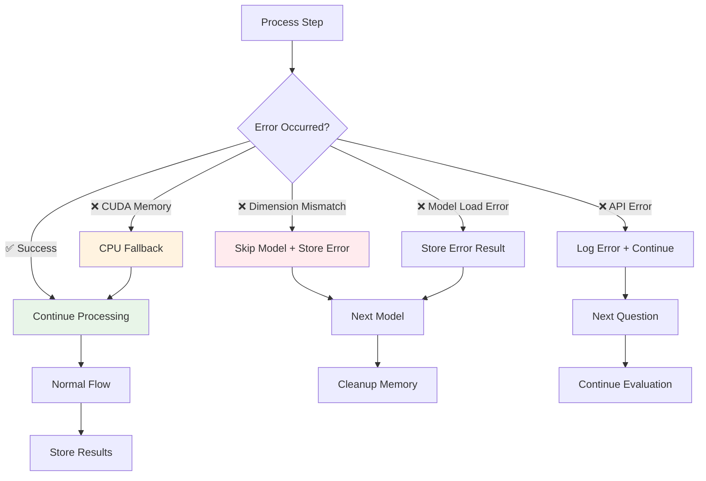

### 🔄 **Memory Management Pattern**
```mermaid
sequenceDiagram
    participant Loop as Model Loop
    participant Mem as Memory Manager
    participant GPU as GPU
    participant CPU as CPU
    
    Loop->>Mem: Start model evaluation
    Mem->>GPU: Try GPU allocation
    
    alt Success
        GPU->>Loop: Model ready
        Loop->>Loop: Process all questions
    else CUDA OOM
        GPU->>CPU: Switch to CPU
        CPU->>Mem: Clear GPU cache
        Mem->>Loop: CPU model ready
        Loop->>Loop: Process questions (slower)
    end
    
    Loop->>Mem: Model complete
    Mem->>GPU: Delete model
    Mem->>GPU: garbage collect
    Mem->>Loop: Ready for next model
```

---

## 📋 **Key Metrics Calculated**

### 🎯 **Retrieval Metrics (Before/After LLM)**
```
📊 Precision@k (k=1,3,5,10): Relevant docs in top-k / k
📊 Recall@k (k=1,3,5,10): Relevant docs in top-k / total relevant  
📊 F1@k (k=1,3,5,10): Harmonic mean of Precision & Recall
📊 NDCG@k (k=1,3,5,10): Normalized Discounted Cumulative Gain
📊 MAP@k (k=1,3,5,10): Mean Average Precision
📊 MRR: Mean Reciprocal Rank (1/rank of first relevant doc)
```

### 🤖 **RAG Metrics (OpenAI-based)**
```
🤖 Faithfulness: Answer fidelity to source documents
🤖 Answer Relevance: How well answer addresses the question  
🤖 Answer Correctness: Factual accuracy of the answer
🤖 Answer Similarity: Semantic similarity to expected answer
```

---

## ✅ **Success Criteria & Verification**

### 🎯 **Evaluation Success Indicators**
- ✅ All 4 models evaluated without dimension errors
- ✅ 100 questions processed per model (E5-Large may use CPU)
- ✅ RAG metrics generated and stored correctly
- ✅ Results compatible with Streamlit visualization
- ✅ Only title+question_content used (not accepted_answer)
- ✅ JSON serialization successful with numpy type conversion

### 📊 **Expected Output Files**
```
📁 Google Drive: /TesisMagister/acumulative/
└── cumulative_results_{unix_timestamp}.json
    ├── config: {num_questions, models, parameters}
    ├── evaluation_info: {timestamp, verification flags}  
    └── results: {
        ada: {avg_metrics, individual_metrics, rag_metrics},
        e5-large: {...},
        mpnet: {...}, 
        minilm: {...}
    }
```

---

## 🚀 **Performance Optimizations**

### ⚡ **Speed Optimizations**
1. **GPU First, CPU Fallback** - Maximum speed when possible
2. **Memory Cleanup** - Aggressive garbage collection between models  
3. **Batch Processing** - Process questions in sequence efficiently
4. **Model Caching** - Avoid reloading same models

### 💾 **Memory Optimizations** 
1. **Explicit Deletion** - `del retriever, del model`
2. **CUDA Cache Clear** - `torch.cuda.empty_cache()`
3. **Garbage Collection** - `gc.collect()` after each model
4. **CPU Fallback** - Automatic when GPU memory insufficient

---

## 🎉 **Final Output**
Un archivo JSON completo con métricas de evaluación multi-modelo, compatible con el sistema de visualización Streamlit existente, con verificación de datos reales y métricas RAG funcionales.