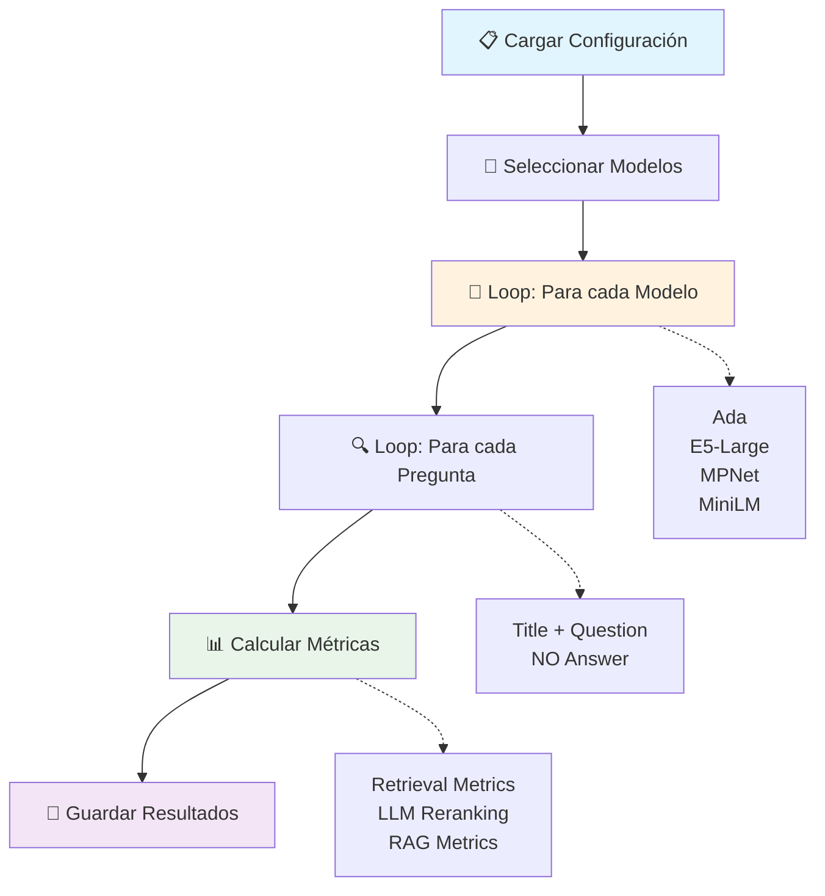
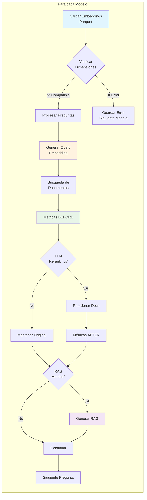
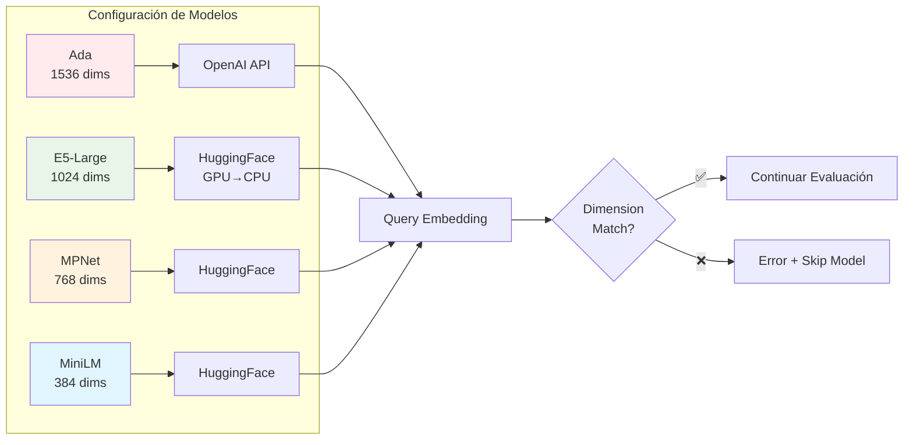
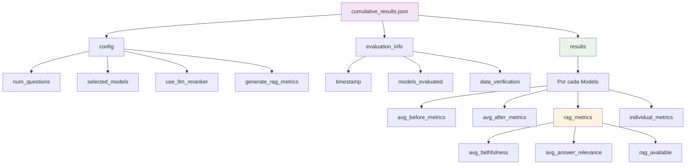
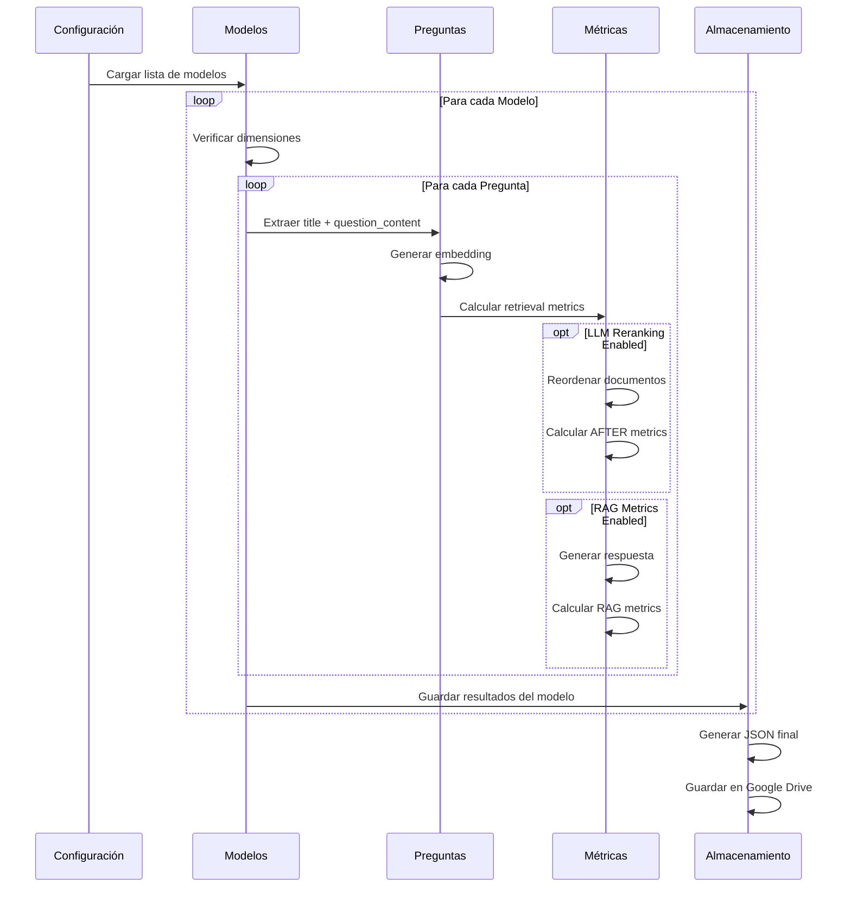
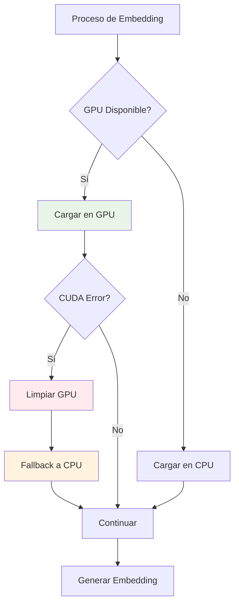
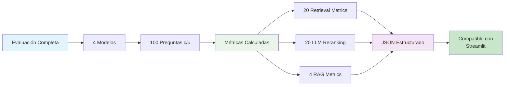

# 📓 Flujo de Alto Nivel - Notebook de Evaluación Multi-Modelo

## 🎯 Flujo Principal



## 🔄 Proceso de Evaluación por Modelo



## 📊 Estructura de Métricas

```mermaid
graph TD
    A[Métricas por Modelo] --> B[Retrieval Metrics]
    A --> C[LLM Reranking]
    A --> D[RAG Metrics]
    
    B --> B1[Precision@k]
    B --> B2[Recall@k]
    B --> B3[F1@k]
    B --> B4[NDCG@k]
    B --> B5[MAP@k]
    B --> B6[MRR]
    
    C --> C1[Métricas BEFORE]
    C --> C2[Métricas AFTER]
    C --> C3[Mejora %]
    
    D --> D1[avg_faithfulness]
    D --> D2[avg_answer_relevance]
    D --> D3[avg_answer_correctness]
    D --> D4[avg_answer_similarity]
    
    style B fill:#e8f5e8
    style C fill:#fff3e0
    style D fill:#f3e5f5
```

## 🔧 Manejo de Modelos y Dimensiones



## 💾 Estructura de Resultados JSON



## 🚀 Flujo de Ejecución Temporal



## ⚡ Optimizaciones y Fallbacks



## 📊 Resumen de Salida

