# 🔬 Diagrama de Flujo: Página de Comparación de Modelos Azure Q&A System

## Flujo Completo del Sistema de Comparación de Modelos

```mermaid
flowchart TD
    A[🚀 Inicio: Usuario en Página de Comparación] --> B[📋 Cargar preguntas de ejemplo]
    
    B --> B1{📚 Preguntas ya cargadas en session_state?}
    B1 -->|Sí| B2[✅ Usar preguntas existentes]
    B1 -->|No| B3[🌐 WEAVIATE: get_sample_questions]
    
    B3 --> B4[🔗 Filtrar preguntas con enlaces MS Learn]
    B4 --> B5[💾 Guardar en session_state]
    B5 --> B2
    
    B2 --> C[📝 Usuario selecciona pregunta del dropdown]
    C --> D[⚙️ Configurar parámetros]
    
    D --> D1[🔧 Ajustar top_k slider 5-20]
    D1 --> D2[🔄 Toggle reranking con LLM]
    D2 --> D3{🧪 Habilitar métricas avanzadas?}
    
    D3 -->|Sí| D4[✅ Activar advanced metrics]
    D3 -->|No| D5[📊 Solo métricas básicas]
    
    D4 --> D6{🤖 Generar respuestas para evaluación?}
    D6 -->|Sí| D7[✅ Habilitar generación RAG]
    D6 -->|No| D8[📄 Solo documentos]
    
    D5 --> D8
    D7 --> E[🔍 Click Comparar Modelos]
    D8 --> E
    
    E --> F[🔧 Inicializar comparison_results]
    F --> G[📊 Configurar progress tracking]
    G --> H[🔄 BUCLE: Para cada modelo embedding]
    
    %% Bucle principal para cada modelo
    H --> H1[📌 Modelo actual: multi-qa-mpnet-base-dot-v1]
    H1 --> H2[⏱️ Iniciar timer modelo]
    H2 --> H3[🔧 initialize_clients para modelo actual]
    
    H3 --> H3a[🌐 Conectar Weaviate para modelo]
    H3a --> H3b[🤖 Inicializar embedding_client específico]
    H3b --> H3c[🔑 Inicializar OpenAI client]
    H3c --> H3d[💎 Inicializar Gemini client]
    H3d --> H3e[🦙 Inicializar Local Llama client]
    H3e --> H3f[🤖 Inicializar Local Mistral client]
    
    H3f --> H4{🧪 Métricas avanzadas habilitadas?}
    
    %% Pipeline con métricas avanzadas
    H4 -->|Sí| H5[📞 evaluate_rag_with_advanced_metrics]
    H4 -->|No| H6[📞 answer_question_documents_only]
    
    H5 --> H5a[🔍 refine_and_prepare_query]
    H5a --> H5b[🧮 Generar embedding de query]
    H5b --> H5c[🌐 WEAVIATE: Búsqueda vectorial]
    H5c --> H5d[🔄 Aplicar reranking]
    H5d --> H5e[🤖 Generar respuesta con modelo seleccionado]
    H5e --> H5f[🧪 Calcular métricas avanzadas RAG]
    
    H5f --> H5f1[🚫 calculate_hallucination_score]
    H5f1 --> H5f2[🎯 calculate_context_utilization]
    H5f2 --> H5f3[✅ calculate_completeness_score]
    H5f3 --> H5f4[😊 calculate_satisfaction_score]
    
    H5f4 --> H7[📞 answer_question_documents_only para UI]
    H7 --> H8[📄 Extraer documentos para display]
    
    %% Pipeline estándar
    H6 --> H6a[🔍 refine_and_prepare_query]
    H6a --> H6b[🧮 Generar embedding de query]
    H6b --> H6c[🌐 WEAVIATE: Búsqueda vectorial]
    H6c --> H6d[🔄 Aplicar reranking]
    H6d --> H8
    
    H8 --> H9[🤖 generate_summary con Mistral local]
    H9 --> H10[📊 calculate_content_metrics]
    H10 --> H11[⏱️ Calcular elapsed_time]
    H11 --> H12[💾 Guardar resultados en session_state]
    
    H12 --> H13{🔄 Más modelos por procesar?}
    H13 -->|Sí| H14[📌 Siguiente modelo: all-MiniLM-L6-v2]
    H13 -->|No| I[✅ Todos los modelos procesados]
    
    H14 --> H15[📊 Actualizar progress bar]
    H15 --> H2
    
    %% Procesamiento de resultados
    I --> I1[📊 Calcular performance data]
    I1 --> I2[🔢 Calcular latencia por modelo]
    I2 --> I3[⚡ Calcular throughput estimado]
    I3 --> I4[📈 Calcular score promedio y desviación]
    I4 --> I5[📊 Calcular métricas de consistencia]
    I5 --> I6[📄 generate_pdf_report]
    
    I6 --> J[🎨 Renderizar UI de resultados]
    J --> J1[📋 Mostrar botón descarga PDF]
    J1 --> J2[📊 Crear columnas para cada modelo]
    
    J2 --> J3[🔄 BUCLE: Para cada modelo]
    J3 --> J4[📌 Renderizar información modelo]
    J4 --> J5[📊 Mostrar métricas básicas]
    J5 --> J6[📋 Mostrar resumen IA]
    J6 --> J7[🔄 BUCLE: Para cada documento]
    
    J7 --> J8[🎨 Aplicar color coding por score]
    J8 --> J9[✅ Marcar ground truth links]
    J9 --> J10[🔄 Marcar documentos duplicados]
    J10 --> J11[🎨 Renderizar card HTML]
    J11 --> J12{🔄 Más documentos?}
    
    J12 -->|Sí| J7
    J12 -->|No| J13{🔄 Más modelos?}
    J13 -->|Sí| J3
    J13 -->|No| K[📊 Mostrar métricas de rendimiento]
    
    %% Sección de métricas y visualizaciones
    K --> K1[📈 Crear gráfico de latencia]
    K1 --> K2[⚡ Crear gráfico de throughput]
    K2 --> K3[📊 Crear distribución de scores]
    K3 --> K4[📊 Crear métricas de consistencia]
    K4 --> K5[📈 Crear gráfico calidad vs variabilidad]
    
    K5 --> L[📊 Mostrar métricas de calidad de contenido]
    L --> L1[🎨 Aplicar color coding BERTScore/ROUGE]
    L1 --> L2[📋 Renderizar tabla styled con colores]
    
    L2 --> M[📊 Mostrar tabla métricas de rendimiento]
    M --> M1[🎨 Aplicar color coding performance]
    M1 --> M2[📋 Renderizar tabla styled con umbrales]
    
    M2 --> N{🧪 Hay métricas avanzadas RAG?}
    N -->|Sí| O[📊 Mostrar tabla métricas avanzadas RAG]
    N -->|No| P[📋 Mostrar guía de métricas]
    
    O --> O1[🎨 Aplicar color coding advanced metrics]
    O1 --> O2[🚫 Color alucinación verde=bajo]
    O2 --> O3[🎯 Color utilización verde=alto]
    O3 --> O4[✅ Color completitud verde=alto]
    O4 --> O5[😊 Color satisfacción verde=alto]
    O5 --> O6[📋 Renderizar tabla advanced styled]
    
    O6 --> P
    P --> P1[📋 Crear tabla consolidada de métricas]
    P1 --> P2[💡 Crear expandibles con tooltips]
    P2 --> P3[📖 Mostrar fórmulas y referencias APA]
    P3 --> P4[🎯 Mostrar umbrales por métrica]
    P4 --> Q[✅ Fin del proceso de comparación]
    
    %% Servicios Externos destacados
    B3:::external
    H3a:::external
    H5c:::external
    H6c:::external
    
    %% Decisiones destacadas  
    B1:::decision
    D3:::decision
    D6:::decision
    H4:::decision
    H13:::decision
    J12:::decision
    J13:::decision
    N:::decision
    
    %% Procesos locales destacados
    H3b:::local
    H3e:::local
    H3f:::local
    H5a:::local
    H5b:::local
    H5f1:::local
    H5f2:::local
    H5f3:::local
    H5f4:::local
    H6a:::local
    H6b:::local
    H9:::local
    H10:::local
    
    %% Estilos CSS
    classDef external fill:#ffcccc,stroke:#ff6666,stroke-width:3px,color:#000
    classDef decision fill:#fff2cc,stroke:#d6b656,stroke-width:2px,color:#000
    classDef local fill:#d4edda,stroke:#28a745,stroke-width:2px,color:#000
```



## 🔧 Leyenda de Componentes

### 🌐 Servicios Externos (Rojo)
- **Weaviate Cloud**: Base de datos vectorial externa
  - `get_sample_questions`: Obtener preguntas de ejemplo para testing
  - `Búsqueda vectorial`: Buscar documentos en cada modelo específico
  - Cada modelo tiene su propia clase: `DocumentsMpnet`, `DocumentsMiniLM`, `Documentation`

### 💚 Procesos Locales (Verde)
- **Embedding local**: sentence-transformers para cada modelo
- **CrossEncoder local**: ms-marco-MiniLM-L-6-v2 para reranking
- **Llama 3.1 8B**: Generación local de respuestas
- **Mistral 7B**: Generación local de resúmenes
- **Métricas avanzadas RAG**: Cálculos locales de alucinación, utilización, etc.
- **Content metrics**: BERTScore y ROUGE calculados localmente

### 🟡 Puntos de Decisión (Amarillo)
- **Métricas avanzadas**: Determina pipeline completo vs estándar
- **Generar respuestas**: Activa generación RAG para evaluación
- **Más modelos**: Control del bucle principal de comparación
- **Hay métricas avanzadas**: Determina si mostrar tabla avanzada

## 📊 Métricas y Tiempos por Modelo

### ⚡ Tiempos Estimados por Modelo
- **Carga inicial de preguntas**: 2-5s (una vez)
- **Por modelo embedding (estándar)**: 1-3s
- **Por modelo embedding (con RAG)**: 5-15s
- **Por modelo embedding (con advanced metrics)**: 10-25s
- **Generación de visualizaciones**: 1-2s

### 📈 Optimizaciones de Costo
- **Modelos locales por defecto**: Llama + Mistral para generación
- **Reranking local**: CrossEncoder instead of GPT-4
- **Embeddings locales**: sentence-transformers
- **Métricas locales**: BERTScore y ROUGE calculados localmente

## 🔄 Flujos Alternativos

### 🚀 Modo Básico (Sin Métricas Avanzadas)
```
Usuario → Selección → Configuración → Bucle modelos → Weaviate → Documentos → Métricas básicas → UI
```

### 🧠 Modo Completo (Con Métricas Avanzadas)
```
Usuario → Selección → Configuración → Bucle modelos → RAG pipeline → Advanced metrics → Documentos → UI completa
```

### 💰 Modo Costo Cero
```
Todo local: Mistral summaries + Local embeddings + CrossEncoder + Llama generation + Local metrics
```

## 🎨 Renderizado y Visualizaciones

### 📊 Gráficos Interactivos (Plotly)
- **Latencia por modelo**: Barra horizontal con tiempo total
- **Throughput estimado**: Consultas por segundo con factor overhead
- **Distribución de scores**: Box plot mostrando calidad y consistencia
- **Consistencia**: Métrica de uniformidad en resultados
- **Calidad vs Variabilidad**: Scatter plot con tamaño por docs recuperados

### 🎨 Color Coding System
- **Performance metrics**: Verde (excelente) → Amarillo (bueno) → Rojo (necesita mejora)
- **Advanced RAG metrics**: Sistema específico por métrica
  - 🚫 Alucinación: Verde (bajo) → Rojo (alto)
  - 🎯 Utilización: Verde (alto) → Rojo (bajo)
  - ✅ Completitud: Verde (alto) → Rojo (bajo)
  - 😊 Satisfacción: Verde (alto) → Rojo (bajo)

### 📋 Tablas Interactivas
- **Styled DataFrames**: Color coding automático basado en umbrales
- **Tooltips expandibles**: Detalles de fórmulas y referencias APA
- **Responsive design**: Adaptable a diferentes tamaños de pantalla

## 🧪 Métricas Avanzadas Pipeline

### 🔄 Flujo de Evaluación Avanzada
1. **evaluate_rag_with_advanced_metrics** ejecuta pipeline completo
2. **Métricas calculadas en paralelo**:
   - 🚫 Detección de alucinaciones (entity extraction + fact checking)
   - 🎯 Utilización de contexto (document coverage + phrase utilization)
   - ✅ Completitud de respuesta (component analysis por tipo de pregunta)
   - 😊 Satisfacción del usuario (clarity + directness + actionability)
3. **Integración con métricas tradicionales**: BERTScore, ROUGE, performance

### 📊 Comparación Multi-Modelo
- **Evaluación paralela**: Todos los modelos embedding testados simultáneamente
- **Métricas comparativas**: Ranking automático por performance
- **Ground truth validation**: Comparación con enlaces Microsoft Learn reales
- **Duplicate detection**: Identificación de documentos comunes entre modelos