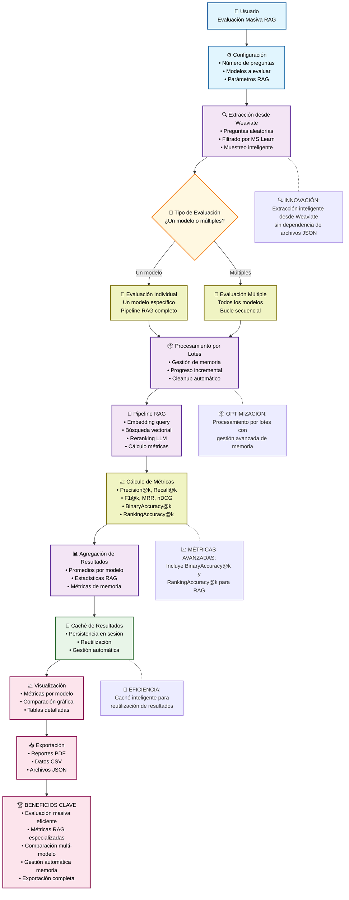

# 📊 Diagrama de Alto Nivel: Página de Métricas Acumulativas
## Flujo General del Sistema de Evaluación Masiva

## Elementos Clave del Diagrama

### 🔵 **Entrada del Usuario**
- **Configuración flexible**: Número de preguntas, modelos, parámetros
- **Interfaz intuitiva**: Controles simples para evaluación compleja

### 🟣 **Procesamiento Inteligente**
- **Extracción desde Weaviate**: Preguntas aleatorias con filtros
- **Procesamiento por lotes**: Gestión automática de memoria
- **Pipeline RAG completo**: Embedding, búsqueda, reranking, métricas

### 🟡 **Decisiones Clave**
- **Evaluación individual vs múltiple**: Adaptación automática del flujo
- **Gestión de recursos**: Balanceo entre velocidad y memoria

### 🟢 **Almacenamiento**
- **Caché de sesión**: Persistencia inteligente de resultados
- **Gestión automática**: Cleanup y optimización de memoria

### 🔴 **Salidas del Sistema**
- **Visualización rica**: Métricas, gráficos, tablas
- **Exportación completa**: PDF, CSV, JSON
- **Comparación multi-modelo**: Análisis detallado

### 🏆 **Beneficios Destacados**
- Evaluación masiva eficiente
- Métricas RAG especializadas
- Comparación multi-modelo
- Gestión automática de memoria
- Exportación completa

## Características Técnicas

### 🔧 **Optimizaciones Implementadas**
- **Muestreo inteligente**: Selección eficiente de preguntas
- **Procesamiento por lotes**: Gestión de memoria con límites
- **Caché de resultados**: Reutilización para análisis iterativo
- **Cleanup automático**: Liberación de recursos entre lotes

### 📊 **Métricas Avanzadas**
- **Tradicionales**: Precision@k, Recall@k, F1@k, MRR, nDCG
- **RAG Especializadas**: BinaryAccuracy@k, RankingAccuracy@k
- **Estadísticas**: Conteo de enlaces, documentos, memoria

### 🚀 **Escalabilidad**
- **Evaluación masiva**: Hasta 2000 preguntas
- **Multi-modelo**: Todos los modelos de embedding
- **Gestión recursos**: Procesamiento eficiente y controlado

---

*Este diagrama representa la arquitectura de alto nivel de la página de métricas acumulativas, enfocándose en el flujo general y los beneficios del sistema.*