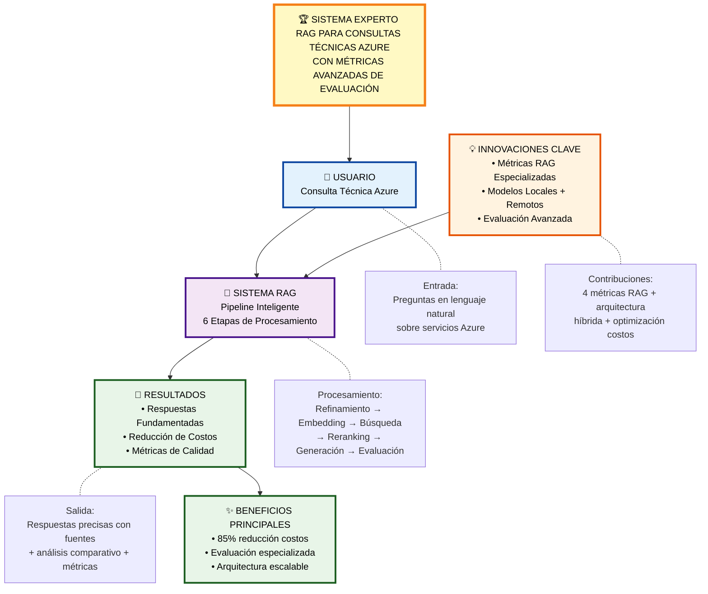

# DIAGRAMA ULTRA-ALTO NIVEL - SISTEMA RAG AZURE
## Overview Conceptual para Defensa de Título

## Conceptos Clave del Sistema

### 🔵 **INPUT (Entrada)**
- Usuario con consulta técnica sobre Azure
- Lenguaje natural, sin restricciones

### 🟣 **PROCESSING (Procesamiento)**
- Sistema RAG con pipeline de 6 etapas
- Procesamiento inteligente y automatizado

### 🟠 **INNOVATION (Innovación)**
- Métricas RAG especializadas (contribución principal)
- Arquitectura híbrida local/remota
- Evaluación avanzada multi-dimensional

### 🟢 **OUTPUT (Salida)**
- Respuestas fundamentadas en documentación
- Análisis comparativo de modelos
- Métricas de calidad especializadas

---

*Este diagrama ultra-simplificado es ideal para introducir el concepto general del sistema antes de profundizar en detalles técnicos.*