# DIAGRAMA DE NIVEL INTERMEDIO - COMPARACIÓN DE MODELOS
## Arquitectura Detallada para Defensa de Título

```mermaid
flowchart TD
    %% Definición de estilos
    classDef userInput fill:#e1f5fe,stroke:#01579b,stroke-width:2px,color:#000
    classDef processing fill:#f3e5f5,stroke:#4a148c,stroke-width:2px,color:#000
    classDef storage fill:#e8f5e8,stroke:#1b5e20,stroke-width:2px,color:#000
    classDef models fill:#fff3e0,stroke:#e65100,stroke-width:2px,color:#000
    classDef output fill:#fce4ec,stroke:#880e4f,stroke-width:2px,color:#000
    classDef metrics fill:#f1f8e9,stroke:#33691e,stroke-width:2px,color:#000
    
    %% ENTRADA DEL USUARIO
    USER[👤 Usuario<br/>Dataset de Preguntas<br/>Configuración Comparación]:::userInput
    
    %% INTERFAZ WEB
    WEB[🌐 Interfaz Comparación<br/>Streamlit Page<br/>Upload Dataset<br/>Configuración Parámetros]:::userInput
    
    %% PREPARACIÓN DE DATOS
    DATA_PREP[📋 Preparación Datos<br/>Validación Dataset<br/>Normalización Preguntas<br/>Configuración Experimento]:::processing
    
    %% MODELOS PARALELOS
    MODEL_A[🔤 Modelo A<br/>multi-qa-mpnet-base-dot-v1<br/>768 dimensiones<br/>Especializado Q&A]:::models
    
    MODEL_B[🔤 Modelo B<br/>all-MiniLM-L6-v2<br/>384 dimensiones<br/>Balance eficiencia/calidad]:::models
    
    MODEL_C[🔤 Modelo C<br/>text-embedding-ada-002<br/>1536 dimensiones<br/>Referencia comercial]:::models
    
    %% PIPELINE RAG PARALELO
    RAG_A[🤖 Pipeline RAG A<br/>Refinamiento<br/>Embedding mpnet<br/>Búsqueda + Reranking<br/>Generación + Evaluación]:::processing
    
    RAG_B[🤖 Pipeline RAG B<br/>Refinamiento<br/>Embedding MiniLM<br/>Búsqueda + Reranking<br/>Generación + Evaluación]:::processing
    
    RAG_C[🤖 Pipeline RAG C<br/>Refinamiento<br/>Embedding ada-002<br/>Búsqueda + Reranking<br/>Generación + Evaluación]:::processing
    
    %% BASE DE DATOS MÚLTIPLE
    VECTOR_DB[🗄️ Base de Datos Vectorial<br/>Weaviate Cloud<br/>3 Colecciones Paralelas<br/>Mismo contenido, diferentes embeddings]:::storage
    
    %% EVALUACIÓN COMPARATIVA
    METRICS_ENGINE[📊 Motor de Métricas<br/>Métricas Tradicionales:<br/>• BERTScore, ROUGE, MRR<br/>Métricas RAG Especializadas:<br/>• Detección Alucinaciones<br/>• Utilización Contexto<br/>• Completitud Respuesta<br/>• Satisfacción Usuario]:::metrics
    
    %% ANÁLISIS ESTADÍSTICO
    STATS_ANALYSIS[📈 Análisis Estadístico<br/>Comparación Pairwise<br/>Significancia Estadística<br/>Ranking por Métrica<br/>Análisis de Correlación]:::processing
    
    %% VISUALIZACIÓN
    VISUALIZATION[📊 Visualización<br/>Gráficos Comparativos<br/>Heatmaps de Métricas<br/>Distribuciones<br/>Dashboards Interactivos]:::output
    
    %% GENERACIÓN DE REPORTE
    REPORT_GEN[📄 Generación Reporte<br/>Reporte PDF Automático<br/>Conclusiones y Recomendaciones<br/>Gráficos Integrados<br/>Análisis Detallado]:::output
    
    %% SALIDA FINAL
    FINAL_OUTPUT[🎯 Salida Final<br/>Ranking de Modelos<br/>Reporte Comparativo<br/>Recomendaciones<br/>Métricas Detalladas]:::output
    
    %% CONEXIONES PRINCIPALES
    USER --> WEB
    WEB --> DATA_PREP
    
    %% PREPARACIÓN DE MODELOS
    DATA_PREP --> MODEL_A
    DATA_PREP --> MODEL_B
    DATA_PREP --> MODEL_C
    
    %% PIPELINE PARALELO
    MODEL_A --> RAG_A
    MODEL_B --> RAG_B
    MODEL_C --> RAG_C
    
    %% BASE DE DATOS
    MODEL_A --> VECTOR_DB
    MODEL_B --> VECTOR_DB
    MODEL_C --> VECTOR_DB
    
    VECTOR_DB --> RAG_A
    VECTOR_DB --> RAG_B
    VECTOR_DB --> RAG_C
    
    %% EVALUACIÓN
    RAG_A --> METRICS_ENGINE
    RAG_B --> METRICS_ENGINE
    RAG_C --> METRICS_ENGINE
    
    %% ANÁLISIS
    METRICS_ENGINE --> STATS_ANALYSIS
    STATS_ANALYSIS --> VISUALIZATION
    STATS_ANALYSIS --> REPORT_GEN
    
    %% SALIDA
    VISUALIZATION --> FINAL_OUTPUT
    REPORT_GEN --> FINAL_OUTPUT
    
    %% COMENTARIOS EXPLICATIVOS
    MODEL_A -.- COMMENT1["🎯 EVALUACIÓN CONTROLADA:<br/>Mismo dataset, mismo pipeline<br/>diferentes modelos embedding<br/>para comparación objetiva"]
    
    METRICS_ENGINE -.- COMMENT2["📊 MÉTRICAS ESPECIALIZADAS:<br/>4 métricas RAG desarrolladas<br/>específicamente para evaluar<br/>calidad en contextos técnicos"]
    
    STATS_ANALYSIS -.- COMMENT3["📈 ANÁLISIS RIGUROSO:<br/>Significancia estadística<br/>correlaciones y ranking<br/>objetivo basado en evidencia"]
    
    %% BENEFICIOS
    BENEFITS[🏆 BENEFICIOS CLAVE<br/>• Selección objetiva de modelos<br/>• Evaluación especializada RAG<br/>• Reportes automatizados<br/>• Análisis estadístico robusto<br/>• Reproducibilidad científica]:::output
    
    FINAL_OUTPUT --> BENEFITS
```

## Elementos Clave del Sistema de Comparación

### 🔵 **Preparación y Configuración**
- **Dataset controlado**: Mismo conjunto para todos los modelos
- **Configuración experimental**: Parámetros idénticos
- **Validación de datos**: Asegurar calidad del experimento

### 🟠 **Modelos Evaluados**
- **mpnet-base-dot-v1**: 768 dim, especializado en Q&A
- **all-MiniLM-L6-v2**: 384 dim, balance eficiencia/calidad
- **text-embedding-ada-002**: 1536 dim, referencia comercial

### 🟣 **Pipeline Paralelo**
- **Procesamiento simultáneo**: 3 pipelines RAG idénticos
- **Embeddings diferentes**: Única variable controlada
- **Evaluación consistente**: Mismo criterio para todos

### 🟢 **Base de Datos Vectorial**
- **3 colecciones paralelas**: Una por modelo
- **Mismo contenido**: Diferentes representaciones vectoriales
- **Weaviate Cloud**: Infraestructura escalable

### 📊 **Evaluación Especializada**
- **Métricas tradicionales**: BERTScore, ROUGE, MRR
- **Métricas RAG**: 4 métricas especializadas desarrolladas
- **Análisis estadístico**: Significancia y correlaciones

### 🎯 **Salidas Profesionales**
- **Ranking objetivo**: Basado en métricas combinadas
- **Reporte PDF**: Automatizado con conclusiones
- **Visualizaciones**: Dashboards interactivos
- **Recomendaciones**: Basadas en análisis estadístico

---

*Este diagrama muestra la arquitectura completa del sistema de comparación, destacando la evaluación paralela y el análisis estadístico riguroso.*