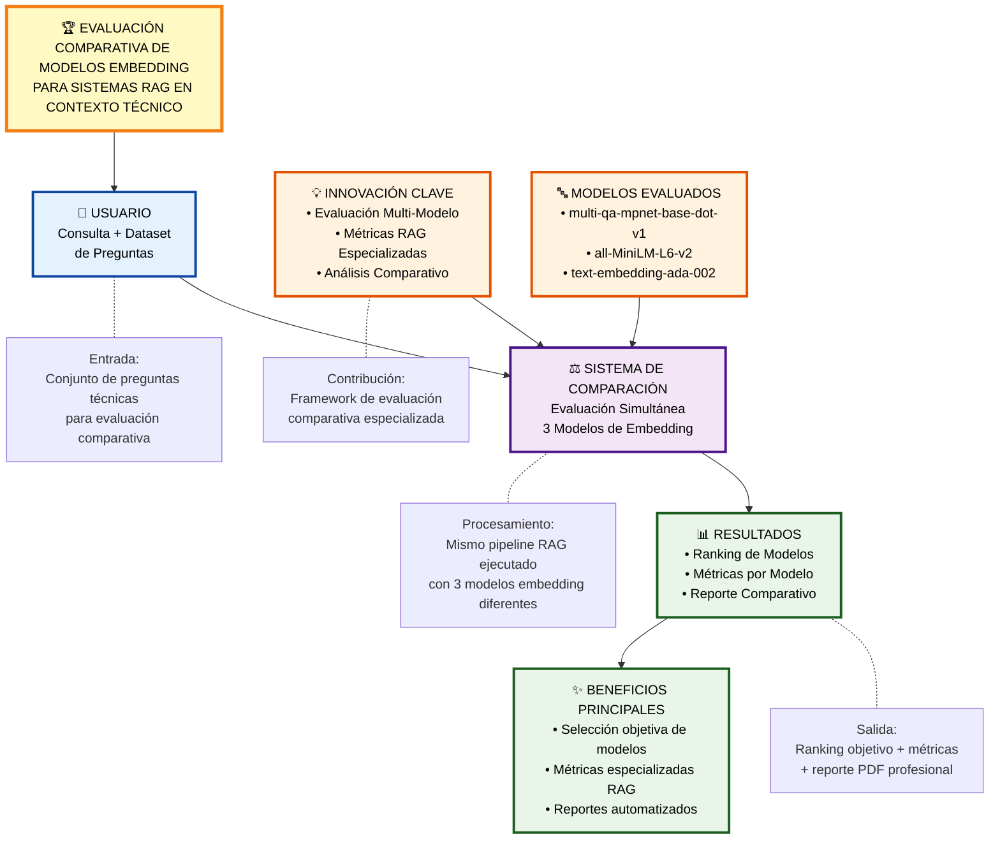

# DIAGRAMA ULTRA-ALTO NIVEL - COMPARACIÓN DE MODELOS
## Overview Conceptual para Defensa de Título

## Conceptos Clave del Sistema de Comparación

### 🔵 **INPUT (Entrada)**
- Dataset de consultas técnicas Azure
- Mismo conjunto para todos los modelos
- Evaluación objetiva y controlada

### 🟣 **PROCESSING (Procesamiento)**
- Sistema de comparación paralela
- 3 modelos de embedding evaluados simultáneamente
- Pipeline RAG idéntico para cada modelo

### 🟠 **INNOVATION (Innovación)**
- Framework de evaluación comparativa
- Métricas RAG especializadas para cada modelo
- Análisis estadístico automatizado

### 🟢 **OUTPUT (Salida)**
- Ranking objetivo de modelos
- Métricas detalladas por modelo
- Reporte PDF profesional con conclusiones

### 🔤 **MODELOS EVALUADOS**
- **mpnet**: Especializado en Q&A
- **MiniLM**: Balance eficiencia/calidad
- **ada-002**: Referencia comercial

---

*Este diagrama ultra-simplificado introduce el concepto de evaluación comparativa antes de mostrar detalles técnicos.*