# 🔍 Diagrama de Flujo: Búsqueda Individual Azure Q&A System

## Flujo Completo del Sistema de Búsqueda Individual

```mermaid
flowchart TD
    A[🚀 Inicio: Usuario en Búsqueda Individual] --> B[⚙️ Configuración de Parámetros]
    
    B --> B1{📝 Título ingresado?}
    B1 -->|Sí| B2[💾 Guardar título en session_state]
    B1 -->|No| B3[📋 Título vacío]
    B2 --> B4[❓ Área de pregunta]
    B3 --> B4
    
    B4 --> B5{❓ Pregunta ingresada?}
    B5 -->|No| B6[⚠️ Mostrar advertencia]
    B5 -->|Sí| C[🔍 Click Buscar Documentacion]
    B6 --> B4
    
    C --> D[⏱️ Iniciar timer de respuesta]
    D --> E[🔗 Combinar título + pregunta = full_query]
    E --> F[🔧 initialize_clients]
    
    F --> F1[🌐 Conectar a Weaviate]
    F1 --> F2[🤖 Inicializar embedding_client local]
    F2 --> F3[🔑 Inicializar OpenAI client]
    F3 --> F4[💎 Inicializar Gemini client]
    F4 --> F5[🦙 Inicializar Local Llama client]
    F5 --> F6[🤖 Inicializar Local Mistral client]
    F6 --> G{🤖 RAG habilitado?}
    
    %% Flujo RAG Completo
    G -->|Sí| H[📞 Llamar answer_question_with_rag]
    G -->|No| I[📞 Llamar answer_question_documents_only]
    
    %% Pipeline RAG Completo
    H --> H1[🔍 refine_and_prepare_query]
    H1 --> H1a{🤖 Local refinement disponible?}
    H1a -->|Sí| H1b[🦙 Usar Mistral local para refinar query]
    H1a -->|No| H1c{💎 Gemini disponible?}
    H1c -->|Sí| H1d[💎 Usar Gemini para refinar query]
    H1c -->|No| H1e[📝 Usar query original]
    H1b --> H2[🔧 Aplicar prefijo condicional]
    H1d --> H2
    H1e --> H2
    
    H2 --> H3[🧮 Generar embedding de query]
    H3 --> H4{📚 use_questions_collection?}
    H4 -->|Sí| H5[🌐 Búsqueda en QuestionsMiniLM]
    H4 -->|No| H6[📄 Saltar búsqueda de preguntas]
    
    H5 --> H5a[🔍 search_questions_by_vector]
    H5a --> H5b[🌐 WEAVIATE: Buscar preguntas similares]
    H5b --> H5c[📊 Obtener top 15 preguntas]
    H5c --> H5d[🔗 Extraer enlaces únicos]
    H5d --> H5e[🌐 WEAVIATE: Buscar docs por enlaces]
    H5e --> H6
    
    H6 --> H7[🌐 WEAVIATE: Búsqueda vectorial en DocumentsMpnet]
    H7 --> H7a[🔍 search_docs_by_vector]
    H7a --> H7b[📊 Obtener documentos candidatos]
    H7b --> H8[🔄 Aplicar filtro de diversidad]
    H8 --> H9{🧠 use_llm_reranker?}
    
    H9 -->|Sí| H10[🔧 rerank_with_llm]
    H9 -->|No| H11[📊 rerank_documents estándar]
    
    H10 --> H10a[🤖 Usar CrossEncoder local ms-marco-MiniLM]
    H10a --> H10b[📈 Calcular scores normalizados]
    H10b --> H12[📋 Documentos reordenados]
    
    H11 --> H11a[🧮 Generar embeddings de documentos]
    H11a --> H11b[📊 Calcular similitud coseno]
    H11b --> H12
    
    H12 --> H13{🤖 Generar respuesta?}
    H13 -->|Sí| H14{🦙 Modelo local seleccionado?}
    H13 -->|No| H20[📋 Solo devolver documentos]
    
    H14 -->|llama-3.1-8b| H15[🦙 generate_final_answer_local]
    H14 -->|mistral-7b| H16[🤖 generate_final_answer_local]
    H14 -->|gemini-pro| H17[💎 generate_final_answer_gemini]
    H14 -->|gpt-4| H18[🔑 generate_final_answer OpenAI]
    H14 -->|Ninguno| H19[❌ Error: No hay modelo]
    
    H15 --> H15a[🦙 Cargar modelo Llama local]
    H15a --> H15b[🤖 Generar respuesta con contexto]
    H15b --> H21[📝 Respuesta generada]
    
    H16 --> H16a[🤖 Cargar modelo Mistral local]
    H16a --> H16b[🤖 Generar respuesta con contexto]
    H16b --> H21
    
    H17 --> H17a[💎 API GEMINI: Generar respuesta]
    H17a --> H21
    
    H18 --> H18a[🔑 API OPENAI: Generar respuesta]
    H18a --> H21
    
    H19 --> H21
    H20 --> H25
    H21 --> H22{📊 evaluate_quality?}
    
    H22 -->|Sí| H23[🔑 API OPENAI: Evaluar calidad]
    H22 -->|No| H24[📊 Métricas básicas]
    H23 --> H25[📋 Compilar resultados RAG]
    H24 --> H25
    
    %% Pipeline Solo Documentos
    I --> I1[🔍 Ejecutar pasos H1-H12]
    I1 --> I2[📋 Devolver solo documentos]
    I2 --> J[📊 Calcular métricas de sesión]
    
    H25 --> J
    
    J --> J1[⏱️ Actualizar response_time]
    J1 --> J2[📈 Actualizar queries_made++]
    J2 --> J3[📚 Actualizar total_docs_retrieved]
    J3 --> J4[⚡ Actualizar avg_response_time]
    J4 --> K{📋 Resultados encontrados?}
    
    K -->|No| L[❌ Mostrar mensaje: No hay resultados]
    K -->|Sí| M[✅ Mostrar mensaje de éxito]
    
    M --> N{🤖 RAG habilitado Y respuesta generada?}
    N -->|Sí| O[🤖 Mostrar Respuesta RAG]
    N -->|No| P[📚 Mostrar solo documentos]
    
    O --> O1[🎯 Mostrar métricas RAG]
    O1 --> O1a[📊 Confianza]
    O1a --> O1b[📋 Completitud]
    O1b --> O1c[📚 Docs Usados]
    O1c --> O1d{📊 evaluate_rag_quality?}
    O1d -->|Sí| O1e[🔍 Mostrar Fidelidad]
    O1d -->|No| O1f[⚡ Mostrar Estado]
    O1e --> O2[💬 Mostrar respuesta generada]
    O1f --> O2
    O2 --> P
    
    P --> P1[📄 Iterar documentos encontrados]
    P1 --> P2[📊 Calcular nivel de confianza por score]
    P2 --> P3[🎨 Aplicar CSS styling según confianza]
    P3 --> P4[📋 Mostrar título, score, enlace]
    P4 --> P5{🔗 Más documentos?}
    P5 -->|Sí| P1
    P5 -->|No| Q[📊 Mostrar información de debug]
    
    Q --> Q1{🐛 show_debug_info?}
    Q1 -->|Sí| Q2[📋 Mostrar logs de refinamiento]
    Q1 -->|No| Q3[📈 Mostrar solo métricas finales]
    Q2 --> Q3
    Q3 --> R[🎯 Actualizar métricas de sesión en UI]
    R --> S[✅ Fin del proceso]
    
    L --> S
    
    %% Servicios Externos destacados
    H5b:::external
    H5e:::external  
    H7:::external
    H17a:::external
    H18a:::external
    H23:::external
    
    %% Decisiones destacadas
    G:::decision
    H4:::decision
    H9:::decision
    H13:::decision
    H14:::decision
    H22:::decision
    B1:::decision
    B5:::decision
    K:::decision
    N:::decision
    O1d:::decision
    Q1:::decision
    P5:::decision
    H1a:::decision
    H1c:::decision
    
    %% Procesos locales destacados
    H10a:::local
    H15a:::local
    H16a:::local
    F2:::local
    H1b:::local
    H11a:::local
    
    classDef external fill:#ffcccc,stroke:#ff6666,stroke-width:3px,color:#000
    classDef decision fill:#fff2cc,stroke:#d6b656,stroke-width:2px,color:#000
    classDef local fill:#d4edda,stroke:#28a745,stroke-width:2px,color:#000
```



## 🔧 Leyenda de Componentes

### 🌐 Servicios Externos (Rojo)
- **Weaviate Cloud**: Base de datos vectorial externa
  - `QuestionsMiniLM`: Búsqueda de preguntas similares
  - `DocumentsMpnet`: Búsqueda de documentos
- **OpenAI API**: Generación y evaluación
- **Gemini API**: Generación de respuestas (si habilitado)

### 💚 Procesos Locales (Verde)
- **Embedding local**: sentence-transformers
- **CrossEncoder local**: ms-marco-MiniLM-L-6-v2
- **Llama 3.1 8B**: Modelo local de generación
- **Mistral 7B**: Modelo local de refinamiento
- **Cálculos de similitud**: numpy/sklearn local

### 🟡 Puntos de Decisión (Amarillo)
- **RAG habilitado**: Determina pipeline completo vs solo documentos
- **use_questions_collection**: Habilita búsqueda en preguntas
- **use_llm_reranker**: Usa CrossEncoder vs similitud estándar
- **Selección de modelo**: Determina API externa vs local
- **evaluate_quality**: Activa evaluación adicional con APIs

## 📊 Métricas y Tiempos

### ⚡ Tiempos Estimados por Componente
- **Búsqueda Weaviate**: 0.1-0.5s
- **Embedding local**: 0.05-0.2s  
- **CrossEncoder reranking**: 0.3-1.0s
- **Generación local (Llama)**: 2-10s
- **Generación API (GPT-4)**: 1-5s
- **Evaluación OpenAI**: 1-3s

### 📈 Optimizaciones de Costo
- **Modelos locales por defecto**: Llama + Mistral
- **Reranking local**: CrossEncoder instead of GPT-4
- **Refinamiento local**: Mistral instead of Gemini
- **Embeddings locales**: sentence-transformers

## 🔄 Flujos Alternativos

### 🚀 Modo Rápido (Sin RAG)
```
Usuario → Configuración → Búsqueda → Weaviate → Reranking → Documentos → UI
```

### 🧠 Modo Completo (Con RAG)
```
Usuario → Configuración → Refinamiento → Búsqueda → Reranking → Generación → Evaluación → UI
```

### 💰 Modo Costo Cero
```
Todo local: Mistral refinement + Local embeddings + CrossEncoder + Llama generation
```